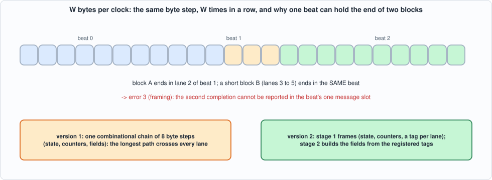
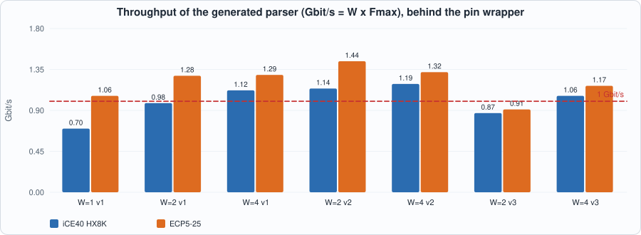
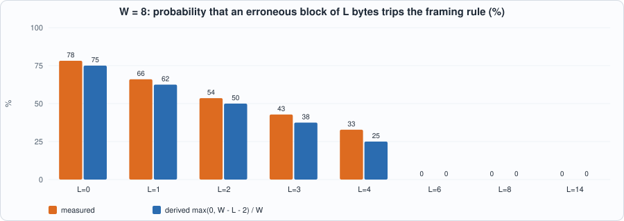

# 17. Line-Rate Message Parsing: W Bytes per Clock, Messages That Span Beats, and a Straightforward Design That Does Not Scale


--8<-- "docs/assets/art/ch-17.md"


**What you will see:** Chapter 16's parser takes one byte per clock, which is a gigabit and no more. A 10-gigabit feed needs eight bytes per clock or more, and then a message no longer starts at the beginning of a beat: it starts in lane 3, spans two beats, and the next block's length bytes arrive in the same beat that finishes it. The chapter extends the generator to emit a **W-bytes-per-beat** parser, tests it against a model with the same fault-filled streams as Chapter 16 (now with every alignment), and **measures honestly what it achieves: the straightforward design does not scale.** It is correct, byte for byte and cycle for cycle, for W = 2, 4 and 8, but its clock falls roughly as 1/W, so the throughput gains little, and at W = 8 the synthesis tool did not finish in 15 minutes. A rebuilt version helps a little; a second rebuild makes it worse, and the chapter says so.

**What you need to know first:** Chapter 16 (the grammar, the generator, the model) and Chapter 15 (what a design that misses the clock looks like).

**What this chapter builds:** `tools/gen_parser_wide.py` (the generator: versions 1, 2 and 3), `rtl/mold_wide.sv` (W = 8, version 2, checked in), `model/wide_gold.py` (the specification and the stimulus), `tb/wide_tb.sv`, `tools/ch17_run.py`, `tools/ch17_example_a.py`, `tools/ch17_example_b.py`, `tools/mut_ch17.py`, `tools/make_figs_ch17.py`.

!!! note "Scope: what this chapter leaves out, on purpose"
    **One message record per beat.** At most one block may complete in a beat; a second one is a **framing error** (below), which for W up to 14 can happen only with erroneous blocks, because a valid ITCH message is at least 14 bytes on the wire. A design that reports several messages per beat needs several record slots and is not built. **W = 8 was not measured on hardware**: synthesis did not finish (Example A); it is simulated and compared with the model like the others. **No sequencing, no SoupBinTCP/OUCH** (Chapter 16's open items). **The layouts are Chapter 16's** (from memory, not checked against the specification). **Fixed layouts only**.

## What a beat adds

A beat is `valid, sop, eop, nb, data` with `W` byte lanes; **lane 0 holds the earliest byte**; `nb` is the number of valid bytes (1 to W, less than W only in the last beat of a packet); a beat with `sop` begins a packet at lane 0. Chapter 16's contract carries over with two changes, written in `model/wide_gold.py`:

- **The cycle of an event is that of the beat that contains the last byte of the block**, plus the latency of the design (1 for version 1, 2 for versions 2 and 3).
- **At most one block may complete in a beat.** The first is reported as before. A **second** block completing in the same beat is a **framing error (err 3)**: an event `X` with the block's index is produced, **the rest of the packet is ignored**, and its packet end reports `trunc`. The field registers are a **snapshot** taken when the block completes, because the next message can start in the same beat and would otherwise overwrite them.


*Figure 17.1: a beat holds bytes of two blocks; a short second block completing in the same beat is a framing error.*

## The generator

The chapter's generator, `gen_parser_wide.py`, takes the same grammar as Chapter 16's and emits, for W lanes, **the byte step of Chapter 16 repeated W times in one combinational chain** (version 1): lane `j` runs if `j < nb`, reads its byte, advances the header position or the block state, counts down the remaining length, pushes the byte into the field registers it belongs to, and, when a block ends, completes it. Everything after the chain is registered.

```python
--8<-- "tools/gen_parser_wide.py"
```

The three versions:

1. **Version 1:** the chain as described: state, counters and field shifts in one path.
2. **Version 2 (checked in):** **two stages.** Stage 1 *frames*: the same chain, but without the field shifts; instead every lane gets a **tag** (is it a field byte, at which body offset, of which type; does a block complete in this lane). Stage 2 builds the fields from the registered tags, a chain of cheap shifts with no framing logic in it.
3. **Version 3:** as version 2 but the header bytes are written by their **position** (indexed writes `session[8*(9-pos) +: 8] = b`) instead of shifted in, on the argument that the header's position is known without looking at data.

The W = 8 parser of version 2:

```systemverilog
--8<-- "rtl/mold_wide.sv"
```

## The model

`model/wide_gold.py` decodes the same packets as Chapter 16's `itch_gold.py` (it imports the message layouts and the field widths from it, and its own `decode` implements the beat rules), plus the stimulus: `schedule` cuts packets into beats of W bytes (the last may be short and carries the eop; a packet left open is cut to whole beats), puts idle cycles and stray beats between them, and pulls a reset before a beat; `alignment_packets` puts one short or odd block (zero-length, one byte, an unknown type of 3 or 4 bytes, a wrong length) at every alignment.

```python
--8<-- "model/wide_gold.py"
```

## The tests

```systemverilog
--8<-- "tb/wide_tb.sv"
```

```python
--8<-- "tools/ch17_run.py"
```

To run: `python3 tools/ch17_run.py` (about ten minutes). Recorded output:

```text
--8<-- "out/ch17_run_out.txt"
```

**Reading the output.**

- **Section 3: all 15 combinations of W (2, 4, 8) and stream (mixed, faults only, well formed, long packets of up to 40 messages, alignments) equal the model in Icarus**, 6 seeds each, and the first seed of each in Verilator: every message (type, error, index, sequence number, the fields), every framing error and every packet end, each **at its cycle**. The alignment stream makes 48 framing errors at W = 4 and 102 at W = 8, which is what tests the rule.
- **Section 3b: all three versions** pass at W = 2, 4 and 8 (latency 1, 2, 2).
- **Section 4: throughput in cycles is exactly the derived one** (`ceil(bytes / W)` per packet): 220, 113 and 52 cycles for a 12-message packet at W = 2, 4 and 8, **7.96 bytes per clock at W = 8**.

## Running example A: what W costs, and the rebuilds

```python
--8<-- "tools/ch17_example_a.py"
```

To run: `python3 tools/ch17_example_a.py 1 2 3 --skip-known` (about twenty minutes; without `--skip-known` the two W = 8 runs that do not finish are repeated). Recorded output:

```text
--8<-- "out/ch17_example_a_out.txt"
```


*Figure 17.2: throughput = W x Fmax; the dashed line is one gigabit per second.*

- **The straightforward design (version 1) does not scale.** From W = 1 to 2 to 4 the clock falls from 87 to 62 to 35 MHz on iCE40 (132, 80, 40 on ECP5): **the throughput rises only from 0.70 to 0.98 to 1.12 Gbit/s on iCE40 and from 1.06 to 1.28 to 1.29 on ECP5**, and the LUT count goes 287, 1,391, 2,843. The critical paths run through the whole chain (from the position and remaining-length counters to the field registers or the error register: 8.2 ns of logic and **20.3 of routing** at W = 4 on iCE40).
- **At W = 8 synthesis did not finish.** Yosys was given 15 minutes for each of the two families, for version 1, 2 and 3, and used them all (the run is not repeated by `--skip-known`). **The design is correct (it passes every test in simulation) and unmeasured on hardware.** This is a result about the tool as much as the design; a larger machine and more time might finish; the book's flow does not.
- **Version 2 (two stages) helps a little:** W = 2: 71.5 MHz and 1.14 Gbit/s on iCE40 (against 61.5 and 0.98), 90 MHz and 1.44 Gbit/s on ECP5 (against 80 and 1.28); W = 4: 37.2 MHz, 1.19 Gbit/s (iCE40) and 41.1 MHz, 1.32 (ECP5): **+6% on iCE40 and +2% on ECP5 over version 1 at W = 4**, for two flip-flop stages and an extra cycle of latency. The critical path is now in stage 1: the framing chain still runs through every lane.
- **Version 3 is worse than version 1** (W = 4: 33.2 MHz and 1.06 Gbit/s on iCE40, 36.7 and 1.17 on ECP5; W = 2: 54.6 and 56.8 MHz). The idea was that the header's position does not depend on data; the indexed write turns each lane's header store into a decoder driven by the position counter, which is the chain again, in a wider form. **It is in the chapter because it is what a reasonable person would try next, and because it does not work.**
- **What this says about the design:** the dependence that makes a wide parser hard is that **where the next block starts is a function of the data** (the length bytes), so lane `j`'s role depends on all earlier lanes. Real wide parsers break that dependence by **speculation** (compute the roles for every possible block start in parallel and select), by a **separate framing stage** that runs ahead (find the boundaries first, from the length bytes only, with a carry-look-ahead structure over lanes), or by buffering whole messages. None is built here (Exercises 1 and 2); the chapter's design is the baseline they have to beat.
- **For gigabit Ethernet the byte-per-clock parser of Chapter 16 is enough**: 125 MHz at one byte per clock is 1 Gbit/s, and ECP5 reaches 132 MHz for it. The wide designs matter above that, and the best here (1.44 Gbit/s on ECP5, W = 2, version 2) is not 10 Gbit/s.

## Running example B: the two prices of a wide beat

```python
--8<-- "tools/ch17_example_b.py"
```

To run: `python3 tools/ch17_example_b.py`. Recorded output:

```text
--8<-- "out/ch17_example_b_out.txt"
```


*Figure 17.3: the probability that an erroneous block of L bytes is a framing error, W = 8, measured and derived.*

- **The tail.** A packet of `B` bytes needs `ceil(B / W)` beats, so the last beat is partly empty: **measured on the RTL (W = 8, back to back), the cycles per packet equal the derived beats exactly** (6, 8, 11, 16, 34 and 108 for 1, 2, 3, 5, 12 and 40 messages), and the bus is **85% used for a 1-message packet, 97% for 2 and 99.5% for 40**. Small packets pay for the wide bus.
- **The framing rule.** A block of `L` bytes of body is `L + 2` bytes on the wire; it ends in the same beat as the block before it when that block's last byte is early enough in its beat. **Derived: the probability is `max(0, W - L - 2) / W`**, if the previous block ends at a uniformly random lane. **Measured: at W = 8, L = 0 to 4: 78%, 66%, 54%, 43%, 33% against 75%, 62.5%, 50%, 37.5%, 25%**, and 0 for L = 6 and above, as derived; the measurements are a few points above the derivation because the header (20 bytes) and the message lengths (14 to 46 bytes on the wire) make the alignment slightly non-uniform. At W = 2 it never happens, at W = 4 only for L of 0 or 1. **At W = 16 even valid traffic can trip it** (two short System Events in one beat: the 3.1% at L = 14). **The rule is a design decision, not a law**: it lets the parser keep one record per beat, and it costs a lost packet when a feed contains blocks shorter than a beat. A feed that does is unusual (Chapter 16 showed the parser reports such blocks as errors anyway).
- On the RTL, 40 packets with erroneous blocks of 0 to 5 bytes (18 framing errors) equal the model.

## Testing the tests

Two families of mutants, one battery (the parser against the model, W = 8 and W = 4, on five kinds of stream, Icarus; the generator mutants are regenerated for both widths):

1. **the generated RTL** (version 2, W = 8), mutated as text (38 mutants). Most anchors occur once per lane: `all` replaces every occurrence, `first` and `last` change only lane 0's or lane 7's, a mistake in one lane only;
2. **the generator** (4 mutants), the RTL regenerated.

```python
--8<-- "tools/mut_ch17.py"
```

To run: `python3 tools/mut_ch17.py` (about ten minutes). Recorded output:

```text
--8<-- "out/ch17_mut_out.txt"
```

**Result: 42 of 42 caught.** The first run caught 37 of 42 and the five survivors were:

| survivor | why | what was done |
|---|---|---|
| a zero-length block in lane 0 reports error 1 instead of 2 | **a missing test**: a zero-length block as the first completion of a beat with its second length byte in lane 0 was too rare | the `alignments` stream puts one short or odd block at every alignment, and the battery runs 120 such packets |
| fields are tagged whatever the error; the snapshot is taken for a block with an error | **outside the contract**: fields are valid only for error 0, and every valid message overwrites all its fields | removed from the generator (the snapshot is taken for every completed block, the tag does not look at the error) |
| the type byte is tagged as a field byte | **code that cannot matter**: the field selects already exclude offset 0 | the redundant guard was removed from the generator |
| the header is registered from the stage-1 register instead of its copy | **redundant**: the copy held the same value | the copy (three registers of 160 bits) was removed |

The regenerated parser was tested and measured again; Example A's numbers are those of the simplified design.

## What this chapter established, and what it did not

**Established, with the tests that show it:** a generator that turns Chapter 16's grammar into a parser taking W bytes per clock, **correct against the independent model for W = 2, 4 and 8, cycle for cycle, with a stated rule for the one thing a wide beat adds** (two blocks completing in one beat); exact throughput in cycles (7.96 bytes per clock at W = 8); **a measured negative result: the straightforward design's clock falls almost as fast as W grows, version 2's pipeline buys 2 to 6%, and the obvious next idea (version 3) is worse**; 42 of 42 mutants caught.

**Not established:** any hardware number at **W = 8** (synthesis did not finish); a design that scales (speculation, a framing stage that runs ahead: Exercises 1 and 2); several messages per beat; 10 gigabit; the layouts against the specification. The explanation of the scaling in the text (a chain through the lanes) is supported by the critical paths nextpnr reports, not by a controlled experiment that removes the chain.

## Self-check questions

1. Why does a message no longer start at the beginning of a beat, and what does the parser have to do about it?
2. What does `nb` mean, and in which beats may it be less than W?
3. Why is the field output a snapshot taken at completion rather than the working register?
4. State the framing rule. Why can only erroneous blocks trip it for W up to 14?
5. Derive the probability that a block of L bytes of body completes in the same beat as the previous one.
6. What does a packet of 41 bytes cost at W = 8, and what fraction of the bus is used?
7. Describe version 2: what does stage 1 produce, and what does stage 2 do with it?
8. Why did version 3 (header by position) make the clock worse?
9. Why does the clock of the straightforward design fall as W grows? What would break the dependence?
10. What did the W = 8 synthesis result tell you, and what does it not tell you?
11. Why is a byte per clock enough for gigabit Ethernet and not for ten gigabit?
12. Name two survivors of the first mutation run and say, for each, whether it was a missing test or code that cannot matter.

## Exercises

1. **Speculate.** For each lane compute, in parallel, the role the lane would have if a block started there (reading the two length bytes at that lane and the next), then select the right set by the actual boundaries. How many lanes' speculation does W = 8 need, and what does it cost in LUTs? Does it synthesise?
2. **A framing stage that runs ahead.** Find the block boundaries from the length bytes only in a first stage (a prefix computation over lanes: boundary positions as a function of `rem` and the bytes), and give stage 2 the boundaries. Compare Fmax with version 2 at W = 4.
3. **Several messages per beat.** Give the parser two record slots, with their own field snapshots; extend the model and the rule (when is a framing error now?).
4. **Make W = 8 synthesise.** Reduce the logic of version 2 until Yosys finishes (fewer type comparisons per lane by decoding the type once, a smaller `er_d`), and measure it.
5. **A mutant that survives.** Add a mutant to `tools/mut_ch17.py` that the battery does not catch. Is it equivalent, outside the contract, or is a test missing?
