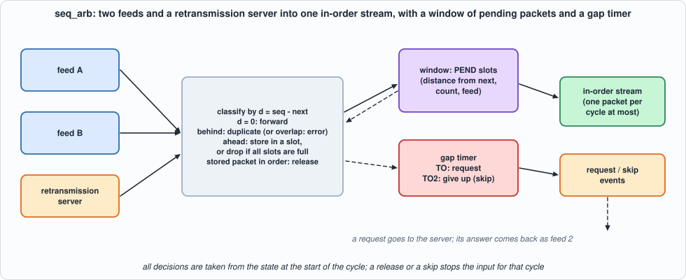
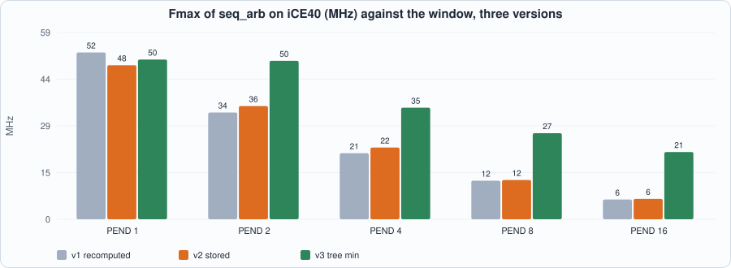
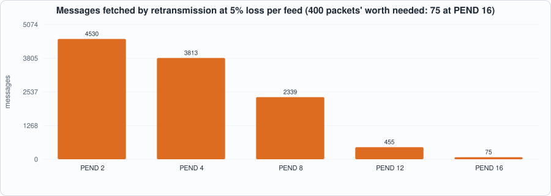
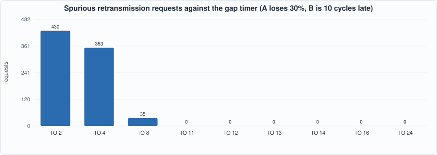

# 18. Sequence Gaps and A/B Feed Arbitration: Forwarding Once and in Order, Asking for What Is Missing, and a Window That Must Be Big Enough


--8<-- "docs/assets/art/ch-18.md"


**What you will see:** exchanges send every market-data packet **twice** (feeds A and B), over different paths, and number the messages so that a receiver can tell what is missing. The arbiter that sits behind the parsers of Chapters 16 and 17 must forward each packet **once**, **in order**, as soon as it has arrived on **either** feed, and when a packet has been lost on both it must ask for it again and, if the answer does not come, say so and go on. The chapter builds it at the level of the packet header (sequence number and message count), with a window of packets that arrived early, a gap timer, and a retransmission request; tests it as an **end-to-end property** (the messages forwarded tile the sequence space in order) in a closed loop with lossy feeds and a lossy retransmission server, and as a **cycle-exact** comparison of the RTL with a model; and measures the two things the design depends on: **how large the window must be** and **how long the timer should wait**. The first version missed the clock badly (6 MHz with 16 slots on iCE40); two rebuilds brought it to 21.

**What you need to know first:** Chapter 16 (the packet header: session, sequence number, count), Chapter 15 (a table in registers, a closed loop with a model) and Chapter 14 (an end-to-end property as a test, and why it is not enough alone).

**What this chapter builds:** `rtl/seq_arb.sv` (version 3; `seq_arb_v1.sv` and `seq_arb_v2.sv` are the first two), `model/arb_gold.py` (the specification, the closed loop, the stimulus), `tb/arb_tb.sv`, `tools/ch18_run.py`, `tools/ch18_example_a.py`, `tools/ch18_example_b.py`, `tools/mut_ch18.py`, `tools/make_figs_ch18.py`.

!!! note "Scope: what this chapter leaves out, on purpose"
    **Packet headers only**: the arbiter decides what to forward; the packets' payloads travel beside it (a buffer, a handle) and are not modelled. **Feeds A and B carry identical packets** (same sequence number, same count, as the real feeds do), and a **retransmission returns exactly the range asked for, as one packet**; overlapping or differently cut packets, and a retransmission that overshoots a stored packet, are **outside the contract** (an overlap with the expected number is reported as an error, `BAD`, and not tested in the closed loop). **One input per cycle** from a merged port (a real design has a port per feed). **32-bit sequence numbers** (Mold has 64) with modular comparison. **A heartbeat is ignored**: a heartbeat that announces a number ahead of the expected one would reveal a loss at the end of a stream, which this arbiter cannot see (measured below). **The retransmission server is a model** that answers after a fixed time; no real protocol (the exchange's request format, rate limits, a separate TCP or UDP session) is built.

## The rules

`model/arb_gold.py` is the specification; its header is the rule book. State: `next` (the sequence number the output waits for), `PEND` slots for packets that arrived ahead of it, a gap timer `tmr` and a flag `req`. **All decisions of a cycle are taken from the state at its start.** In one cycle:

- a stored packet whose number equals `next` is **released** (the lowest such slot, at most one); a **gap** is a non-empty window with no release possible; its **minimum distance** `mind` is the smallest `slot seq - next`;
- **timer.** In a gap, when no request has been sent and `tmr = TO`: **REQUEST** `[next, next + min(mind, 65535))`; when a request has been sent and `tmr = TO2`: **SKIP**, report `[next, next + mind)` lost and move `next` to the first stored packet; otherwise `tmr` counts; outside a gap it is cleared;
- **stall** = a release or a skip: the input is not accepted (`ready = 0`);
- otherwise the input `(feed, seq, cnt)` is classified by `d = seq - next`: **HB** (a heartbeat, `cnt = 0`: no change); **FWD** (`d = 0`: forwarded, `next += cnt`); behind `next`: **DUP** if it ends at or before `next`, else **BAD**; ahead: **DUP** if a slot has this number, **STORE** in the lowest free slot, or **OVF** (dropped: the window is full).

The outputs are registered: the decision for the input or the release (kind, number, count, feed), the timer event (REQ or SKIP, number, count), and the state after the cycle (`next`, slots in use).


*Figure 18.1: two feeds and a retransmission server into one in-order stream.*

```python
--8<-- "model/arb_gold.py"
```

## The hardware

The first version is the rules written down as logic: for every slot, `seq - next` is recomputed in every cycle, compared with zero (is it in order?), compared with the other slots (which is the minimum?), and `next` is advanced by a count that is selected from the release, the skip or the input. The chapter shows the three versions because the first one did not work well enough, and what it measured.

```systemverilog
--8<-- "rtl/seq_arb.sv"
```

(This is version 3; Example A shows what versions 1 and 2 were and what each measured.)

## The tests

```systemverilog
--8<-- "tb/arb_tb.sv"
```

```python
--8<-- "tools/ch18_run.py"
```

To run: `python3 tools/ch18_run.py` (several minutes). Recorded output:

```text
--8<-- "out/ch18_run_out.txt"
```

**Reading the output.**

- **Section 2 is the end-to-end property, and it holds in all 70 closed-loop runs** (7 profiles, 10 seeds of 200 packets): the messages forwarded tile the sequence space in order, with no gap and no overlap except the ranges the arbiter reported as skipped. With feed B clean, with 20% duplicates, with B six cycles late: no request at all. With 30% loss on each feed and a retransmission server that loses half its answers: 138 requests, 74 skips (7,786 messages reported lost). A copy that arrives late is a DUP, and never forwarded twice.
- **The last column is a limit, not a test result:** messages that **arrived** on A or B but were never forwarded, because the forwarding stopped before them. They are the last packets of a stream that were dropped for lack of a slot (OVF) while a gap was open: nothing after them reveals the loss. A heartbeat with a higher number would; this arbiter ignores heartbeats (Exercise 2).
- **Section 3: the RTL equals the cycle model** in all 30 runs: five configurations (windows of 1, 2, 4 and 8 slots, timers from 6 to 20 cycles, **one with TO2 smaller than TO**, and sequence numbers about to wrap), on closed-loop runs and on **random inputs** (behind, equal, ahead, overlapping, heartbeats, a gap of 2^31), in Icarus (with the registers powered up with garbage, so that a reset that forgets one is seen) and in Verilator (first seed of each). Every output and the state after every cycle, including `ready`, are compared. Overlaps (`BAD`) and full windows (`OVF`) occur in the random runs, which the closed loop rarely makes.

## Running example A: the first version missed the clock

```python
--8<-- "tools/ch18_example_a.py"
```

To run: `python3 tools/ch18_example_a.py` (about fifteen minutes). Recorded output:

```text
--8<-- "out/ch18_example_a_out.txt"
```


*Figure 18.2: the Fmax of the three versions of seq_arb on iCE40 against the number of slots.*

- **Measured, version 1:** the clock **falls almost in inverse proportion to the window**: 52, 34, 21, 12 and **6 MHz on iCE40** for 1, 2, 4, 8 and 16 slots (74, 53, 33, 18 and 10 MHz on ECP5). At 16 slots the critical path is **88 ns of logic and 74 of routing**, from `next` through the distance of every slot, the minimum, and back into `next`.
- **Version 2 (store the distance) changed little**: 48, 36, 22, 12 and 6 MHz. Each slot now keeps `seq - next` and every advance of `next` subtracts the same count from all of them, so "in order" is a test for zero on a register and `seq - next` is not recomputed. It removed some LUTs and ECP5 carry cells (4-slot ECP5: 32.5 to 36.9 MHz) but **not the critical path, which was never the subtraction**: the critical path ran through the **minimum**.
- **Version 3 (a tree for the minimum)** is the fix: the minimum was written as a loop, `if (d < min) min = d` over the slots, which is a **chain of PEND comparators** in series; written as a tree of pairwise comparisons it is `log2(PEND)` comparators deep. **50, 50, 35, 27 and 21 MHz on iCE40; 75, 77, 56, 43 and 32 on ECP5: 3.4 times version 1 at 16 slots**, with the same LUTs. The critical path at 16 slots is 25 ns of logic and 22 of routing, still through the distances and the subtraction of the advance.
- **Derived:** the model of a chain is linear in the number of slots, a tree is logarithmic: 16 slots in a chain is 16 comparator delays, in a tree 4. The measurements follow this loosely (88 ns of logic for 16 slots in a chain against 4 slots: 27, a ratio of 3.3; the tree: 25 against 15, a ratio of 1.7).
- **No version reaches 125 MHz, even with one slot (51 MHz on iCE40, 75 on ECP5)**; one packet per cycle at 35 MHz is 35 million headers per second, more than the 15 million of the smallest Ethernet frames at 10 Gbit/s, but the clock of a design that also has to forward the payloads would be lower. The slots are registers; 16 slots are 3,579 LUTs and 1,049 flip-flops on iCE40.

## Running example B: what the second feed buys, how big the window must be, how long to wait

```python
--8<-- "tools/ch18_example_b.py"
```

To run: `python3 tools/ch18_example_b.py`. Recorded output:

```text
--8<-- "out/ch18_example_b_out.txt"
```

**1. The second feed.** With independent loss `p` on each feed, a packet needs a retransmission only if it is lost on both: derived `p^2`. **Measured (2,000 packets per row): 0.25% against 0.25% at 5%, 4.10% against 4.00% at 20%, 9.45% against 9.00% at 30%** (at 10%, 1.65% against 1.00%: 33 packets against 20 expected, about three standard errors, which I did not investigate). One feed alone loses `p`: at 5% per feed the arbiter forwards **99.75%** of the packets without a request; the requests that it does make are for the rest. The forwarding delay (from the first arrival of a packet on either feed to its forwarding) is **1.0 cycle on average at 5% loss, with a p99 of 39 cycles**, which is the cost of waiting for the gap timer and the answer: the packets behind a lost one wait.

**2. The window must cover the gap.** A gap stays open for `TO` plus the answer time (16 + 30 = 46 cycles here), and in that time `46 / 4 = 11.5` packets arrive behind the lost one and must be stored. If the window is smaller, the later packets are **dropped (OVF)** and must be **asked for again**:


*Figure 18.3: messages fetched by retransmission at 5% loss per feed, against the window.*

| PEND | requests | messages from retransmissions | packets lost on both feeds | dropped for lack of a slot |
|---|---|---|---|---|
| 2 | 44 | 4,530 | 5 | 838 |
| 4 | 43 | 3,813 | 5 | 690 |
| 8 | 40 | 2,339 | 5 | 422 |
| 12 | 17 | 455 | 5 | 71 |
| 16 | 5 | 75 | 5 | 0 |

**Five packets were really lost** in the 2,000; with 16 slots the arbiter makes five requests and fetches 75 messages. With 2 slots it makes 44 requests and fetches **4,530 messages, 60 times as many**: packets that had arrived and were thrown away. **A window shorter than (TO + answer time) / packet spacing turns one lost packet into a stream of needless requests**, and Example A shows what the window costs in clock: the design is pushed both ways. (At 20% and 30% loss even 16 slots are too few.)

**3. The timer.** A loses 30%, B is clean but arrives 10 cycles late (with 0 to 3 of jitter). Every packet reaches the arbiter, so every request is **spurious**. **Measured: 430 requests at TO = 2, 353 at 4, 35 at 8, and none from TO = 11.** A gap opened by A's loss lasts until B's copy arrives, about the skew plus the jitter (10 to 13 cycles); a timer shorter than that fires while the copy is on its way. **A timer must be longer than the skew between the feeds**; the price of a longer one is the time to recover a real loss.


*Figure 18.4: spurious requests against the gap timer.*

## Testing the tests

Two families of mutants, each with its own battery: the **RTL** (42 mutants; battery: `seq_arb` against the cycle model on five configurations, closed-loop runs and random inputs) and the **model** (9 mutants; battery: its hand-checked scenarios and the end-to-end property).

```python
--8<-- "tools/mut_ch18.py"
```

To run: `python3 tools/mut_ch18.py` (about ten minutes). Recorded output:

```text
--8<-- "out/ch18_mut_out.txt"
```

**Result: 51 of 51 caught**, after a first run that caught 48 of 54. The survivors:

| survivor of the first run | why | what was done |
|---|---|---|
| the skip does not wait for a request | **a missing test**: with TO smaller than TO2 the request always comes first | a configuration with TO2 smaller than TO (20 and 8) |
| reset does not clear the slots | **Icarus semantics**: an `if` on an undefined bit is false, so a power-up of `x` looks like an empty slot | the testbench powers the registers up with garbage (Icarus only) |
| a forward advances during a heartbeat | **code that cannot matter**: a heartbeat's count is 0 | the redundant condition removed from the RTL |
| a skip does not clear the request flag | **equivalent**: after a skip the expected number is a stored packet's, so the next cycle is not a gap and the flag is cleared there | the RTL no longer clears it in the skip cycle |
| (model) the request count is not capped | **my mutant was wrong**: the anchor matched the docstring before the code | the anchor made unique; caught by the hand-checked scenario with a gap of 69,999 |
| a release does not free the slot | **bad anchor** (stale text) | the anchor corrected; caught |

## What this chapter established, and what it did not

**Established, with the tests that show it:** an arbiter that forwards each packet once and in order from two feeds, stores early packets, requests a gap after a timer, gives up after a second one, and **equals its cycle model on every output and the state in every cycle**, with wrapped sequence numbers and random inputs, in two simulators; the **end-to-end property in 70 closed-loop runs**; **measured**: the window must cover (TO + answer time) / spacing packets or a lost packet costs 60 times its size in retransmissions (4,530 messages against 75); a timer shorter than the skew between the feeds fires needlessly (430 requests against none); the first version's clock fell as 1/window (6 MHz at 16 slots on iCE40), storing the distance did not help, a tree for the minimum gave 3.4 times; 51 of 51 mutants caught.

**Not established:** payloads, buffering and the handle between the arbiter and the data; differently cut packets and overlapping retransmissions; **detecting a loss at the end of a stream** (heartbeats); a real retransmission protocol; a clock near 125 MHz with more than a few slots; **a RAM-based window** for hundreds of slots (the slots are registers, 3,579 LUTs for 16); **64-bit sequence numbers** (the comparators and subtractors double). The A/B skew and the loss rates in the examples are **assumptions** of the generator, not measurements of a feed.

## Self-check questions

1. Why do exchanges send every packet on two feeds, and what must the arbiter do with a packet that arrives on both?
2. Describe what happens to a packet that arrives ahead of the expected sequence number, step by step.
3. When is a request sent, and for which range? When is a range given up?
4. Why does a release stop the input for a cycle? Why does a skip?
5. Why is the end-to-end property "the messages forwarded tile the sequence space" a good test, and what does it not check?
6. Derive the fraction of packets that need a retransmission when each feed loses a fraction `p` independently.
7. How big must the window be, and what happens if it is smaller?
8. How long must the gap timer be, and what happens if it is shorter?
9. What did version 1 measure, and why did storing the distance (version 2) change so little?
10. Why is a loop `if (d < min) min = d` a chain, and how does a tree change the critical path?
11. Why is a loss at the very end of a stream invisible to this arbiter?
12. Name two survivors of the first mutation run and say, for each, whether it was a missing test, code that cannot matter or an equivalent mutant.

## Exercises

1. **Several packets in one answer.** Let the retransmission return a range that is cut differently from the original packets (so that it overlaps stored ones) and extend the contract: what must be done with a stored packet that the answer makes stale?
2. **Use the heartbeat.** A heartbeat announces the next sequence number: treat one that is ahead of `next` as a gap with no data. Extend the model and show that the stream's tail is now recovered.
3. **A RAM window.** Keep the slots in a block RAM indexed by `seq mod 512` (a bitmap and a RAM of counts): what happens to the minimum and to the release? Measure the clock for a window of 512.
4. **Per-feed ports.** Give A and B their own input ports and arbitrate between them; what does the model need to say about two packets in the same cycle?
5. **A mutant that survives.** Add a mutant to `tools/mut_ch18.py` that neither battery catches. Is it equivalent, outside the contract, or is a test missing?
