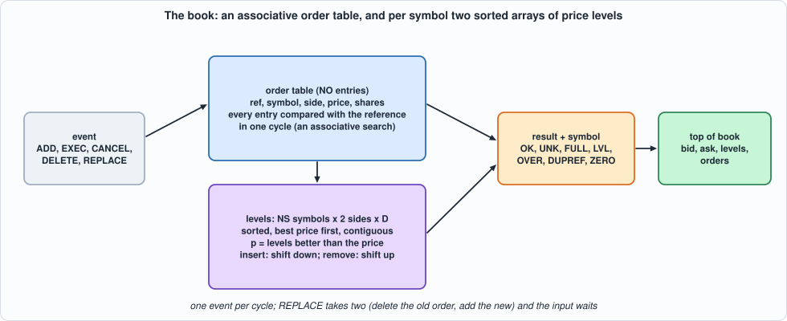
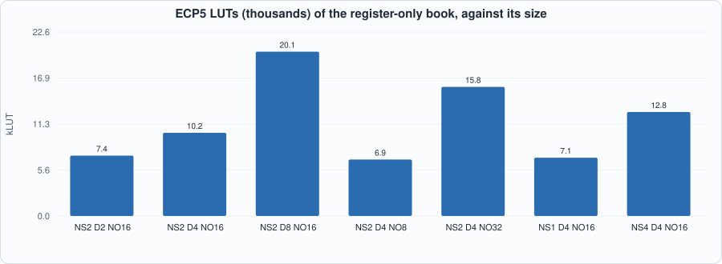
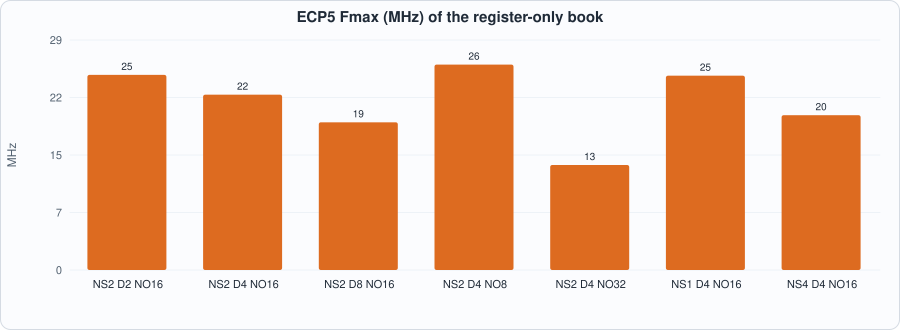
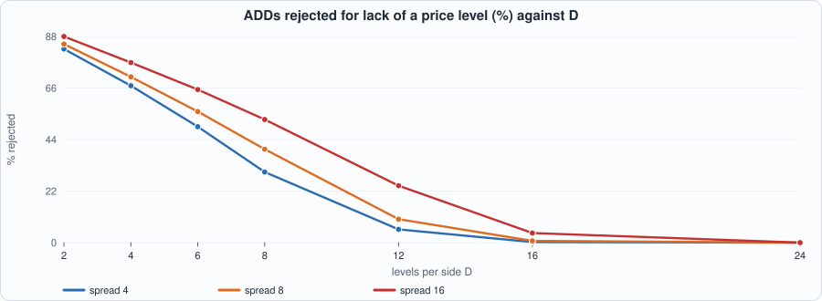
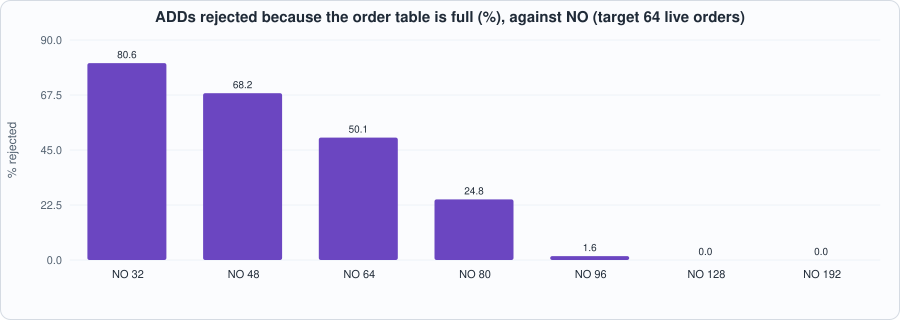

# 19. The Order Book in Hardware: Orders, Price Levels, Top of Book, and a Design That Is Correct and Too Big


--8<-- "docs/assets/art/ch-19.md"


**What you will see:** the message stream of Chapters 16 to 18 builds a **book**: the resting orders and, for each symbol and side, the shares at each price. The chapter writes the **specification first, with dictionaries** (what a book *is*), then the hardware: an **order table** searched associatively by reference and, for each symbol and side, a **sorted array of price levels** in registers, updated in one cycle by shifting. Every event reports a result (OK, unknown reference, table full, no free level, over-reduction, duplicate reference, zero shares) and the **top of book** of its symbol. The RTL equals the model in every cycle, in two simulators, on realistic flow with faults and on uniformly random events; **50 of 50 mutants** are caught. And the measurement is a **negative one**: the all-registers design is 5,000 to 12,000 LUTs for a book of a few dozen orders and two or three price levels per side, **does not fit the iCE40 above 16 orders**, and runs at 13 to 26 MHz. A sizing study says how large the book needs to be; Chapter 20 is about making it fit.

**What you need to know first:** Chapter 18 (a window of pending items, a model with its state at the start of the cycle), Chapter 15 (a table in registers, a closed loop with a model) and Chapter 10 (associative search and what it costs).

**What this chapter builds:** `rtl/book.sv` (`book` and the pin wrapper `book_syn`), `model/book_gold.py` (the specification, the closed loop and the stimulus), `tb/book_tb.sv`, `tools/ch19_run.py`, `tools/ch19_example_a.py`, `tools/ch19_example_b.py`, `tools/mut_ch19.py`, `tools/make_figs_ch19.py`.

!!! note "Scope: what this chapter leaves out, on purpose"
    **Everything is registers**, with one event per cycle and one cycle's worth of logic; a RAM-based book, worst-case latency against depth and the depth of a real book are **Chapter 20**. **Capacity is fixed**: a new price level when all `D` are in use is **rejected** (the order is not added), not evicted; a real book keeps the best levels and drops the worst. **32-bit references** (ITCH's are 64 bits), prices and shares; the overflow of a level's shares past 2^32 is outside the contract. **No matching, no market-by-order timestamps**, no cross-book consistency (a bid above the best ask is accepted as it is). **Events arrive already parsed**: the parser of Chapters 16 and 17 and the arbiter of Chapter 18 are not joined to it. **The flow is generated**, not captured: the book has no real feed to be measured against.

## What a book is

`model/book_gold.py` states it in a few lines of Python with dictionaries: an `orders` dictionary (reference to symbol, side, price, shares) and, for each symbol and side, a `levels` dictionary (price to shares). Five events: **ADD**, **EXEC** and **CANCEL** (the same: reduce an order by some shares), **DELETE**, **REPLACE** (the old order is deleted and a new one with a new reference, the same symbol and side and a new price and size is added; if the add fails the old order is gone all the same). Two capacities are the only structural facts: the table holds `NO` orders and each side of each symbol `D` levels. The checks and their order are written down:

- ADD: **ZERO** (no shares), **DUPREF** (the reference exists), **FULL** (the table is full), **LVL** (a new level is needed and all `D` are in use);
- EXEC, CANCEL: **UNK** (no such reference), **ZERO**, **OVER** (more than the order has); a reduction to zero shares removes the order; a level whose shares reach zero disappears;
- a failed event changes nothing (except the old order of a REPLACE).

After every event the **result**, the **symbol** (the order's, or the input's for an ADD, or 0 for an unknown reference) and the **top of book** of that symbol are reported: best bid and ask (price, shares), the number of levels on each side, the number of orders in the table. One event is accepted per cycle; a REPLACE takes two, and the input waits during the second.

```python
--8<-- "model/book_gold.py"
```

## The hardware

The order table is `NO` registers, each with a valid bit, the reference, symbol, side, price and shares; **a lookup compares every entry with the reference in one cycle** (an associative search: a comparator per entry). For each symbol and side the levels are `D` entries (valid, price, shares) **kept sorted, best price first, with the valid ones contiguous from index 0**: the position `p` of a price is the **number of levels that are better than it** (parallel comparators and a count), a level at position `p` with an equal price is a hit; a new level is inserted by **shifting the worse ones down**, an emptied one removed by **shifting the worse ones up**, each in the one cycle. The top of book is level 0 of each side.


*Figure 19.1: the order table and the sorted levels.*

```systemverilog
--8<-- "rtl/book.sv"
```

## The tests

```systemverilog
--8<-- "tb/book_tb.sv"
```

```python
--8<-- "tools/ch19_run.py"
```

To run: `python3 tools/ch19_run.py` (several minutes). Recorded output:

```text
--8<-- "out/ch19_run_out.txt"
```

**Reading the output.**

- **Section 2: what the stimulus contains.** The *flow* stream is adds, partial and full reductions, deletes and replaces on live orders with faults mixed in (an unknown or duplicate reference, an over-reduction, zero shares); the *random* stream is uniformly random events over a small space of references, prices and symbols, which reaches the cases the flow does not (unknown references in 1,259 of 2,400 events, every result, a table that is full, replaces of unknown references). Both make every result code.
- **Section 3: the RTL equals the cycle model in all 40 runs** (5 sizes, 2 kinds, 4 seeds of 300 events), in Icarus (with the registers powered up with garbage, so that a reset that forgets one is seen) and in Verilator (first seed of each). Every result, the symbol, **the whole top of book** (bid and ask price and shares, both level counts, the number of orders) and the `ready` signal are compared in every cycle. The sizes include a single level per side (`D = 1`), a table of 3 orders, and 4 symbols (a symbol index that is not a power of two: 3).

## Running example A: the first design is correct and too big

```python
--8<-- "tools/ch19_example_a.py"
```

To run: `python3 tools/ch19_example_a.py` (about forty minutes). Recorded output:

```text
--8<-- "out/ch19_example_a_out.txt"
```


*Figure 19.2: ECP5 LUTs of the register-only book against its size.*


*Figure 19.3: ECP5 Fmax against the size.*

- **Measured:** even the smallest book here, **2 symbols, 2 levels per side and 16 orders (2,104 bits of state), is 4,949 LUTs and 2,380 flip-flops on iCE40 at 19.0 MHz and 7,407 LUTs at 24.7 MHz on ECP5.** **With 4 levels per side and 16 orders (2,624 bits) it needs 7,685 LUTs on iCE40 and does not fit** (the HX8K has 7,680 logic cells; place-and-route fails); on ECP5 it is 10,197 LUTs at 22.2 MHz. With 8 levels it is 20,141 LUTs and 18.7 MHz; with 32 orders 15,828 LUTs and **13.3 MHz**; with 4 symbols 12,750 LUTs and 19.6 MHz. The sweep to a few thousand LUTs per few hundred bits is the design's own: **every order-table entry has a 32-bit comparator against the reference and a mux for each field; every level has comparators against the price and a mux in each of the shift directions; and the dynamic indexing by symbol and side multiplies it again.**
- **The clock is limited by routing, not by logic**: at `NO = 32` the critical path is 22.5 ns of logic and **52.9 ns of routing**, from an order's valid bit through the lookup, the level search and the shift into the result register. The one-cycle read-modify-write is the same trade as in Chapters 12 and 15, and a register file this wide is its worst case.
- **What to do about it is Chapter 20's subject:** put the order table in a RAM indexed by a hash of the reference (not an associative search), keep the levels in a RAM or in fewer registers by a different structure (a sorted array only for the top few levels, a hash or a bitmap beyond), and split the event into pipeline stages with the hazard between consecutive events on the same level handled by forwarding. The numbers above are the baseline.

## Running example B: how big must the book be?

A stationary flow is generated **against the book itself** (so that a rejected add is simply not live): at each event an ADD with a probability that pulls the number of live orders towards a target, else an event on a uniformly chosen live order (50% delete, 25% reduction by a random part, 25% replace at a new price); prices within `spread` ticks of a mid that moves by one tick in 40% of the events.

```python
--8<-- "tools/ch19_example_b.py"
```

To run: `python3 tools/ch19_example_b.py`. Recorded output:

```text
--8<-- "out/ch19_example_b_out.txt"
```


*Figure 19.4: ADDs rejected for lack of a price level against D.*


*Figure 19.5: ADDs rejected because the order table is full, against NO.*

- **Levels.** With a spread of 8 ticks, **D = 8 rejects 40% of the ADDs, D = 12 rejects 10%, D = 16 rejects 0.72% and D = 24 none**; with a spread of 4 ticks D = 16 rejects 0.25%, with 16 ticks 4.1%. Without a limit, the fullest side of a symbol holds **13.2 levels on average (p99 19, maximum 24) at a spread of 8**: **more than the spread**, because the mid moves and the orders it leaves behind keep their levels until they are executed or deleted. A rule of thumb from this flow: **`D` of about 2 to 3 times the spread** for under 1% rejected; it is a property of the flow, not of markets.
- **Orders.** The control target of 64 live orders gives an unlimited-table occupancy of **mean 86.7, p99 100, maximum 108** (the feedback overshoots the target; the target is not the mean). **NO = 96 rejects 1.6% of the ADDs, NO = 128 none**, and NO = 64 rejects 50%. A table sized at the target rejects half of what it is offered.
- **Both finite (D = 8, NO = 64)** at targets of 32, 64 and 96 live orders: **11.5%, 49.6% and 69.6% of the ADDs rejected**: the level limit dominates at a low load and the table at a high one.
- **What it means:** the register-based design's cost (Example A: 10,000 LUTs for D = 4, NO = 16) is what it takes to hold a book of a *few dozen orders*; a book of the sizes this study asks for (D = 16 to 24, NO = 128 and more) is out of reach of the all-registers design by an order of magnitude, which is why the structures of Chapter 20 exist.

## Testing the tests

Two families of mutants, each with its own battery: the **RTL** (41 mutants; battery: the book against the cycle model on five sizes, flow with faults and random events) and the **model** (9 mutants; battery: the model's own hand-checked scenarios; the model is the oracle, and a handful of cases worked by hand is what checks *it*, so this family measures how complete they are).

```python
--8<-- "tools/mut_ch19.py"
```

To run: `python3 tools/mut_ch19.py` (about fifteen minutes). Recorded output:

```text
--8<-- "out/ch19_mut_out.txt"
```

**Result: 50 of 50 caught**, after a first run that caught 48 of 51. The three survivors:

| survivor of the first run | why | what was done |
|---|---|---|
| the insertion shifts one level too many (`>=` for `>`) | **equivalent**: the branch for the new level at position `p` is tested first, so the shifted-down test is never reached for `i = p` | dropped |
| (model) a duplicate reference is checked after the table is found full | **a missing hand-checked scenario**: no case had a full table and a duplicate at once | added: a full table, an ADD with an existing reference must be DUPREF |
| (model) an unknown reference is reported with symbol 1 | **a missing hand-checked scenario**: no case checked the symbol of an unknown REPLACE or DELETE | added |

The 41 RTL mutants include: the level search counting the wrong side as better, an equal price counted as better, a hit with no price test, a side full one level early, each check of ADD in the wrong order or missing, a replace that adds at the input's symbol or side or with the old reference or the old price, a reduction that sets instead of subtracting, the shifts one level off in each direction, reset that forgets the table, the levels or the busy flag, and a top of book that shows a price for an empty side.

## What this chapter established, and what it did not

**Established, with the tests that show it:** a book specified with dictionaries, and hardware (an associative order table and sorted level arrays in registers) that **equals it in every cycle**, including results, symbols, the whole top of book and readiness, on flow with faults and on random events, for five sizes, in two simulators; the **sizing of the book for a given flow** (levels about 2 to 3 times the spread, the table about 1.5 times the target of live orders); **a measured negative result: the all-registers design is thousands of LUTs for a few dozen orders, does not fit the iCE40 above 16 orders, and runs at 13 to 26 MHz**; 50 of 50 mutants caught.

**Not established:** a RAM-based or otherwise scalable design (Chapter 20); eviction of the worst level; 64-bit references; behaviour on a real feed; the sizing results outside the synthetic flow (they are properties of the generator: a different mid-drift, a different mix of cancellations, would give different numbers); the parser, the arbiter and the book **together** (the chapters build the pieces; Part 6 joins them).

## Self-check questions

1. What is the top of book, and what does the book report after every event?
2. Why do EXEC and CANCEL behave the same? What does a REPLACE do if the add fails?
3. State the order in which an ADD is checked and why a duplicate is found before a full table.
4. How does the position of a price in the sorted array of levels come out of parallel comparators?
5. What happens in one cycle when a new price level is inserted? When one is removed?
6. Why does a REPLACE take two cycles, and what does the input do meanwhile?
7. What is an associative search and what does it cost per entry?
8. Why is the specification written with dictionaries?
9. What did Example A measure, and where did the clock go?
10. How many levels does the fullest side need at a spread of 8 ticks, and why more than 8?
11. Why does a table sized at the target number of live orders reject half the ADDs?
12. Name three survivors of the first mutation run and say, for each, whether it was a missing test, an equivalent mutant or a missing hand-checked scenario.

## Exercises

1. **A RAM order table.** Replace the associative search by a RAM addressed by a hash of the reference with a small overflow list; what does the model need to say about two references with the same hash? Measure LUTs and clock for NO = 1,024.
2. **Evict the worst level.** When all `D` levels are in use and a better price arrives, drop the worst level (and say what happens to its orders). Extend the model and the tests.
3. **Beyond D.** Keep the best 4 levels in registers and the rest in a RAM; what is the rule when the top level empties and the next must come from the RAM?
4. **Join the parser.** Feed the book from the parser of Chapter 16 (the ITCH fields `ref`, `side`, `shares`, `price`, `stock`): what maps the stock to a symbol index?
5. **A mutant that survives.** Add a mutant to `tools/mut_ch19.py` that neither battery catches. Is it equivalent, outside the contract, or is a test missing?
