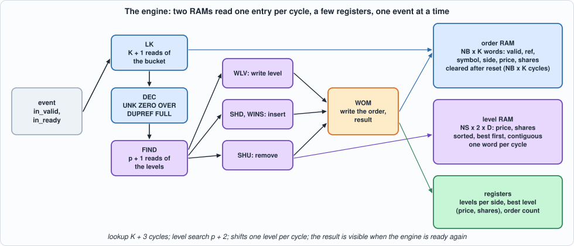
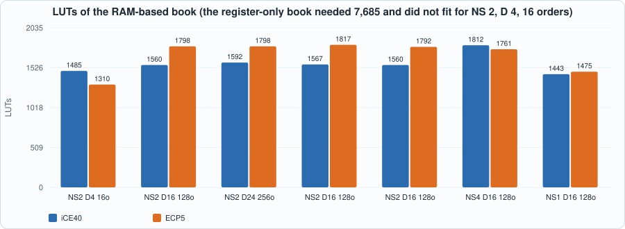
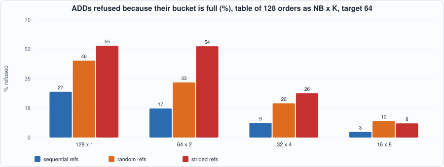
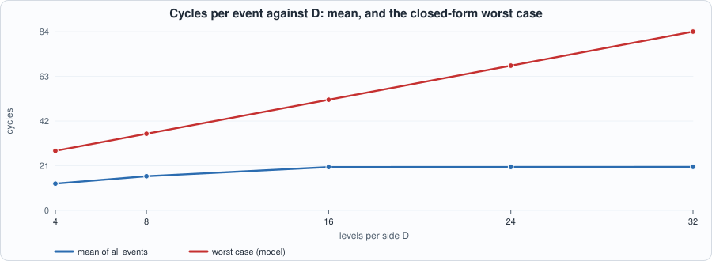

# 20. Order-Book Engineering: RAMs, a Hash Table, and What a Bounded Latency Costs


--8<-- "docs/assets/art/ch-20.md"


**What you will see:** Chapter 19's book was correct and far too big: registers for every order and every level. This chapter builds the same book out of **two RAMs**: the orders in a **hash table** (a bucket of `K` ways, read one way per cycle) and the price levels of each symbol and side in a **sorted array in a RAM** that is searched, shifted and rewritten one entry per cycle. The price is time: an event is no longer one cycle but **K + 3 to a few tens of cycles, depending on the state of the book**. The chapter makes that time part of the specification, checks it **cycle for cycle** against the model, finds the **closed-form worst case**, and measures what the hash table costs in refused orders.

**What you need to know first:** Chapter 19 (the specification with dictionaries, the results and the top of book), Chapter 15 (a closed loop with a model that records per-cycle stimulus) and Chapter 9 (block RAM: a read returns one cycle after its address).

**What this chapter builds:** `rtl/book2.sv` (`book2` and the pin wrapper `book2_syn`), `model/book2_gold.py` (the specification, now with the hash and the cycle counts), `tb/book2_tb.sv`, `tools/ch20_run.py`, `tools/ch20_example_a.py`, `tools/ch20_example_b.py`, `tools/mut_ch20.py`, `tools/make_figs_ch20.py`.

!!! note "Scope: what this chapter leaves out, on purpose"
    **One event at a time**: the engine accepts the next event only when the last has finished; a pipelined engine that overlaps events (and has to forward between consecutive events on the same level) is **not** built, and is where the order-of-magnitude speed-up would come from. **A content-addressable memory (CAM)** is not built; the hash table is the alternative. **Capacity is fixed**: a bucket that is full refuses the ADD (FULL), a side with `D` levels refuses a new level (LVL); nothing is evicted. **The clearing of the order RAM after reset takes `NB x K` cycles** and is part of the contract. 32-bit references, prices and shares, as in Chapter 19. **No design here reaches 125 MHz** (see Example A); the critical path is named but not fixed. This is a model of a design, not a product.

## What changes in the specification

Everything in Chapter 19 stays (events, results, the order in which an ADD is checked, symbols reported, the top of book). Two things are added, both **forced by the hardware**, and the model says them:

1. **A bucket can be full when the table is not.** The order table is `NB` buckets of `K` ways; a reference goes to bucket `h(ref) = (ref ^ ref>>8 ^ ref>>16 ^ ref>>24) mod NB` (`NB` a power of two), and an ADD whose bucket already holds `K` orders is refused with **FULL**, whatever the rest of the table holds. The hash is part of the contract, because it decides which ADDs are refused.
2. **Time.** The model returns, with every event, the **number of cycles** from the cycle it is accepted to the cycle the engine accepts the next one (the result is visible in that cycle). With `p` = the number of strictly better price levels (the index of the order's level, or of the place a new level goes) and `c` = the number of levels on the side:

| step | cycles |
|---|---|
| ADD with 0 shares | 1 |
| accept + lookup of the bucket (every other event) | K + 3 (accept 1, K + 1 reads, 1 decision) |
| the events that end at the decision: UNK, ZERO, OVER, DUPREF, FULL | exactly K + 3 |
| level search | p + 2 |
| LVL (a new level, all `D` in use) | ends after the search |
| an ADD to an existing level, or a reduction that leaves shares at its level | 1 + 1 (write the level, write the order) |
| an ADD of a new level at index p | (c - p + 1 if c > p, else 0) shifting down, + 1 + 1 |
| a reduction that empties the level at index p | (c - p - 1 + 1 if c - p - 1 > 0, else 0) shifting up, + 1 (write the order) |
| REPLACE | the deletion, then the ADD **without** the accept cycle (or ZERO at once if the new shares are 0) |
| after reset | not ready for `NB x K` cycles (the order RAM is cleared) |

```python
--8<-- "model/book2_gold.py"
```

The hand-checked scenarios at the end of the file are worked out by hand from the table (for example, `D = 2, K = 2`: a REPLACE of the order at the best of 2 levels is 10 cycles for the deletion and 10 for the addition, 20; `D = 1, K = 1` gives 15). They are what checks the model; the RTL is then checked against the model.

## The hardware


*Figure 20.1: the states of the engine and the RAMs they use.*

Two RAMs with one write port and one registered read port each: the **order RAM** (`NB x K` words of valid, reference, symbol, side, price, shares) and the **level RAM** (`NS x 2 x D` words of price and shares). Because the read data arrives one cycle after the address, every loop is a small pipeline: an address is issued each cycle and the data of the previous one is consumed. The states:

- **INIT**: write zero to every order word, one per cycle. The level RAM needs no clearing, because the number of levels of each side (a register) says which words are valid.
- **IDLE → LK → DEC**: read the `K` ways of the bucket while recording which way holds the reference (and its fields) and a free way; then decide: DUPREF, FULL, UNK, ZERO, OVER, or go on.
- **FIND**: read the levels from the best down until the price is found (a hit), or a worse price (insert here), or the end; the decision is made `p + 1` cycles after the first read.
- **WLV**: write a level (an addition to it, or a reduction that leaves shares). **SHD** + **WINS**: shift the worse levels down one place per cycle and write the new level. **SHU**: shift the worse levels up over a level that has emptied. **WOM**: write the order word (new, reduced or cleared), report the result, and, for a REPLACE, start the second phase.
- The number of levels of each side, the **best level** of each side and the number of orders are **registers**, updated as the levels change, so the top of book is read in the cycle the result is visible with no RAM access.

```systemverilog
--8<-- "rtl/book2.sv"
```

Two details are worth reading. The RAM address and write data are **combinational functions of the state** (the `always_comb` block), because a registered write enable would write a cycle late; and the shifts read one entry while writing the previous one to a different address, which a one-write-port RAM allows. Two simplifications came from the mutation run below: the free way chosen is simply the last one seen (the model does not say which), and a match needs no "first match" flag (references are unique in the table).

## The tests

```systemverilog
--8<-- "tb/book2_tb.sv"
```

```python
--8<-- "tools/ch20_run.py"
```

To run: `python3 tools/ch20_run.py` (several minutes). Recorded output:

```text
--8<-- "out/ch20_run_out.txt"
```

**Reading the output.**

- **Section 3: the RTL equals the model, cycle for cycle, in all 80 runs** (5 sizes, 4 kinds of stimulus, 4 seeds), in Icarus (both RAMs and the registers powered up with garbage, so that a clearing sweep or a reset that misses something is seen) and in Verilator. Every result, the symbol, the whole top of book and **`in_ready` in every cycle** are compared, so a wrong *time* is a failure like a wrong result. The four kinds: *flow* with faults, *random* events, *wide* (the same flow with every reference mapped through a bijection of 32 bits, so all four bytes of a reference reach the hash and the comparison), and *near* (for every bit, a reference and the same reference with that bit flipped, which land in the **same bucket** when the bit only affects a high bit of the hash, together with reference 0, the value an empty entry holds).
- **Section 4: the longest event.** The closed form `worst_case(D, K)` (an enumeration of the structural cases) equals the longest event of a long random search and the longest of two **constructed** events (D bid levels, REPLACE of the best order by a better price, which shifts `D - 1` levels up and `D - 1` down; or a REPLACE at the worst level that holds two orders, which searches to the end twice), and the RTL executes the constructed events cycle for cycle: **15, 20, 28, 36 and 30 cycles for (D, K) = (1,1), (2,2), (4,4), (8,4), (8,1)**.

## Running example A: what the RAMs buy

```python
--8<-- "tools/ch20_example_a.py"
```

To run: `python3 tools/ch20_example_a.py` (a few minutes). Recorded output:

```text
--8<-- "out/ch20_example_a_out.txt"
```


*Figure 20.2: LUTs of the RAM-based book on the two families.*

- **Measured:** the book of Chapter 19 with 16 orders and 4 levels needed 7,685 LUTs and did not fit the iCE40 HX8K. The RAM-based book with the same capacity is **1,485 LUTs and 55.3 MHz on iCE40, 1,310 LUTs and 77.2 MHz on ECP5**, and a book **eight times larger in orders and four times in levels** (128 orders, 16 levels) is **1,560 LUTs, 50.2 MHz** on iCE40 and 1,798 LUTs, 62.2 MHz on ECP5; 256 orders and 24 levels: 1,592 LUTs, 56.3 MHz (the spread of 50 to 58 MHz across sizes is placement noise as much as design: the logic is the same). **The cost no longer grows with the capacity**: it is the control, the comparators on the one entry being read, the best-level registers and the pin wrapper's 140-bit shift register (about 1,100 flip-flops of 1,150 are registers of the engine and the wrapper). The capacity is in the RAM: 11 block RAMs on iCE40 whatever the size here (each wide word takes `ceil(width / 16)` blocks of 256 words), 5 `DP16KD` and 32 LUT RAMs on ECP5.
- **The clock is still low and routing-bound**: the critical path is 16 to 20 ns, 40 to 60% routing (iCE40: `r_t -> st`, 8.1 ns of logic and 11.9 ns of routing; ECP5: the level RAM's read data to the shift flag `sw`, 10.0 and 6.0): the 32-bit comparison of the level's price with the target, the choice of the next state and the counters in one cycle. **This design does not reach 125 MHz**, and the fix is known but not made: register the comparison results (one more pipeline stage, +1 cycle per search), which changes the timing table above and is Exercise 1.
- **What it cost:** at about 50 MHz and a mean of 20 cycles per event (Example B), the engine handles **about 2.5 million events per second** (derived: 50.2 MHz / 20.4 cycles). Chapter 19's book did one event per cycle at 13 to 26 MHz but could not hold a book; the price of fitting is a factor of ten in cycles per event.

## Running example B: refused orders and cycles

```python
--8<-- "tools/ch20_example_b.py"
```

To run: `python3 tools/ch20_example_b.py`. Recorded output:

```text
--8<-- "out/ch20_example_b_out.txt"
```


*Figure 20.3: ADDs refused because the bucket is full, for a table of 128 orders arranged four ways.*


*Figure 20.4: cycles per event against D.*

- **Hash collisions refuse orders long before the table is full.** A table of 128 orders as 32 buckets of 4 ways, at a target of 64 live orders, refuses **8.7%** of the ADDs with sequential references, **20%** with random references and **26%** with references that are multiples of 64 (the worst case for a hash on the low bits). One way per bucket (a direct-mapped table) refuses 27% to 55%; 8 ways, 3% to 10%. *For scale:* with no limit the target of 64 gives a mean of 86.8 live orders (p99 99), so the load is nearer 0.7 than 0.5. **A hash table needs to be sized well above the number of live orders it must hold**, more than the associative table of Chapter 19, which refused nothing until it was really full. More ways reduce the refusals and cost cycles: the lookup reads all `K` ways, so a K = 8 table costs 25.5 cycles per event on average against 15.1 for K = 1 (section 3).
- **Time depends on the depth, and mostly on the position.** At D = 16 the mean event is **20.4 cycles** (ADD 17.6, EXEC+CANCEL 16.6, DELETE 18.4, REPLACE 35.0) and is almost the same at D = 24 or 32 (20.4): most events are at or near the best price, so the search is short and the deep levels are rarely visited. The **tail** is what grows with D: the 99th percentile of REPLACE is 28 at D = 4, 50 at D = 16 and 53 at D = 32, and the **closed-form worst case is 28, 36, 52, 68 and 84 cycles for D = 4, 8, 16, 24, 32**, against a longest event seen of 28, 36, 52, 66 and 69. For a latency bound the closed form is the answer; for throughput the mean is.
- **At the clock of Example A** the worst case at D = 16, K = 4 is 52 cycles, **about 1.0 microsecond at 50 MHz** (derived), and the mean 0.41 microseconds.

## Testing the tests

Two families of mutants: the **RTL** (79 mutants; battery: the engine against the cycle model on five sizes and four kinds of stimulus, results, top of book and readiness in every cycle) and the **model** (20 mutants; battery: the model's own hand-checked scenarios).

```python
--8<-- "tools/mut_ch20.py"
```

To run: `python3 tools/mut_ch20.py` (a minute or two). Recorded output:

```text
--8<-- "out/ch20_mut_out.txt"
```

**Result: 99 of 99 caught**, after a first run that caught 97 of 101. The four survivors:

| survivor of the first run | why | what was done |
|---|---|---|
| the lookup keeps the *last* free way instead of the first | **equivalent**: the model does not say which free way a new order takes, and the position in the bucket changes neither a result nor a time | RTL simplified to the last one seen; mutant dropped |
| an equal price counts as "better" in the level search | **equivalent**: the hit test comes first, so equality never reaches the comparison | dropped |
| (model) the hash ignores byte 1 | **a missing hand-checked scenario**: no case used a reference above 255 | added: refs differing only in byte 1, 2 or 3 land in different buckets |
| (model) a bucket's fullness is counted over one symbol only | **a missing hand-checked scenario**: no case filled a bucket with orders of another symbol | added |

Earlier edits that this run made possible: the reset of the best-level registers (`tpx`, `tsh`) was found unnecessary (they are shown only when the level count is not 0, and written before it becomes so) and removed; the "first match" flag was removed (references are unique). The two RTL mutants about the **hash bytes** and the **comparison width** were at first uncaught by *flow* and *random* stimulus, whose references are small: the *wide* and *near* kinds were added to the battery for them, and are why the stimulus section above has four kinds.

## What this chapter established, and what it did not

**Established, with the tests that show it:** a book in two RAMs and a few registers that **equals the specification in every cycle, results and time**, on four kinds of stimulus and five sizes, in two simulators; the **timing rules** of the specification and the **closed-form worst case**, checked against a search and against constructed events the RTL executes exactly; a **fit**: 128 orders and 16 levels in about 1,600 LUTs where Chapter 19 could not fit 16 orders and 4 levels; the **cost of the hash** (8.7% to 26% of ADDs refused at a load of about 0.7 for 32 x 4) and of the **depth** (a mean of about 20 cycles, a worst case of 52 at D = 16); 99 of 99 mutants caught.

**Not established:** a clock near 125 MHz (it is 50 to 58 MHz on iCE40 and 59 to 82 on ECP5); an engine that overlaps events; a CAM; a RAM-resident tail of price levels with only the best few in registers (Exercise 3); eviction; 64-bit references; any real feed; whether the sizing numbers survive a different generator (they are properties of this one); the book joined to the parser and arbiter (Part 6).

## Self-check questions

1. Why can an ADD be refused with FULL when the table is far from full, and what in the specification says when?
2. How many cycles does an event that ends in DUPREF take, and why does the number not depend on whether the reference was found?
3. What is `p`, and how does it set the length of the level search?
4. Why does a REPLACE not pay the accept cycle twice?
5. Why are the RAM addresses and write data functions of the state and not registered?
6. Describe the shift down: which entries are read and written in which cycle, and why does a one-write-port RAM suffice?
7. Why does the level RAM need no clearing after reset and the order RAM does?
8. Why is the mean of about 20 cycles almost the same for D = 16 and D = 32 while the worst case is not?
9. What are the two constructed events of Section 4 and why is each the longest of its kind?
10. What does Example A show about how the cost grows with capacity, and where does the capacity go?
11. What limits the clock, and what would you change?
12. Name two survivors of the first mutation run and say, for each, whether it was equivalent or a missing scenario, and what was done.

## Exercises

1. **Register the comparison.** Register `l_px == tgt`, `l_better` and `cnt_l == fi` at the RAM output and decide one cycle later. What changes in the timing table (+1 cycle per search?), in `worst_case`, and in the clock?
2. **Early exit in the lookup.** Stop reading the bucket when the reference is found (for a reduction or DELETE). Update the model's timing and show the mean cycles per event fall.
3. **Levels beyond the best few.** Keep the best 4 levels of each side in registers and the rest in the RAM. What is the rule when the top level empties and the next must come from the RAM, and what does it do to the worst case?
4. **A better hash.** Replace the XOR fold with a multiplicative hash; measure the refusals of Example B for sequential, random and strided references. Is the strided case still the worst?
5. **A mutant that survives.** Add a mutant to `tools/mut_ch20.py` that neither battery catches. Is it equivalent, outside the contract, or is a test missing?
