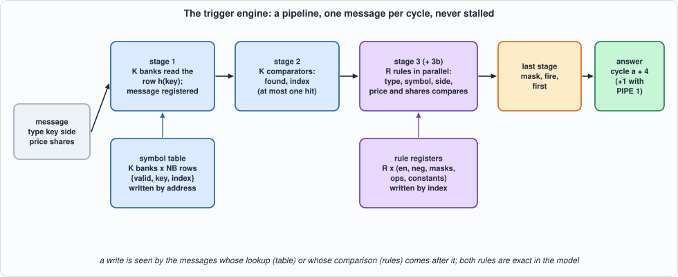
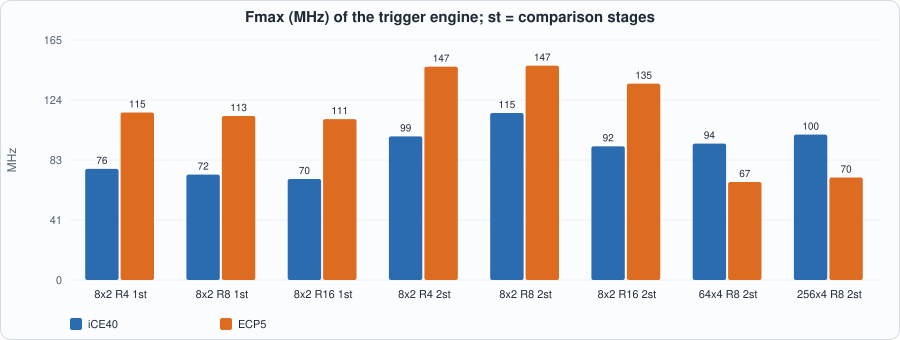
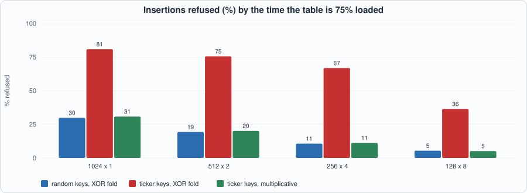

# 21. Triggers: Predicates on Messages, a Symbol Table, and Comparators That Meet the Clock


--8<-- "docs/assets/art/ch-21.md"


**What you will see:** the book of Chapters 19 and 20 knows what is happening in the market. Part 5 decides and acts, and the first step is a **trigger**: a small set of conditions on each message (a price above a level, a large execution in a watched symbol, anything that is not an ADD) that says *something we care about just happened*. The chapter writes the **specification first** (a message goes through a **symbol table** that turns the exchange's stock key into a small index, and through **R rules** that are predicates on the message), then builds a **pipeline** that answers every message, one per cycle, in a fixed number of cycles, and shows what it costs and what limits its clock: a design that **reaches 125 MHz on ECP5** (as a few in Chapters 9 and 16 did; not on iCE40) once the 32-bit comparisons are cut in two stages.

**What you need to know first:** Chapter 10 (hash tables and match engines), Chapter 16 (the fields of an ITCH message), Chapter 20 (a hash table in RAM, a model that states time, near-miss test keys) and Chapter 3 (reading a timing report).

**What this chapter builds:** `rtl/trig.sv` (`trig` and the pin wrapper `trig_syn`), `model/trig_gold.py` (the specification, the closed loop and the stimulus), `tb/trig_tb.sv`, `tools/ch21_run.py`, `tools/ch21_example_a.py`, `tools/ch21_example_b.py`, `tools/mut_ch21.py`, `tools/make_figs_ch21.py`.

!!! note "Scope: what this chapter leaves out, on purpose"
    **Predicates are a fixed template**, not a language: each rule is a conjunction of a type mask, a symbol set (or any), a side (or any) and **one comparison each on the price and on the shares against a constant**, optionally negated; a rule that compares two message fields with each other, or one field with an arithmetic expression, is not expressible (the fixed-point signals of Chapter 22 feed richer conditions). **No state**: a rule sees one message; a count of messages, a moving price or a position is a later chapter. **The keys are 32 bits** (ITCH's stock names are 8 bytes). **The table is written by address**: choosing the way is the control plane's job (`place()` in the model is what its software does); the hardware has no insert, no delete and no duplicate check. **Loads and rule writes while messages flow are in the contract** (the model says exactly which messages see them), but a table write must not be issued during the `NB` cycles after reset in which the table is cleared, and `in_valid` must be 0 during reset. This is a model of a design, not a product.

## What a trigger is

`model/trig_gold.py` states it in plain Python. A **message** is `(type, key, side, price, shares)`. The **symbol table** is `NB` buckets of `K` ways; a key lives in bucket `h(key) = (key ^ key>>8 ^ key>>16 ^ key>>24) mod NB` (the hash of Chapter 20, on 32 bits), in any of the `K` ways; the table answers `(found, index)` or `(0, 0)`. A **rule** is `en`, `neg`, a type mask over the 5 message types, **symany or a mask over the symbol indexes** (a message whose key is not in the table matches only a rule with `symany`), **sideany or one side**, and a comparison each on price and shares (`ANY`, `LT`, `LE`, `EQ`, `NE`, `GE`, `GT`, `NEVER`; unsigned 32 bits). A rule **matches** when it is enabled and its predicate xor `neg` is true; the answer to a message is `mask` (bit r = rule r matched), `fire` (any bit) and `first` (the lowest matching rule).

The model also says **when**. A message offered in cycle `a` is answered in cycle `a + L`, `L = 4 + PIPE`, with no stalls. And it says exactly which writes a message sees, because the control plane writes while messages are in flight:

- a **table write** in cycle `w` is seen by the lookups of cycles `w + 1` on (the write lands at the end of cycle `w`; a lookup in cycle `w` reads the old contents);
- a **rule write** in cycle `c` is seen by the messages offered from cycle `c - 1` on (a message offered in cycle `a` has its rules compared in cycle `a + 2`).

```python
--8<-- "model/trig_gold.py"
```

The hand-checked scenarios at the end are worked out on paper (the hash of seven keys, every comparison at, below and above its constant, the disabled and the negated rule, an unknown key against a symbol mask, and the cycle in which a table write and a rule write start to be seen). They are what checks the model; the RTL is then checked against it.

## The hardware


*Figure 21.1: the pipeline and the two tables the control plane writes.*

- **Symbol table.** `K` RAM banks of `NB` words; a lookup reads **the same row of all `K` banks** in one cycle and compares `K` keys at once (Chapter 20 read the ways one per cycle: here the time is fixed at the cost of `K` comparators). A table write is by address: bank `ld_addr mod K`, row `ld_addr / K`. After reset a sweep clears the valid bits, one row per cycle in all banks (`o_ready` is low for `NB` cycles).
- **A stored key omits its low `log2(NB)` bits.** Row bit `b` is `key[b] ^ key[b+8] ^ key[b+16] ^ key[b+24]`, so two keys in the same row that agree in the other bits agree in these too: the bits are redundant (for `NB` up to 256). The mutation run below found this: comparing all 32 bits could not be told from comparing 31.
- **Rules** are registers (`R x` about 110 bits), written by index. Per rule, in one cycle: the part that does not depend on price and shares (type mask indexed by the type, symbol mask indexed by the index, side), and the two comparisons against constants, each from `x < c` and `x == c`.
- **PIPE = 1 splits each 32-bit comparison in two stages**: the halves are compared in the first (`<` and `==` on the high 16 bits and on the low 16 bits, registered, together with the rest of the rule's inputs), and combined in the second (`lt = hi_lt | (hi_eq & lo_lt)`, `eq = hi_eq & lo_eq`). The rule's fields are all read in the first of the two stages, so a rule write is seen at the same cycle either way. The latency is 4 cycles with one stage and 5 with two; the throughput is one message per cycle in both.
- The last stage turns the `R` match bits into `mask`, `fire` and `first` (a priority encoder).

```systemverilog
--8<-- "rtl/trig.sv"
```

## The tests

```systemverilog
--8<-- "tb/trig_tb.sv"
```

```python
--8<-- "tools/ch21_run.py"
```

To run: `python3 tools/ch21_run.py` (a few minutes). Recorded output:

```text
--8<-- "out/ch21_run_out.txt"
```

**Reading the output.**

- **Section 3: the engine equals the model in all 85 runs** (5 sizes; 4 kinds of traffic with 4 seeds each, and the directed edge set once), in Icarus (the rule registers and the table banks powered up with garbage, so that a reset or a clearing sweep that misses something is seen) and in Verilator. Every answer (found, index, matching rules, fire, first) is compared **in the cycle the model says**, and so is `ready`; a wrong time is a failure like a wrong answer. The five kinds: *random* traffic, with rule writes and table writes at random cycles, **in the same cycle as a message** so the visibility rules are exercised; *wide* (32-bit keys); *near* (keys one bit apart, which share a bucket whenever the bit does not change the hash); *dense* (a message in every cycle, with a write in one cycle in five); and *edge*: for every comparison, every constant in a set that holds the 16-bit and 32-bit boundaries against every message value in the same set, on the price and on the shares (about 3,000 answers per size).
- The sizes include `K = 1` (a direct-mapped table), `K = 8`, `R = 3` (not a power of two), `NS = 8` and `NS = 32` (the index width), and both comparison depths.

## Running example A: what it costs and how fast it runs

```python
--8<-- "tools/ch21_example_a.py"
```

To run: `python3 tools/ch21_example_a.py` (a few minutes). Recorded output:

```text
--8<-- "out/ch21_example_a_out.txt"
```


*Figure 21.2: Fmax of the engine, with one and two comparison stages.*

- **Measured, one comparison stage:** 603 LUTs (4 rules) to 2,786 (16 rules) on iCE40, **70 to 76 MHz**; 749 to 2,882 LUTs on ECP5, 111 to 115 MHz. The critical path is the one the stage was built to cut: iCE40, the registered price (`s2_px`) through the 32-bit comparison to the rule's registers (6.4 ns of logic and 7.9 ns of routing); ECP5, `s2_px` to `s3_m` (2.9 and 6.1).
- **Measured, two stages:** **92 to 115 MHz on iCE40 and 135 to 147 MHz on ECP5**, for one more cycle of latency. **On ECP5 this is above 125 MHz for 4, 8 and 16 rules (146.7, 147.4 and 135.0 MHz)**; on iCE40 the best is 115 MHz (8 rules), 99 with 4 and 92 with 16 (placement noise is several MHz: the logic is the same). The cost in LUTs is not more, and not monotone: 625, 1,459 and 1,727 LUTs for 4, 8 and 16 rules (iCE40), against 603, 1,474 and 2,786 with one stage: the two halves are cheaper comparators than one 32-bit one (the synthesis tool's carry chain is not free), and the 8-rule case is within a few LUTs. 16 rules cost 1,727 LUTs against 2,786: a saving of a third at the larger size.
- **The symbol table moves the limit.** With 8 buckets of 2 ways (a table of 16 symbols) Yosys puts the banks in LUT RAM on ECP5 (no block RAM, 18 `DPR16X4`), and the engine runs at 147 MHz; with **64 x 4 (256 symbols) and 256 x 4 (1,024 symbols)** the banks are block RAM (4 `DP16KD` on ECP5, 8 `SB_RAM40_4K` on iCE40) and **the ECP5 falls to 67 to 70 MHz**: the path is the block RAM's output to the `K` key comparators and the index (8.8 ns of logic, 5.4 of routing); on iCE40 it is 94 to 100 MHz (`way[1].mem.RDATA` to `idx_or`, 4.5 and 5.5). **Both table sizes cost the same logic (1,138 and 1,185 LUTs on iCE40): the table is in the RAM.** The fix is one more stage that registers the RAM's output before the comparison (Exercise 3); it costs a cycle of latency and was not built.
- **Throughput and latency (derived):** one message per cycle at every size, so at 147 MHz **147 million messages per second** (ECP5, 4 rules, small table) and 115 million on iCE40; the answer comes **5 cycles (34 ns at 147 MHz) after the message is offered**. The messages the feed delivers (millions per second at the busiest) are far below this: the clock is not the limit, the *latency* is what the stage count trades.

## Running example B: the table and the rules on a workload

```python
--8<-- "tools/ch21_example_b.py"
```

To run: `python3 tools/ch21_example_b.py`. Recorded output:

```text
--8<-- "out/ch21_example_b_out.txt"
```


*Figure 21.3: insertions refused by the time a table of 1,024 entries is 75% loaded.*

- **The XOR-fold hash fails on tickers, and the failure is large.** A table of 1,024 entries as 256 buckets of 4 ways takes **random** 32-bit keys until 21% load before the first refusal and refuses 11% of insertions by 75% load. With **tickers** (1 to 4 random capital letters, space padded, as four ASCII bytes) the first refusal comes at **7.8%** load, and **67% of the insertions are refused by 75% load**; direct-mapped, 81%. The reason is visible in the hash: letters differ in their low five bits, the XOR of four of them is a 5-bit number, so the low 6 or 7 bits of the hash (the row) take at most a few dozen values whatever the table size. The **multiplicative** hash of Exercise 1 (the top bits of `key x 0x9E3779B1`, here in the model only) is as good on tickers (11% refused by 75% with 256 x 4) as the XOR fold on random keys. **Chapter 20's refusals under strided references were the same effect**; a hash on structured keys needs to mix the bits.
- **Ways help, as in Chapter 20, at a price in comparators:** random keys, 75% load: 30%, 19%, 11% and 5% refused for 1, 2, 4 and 8 ways.
- **The rules on a workload.** Eight rules (a price band, a large execution in a watch list, every DELETE, a key not in the table, everything but an ADD) on 200,000 synthetic messages: rule 3 (anything in the watch list) matches 66% of messages because the popular symbols are in the list; rule 4 (a key not in the table) 14.9%; the selective ones (an EXEC or CANCEL of 500 shares or more in the list, or any message of 2,000 shares or more) 0.4%. **97.7% of the messages fire at least one rule**: a trigger set with rules like these is a filter that passes almost everything, and the choice of what to *do* on `fire` (Chapters 22 to 25) is where the decision is. The numbers are a property of this synthetic stream and these rules.

## Testing the tests

Two families of mutants: the **RTL** (74 mutants; battery: the engine against the cycle model on five sizes and five kinds of traffic) and the **model** (21 mutants; battery: the model's own hand-checked scenarios).

```python
--8<-- "tools/mut_ch21.py"
```

To run: `python3 tools/mut_ch21.py` (a minute or two). Recorded output:

```text
--8<-- "out/ch21_mut_out.txt"
```

**Result: 95 of 95 caught**, after a first run that caught 85 of 96. The eleven survivors:

| survivor of the first run | why | what was done |
|---|---|---|
| a table write ignores the valid bit; an invalid entry can match | **a missing test**: the generator cleared an entry with a write of key 0, so ignoring the valid bit only mattered to a message with key 0 | a deletion now writes the entry's own key and index with the valid bit 0 (what software that keeps a copy of the table does) |
| only 31 bits of the key are compared | **equivalent**: the dropped bit is implied by the row and the other bits | generalised: the RTL stores keys without their low `log2(NB)` bits; the mutant became "one bit fewer than that", caught by keys one bit apart |
| the first stage, the second stage, the output register are not reset | **equivalent, each alone**: the valid chain was reset at every stage, and one stage's reset flushes the rest within the three reset cycles | the RTL resets only the last valid register (`in_valid` must be 0 during reset: stated in the scope note); two mutants on that reset added (one per comparison depth) |
| (model) a duplicate key can be placed | **a missing hand-checked scenario**: no case had the key present *and* a free way | added |
| (model) an unknown key matches a symbol mask | **a missing hand-checked scenario**: no case had a symbol mask with bit 0 set and an unknown key | added |
| (model) a negated rule ignores the enable | **a missing hand-checked scenario**; the first scenario written for it did not tell the two apart (its predicate was true), which a second run showed, and it was rewritten with a false predicate | added |
| (model) `ready` one cycle early; the side test ignored | **missing hand-checked scenarios** | added |

The remaining RTL mutants include each comparison operator confused with its neighbour, each field of a rule write left out, the hash ignoring a byte, a table write to the wrong row or ignoring the index, the halves of a two-stage comparison combined wrongly, the signed comparison, the first rule taken as the last, and a clearing sweep that stops a row early.

## What this chapter established, and what it did not

**Established, with the tests that show it:** a symbol table and `R` rules, pipelined at one message per cycle, whose answers equal a plain-Python specification **in the cycle the specification says**, including the cycle in which a table write or a rule write starts to be seen, on five kinds of traffic and five sizes in two simulators; **a trigger engine at 135 to 147 MHz on ECP5** (small table, up to 16 rules, two comparison stages), **70 MHz with a block-RAM table**, and 92 to 115 MHz on iCE40; the **cost of the table** (the logic does not grow with the table); **a measured weakness**: the XOR-fold hash refuses two thirds of the tickers by 75% load where a multiplicative hash would refuse a tenth; 95 of 95 mutants caught.

**Not established:** a clock above 100 MHz with a block-RAM table (Exercise 3); a hash that is good on structured keys *in the engine* (it is measured in the model only); rules that compare two fields or keep state; 8-byte keys; the table written while messages flow *from software* (the contract is stated and tested with hardware-timed writes, not with a real control plane); the sizing numbers outside the synthetic ticker and message generators; the triggers joined to a decision and to order entry (Chapters 22 to 25).

## Self-check questions

1. What are the fields of a message, a rule and an answer, and when does a rule match?
2. Why does a message whose key is not in the table match only a rule with `symany`?
3. In which cycle is a message offered in cycle `a` answered, and what changes with two comparison stages?
4. A table write is issued in cycle `w` and a message in cycle `w`: does the message see it? And a rule write in cycle `c` and a message in cycle `c - 1`?
5. Why does a lookup read the same row of all `K` banks, and what does it cost compared with Chapter 20's one way per cycle?
6. Why can a stored key omit its low `log2(NB)` bits? For which `NB`?
7. How is a 32-bit comparison split in two stages, and why are all of a rule's fields read in the first?
8. Why is the logic of the engine almost the same for a table of 256 and of 1,024 symbols?
9. Why does the ECP5 fall from 147 MHz to 70 MHz when the table moves from LUT RAM to block RAM, and what would you change?
10. Why does the XOR-fold hash refuse most ticker keys at 75% load, and what does a multiplicative hash do differently?
11. What does `in_valid` have to be during reset, and what changed in the RTL because of it?
12. Name two survivors of the first mutation run and say, for each, whether it was equivalent or a missing test, and what was done.

## Exercises

1. **A multiplicative hash in the engine.** Replace the XOR fold by the top bits of `key x 0x9E3779B1`. The partial-key saving no longer works (why?); what does the multiplier do to the clock, and how many refusals does it save on tickers? Update the model, the near-miss test (it assumes the fold) and the mutants.
2. **A rule on two fields.** Add a clause `shares >= price / 100` (or `shares * 100 >= price` to avoid a divider). What does it cost in LUTs and in clock, and what must the model say about overflow?
3. **Register the RAM's output.** Add a stage between the banks and the key comparators; what is the latency, what does the visibility rule for table writes become, and how far does the ECP5 clock rise with the 256 x 4 table?
4. **A stateful rule.** Add a per-symbol counter of messages and a rule "more than N messages for this symbol since the last reset". What is the hazard between two messages of the same symbol in consecutive cycles, and how does the model state it?
5. **A mutant that survives.** Add a mutant to `tools/mut_ch21.py` that neither battery catches. Is it equivalent, outside the contract, or is a test missing?
