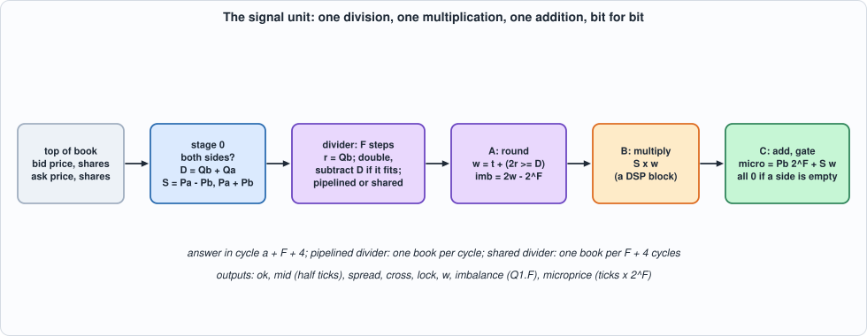
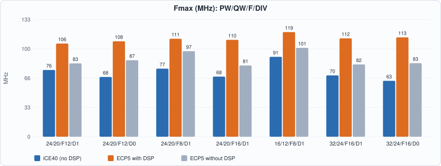
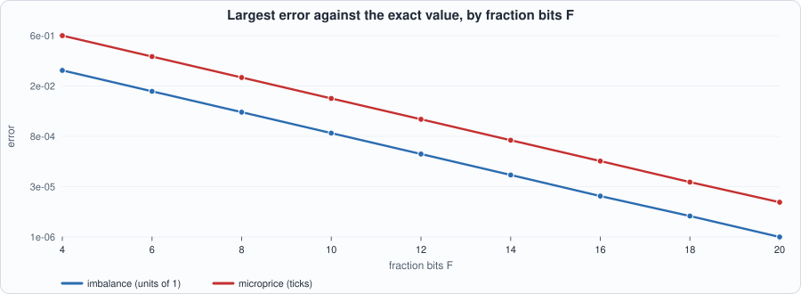
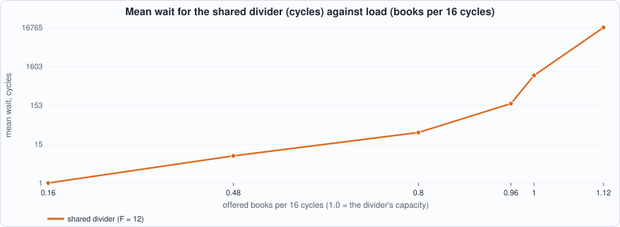

# 22. Fixed-Point Signals: Imbalance, Mid and Microprice, a Division That Is Exact to the Bit, and What a DSP Block Buys


--8<-- "docs/assets/art/ch-22.md"


**What you will see:** the trigger of Chapter 21 compares a message with constants. A **signal** is a number computed from the book: how lopsided the quantity at the touch is (the **imbalance**), where the price would sit if it leaned toward the thinner side (the **microprice**), the **mid** and the **spread**. Computing them in hardware means choosing a **fixed-point format**, a **rounding rule** and an **overflow rule**, and then proving that the hardware does *exactly* that, to the last bit. The chapter writes the arithmetic as a specification in integers, builds a unit with **one division** (F restoring steps, pipelined or shared), one multiplication and one addition, tests it **bit for bit** against the specification, **measures the error against the exact rational values**, and shows what a DSP block saves and what a shared divider costs in waiting.

**What you need to know first:** Chapter 5 (fixed-point arithmetic, DSP blocks), Chapter 20 (the top of book the unit reads) and Chapter 3 (reading a timing report).

**What this chapter builds:** `rtl/sig.sv` (`sig` and the pin wrapper `sig_syn`), `model/sig_gold.py` (the specification, the exact reference, the closed loop and the stimulus), `tb/sig_tb.sv`, `tools/ch22_run.py`, `tools/ch22_example_a.py`, `tools/ch22_example_b.py`, `tools/mut_ch22.py`, `tools/make_figs_ch22.py`.

!!! note "Scope: what this chapter leaves out, on purpose"
    **The signals are of the best bid and the best ask only** (the touch); an imbalance over the top N levels is Exercise 4. **Prices are unsigned integers of `PW` bits (ticks) and shares unsigned of `QW` bits**: the 32-bit values of Chapter 20 must fit (`PW <= 32`, `QW <= 24`); a larger share count is outside the contract. **No state**: each answer is a function of one top of book. **One division**, restoring, one bit per step; a faster divider (radix 4, a reciprocal and Newton's method) is an exercise. **The multiplication is the DSP's**, not pipelined inside it (the clock result says so). **Only the best bid and ask are read**; whether the book is crossed is reported (`cross`, `lock`), not repaired. This is a model of a design, not a product.

## What the signals are

`model/sig_gold.py` states the arithmetic in a few lines of integer Python. With `Pb, Qb` the best bid's price and shares and `Pa, Qa` the best ask's:

| output | definition | format |
|---|---|---|
| `ok` | `Qb > 0` and `Qa > 0`; when 0, **every output is 0** | 1 bit |
| `mid2` | `Pa + Pb`: the mid in **half ticks**, exact | `PW + 1` bits, unsigned |
| `spread` | `Pa - Pb` (negative if the book is crossed), with `cross` (spread < 0) and `lock` (spread = 0) | `PW + 1` bits, signed |
| `w` | `round_half_up(Qb x 2^F / (Qa + Qb))`: the bid's share of the quantity at the touch | `F + 1` bits, 0 to 2^F |
| `imb` | `2 w - 2^F`: the imbalance `(Qb - Qa) / (Qb + Qa)` in units of 2^-F | `F + 2` bits, signed |
| `micro` | `Pb x 2^F + spread x w`: the microprice `Pb + spread x Qb / (Qa + Qb)` in ticks x 2^F | `PW + F` bits, unsigned |

**The microprice** is the price you get by weighting each side's price by the *other* side's quantity: `(Pa x Qb + Pb x Qa) / (Qa + Qb)`. If the bid is thick (`Qb` large) the next trade is more likely to lift the ask, and the microprice leans toward the ask. It always lies between the two prices, because `w` is between 0 and 1.

**One division, done once.** `w` is the only quotient; the imbalance and the microprice are computed from the **rounded** `w` (`imb = 2w - 2^F` is exact in `w`, and `micro` is an exact integer product and sum), so no number is rounded twice by a different rule. The imbalance therefore has a resolution of 2^-(F-1) (only even values), and the microprice error is at most `spread / 2^(F+1)`. **Rounding is half up**, so the unit is *not* antisymmetric at exact halves: swap the sides and an exact half rounds up on both, so `w(Qb, Qa) + w(Qa, Qb)` is 2^F or 2^F + 1.

**Time.** A book offered in cycle `a` is answered in cycle `a + L`, `L = F + 4`: `F` division steps, one rounding stage, one multiplication stage, one addition stage. With **DIV = 1** (a pipelined divider) the unit accepts a book every cycle; with **DIV = 0** (one shared divider step) it is busy until the answer is visible and accepts a new book every `F + 4` cycles.

```python
--8<-- "model/sig_gold.py"
```

The hand-checked scenarios are worked on paper (a book with `Qb = 10, Qa = 30` has `w = 4/16`, imbalance -0.5 and microprice 100.5; equal sides; a missing side; a crossed and a locked book; the exact-half rounding cases at `F = 3`). The self-test also checks that the division done **as the hardware does it** (a remainder doubled and reduced `F` times) gives the same `w` as the closed formula. They are what checks the model; the RTL is then checked against it.

## The hardware


*Figure 22.1: the stages of the signal unit.*

- **Stage 0** decides `ok`, forms the total `D = Qb + Qa`, the spread and the mid.
- **The divider** starts with the remainder `r = Qb` (which is below `D` when both sides are present, so the integer part of the quotient is 0) and does `F` steps: double the remainder; if it is at least `D`, subtract `D` and shift in a 1, else shift in a 0. After `F` steps the quotient bits `t` are `floor(Qb 2^F / D)` and the remainder `r` says how close the next bit is. In the **pipelined** version each step is a stage with its own registers (the remainder, the total, the quotient so far and the values the later stages need); in the **shared** version one step is reused for `F` cycles under a counter.
- **Stage A** rounds (`w = t + (2r >= D)`: the next bit, half up) and forms the imbalance. **Stage B** multiplies `spread x w` (signed by unsigned). **Stage C** adds `Pb 2^F` and gates every output with `ok`.
- The product and the sum are computed **modulo 2^(PW+F)**: the true value lies in range, so the low bits are the answer, and no sign or carry bit is carried that nothing uses.

```systemverilog
--8<-- "rtl/sig.sv"
```

## The tests

```systemverilog
--8<-- "tb/sig_tb.sv"
```

```python
--8<-- "tools/ch22_run.py"
```

To run: `python3 tools/ch22_run.py` (a few minutes). Recorded output:

```text
--8<-- "out/ch22_run_out.txt"
```

**Reading the output.**

- **Section 2: the properties of the arithmetic**, checked on 362,764 cases of random books in the model: `w` stays in `[0, 2^F]`, the imbalance in `[-1, 1]`, the microprice **between the two prices**, the imbalance error is at most one unit of 2^-F and the microprice error at most `spread / 2^(F+1)`; **the bounds are reached** (the worst errors seen are exactly 1.0000 of each bound, at exact halves), so they are tight, not loose; and the sum `w(Qb, Qa) + w(Qa, Qb)` is always 2^F or 2^F + 1.
- **Section 3: the unit equals the model in all 45 runs** (5 formats, both dividers; random and burst books with 4 seeds each, and the directed set once), in Icarus and in Verilator; every output bit, `in_ready` and the valid flag are compared in every cycle. The three kinds: random books (prices around a drifting mid with a spread of 0 to 20 ticks, sometimes crossed; shares long-tailed, sometimes zero, sometimes equal) with random gaps; the same in **bursts** (no gaps, which makes the shared divider hold each book until it is accepted); and **directed** books: every combination of prices and shares from sets that hold the boundaries (0, 1, the maximum, a half, crossed, locked, equal, one side empty), **2,916 books**, and the **exact-half** books, where the division lands exactly on half a unit and the rounding rule is the only thing that decides (22 more).
- The formats include 12-bit prices with 8-bit shares and `F = 4`, and 30-bit prices with 22-bit shares and `F = 16`, and a fraction width that is odd (`F = 9`).

## Running example A: what it costs and what a DSP block buys

```python
--8<-- "tools/ch22_example_a.py"
```

To run: `python3 tools/ch22_example_a.py` (a few minutes). Recorded output:

```text
--8<-- "out/ch22_example_a_out.txt"
```


*Figure 22.2: Fmax of the unit on iCE40 (no DSP), on ECP5 with DSP blocks and on ECP5 without.*

- **The multiplication is where the DSP block pays.** At the default format (24-bit prices, 20-bit shares, `F = 12`, pipelined divider) the unit is **1,408 LUTs and 2 `MULT18X18D` at 105.7 MHz on ECP5**; forbidding the DSP (`synth_ecp5 -nodsp`) gives **3,156 LUTs at 83.2 MHz**: the block saves **1,748 LUTs (55%) and raises the clock by 27%**. The HX8K has no DSP block, so the multiplier is LUTs there: 1,942 LUTs at 75.7 MHz.
- **The shared divider is a quarter of the size.** DIV = 0 is **335 LUTs and 514 flip-flops on ECP5** against 1,408 LUTs and 1,834 flip-flops for the pipelined divider (iCE40: 1,110 LUTs against 1,942): the pipelined divider holds `F` copies of the remainder, the total and every number the later stages need. The latency is the same (16 cycles at `F = 12`); only the rate differs.
- **The clock is limited by the multiplication stage, not by the divider.** The critical path is `a_s -> b_prod` on ECP5 with the DSP (5.7 ns of logic and 3.7 ns of routing: the block's combinational path with no pipeline registers inside it), and the same on iCE40 (7.0 and 6.2). **No format reaches 125 MHz**: 106 to 113 MHz on ECP5 at the 24-bit and 32-bit formats, 118.7 MHz at 16-bit prices with 12-bit shares. Using the DSP's own pipeline registers (or splitting the product in two stages) is Exercise 1.
- **Cost against width:** `F` from 8 to 16 raises the pipelined unit from 988 to 1,823 LUTs and from 1,404 to 2,240 flip-flops on ECP5 (about 105 of each per fraction bit: one more stage of registers and a subtractor); 32-bit prices with 24-bit shares at `F = 16` are 3,563 LUTs against 1,823 for 24 and 20 bits.

## Running example B: how many fraction bits, and what waiting costs

```python
--8<-- "tools/ch22_example_b.py"
```

To run: `python3 tools/ch22_example_b.py`. Recorded output:

```text
--8<-- "out/ch22_example_b_out.txt"
```


*Figure 22.3: the largest error against the exact rational value, by `F`.*


*Figure 22.4: mean wait of a book for the shared divider, against its load.*

- **The error halves with every fraction bit, and the bound holds.** On 45,305 random books the largest microprice error is **0.039 tick at `F = 8`, 0.0024 at `F = 12`, 0.00015 at `F = 16`**, and always within `spread / 2^(F+1)` (section 1: the last column is at most 1/2^(F+1) of the spread). The imbalance error is below 0.004 at `F = 8` and 0.00024 at `F = 12`. **For a microprice that is right to a hundredth of a tick on every book seen, `F = 10` is enough; for a thousandth, `F = 14`.** Fixed point is not a loss of accuracy here: a few bits give a precision no market has.
- **What the shared divider costs is waiting, and it is cruel at the limit.** At `F = 12` it accepts one book every 16 cycles. With books arriving at random and each held until accepted, the mean wait is 1.4 cycles at 0.16 books per 16 cycles, 7 at 0.48, **29.5 at 0.8**, 169 at 0.96 and **928 cycles at 1.0** (the divider's capacity), after which the queue grows without bound. The pipelined divider never waits. **The choice is a rate, not a taste**: Chapter 20's book finishes an event about every 20 cycles on average (a mean of 20.4 at `D = 16`), which is a load of about 0.8 on a shared divider of capacity one per 16 cycles: a mean wait of about 30 cycles, with bursts that wait for hundreds.

## Testing the tests

Two families of mutants: the **RTL** (47 mutants; battery: the unit against the bit-exact model on five formats and three kinds of stimulus) and the **model** (13 mutants; battery: the model's own hand-checked scenarios and the check that the hardware's division equals the formula).

```python
--8<-- "tools/mut_ch22.py"
```

To run: `python3 tools/mut_ch22.py` (about a minute). Recorded output:

```text
--8<-- "out/ch22_mut_out.txt"
```

**Result: 60 of 60 caught**, after a first run that caught 60 of 64. The four survivors:

| survivor of the first run | why | what was done |
|---|---|---|
| the pipelined valid is not reset at its first stage; the output valid is not reset | **equivalent, each alone**: the stage before one of them is reset, which flushes it in the next cycle (`in_valid` must be 0 during reset) | the two redundant resets removed from the RTL; the mutants dropped |
| the shared divider does one step too many | **equivalent**: the extra step starts in the cycle in which the next stage takes the result, so it is never seen | the guard `if (cnt < F)` removed from the RTL (the divider steps in every busy cycle); that mutant and its neighbour ("one step too few") dropped, since the guard is gone |
| rounding is half down (`>` for `>=`) | **a missing test**: the two rules differ only when the division lands *exactly* on half a unit, which random shares almost never do | `half_books()` added: books with `Qb = m`, `D = m 2^(F+1)` and `Qb` odd with `D = 2^(F+1)`, which hit exact halves, in the directed set; the self-test checks they really are exact halves |

The other RTL mutants include each of the six outputs ungated, the quotient bit inverted or not shifted, the divider started from the ask's shares, the remainder or the total not carried between stages, the product without the top bit of `w` (which matters only when `w = 2^F`), the microprice without its price term or with the term not shifted, and the shared divider free a cycle early or late. Two **lint** items were also cleaned up along the way: unused high bits of three intermediate values, removed by doing the arithmetic modulo the width actually used.

## What this chapter established, and what it did not

**Established, with the tests that show it:** a fixed-point **specification** (formats, half-up rounding, the imbalance and the microprice from one rounded `w`) with **proved properties** (the microprice between the two prices, the two error bounds, **reached** and so tight); a unit that **equals the specification in every output bit and every cycle**, pipelined and shared, on five formats, random, burst, directed and exact-half books, in two simulators; the **price of the format** (error halving with each bit: `F = 10` for 0.01 tick, `F = 14` for 0.001); **what a DSP block buys** (55% of the LUTs and 27% of the clock at 24-bit prices) and **what a shared divider costs** (a quarter of the area, a waiting time that diverges at its capacity); 60 of 60 mutants caught.

**Not established:** a clock above 125 MHz (the multiplication stage limits it at 105 to 119 MHz on ECP5; Exercise 1); a faster or smaller divider; the imbalance over several levels; signals over time (a moving average, a sign of the last change); the unit joined to the book (the unit takes a top of book as an input; the join is Chapter 26); the error figures outside the synthetic book generator.

## Self-check questions

1. What are `mid2`, `spread`, `w`, `imb` and `micro`, in which formats, and why is `mid2` in half ticks?
2. Why is there only one division, and why is `imb` computed from `w` instead of divided separately?
3. Why does the remainder start at `Qb`, and why does `F` steps give `F` fraction bits and no integer bit?
4. Why is `w(Qb, Qa) + w(Qa, Qb)` sometimes 2^F + 1? What does the unit do when a side has no shares?
5. Why does the microprice always lie between the two prices, even when the book is crossed?
6. State the two error bounds. Why are they *tight*, and what shows it?
7. At what time is a book answered, and how do the two dividers differ in when they accept a new one?
8. Why does the pipelined divider need so many flip-flops, and what does the shared divider give up?
9. Why does forbidding the DSP block cost more than a half of the LUTs here, and why does the clock fall?
10. What limits the clock, and what would you change (Exercise 1)?
11. How many fraction bits give a microprice right to a hundredth of a tick, and what does the data in Example B say about waiting for the shared divider at its capacity?
12. Name two survivors of the first mutation run and say, for each, whether it was equivalent or a missing test, and what was done.

## Exercises

1. **Reach 125 MHz.** Split the product into two stages (the low and high halves of `w`, or the DSP's own input and output registers); what does it do to the latency, to `L`, to the LUTs, and to the clock on ECP5 at 24-bit prices?
2. **A radix-4 divider.** Do two quotient bits per step. How many cycles does the shared divider save, what does a step cost in LUTs, and what changes in `division()` and in the half-books?
3. **No divider.** Replace the division by a reciprocal table of `1 / D` (on the leading bits of `D`) and one Newton-Raphson step. What error does it add to `w`, and what does the model have to say about it (the bounds of this chapter no longer hold)?
4. **The top N levels.** Compute the imbalance over the best 2 levels of each side: `(Qb1 + Qb2 - Qa1 - Qa2) / (all four)`. What changes in the widths, and is the microprice formula still the right one?
5. **A mutant that survives.** Add a mutant to `tools/mut_ch22.py` that neither battery catches. Is it equivalent, outside the contract, or is a test missing?
