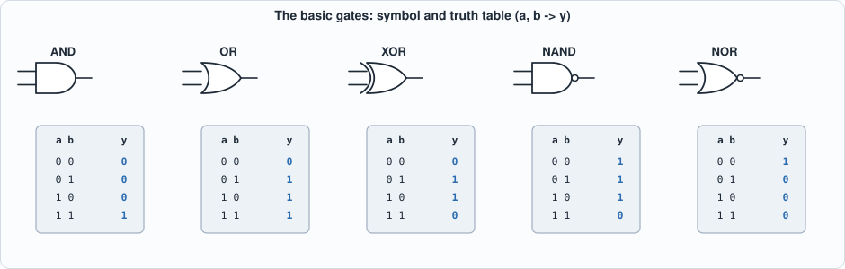
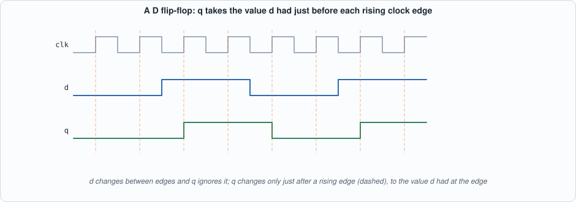
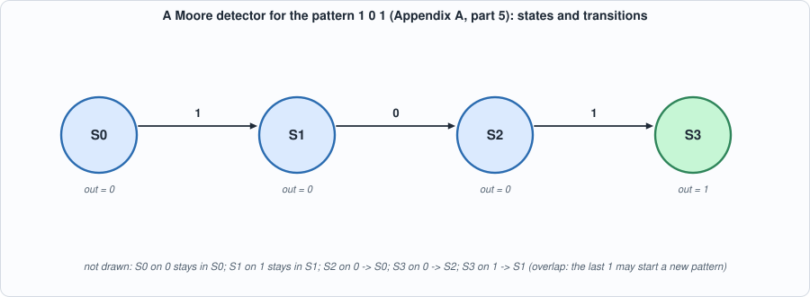

# Appendix A. Digital Logic


--8<-- "docs/assets/art/appx-a.md"


**Who this is for:** readers who have not built digital circuits before, or have forgotten how. It is the background for Chapters 1-5 and for the Verilog of Appendix B. **What you will do:** build adders out of NAND gates, simulate flip-flops and a state machine cycle by cycle, and work out why a clock has a speed limit. Every number below comes from `tools/appx_a.py`, whose recorded output is part of this page.

## Bits, gates and truth tables

A digital circuit works with signals that are, at each moment, one of two values: 0 or 1 (low or high voltage). A **gate** computes one output bit from one or two input bits. Its whole behaviour fits in a **truth table**: one row per combination of inputs.


*Figure A.1: the basic gates. AND is 1 only if both inputs are 1; OR if either is; XOR if exactly one is (it is addition of one-bit numbers without the carry); NAND and NOR are the inverses of AND and OR.*

Gates are cheap and fast in hardware, and one fact makes the whole subject manageable: **NAND alone is enough**. NOT is a NAND with its inputs tied together, AND is a NAND followed by a NOT, OR is a NAND of two NOTs, and XOR takes four NANDs. The script builds all four from `nand` only and checks them against Python's own operators on every input. Real chips use libraries of a few dozen cell types (Chapter 10) because NAND-only logic is bigger and slower than logic that uses the cell that fits.

## Combinational circuits: adders

A **combinational** circuit has no memory: its outputs depend only on its present inputs. The central example is binary addition. One column of an addition has two input bits and a carry in; it produces a sum bit and a carry out. That is a **full adder**: `sum = a XOR b XOR cin` and `cout = (a AND b) OR ((a XOR b) AND cin)`. Chain four of them, the carry of each feeding the next, and you have a 4-bit **ripple-carry adder**, which the script checks on all 512 combinations of its inputs.

The carry of the top bit cannot be known until the carry of every bit below it has been computed: the delay grows in proportion to the width (the script prints about 2n + 2 gate levels for n bits). A **lookahead** (or prefix) adder computes the carries with a tree of logarithmic depth, at the price of more gates. Chapter 10 builds both and measures them. The lesson is general: *the same function can be built in different structures, with a trade-off between area and speed*.

## Sequential circuits: flip-flops and the clock

A **flip-flop** remembers one bit. The D flip-flop has an input `d`, an output `q` and a clock; on each *rising edge* of the clock it copies `d` to `q` and holds it until the next edge. Everything between edges is combinational logic computing the next `d`s from the current `q`s. This is the **synchronous** style of design: all state changes happen together at the clock edge, so the circuit moves in discrete steps and can be reasoned about one step at a time.


*Figure A.2: q takes the value d had at the rising edge (dashed lines). The changes of d between edges are ignored.*

The script's clocked simulator makes this concrete: a 4-bit **shift register** (each edge moves every bit one place left and takes the new bit in at the right) and a 2-bit **counter with enable**. In both, the next state is computed from the *current* state and input and *all* flip-flops change together; that is what `<=` means in Verilog (Appendix B).

## Finite-state machines

Control logic is usually a **finite-state machine**: a set of states, a rule giving the next state from the current state and the input, and an output that depends on the state (a *Moore* machine) or on the state and the input (*Mealy*). Hardware stores the state in flip-flops and computes the rule with combinational logic. The example is a detector for the pattern 1 0 1 (overlapping matches allowed): four states remember how much of the pattern has been seen. The script runs it on a 16-bit stream and compares it with a direct "look at the last three bits" reference: the outputs are identical.


*Figure A.3: the detector. Chapter 7's sequencer, which fetches and issues one instruction at a time, is a larger machine of the same kind.*

## Why a clock has a speed limit

Between two flip-flops the signal must travel through the combinational logic and arrive before the next edge, a little early (the **setup time**). So the clock period must satisfy

```
period  >=  clock-to-q (time for the first flip-flop's output to change)
          + logic delay (the longest path through the gates)
          + setup time (of the second flip-flop)
```

This is **static timing analysis** (Appendix G) in one line. The script evaluates it with *assumed* delays: a 4-bit ripple adder between registers allows about 370 MHz, a 32-bit ripple adder only 60 MHz, a 32-bit lookahead adder about 227 MHz. A faster clock needs a shorter longest path: smaller logic between registers (more pipeline stages, Chapter 10) or faster structures. These delays are made-up round numbers for illustration, not those of any real process.

## Running the examples

```python
--8<-- "tools/appx_a.py"
```

To compile and run: `python3 tools/appx_a.py` (instant; Python only). Recorded output:

```text
--8<-- "out/appx_a_out.txt"
```

## Self-check questions

1. Build XOR from NAND gates only and count them. Check it on all four inputs by hand.
2. How many input combinations must a test cover to check a full adder exhaustively? A 16-bit adder with carry in?
3. In the shift register example, what is the register after three edges for the input stream 1, 1, 0 starting from 0000?
4. Give the state table of a Moore machine that outputs 1 when the last two bits were both 1 (overlap allowed). How many states does it need?
5. A path has clock-to-q 0.3 ns, logic 3.4 ns and setup 0.1 ns. What is the fastest clock? What happens if you clock it faster?
6. Why can a flip-flop's `d` change between edges without changing `q`?
