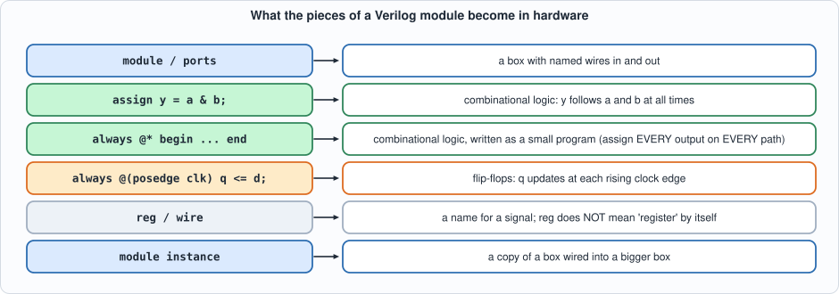
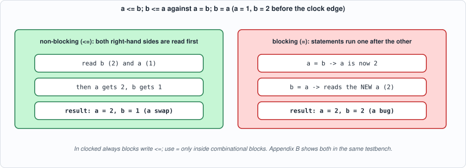

# Appendix B. Verilog


--8<-- "docs/assets/art/appx-b.md"


**Who this is for:** readers who will read or write the RTL in this book. Verilog describes hardware, not a program: a module is a *structure* that exists all the time, and the language's statements describe wires and registers, not a sequence of steps. This appendix covers the synthesizable subset the book uses, the three or four mistakes that account for most bugs, and how a design is tested. The demonstration modules (`rtl/appx_b.v`) and their self-checking testbench (`tb/appx_b_tb.v`) run in **both** simulators and are tested by mutation like every other circuit in the book.

## The shape of a module

```verilog
module name #(parameter W = 8) (input clk, input [W-1:0] a, output [W:0] y);
    wire [W-1:0] t;                      // wires carry values between pieces
    reg  [W-1:0] r;                      // a reg is a variable that a procedural block assigns
    assign t = a ^ 8'hFF;                // continuous assignment: t is ALWAYS a XOR 0xFF
    always @(posedge clk) r <= t;        // clocked block: flip-flops
    assign y = {1'b0, r};                // concatenation: {high, low}
endmodule
```

A module has **ports** (inputs and outputs, with widths), **parameters** (constants set when it is used), internal **wires** and **regs**, and a body of **assignments**, **procedural blocks** and **instances** of other modules. Numbers are written `width'base value`: `8'hFF`, `4'b1010`, `12'd2047`; `{4{x[7]}}` repeats a bit four times (sign extension).


*Figure B.1: what each construct means in hardware. `reg` is only a language word for "assigned inside an always block"; whether it becomes a flip-flop or just a wire depends on the block.*

## Combinational and sequential blocks

- **`assign y = expr;`** is combinational: `y` follows its inputs at all times.
- **`always @* begin ... end`** is also combinational, written like a program. The rule: **assign every output on every path** (give `if` an `else`, `case` a `default`). If a path leaves an output unassigned, the output must *remember* its old value, and synthesis builds a **latch**, a memory element you did not ask for. The script shows it: the same multiplexer with and without a `default` synthesizes to a `$dlatch` in one case and none in the other, and Yosys warns *Latch inferred for signal*.
- **`always @(posedge clk) ...`** is sequential: its assignments update flip-flops at each rising edge.

## Blocking and non-blocking assignment

The most important rule of the language: **in a clocked block use `<=` (non-blocking); in a combinational block use `=` (blocking).** A non-blocking assignment reads every right-hand side *before* any left-hand side changes, exactly as flip-flops sampling at the same edge. A blocking assignment takes effect at once and the next statement sees it. The demonstration modules swap two registers both ways: with `<=` the pair swaps; with `=` the second statement reads the already-changed value and **both registers end up equal**, which the testbench checks.


*Figure B.2: the same two statements, two meanings.*

## The pieces tested here

```verilog
--8<-- "rtl/appx_b.v"
```

- **`gray_cnt`** is a synchronous counter with enable and synchronous reset whose output is a **Gray code** (`b ^ (b >> 1)`): consecutive values differ in exactly one bit. The testbench checks the formula for 20 steps, the one-bit-change property at every step, and that the counter holds its value while `en` is low.
- **`swap_nb` / `swap_blocking`** show the assignment rule above.
- **`mux_latch` / `mux_ok`** show the forgotten case and its repair.
- **`extend`** shows width and sign: `{{4{x[7]}}, x}` sign-extends 8'h80 (-128) to 12'hF80 (still -128), while `{4'b0000, x}` zero-extends it to 12'h080 (+128). A signed value widened without sign extension changes its meaning, the commonest arithmetic bug in RTL (Chapter 2).

## Testbenches

A **testbench** is Verilog too, but not synthesizable: it generates the clock (`always #5 clk = ~clk;`), applies inputs, waits (`@(negedge clk)` samples away from the active edge, avoiding races) and **checks** outputs against what the design should do, printing `PASS`/`FAIL` and exiting. A testbench that only prints waveforms for a person to inspect is not a test. Two simulators are used for every circuit in the book (Icarus Verilog and Verilator) because they implement the language independently: a race condition or a simulator-specific behaviour usually shows as a difference between them.

```verilog
--8<-- "tb/appx_b_tb.v"
```

```python
--8<-- "tools/appx_b.py"
```

To compile and run: `python3 tools/appx_b.py` (a few seconds; needs Icarus Verilog, Verilator and Yosys). Recorded output:

```text
--8<-- "out/appx_b_out.txt"
```

## Testing the test

Each mutant changes one line of `appx_b.v`; the testbench must fail. Run with `python3 tools/mut_appx_b.py`:

```text
--8<-- "out/appx_b_mutation_out.txt"
```

All ten are caught, but **the first run caught nine**: "the enable is ignored" survived, because the original testbench held `en = 1` all the time, so a counter that ignores `en` was indistinguishable from a correct one. The hold-while-disabled check was added in response. This is the book's method in miniature (Chapter 1): a test that never exercises an input cannot notice that the design ignores it.

## Common mistakes, and what catches them

| mistake | symptom | what catches it |
|---|---|---|
| `=` in a clocked block | registers that should swap or shift behave as if combinational | a testbench that checks sequences; a lint tool |
| missing `default` or `else` in a combinational block | an unwanted latch | synthesis warning `Latch inferred`; Yosys `check` |
| mixing widths silently | high bits lost or wrongly extended | `iverilog -Wall`, Verilator warnings; tests with extreme values |
| unsigned used where signed meant | negative numbers read as large positives | tests at -128, -1, 0, 127 |
| combinational loop (output feeds its own input) | simulation oscillates or hangs | simulator, synthesis `check` |
| reading a signal at the active clock edge in a testbench | a race: the result depends on scheduler order | sample at the *other* edge; use both simulators |

## Self-check questions

1. Write a module `inc4` that adds 1 to a 4-bit input with wrap-around, once with `assign` and once with `always @*`.
2. Why does `always @* case (sel) 0: y = a; 1: y = b; endcase` for a 2-bit `sel` produce a latch?
3. In `swap_blocking`, what are the values of `a` and `b` after the first clock edge following reset?
4. Convert the 4-bit binary values 0110 and 1011 to Gray code by hand. Check that they differ from their neighbours in one bit.
5. What does `{{4{x[7]}}, x}` produce for `x = 8'h7F`? For `x = 8'h80`?
6. Why does the book run every testbench in two simulators?
