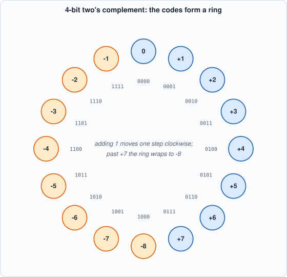
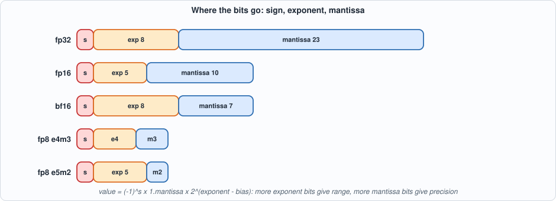

# Appendix C. Number Formats


--8<-- "docs/assets/art/appx-c.md"


**Who this is for:** readers who want the background of Chapters 2 and 3 (the MAC, quantization, requantization) and Chapter 13 (int4). A chip computes with a *finite number of bits*; this appendix is about what those bits mean, what they cannot represent, and what happens when a result does not fit. Every table comes from `tools/appx_c.py`.

## Integers: unsigned and two's complement

An *n*-bit pattern read as an **unsigned** integer has the value `sum(bit_i * 2^i)`, from 0 to 2^n - 1. To also represent negative numbers, hardware uses **two's complement**: the top bit has weight `-2^(n-1)` instead of `+2^(n-1)`. The range is `-2^(n-1) .. 2^(n-1) - 1`: int4 -8..7, int8 -128..127, int16 -32768..32767, int32 about +-2.1 billion.

The reason it is universal is that **addition works the same for signed and unsigned**: the adder does not need to know. Negation is "invert every bit and add one". The asymmetry has a consequence: `-128` has no positive counterpart in int8, so `-(-128)` is `-128` again, which is why quantization (Chapter 3) uses the symmetric range -127..127 and leaves -128 unused.


*Figure C.1: 4-bit two's complement. Counting up past +7 wraps to -8; this wrap-around is overflow.*

**Overflow** is a result outside the range. Two answers exist: **wrap-around** (keep the low bits, so 100 + 28 = 128 becomes -128) or **saturation** (clamp to the nearest representable value, 127). Wrap-around is what a plain adder does and is catastrophic for a signal (a loud positive becomes a loud negative); saturation distorts less and is what the requantizer of Chapter 3 does. The script prints both for several sums.

**Widening.** To put an n-bit signed number in more bits, copy the sign bit into the new top bits (**sign extension**); zero-extension would change the meaning of a negative number.

## Fixed point

A **fixed-point** number stores an integer and remembers, outside the data, a scale: the real value is `integer * 2^-n` for a format with n fraction bits (written Qm.n for m integer bits). It is how the hardware of this book represents fractions: the softmax input is Q4.4 (Chapter 6), the requantizer multiplier is a fixed-point fraction (Chapter 3). The error of rounding to the nearest value is at most half a step (`2^-(n+1)`); the script shows 0.7071 stored in Q1.7, Q4.4 and Q8.8 with its error. The trade-off is fixed: more fraction bits means finer steps but a smaller range.

## Rounding

When a result falls between two representable values, a rule picks one. **Truncation** drops the low bits (biased downward). **Round half up** sends .5 upward (biased upward: the script rounds the 100 values -50.5 .. 49.5 and the average error is +0.50). **Round half away from zero** sends .5 to the larger magnitude (symmetric, so no bias for data that is balanced around zero: 0.00 on this list). **Round half to even** sends .5 to the nearest even integer (no bias for any data). Biases matter when millions of roundings accumulate; the requantizer in this book rounds half away from zero (`round_half_away` in `model/quant.py`: symmetric, and cheap in hardware), and Chapter 3 measures its effect.

## Floating point

A **floating-point** number stores a sign, an exponent and a mantissa: `(-1)^s * 1.mantissa * 2^(exponent - bias)`. The exponent gives range, the mantissa precision, and the spacing between neighbours **grows with magnitude**: in fp16 the gap near 1 is 0.001, near 100 it is 0.06, near 10,000 it is 8. Floats suit values that span many orders of magnitude; integers suit values whose range is known, and are far cheaper in hardware, which is why inference chips quantize to int8 or int4.


*Figure C.2: fp32 (8+23), fp16 (5+10), bf16 (8+7), fp8 e4m3 and e5m2. bf16 keeps fp32's range with 8 bits of precision: it is fp32 with the low 16 bits cut off, which is why it is popular for training.*

The script decodes any (exponent, mantissa) format with one function, checks it against Python's own fp32 and fp16 encodings on 1,000 values each, and prints the range and epsilon of each format. Note: the 8-bit e4m3 format used in practice reserves only one code for NaN and so reaches 448; the generic IEEE-pattern decoder gives 240.

## Accumulating products

A product of two int8 numbers needs 16 bits. A **sum** of n such products needs `16 + ceil(log2 n)` signed bits: the worst case is every product equal to (-128) x (-128) = 16,384 = 2^14, so the sum is n * 2^14. This is why the MAC of Chapter 2 has a wide accumulator (32 bits: enough for sums of 2^16 products) and why a matrix unit of K = 64 terms needs 22 bits at the very least. The script tabulates it.

## Symmetric int8 quantization

Mapping real numbers to int8: choose a **scale** `s = max|x| / 127`, store `q = round(x / s)`, and recover `x ~ q * s`. The error of each value is at most `s/2`. A scale chosen from the largest value uses the range exactly; an outlier makes the scale large and wastes resolution for everything else (Chapter 3 measures this). int4 uses the same recipe with 7 in place of 127 (Chapter 13).

## Running the examples

```python
--8<-- "tools/appx_c.py"
```

To compile and run: `python3 tools/appx_c.py` (instant). Recorded output:

```text
--8<-- "out/appx_c_out.txt"
```

## Self-check questions

1. Write -37 in 8-bit two's complement. Add 100 to it by hand in binary and check the result.
2. What do the 8-bit patterns 0x80, 0xFF and 0x7F mean as unsigned and as signed?
3. Which format represents a value near 0.001 more finely: Q1.7, or fp16? Which represents 1000?
4. Round 2.5, 3.5 and -2.5 by truncation, half up and half even.
5. How many bits does the sum of 1,000 int8 products need in the worst case?
6. A tensor has values in [-6, 6] with one outlier at 60. What is the int8 scale, and what is the quantization step of the ordinary values?
7. Why is saturation better than wrap-around for an activation, and when would wrap-around be acceptable?
