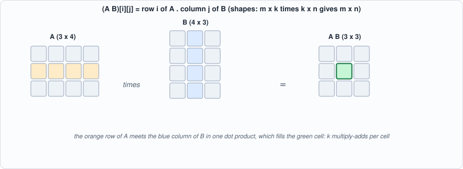
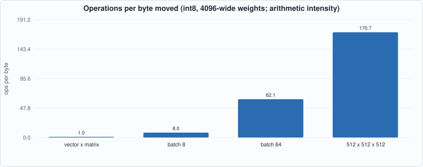

# Appendix D. Linear Algebra for Machine Learning


--8<-- "docs/assets/art/appx-d.md"


**Who this is for:** readers who need the mathematics behind Chapters 4, 8, 9 and 11, and have not met vectors and matrices as *computations*. The only operations a neural network performs on its weights are the ones on this page: dot products, matrix products, a few elementwise functions and softmax. Everything is checked by `tools/appx_d.py`, which uses nothing but Python lists.

## Vectors and the dot product

A **vector** is a list of numbers. The **dot product** of two vectors of the same length multiplies them element by element and adds: `a . b = sum(a_i * b_i)`. For `a = [1, 2, 3]` and `b = [4, -5, 6]` it is `4 - 10 + 18 = 12`. Geometrically it measures how much two vectors point the same way: divided by the lengths it is the cosine of the angle between them (1 for the same direction, 0 for perpendicular, -1 for opposite). The attention score between a query and a key (Chapter 8) is a dot product: a large score means the query and key point alike.

The dot product is also the multiply-accumulate (MAC) of Chapter 2: *every* matrix operation is a pile of them.

## Matrices and the matrix product

A **matrix** is a table of numbers with `m` rows and `n` columns. Multiplying a matrix `A` (m x k) by `B` (k x n) gives an m x n matrix whose entry `(i, j)` is the dot product of row `i` of `A` with column `j` of `B`. The inner dimensions must agree (`k`); the result has the outer ones. Matrix multiplication is **not commutative**: `A B` and `B A` usually differ, and may not even have the same shape (the script shows a 2x3 times 3x2 giving 2x2 and the reverse giving 3x3).


*Figure D.1: one cell of a matrix product.*

A **vector times a matrix** (`x W`, a 1 x k row times a k x n matrix) is the case that matters most: it is what one layer of a network does to one token's activations. The transpose swaps rows and columns, and `(A B)^T = B^T A^T` (checked).

## Three ways to see one product

The script computes the same product three ways and checks they agree: row by row (each row of the left matrix times the whole right matrix), entry by entry (a dot product per output cell), and as a **sum of outer products** (column `k` of `A` times row `k` of `B`, added over `k`). The last is the view that matters for hardware: a **systolic array** (Chapter 4) receives one column of the left operand and one row of the right at each step, and every cell adds its product to a running sum. Different loop orders, same numbers, very different memory behaviour (Chapter 5).

## Counting work

An m x k by k x n product does `m * k * n` multiply-adds (`2 m k n` floating-point operations, counting the add and the multiply separately); the script counts them by running the loops. For a language model, every weight matrix is used once per token per batch row: a 7B-parameter model does about 7 billion multiply-adds per token.

## Arithmetic intensity: why decoding is slow

What limits a computation is the smaller of two rates: arithmetic and memory. The ratio **operations per byte moved** (arithmetic intensity) says which. Moving the operands of a product costs `m k + k n + m n` bytes in int8:


*Figure D.2: operations per byte for a 4096-wide weight matrix.*

A vector times a 4096 x 4096 matrix does **one** multiply-add per weight byte: the weights are read once and used once. A matrix with 64 rows of activations reuses each weight 64 times: 62 operations per byte. A modern accelerator can do hundreds of operations per byte it can read, so the first case leaves the multipliers idle waiting for memory and the second may fill them. This single calculation is the reason batching (Chapter 9), speculative decoding (Chapter 16) and mixture-of-experts routing (Chapter 17) exist.

## Softmax

**Softmax** turns a list of scores into probabilities: `p_i = exp(s_i) / sum_j exp(s_j)`; the results are positive and sum to 1; larger scores get larger shares. Computing `exp` of a large number overflows, so every implementation first subtracts the maximum (which cancels in the ratio): the script shows scores `[1000, 999]` giving `[0.73, 0.27]`, not an overflow. Chapter 6 builds a softmax unit from a lookup table and a divider.

## One attention head in four lines

With `d` the head width, a query `q`, cached keys `K` and values `V` (one row per past token):

```
scores  = q K^T / sqrt(d)        # one dot product per cached token
weights = softmax(scores)        # non-negative, sum to 1
output  = weights V              # a weighted average of the value rows
```

The output is a weighted average, so every entry lies between the smallest and the largest of the corresponding value entries (checked by the script). The `1/sqrt(d)` keeps the scores from growing with the width of the head.

## Running the examples

```python
--8<-- "tools/appx_d.py"
```

To compile and run: `python3 tools/appx_d.py` (instant). Recorded output:

```text
--8<-- "out/appx_d_out.txt"
```

## Self-check questions

1. Compute `[2, -1, 3] . [4, 0, -2]`. Are the vectors closer to perpendicular or to the same direction?
2. Multiply `[[1, 0], [2, 1]]` by `[[3, 1], [0, 2]]`. Multiply them in the other order and compare.
3. A product of a 6 x 8 matrix with an 8 x 5 matrix: what shape is the result, and how many multiply-adds?
4. Compute the arithmetic intensity (int8) of a 1 x 1024 vector times a 1024 x 1024 matrix.
5. Why does softmax subtract the maximum before exponentiating? Does it change the result?
6. Softmax of `[0, 0, 0, 0]`: what is it, and what does it say about attention with all scores equal?
7. Why does the outer-product view suit a systolic array better than the dot-product view?
