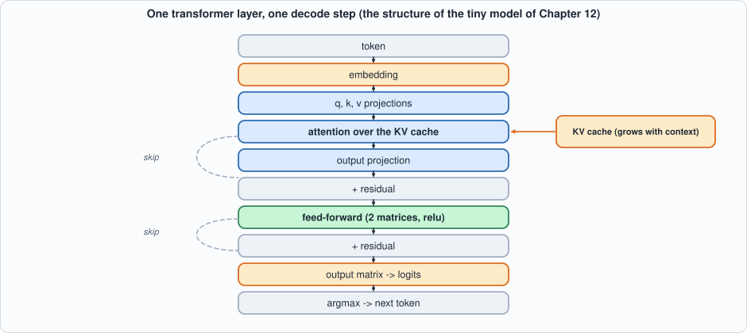
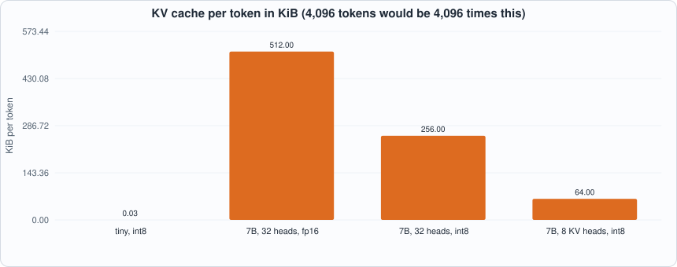

# Appendix E. Transformers and LLM Inference


--8<-- "docs/assets/art/appx-e.md"


**Who this is for:** readers who want the model-side background of Chapters 6, 8, 9, 12 and 14-17: what a transformer language model computes, what a decode step costs, and why serving it is a memory problem. The running model is the *tiny* model of Chapter 12 (the numbers in the first parts come from running it), scaled up by formula to real sizes. `tools/appx_e.py` produces every number.

## What a language model does

A language model reads a sequence of **tokens** (pieces of text, mapped to integers by a fixed vocabulary) and produces, for the next position, a score for every token in the vocabulary (the **logits**). **Generation** repeats: feed the tokens so far, pick the next token, append it, repeat. *Greedy* decoding picks the largest logit; *sampling* draws a token in proportion to the softmax of the logits (Appendix D). This book decodes greedily so that its tests have a deterministic answer.

## The structure of one layer

A transformer is a stack of identical layers. Each has two blocks, each wrapped in a **residual connection** (the block's output is *added* to its input, so the input flows through unchanged and the block learns a correction):


*Figure E.1: one decode step of one layer. The tiny model of Chapter 12 has exactly this structure (and no layer normalization, which Capra lacks).*

1. **Embedding.** The token's integer indexes a row of a table: a vector of `d` numbers.
2. **Attention.** Three projections give the token's query, key and value. The key and value are appended to the **KV cache**; the query is compared with *all cached keys* (dot products, scaled), the scores go through softmax, and the output is the weighted average of the cached values (Appendix D). Attention is the only place where tokens interact. Several **heads** run in parallel on slices of the vectors; an output projection mixes them.
3. **Feed-forward network (FFN).** Two matrices with an elementwise nonlinearity between them, applied to each token independently: `relu(h W1) W2`. It holds most of the parameters. (A *mixture of experts*, Chapter 17, replaces it by several and picks one per token.)
4. **Output matrix.** The final vector times a `d x vocabulary` matrix gives the logits.

## Counting parameters

A layer has `4 d^2` attention weights (the q, k, v and output projections) and `2 d f` FFN weights (`f` is the hidden width, usually about 4d; modern models use a gated FFN with three matrices, `3 d f`), plus embeddings and the output matrix (`2 V d`). The script checks the formula against the tiny model's actual weights (2,560 numbers; the chip's 2,304 are these minus the embedding table, which the host holds) and applies it to larger configurations: a 125M-class model comes to about 162 million parameters, a 7B-class model (32 layers, d = 4096) to 6.74 billion.

## The KV cache

Without a cache, each new token would redo the keys and values of every earlier token. With one, each token's key and value are computed once and stored: per token, per layer, `kv_heads * head_width` numbers each for K and V. For a 7B-class model with 32 KV heads, 128 wide, int8: **256 KiB per token**, so a 4,096-token context is 1 GiB *per request*. Sharing keys and values across heads (Chapter 14) cuts it by the sharing factor; a sliding window (Chapter 15) bounds it; both are covered by the arithmetic in the figure:


*Figure E.2: the cache per token for the tiny model and three 7B-class variants (fp16 with 32 heads; int8 with 32 heads; int8 with 8 KV heads).*

## Prefill and decode

Two phases have opposite character. **Prefill** processes the whole prompt at once: its matrices have many rows (one per prompt token), so every weight is reused across them, and the work is arithmetic-bound. **Decode** produces one token per pass: the matrices have *one* row, every weight is read and used once, and the work is memory-bound. For a 7B-class model the script prints 3,316 G multiply-adds for a 512-token prefill and 6.5 G for one decode step, against the *same* 6.5 GB of weights to read: 512 operations per weight byte against 1.

Decode is therefore the problem every chapter of Part 6 attacks from a different side: fewer bytes per weight (int4, Chapter 13), a smaller cache (GQA and windows, Chapters 14-15), more tokens per pass over the weights (speculation, Chapter 16), fewer weights read per token (experts, Chapter 17) and, in Chapter 9, more requests per pass (batching).

## The decode loop

```
tokens = prompt
repeat:
    logits = model(last token, KV cache)      # one decode step
    next   = argmax(logits)                   # or a sample
    append the new key and value to the cache
    tokens.append(next)
```

The loop is inherently sequential: token t+1 needs token t. The host program in Chapter 12 is this loop; the chip runs the model step.

## Layer normalization (not in the tiny model)

Real transformers also normalize each vector before each block: `x -> (x - mean) / sqrt(variance + eps) * gain`, keeping the activations at a stable scale. It needs a reciprocal square root, which is a divider with a lookup table (Chapter 6); Capra has no operation for it, so the tiny model omits it. This is one of the ways the model is smaller than a real one, along with having no training: its weights are constructed so the answer is known (Chapter 12).

## Running the examples

```python
--8<-- "tools/appx_e.py"
```

To compile and run: `python3 tools/appx_e.py` (instant). Recorded output:

```text
--8<-- "out/appx_e_out.txt"
```

## Self-check questions

1. Count the parameters of a model with 24 layers, `d = 1024`, `f = 4096` (two-matrix FFN) and a vocabulary of 50,000, with a separate output matrix.
2. Why does the attention of token t only look at tokens up to t? What stops it looking ahead during decode?
3. Compute the KV cache per token of a model with 40 layers, 8 KV heads of width 128, in int8. How many requests of 8,192 tokens fit in 24 GiB?
4. Why is decode memory-bound but prefill not? Express it as operations per weight byte.
5. A residual connection adds the block's output to its input. What would happen to the signal after 100 layers without them?
6. Greedy against sampling: which gives the same output twice, and why does a test suite care?
