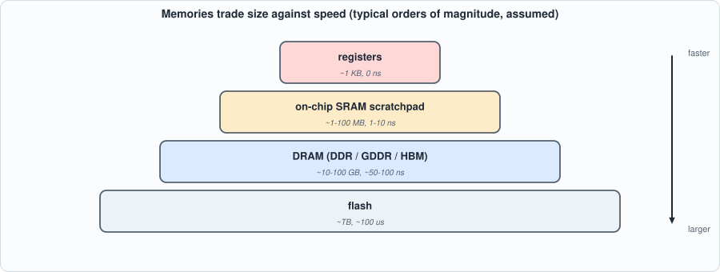
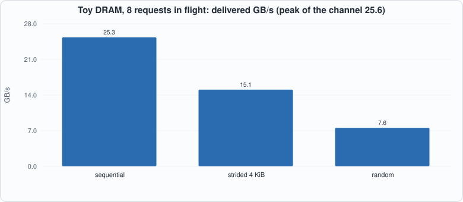

# Appendix F. Memory Systems and DRAM


--8<-- "docs/assets/art/appx-f.md"


**Who this is for:** readers of Chapters 5 and 9 who want to know where the memory numbers come from, and why the book's chips assume a simple fixed-latency memory. The DRAM model here is a *toy* with **assumed** DDR-class timings; it shows the shapes of the effects (what a row hit is, why random access is slow, why parallelism helps), not the numbers of any real part. `tools/appx_f.py` runs it.

## The hierarchy

Memory is a compromise between size, speed and cost, so computers use several kinds in layers:


*Figure F.1: smaller and closer is faster. Orders of magnitude only; they vary with process and design.*

- **Registers and flip-flops** hold a few bytes and are available in the same cycle.
- **SRAM** (static RAM: six transistors per bit) is fast and sits on the same die as the logic; megabytes to a hundred megabytes. The **scratchpad** of Chapter 5 is SRAM. It has one cycle of read latency, and (in this book's chips) one write port.
- **DRAM** (dynamic RAM: one transistor and a capacitor per bit) is dense and cheap but slow, and must be periodically **refreshed**; gigabytes. It lives in separate chips (DDR, GDDR) or in stacks next to the processor (**HBM**).
- **Flash** holds terabytes and takes about a hundred microseconds to read.

An accelerator keeps what it is working on in SRAM and **streams** the rest from DRAM. The chip of Chapter 7 does it with explicit `LD` and `ST` instructions and a DMA engine (Chapter 5): the programmer, not a cache, moves the data.

## How DRAM works

A DRAM chip is a set of **banks**; each bank is a grid of cells read a whole **row** at a time into a **row buffer**. To read a byte:

- if the right row is already in the row buffer, a **row hit**: just the *column access* (time `tCL`);
- if the bank is idle, an **activate** loads the row (`tRCD`) and then the column access;
- if a *different* row is open, a **precharge** closes it (`tRP`), then activate, then column access: a **row miss**, the slowest case.

With the assumed timings of the script (14 ns each) that is 14, 28 and 42 ns to the first data. Data then moves in **bursts** over the bus (64 bytes in 2.5 ns for a 25.6 GB/s channel). Several banks can work at once, overlapping each other's latencies.

## Three access patterns

The script drives the same toy DRAM with three patterns of 4,000 requests:


*Figure F.2: the same memory, three patterns. Sequential access reaches nearly the channel's peak of 25.6 GB/s; a stride that keeps landing in one bank gets 60% of it; random access, almost every request a row miss, gets 30%.*

- **Sequential** (streaming a weight matrix, as decode does): 99% row hits; with one request at a time the 14 ns of latency dominates (3.8 GB/s), but with eight in flight the latencies overlap and the channel is nearly full (25.3 GB/s). *Bandwidth needs parallelism: a memory system must be asked for several things at once.*
- **Strided by 4 KiB:** every access lands in the same bank (the bank number is the line number mod 8, and 4 KiB is exactly 64 lines), so the banks cannot overlap each other even though the rows hit.
- **Random:** every request pays a row miss; the throughput is limited by activates.

**Open-page against closed-page** policy (keep the row open after an access, or precharge at once): in this toy model, open page wins for both patterns, by a factor of two on the stream. Real controllers choose per workload or adaptively. **Banks** matter less here than parallelism: one to sixteen banks differ by only 8% on a stream with rows that hit.

## What the book's chips assume

Chapter 5's DMA has a **fixed latency** (8 cycles) and moves one word per cycle: this models a streaming read with row hits and enough parallelism, *not* an arbitrary DRAM. So the book's cycle counts are exact for the SRAM scratchpad and **optimistic for DRAM**: a real system would see the pattern-dependent numbers above. For the *shape* of Chapter 9's roofline this does not matter, because decode streams its weights sequentially, which is the good case. It matters for gathers (embedding lookups, paged caches, Chapter 15) and for any scheme that fetches small pieces.

## Bandwidth sets the speed of decode

Decode reads every weight once per token, so the speed ceiling is `bandwidth / bytes of weights`, derived in the last table of the script: a 7B-class model at int8 (7 GB) reaches 7 tokens per second on 50 GB/s (a laptop-class memory), 29 on 200 GB/s, 143 on 1 TB/s (a datacenter accelerator's HBM). Halving the bytes (int4) doubles the ceiling, and nothing about the arithmetic changes. This is the whole logic of Part 6.

## Running the examples

```python
--8<-- "tools/appx_f.py"
```

To compile and run: `python3 tools/appx_f.py` (instant; Python only). Recorded output:

```text
--8<-- "out/appx_f_out.txt"
```

## Self-check questions

1. Why does a row hit cost less than a row miss? What does the precharge do?
2. A DRAM channel delivers 25.6 GB/s at peak. How long does it take to stream the 7 GB of an int8 7B model once?
3. Why does one request at a time give 3.8 GB/s from a memory whose peak is 25.6?
4. Why is a stride of 4 KiB bad for the toy model's banks? What would you change in the address mapping?
5. An accelerator has 1 TB/s of HBM and a 7B int8 model. What is the best decode speed at batch 1? At batch 8, if the weights are read once per step and the cache is neglected?
6. Which of the book's chip assumptions would change if the memory were real DRAM, and which would not?
