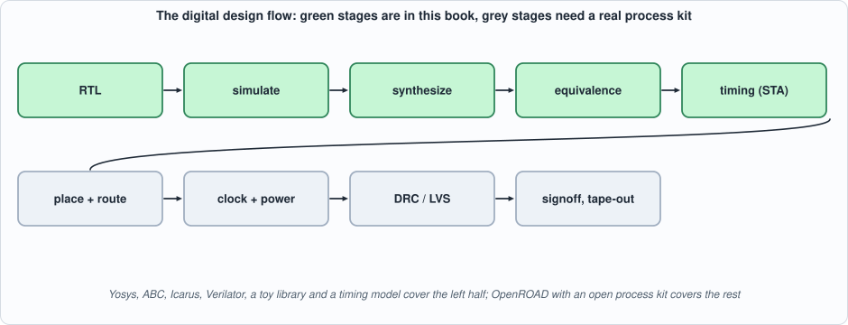
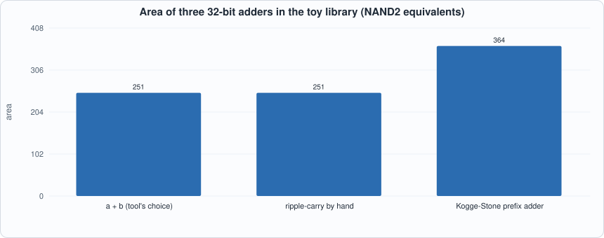
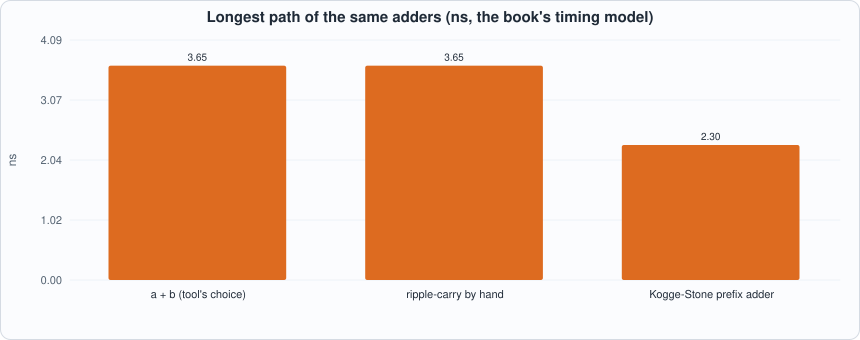

# Appendix G. The EDA Flow


--8<-- "docs/assets/art/appx-g.md"


**Who this is for:** readers of Chapters 1 and 10 who want to know what happens between Verilog and a chip, which parts of it this book does with open-source tools, and which it does not. EDA stands for electronic design automation: the programs that turn a description into something a factory can build. The tools used here are **Yosys** (synthesis), **ABC** (logic optimization inside Yosys), **Icarus Verilog** and **Verilator** (simulation), and the book's own toy cell library and timing analyzer (Chapter 10). `tools/appx_g.py` runs them stage by stage.

## The flow


*Figure G.1: the digital design flow. The book covers the left half; the right half needs a real **process design kit** (PDK: the foundry's cell library, design rules and models) and place-and-route software such as OpenROAD.*

1. **RTL.** Register-transfer-level Verilog: what the circuit does each cycle (Appendix B).
2. **Simulation.** Does the RTL do the job? Testbenches run in Icarus and Verilator. Most bugs die here.
3. **Synthesis.** The RTL is translated to a **netlist** of cells from a library: *elaborate* (read the language), `proc` (turn procedural blocks into logic and flip-flops), *optimize*, *technology-map* (choose library cells), and optimize again. Yosys with ABC does it.
4. **Equivalence checking.** Does the netlist still compute what the RTL does? Simulation tests samples; a **formal** check proves it for *all* inputs.
5. **Static timing analysis.** The longest path between flip-flops against the clock period (Appendix A, "why a clock has a speed limit").
6. **Floorplan, placement and routing.** Where each cell goes on the die and how wires join them. The physical design adds the wire delays that logic synthesis ignores.
7. **Clock tree and power grid.** The clock must reach every flip-flop at nearly the same time, and power every cell without voltage drops.
8. **Physical verification.** Design-rule checks (DRC: are the shapes manufacturable) and layout-versus-schematic (LVS: does the layout implement the netlist).
9. **Signoff and tape-out.** Final timing and power with the parasitics extracted from the layout, then the masks.

## Synthesis, stage by stage

The script runs the voter of the Background page (`vote3_assign`, written as the expression `(a & b) | (a & c) | (b & c)`) through the first stages and counts the cells after each:

| after | cells |
|---|---|
| reading and elaborating | 5 generic `$and`/`$or` |
| `proc` and `opt` | 5 (nothing to simplify yet) |
| `techmap` | 5 simple gates (`$_AND_`, `$_OR_`) |
| `abc` | **4** (ABC found a cheaper factoring, for example `(a & b) | (c & (a | b))`: two ANDs and two ORs) |

Then it maps the optimized logic to the book's toy library (`lib/toy.lib`): 3 cells, area 3.67 units, which is a cell count and an area *in the library's units*, not square micrometres. The **toy library is not a real process**; it is what makes the numbers of Chapter 10 reproducible and honest about being a model.

**Three descriptions, one circuit.** The same voter written as an expression, as a `case` statement and as explicit gates produces the same area: 3 cells and 3.67 units. ABC picks different but equivalent cells for the `case` version (an AOI21 and two NOR2s instead of two NAND2s and an OAI21), at the same area. Synthesis optimizes the *logic function*; how you write it does not matter for such a small function.

## Equivalence checking: a proof, not a test

A **miter** circuit joins two designs, feeds them the same inputs and compares their outputs; a **SAT solver** then looks for an input on which they differ. If it finds none, the designs are equivalent *for all 2^n inputs*. The script proves the three voters equivalent. It then breaks one by forgetting the `b & c` term and asks again: the solver finds the counterexample `a = 0, b = 1, c = 1`, where the correct voter says 1 (two of three agree) and the broken one says 0. A formal check reaches in a fraction of a second what an exhaustive test would also reach for three inputs, but the *same* check works at 64 inputs, where exhaustive simulation (2^64 cases) cannot. (Chapter 10 uses ABC's `cec`, a cousin of this check, to confirm that the synthesized netlists still equal the RTL.)

## Architecture beats the tool

The last test synthesizes a 32-bit adder written three ways: with `+`, with a hand-built ripple chain, and with a Kogge-Stone prefix tree (Chapter 10).


*Figure G.2: area. The first two are the same circuit: Yosys turns `+` into a ripple chain.*


*Figure G.3: longest path in the book's timing model. The prefix adder is 37% faster for 45% more area.*

Two lessons. First, **writing `+` does not get a fast adder**: it gets whatever structure the tool's default produces (a ripple chain here). Second, **the tool does not invent algorithms**: it optimizes the logic you gave it, but moving from ripple to prefix is a design decision a person or a generator makes. Note that at 8 bits all three variants synthesized to the *same* netlist (37 cells, 1.01 ns): the structures only separate as the width grows, which is why the script uses 32.

## What this book's flow is, and is not

| | in this book | not in this book |
|---|---|---|
| synthesis | Yosys + ABC to a toy library | a foundry library, multi-corner optimization |
| timing | a 60-line longest-path model (cell delays only) | wire delay, fan-out, clock skew, on-chip variation |
| physical | none | placement, routing, clock tree, power grid, DRC, LVS |
| results | area in NAND2 equivalents, nanoseconds in a model | square micrometres, milliwatts, megahertz of a real chip |

This is why every synthesis number in the book is labelled *toy library* and why the chips are called *models of a chip, not a chip* (Introduction). Taking the same RTL through OpenROAD with an open PDK (SkyWater 130 nm, for instance) is the natural next step and the one that turns the model into a measurement.

## Running the examples

```python
--8<-- "tools/appx_g.py"
```

To compile and run: `python3 tools/appx_g.py` (about 20 seconds; needs Yosys). Recorded output:

```text
--8<-- "out/appx_g_out.txt"
```

## Self-check questions

1. Name the stages between Verilog and a netlist, and say what each does in one sentence.
2. Why can simulation never prove two circuits equivalent, and what does a miter do differently?
3. The counterexample for the broken voter is `a = 0, b = 1, c = 1`. Compute both outputs by hand.
4. Why are the three 8-bit adders identical after synthesis but the 32-bit ones not?
5. What does logic synthesis not know that place-and-route does? Name two things that make real timing worse than the model's.
6. Why is area in "NAND2 equivalents" a reasonable unit, and what is its weakness?
