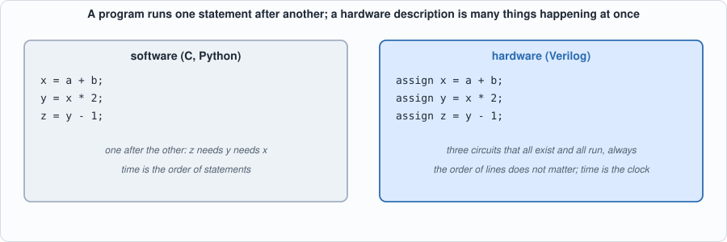
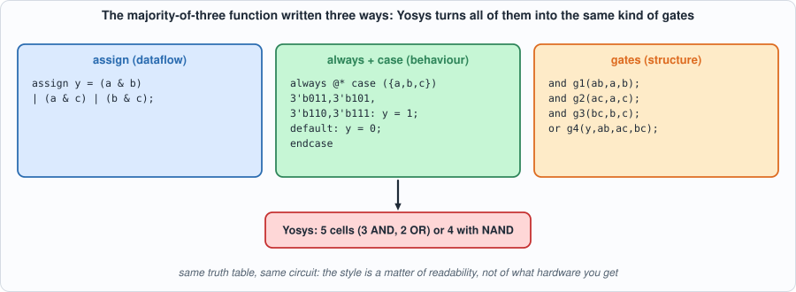
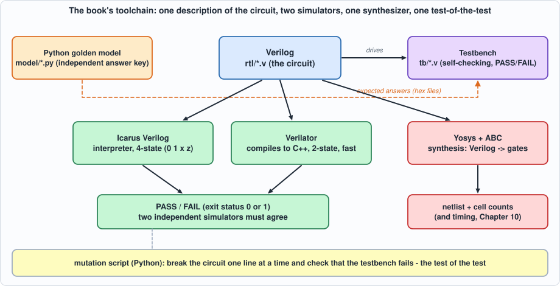

# Background: Verilog and the Tools

**What you will understand:** why chips are designed with a *language* rather than drawn, what Verilog is and how it differs from a programming language, what it can and cannot do, and what each of the tools in this book does and why it was chosen. By the end you will be able to read the Verilog in every chapter, run the commands in the book and know which tool a number came from.

**What you need to know first:** the [Getting Started](getting-started.md) page (tools installed). No hardware experience is assumed; a little programming in any language helps.

**What this page builds:** one tiny circuit, a three-input majority voter, `rtl/demo_vote3.v`, with its testbench `tb/demo_vote3_tb.v`, taken through the simulators and the synthesizer so you can see every tool do its job on something small enough to read in full.

## Why design chips with a language

A modern chip has billions of transistors. Nobody places them by hand. The design is written as text, a **hardware description language** (HDL), in the same spirit as source code; tools then check it, simulate it and turn it into the shapes a factory prints on silicon. The reasons for using text are the reasons for using source code in software:

- **Scale.** A schematic with a million gates is unreadable; a thousand lines of text that generate it are not.
- **Reuse and parameters.** The same module can be instantiated 64 times, or built for 4 or 8 or 128 elements by changing a number (Chapter 4's array does exactly this).
- **Testing.** Text can be simulated against a test program thousands of times a minute, long before anything is built. A bug found in simulation costs minutes; one found in a manufactured chip can cost months and millions of dollars.
- **Version control and review.** Text can be diffed, reviewed and merged.
- **Retargeting.** The same description can become gates for an FPGA (a chip you can reprogram) or for a custom chip in some factory process, by changing the synthesis tool's settings and not the design.

The two HDLs in wide industrial use are **Verilog** (with its extension **SystemVerilog**) and **VHDL**. Verilog was created in the mid-1980s as a simulation language, was standardized by the IEEE in 1995, and its synthesizable core is now the most widely used way to describe digital circuits in industry. This book uses **plain Verilog** (a small, readable subset), for three reasons: it is compact enough to show whole modules on a page; it is supported by mature open-source tools; and the same constructs carry over unchanged to SystemVerilog and, with different spelling, to VHDL.

## Describing a circuit is not writing a program

The most important idea on this page: **a hardware description is not executed top to bottom.** It states what exists and how it is connected, and everything that exists is always working.


*Figure B.1: in software the second line waits for the first. In Verilog the three `assign` lines are three adders and multipliers wired in a chain; they all exist, and when `a` changes the change ripples through the chain. Swapping the order of the lines changes nothing.*

Four consequences of that idea explain most of what is unusual about Verilog:

1. **Concurrency is the default.** Statements describe things that happen at the same time. The exception is a `begin ... end` block inside an `always` block, which reads like a small program but describes the logic *inside one circuit*.
2. **Time is the clock.** A **combinational** circuit (gates only) has no memory: its outputs follow its inputs. A **sequential** circuit has **registers** (flip-flops) that remember a value and change only at a clock edge. Verilog writes combinational logic with `assign` or `always @*`, and sequential logic with `always @(posedge clk)`.
3. **Values have four states in simulation.** A wire can be `0`, `1`, `x` (unknown: nothing has driven it yet, or two things disagree) or `z` (disconnected). Real hardware has only 0 and 1 (and analog subtleties); the `x` exists so the simulator can tell you "this value was never set".
4. **There are two kinds of assignment.** `=` (blocking) takes effect at once and is used for combinational logic in a block; `<=` (non-blocking) schedules the update for the end of the time step and is used for registers, so that every register in the chip samples its inputs *at the same moment*, before any of them changes.

## A first circuit, three ways

The function: `y` is 1 if at least two of `a`, `b`, `c` are 1 (a **majority voter**, the building block of fault-tolerant systems). Here it is written in three styles that mean the same thing. The file is `rtl/demo_vote3.v`.

```verilog
--8<-- "rtl/demo_vote3.v"
```


*Figure B.2: three descriptions of one circuit. The style is about readability; the hardware that results is the same function.*

- **`assign` (dataflow):** "y is always this expression." Shortest; best for small combinational functions.
- **`always @*` with `case` (behaviour):** reads like a small program, but still describes combinational logic (the `@*` means "whenever any input changes"). Best when there are many cases.
- **Gates (structure):** you name every gate and wire. Rarely needed except to describe something very specific.
- **`vote_seq`** adds a clock. `always @(posedge clk)` is "on every rising edge of the clock"; `w <= {w[1:0], d}` shifts the register left and brings `d` in at the bottom (the braces `{ }` concatenate bits). The voter looks at the last three values of `d`.

### Simulating it

A **testbench** is a Verilog module that has no inputs or outputs of its own: it creates the inputs, watches the outputs, checks them and reports. Here is the one for the demo:

```verilog
--8<-- "tb/demo_vote3_tb.v"
```

Run it in Icarus Verilog (compile with `iverilog`, run with `vvp`):

```bash
iverilog -g2012 -s demo_vote3_tb -o /tmp/dv.vvp rtl/demo_vote3.v tb/demo_vote3_tb.v
vvp -n /tmp/dv.vvp
```

**Output (cloud sandbox -- live-executed; Icarus Verilog 12.0)**

```text
--8<-- "out/background_sim_out.txt"
```

Reading it: the first table is a **truth table**, all eight combinations of `a b c`; the three descriptions agree with each other and with a reference written in a different style (`(a + b + c) >= 2`), which is the book's golden-model idea in miniature. The second part is the clocked circuit: at cycle 1 the window is `001` (one 1, so `y = 0`); at cycle 2 it is `011` (two 1s, so `y = 1`); the last 1 shifts out and `y` falls back to 0 at cycle 5. The testbench prints `PASS` and exits with status 0; on a mismatch it would print `FAIL` and exit non-zero, so a script can run it without a human reading anything.

And in the second simulator, Verilator (which compiles the design to C++ and builds an executable):

```bash
verilator --binary --timing -Wno-fatal -Wno-lint -Wno-style --top-module demo_vote3_tb -Mdir /tmp/vl_dv -o sim rtl/demo_vote3.v tb/demo_vote3_tb.v
/tmp/vl_dv/sim
```

```text
--8<-- "out/background_verilator_out.txt"
```

### Synthesizing it

**Synthesis** turns the description into a **netlist**: a list of gates and wires. Yosys does it; ABC (inside Yosys) chooses the gates. The same function, three ways:

```bash
yosys -p "read_verilog rtl/demo_vote3.v; synth -top vote3_assign; stat"                       # generic gates
yosys -p "read_verilog rtl/demo_vote3.v; synth -top vote3_assign; abc -g AND,NAND,OR,NOR,XOR,XNOR,ANDNOT,ORNOT,MUX; opt_clean; stat"
yosys -p "read_verilog rtl/demo_vote3.v; synth_ice40 -top vote3_assign; stat"                 # an FPGA family's lookup tables
```

| Target | Result (measured with Yosys 0.33) |
|---|---|
| generic `synth` | 5 cells: 3 `AND`, 2 `OR` |
| restricted gate set (ABC) | 4 cells: 3 `NAND`, 1 `OR` |
| Lattice iCE40 FPGA | 1 cell: one 4-input lookup table (`SB_LUT4`) |
| the clocked `vote_seq`, generic | 8 cells: 3 `AND`, 2 `OR` and 3 flip-flops (`$_SDFF_PP0_`) |

The same function costs 5 gates, 4 gates or one lookup table depending on what the target offers: **the description says what; the tool decides how.** `write_verilog` shows the 4-gate netlist as Verilog again:

```text
--8<-- "out/background_netlist_out.txt"
```

The three `assign` lines of the original became four gates: `NAND(a, c)`, `OR(a, c)`, `NAND(b, OR(a, c))` and a final `NAND`. Check it by hand with `a = 1, b = 0, c = 1`: `_0_ = ~(1 & 1) = 0`, `_1_ = 1 | 1 = 1`, `_2_ = ~(0 & 1) = 1`, `y = ~(0 & 1) = 1`, correct (two of the inputs are 1).


*Figure B.3: how the pieces fit. One Verilog description is checked by two independent simulators against an independent Python answer key, synthesized to gates by Yosys, and the whole test is tested by breaking the circuit on purpose.*

## What Verilog can do, and what it cannot

**What it does well**

- Describe **combinational and sequential logic** at any level: gates, arithmetic, state machines, memories, whole processors.
- **Parameterize**: `parameter N = 4` and `generate` loops build arrays of any size (Chapter 4).
- **Simulate**: the testbench language is the same language, with extra constructs (`initial`, delays such as `#5`, `$display`, `$readmemh` to load data files) that have no hardware meaning.
- **Be synthesized**: a defined subset becomes gates.
- **Be formally checked**: the same code can be proved equivalent to another version, or to a property. (This book uses an equivalence checker, ABC's `cec`, in Chapter 10.)

**What to keep in mind**

- **Not everything simulates *and* synthesizes.** A delay such as `assign #5 y = a & b;` simulates (the output changes 5 time units late) but synthesis *ignores* it: Yosys builds one AND gate (checked while writing this page). Delays are for modelling in a simulator, not for building hardware. The testbench constructs above (`initial`, `$display`) are for simulation only. The book keeps the circuits (`rtl/`) in the synthesizable subset and everything else in `tb/`.
- **Unknown values.** In Icarus an unset input gives an unknown output:

  ```text
  a unset -> y = x  (x means unknown)
  a = 1 -> y = 1
  ```

  A real chip would settle to 0 or 1 at power-up with no warning, which is why Chapter 10 measures what happens with random power-up values (Verilator's two-state simulation can do this) and why every design needs a reset.
- **It is easy to write something that simulates correctly and synthesizes to something else** (a missing `else` creates an unintended latch, a mixed blocking/non-blocking style creates a simulation race). The defence is the book's method: two simulators, a synthesis run, and tests that are themselves tested.
- **It is not a software language.** There is no dynamic memory, no recursion in hardware, and a loop in a synthesizable module is *unrolled* into copies of a circuit, not executed over time.

## The tools, one by one

Each tool is here for a reason, and each has limits.

| Tool | Role in this book | Why this one | What it cannot do |
|---|---|---|---|
| **Icarus Verilog** (`iverilog`, `vvp`) | The reference simulator. Compiles to an intermediate form and interprets it. | Four-state (0, 1, x, z): it *shows* uninitialized values. Free, small, standard. Accepts the whole testbench language. | Slow on big designs (it interprets); no real two-state random start-up. |
| **Verilator** | The second, independent simulator. Compiles the Verilog to C++ and then to a program. | Very fast; **two-state**, so it behaves like real hardware when a value was never set (and `--x-initial unique` can randomize it). It is also a strict linter (below). | No `x` or `z`; its model of time is less general than Icarus's, so a testbench written for one sometimes needs care for the other (Chapter 2's lesson). |
| **Yosys** | Synthesis: Verilog to gates, with counts and a netlist. Also reads and writes JSON netlists, which Chapter 10's timing and fault-grading scripts use. | Open-source, scriptable, supports several targets (generic gates, FPGAs, custom libraries). | It does not place or route, or know about a real factory process; area and timing in this book are from a toy library (Chapter 10) and are *not* silicon numbers. |
| **ABC** (inside Yosys) | Chooses the gates that implement a logic function; its `cec` command also checks two circuits for equivalence. | Standard open logic optimizer. | Not a timing sign-off tool. |
| **Python 3** | The golden models, the assembler and the compiler (Capra), test generators, the mutation scripts, and every figure on every page. | Readable, with arbitrary-precision integers (so a golden model never overflows by accident). Standard library only: nothing to install. | Not fast; the book's scripts that run hundreds of thousands of cycles do so in the simulators, not in Python. |
| **MkDocs + Material** | Builds this book from Markdown, embedding the real source files and recorded outputs. | The pages show exactly what is in the repository. | Only needed if you want to build the site yourself. |
| **git** | Distributes the book's code; every chapter is reproducible from a commit. | Standard. | |
| *Optional: a waveform viewer such as GTKWave* | Not used by the book (it prints waveforms as text and checks with self-testing benches) but handy when you experiment. | Free; reads the `.vcd` files simulators write. | |

### Verilator as a linter

Verilator can also *check a design without simulating it*. A small deliberately sloppy file, assigning a 4-bit value to a 3-bit output:

```verilog
module lint_demo(input [3:0] a, output [2:0] y);
    assign y = a;
endmodule
```

```bash
verilator --lint-only -Wall lint_demo.v
```

```text
--8<-- "out/background_lint_out.txt"
```

Both warnings are correct and neither is an error in Verilog itself: the top bit of `a` is silently dropped. A simulator would run this without complaint and produce a plausible, wrong answer. In the book the lint warnings are switched off for the simulations (`-Wno-lint -Wno-style`) because the testbenches use constructs that trigger harmless warnings, but you will find the habit useful in your own designs.

## Where each tool appears in the book

| Chapter | New idea | Main tools |
|---|---|---|
| 1 The flow | The four-step loop | all of them, on a 4-bit adder |
| 2 to 6 | MAC, quantization, array, memory, softmax | Verilog, both simulators, Yosys, Python models, mutation scripts |
| 7 to 9 | The whole chip, attention, batching | the same, plus the assembler and the cycle model |
| 10 | From Verilog to gates | Yosys JSON netlists, a toy cell library, ABC equivalence checking, static timing and fault grading in Python |
| 11 to 12 | The compiler and a tiny language model | Python (Capra) producing programs that run on the simulated chip |

## A reading cheat sheet for the Verilog in this book

| You see | It means |
|---|---|
| `module name #(parameter N = 4) (input clk, ...);` | A circuit with a configurable size and a list of ports |
| `wire [7:0] x;` / `reg [7:0] x;` | An 8-bit signal (`wire`: driven by an `assign`; `reg`: assigned in an `always` block; neither implies a register by itself) |
| `signed` | The bits are two's complement (Chapter 2); without it arithmetic is unsigned |
| `x[3]`, `x[7:4]`, `x[8*i +: 8]` | One bit, a range of bits, and "8 bits starting at 8i" (used to slice buses) |
| `{a, b}`, `{4{a}}`, `{{8{x[7]}}, x}` | Concatenation, repetition, and sign extension |
| `a ? b : c` | A multiplexer: `b` if `a` is 1, else `c` |
| `always @(posedge clk)` | Sequential logic: do this on every rising clock edge |
| `always @*` | Combinational logic: redo this whenever any input changes |
| `<=` vs `=` | Non-blocking (registers) versus blocking (combinational) assignment |
| `genvar`, `generate for` | Make N copies of a circuit |
| `$display`, `$finish`, `initial`, `#5` | Simulation-only: they do nothing in synthesized hardware |
| `$readmemh("file", mem)` | Load a hex file into a memory in the simulator (how golden vectors reach testbenches) |

## Where to go deeper

- **Appendix B** (Verilog primer) and **Appendix G** (the EDA flow) expand this page, including the whole synthesizable subset and the usual pitfalls.
- **Appendix A** (digital logic) covers gates, flip-flops and finite-state machines from the start.
- The language standards are IEEE 1364 (Verilog) and IEEE 1800 (SystemVerilog); the Icarus, Verilator and Yosys manuals document each tool's dialect and options.
- Chapter 1 puts all of this together on a 4-bit adder, and is the place to continue.
