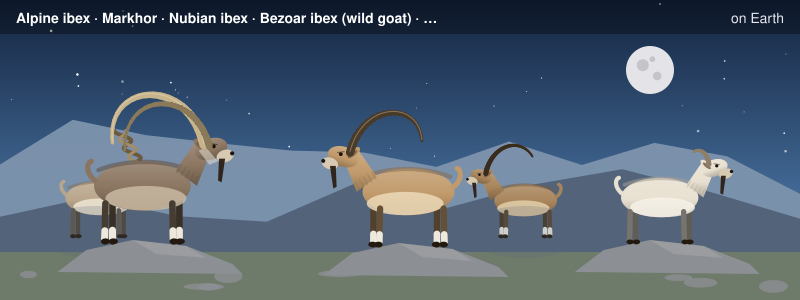

# Capra: Silicon Compiler from Scratch

--8<-- "docs/assets/art/index.md"

**An open-source LLM-inference accelerator, from Verilog to the compiler that targets it.**

This book builds a small neural-network accelerator the way a chip team would, in the order a chip team would, and then builds the compiler that turns a model into programs for it. Everything runs on a laptop with three open-source tools: **Icarus Verilog** and **Verilator** (two independent simulators) and **Yosys** (synthesis). No vendor tools, no FPGA board, no licences.

**What you will build**

| Part | Chapters | What you end up with |
|---|---|---|
| **1. Foundations** | 1-3 | The build-simulate-synthesize-mutate loop on one small circuit; an int8 multiply-accumulate unit with its overflow behaviour; the quantization arithmetic and the requantizer that connects layers |
| **2. The Compute Engine** | 4-6 | A systolic array; a scratchpad, a DMA engine and double buffering; exp, reciprocal and softmax hardware |
| **3. The Whole Chip** | 7-9 | An instruction set, a sequencer and a chip that runs programs; attention with a KV cache; batching and a roofline analysis of why decoding is slow |
| **4. From Verilog to Gates** | 10 | Synthesis to a cell library, a timing analyzer, gate-level simulation, fault grading and equivalence checking |
| **5. Compilation** | 11-12 | Capra, a compiler from a model graph to the chip's instructions; a tiny transformer decoding tokens on the simulated silicon |
| **6. Case Studies** *(in progress)* | 13-17 | Industrial techniques built and tested on the stack: int4 weight-only quantization, grouped-query attention, paged KV cache with a sliding window, speculative decoding, mixture-of-experts routing |
| **Appendices** *(in progress)* | A-G | Primers: digital logic, Verilog, number formats, linear algebra for ML, transformers and LLM inference, memory systems, the EDA flow |

**The rules of the book**

- **Every circuit has a golden model written in Python** that shares no code with the Verilog. A testbench compares the two, and the same testbench runs in two simulators.
- **Every test is tested.** A mutation script breaks the Verilog one line at a time; a test that does not notice has a gap, and the book says what it found.
- **Every number is measured or derived, and says which.** Cycle counts come from simulation, areas from Yosys, and where a figure is an assumption (a clock speed, a memory bandwidth) the page says so.
- **This is a model of a chip, not a chip.** Nothing here has been placed, routed, timed against a real process, taped out or run on silicon. Each chapter says what its numbers can and cannot show.

This book is a companion to *Unix OS from Scratch* and *IR Forge: A Compiler from Scratch*; Chapters 40 to 43 of the compiler book built GA-1, a cycle-counting software model of a matrix accelerator. This book builds a hardware description of one, and the compiler for it.

*Under development.*
