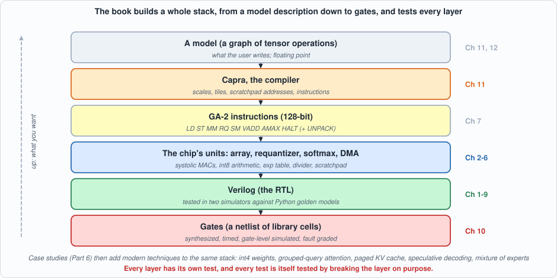
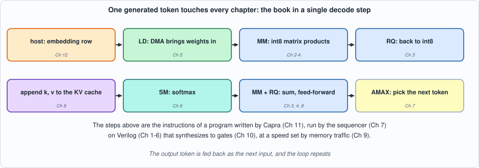
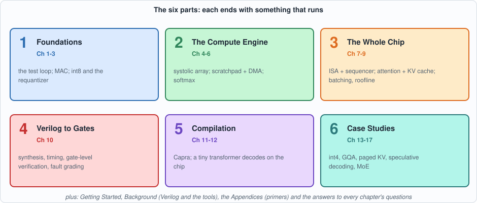
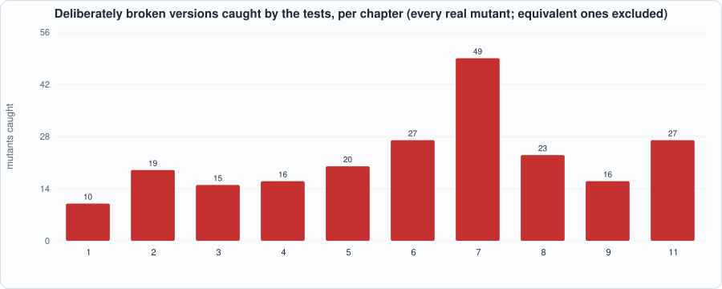

# Introduction: The Book at a Glance

--8<-- "docs/assets/art/introduction.md"

**What this page is:** a bird's-eye view of the whole book before you start: what it builds, why, what it deliberately leaves out, how the chapters fit together, how to read it, and what you will be able to do at the end. Everything here is explained properly later; this page is the map.

## What this book is

*Capra: Silicon Compiler from Scratch* builds a small **accelerator for running large language models**, as a chip team would build one: describe it in Verilog, test it against independent Python models in two simulators, synthesize it to gates, and then build the **compiler** that turns a neural network into programs for it. By the end, a tiny transformer decodes text, token by token, on the simulated silicon, with every program written not by a person but by the compiler.

Everything runs on a laptop with open-source tools (Icarus Verilog, Verilator, Yosys and Python). Nothing is bought, nothing is licensed, and every number printed on every page was produced by a script you can run.

One sentence to hold on to, because the book repeats it: **this is a model of a chip, not a chip.** Nothing here has been placed, routed, timed against a real manufacturing process, taped out or measured on silicon. The book is about *how such a design is built and checked*, with every claim labelled as measured, derived or assumed.

## Why this book exists: the motivation

**Running a language model is a hardware problem.** A model such as the ones behind chat assistants produces text one token (roughly a word piece) at a time, and each token needs a pass over every weight of the model. A model with seven billion weights is 7 GB of numbers in 8-bit form; generating one token means reading all of it from memory. The arithmetic per byte read is tiny. So the machine spends most of its time *waiting for memory*, not computing (Chapter 9 measures this and draws the roofline). Everything interesting in AI inference hardware is a response to that fact: smaller numbers (8 and 4 bits), keeping reusable data on the chip, sharing weights across many requests, and arrangements of multiplier arrays that pass data from neighbour to neighbour instead of fetching it again.

**Understanding that requires seeing it, not just reading about it.** The usual accounts are either slide-level ("accelerators have systolic arrays") or industrial-scale (a proprietary design with millions of lines nobody outside can read). This book sits in between: a design small enough to read completely, real enough that its numbers behave like the real thing (a decode step really is memory-bound; the KV cache really does dominate memory at long contexts; a matrix unit really does idle three quarters of itself on a vector product).

**Hardware and compiler are one problem.** A chip with no compiler is a curiosity, and a compiler without a chip has nothing to be correct about. The tiling, the scales, the memory placement and the instruction set are decided together. So the book builds both, and lets the compiler's needs shape the hardware's limits (the 64-word limit on a matrix product's inner dimension, the missing accumulate instruction, the size of the scratchpad are all visible in the compiler's error messages).

**And hardware has to be *verified*.** A chip that fails after manufacture cannot be patched. The people who build chips therefore spend more effort checking a design than writing it, and the craft is in making the checks trustworthy. A test that has never failed has never been shown able to fail. So this book gives equal weight to the designs and to **testing the tests**: every circuit is deliberately broken, one line at a time, to see whether its tests notice.

## What you will be able to do

By the end you will be able to:

1. **Read and write synthesizable Verilog** for arithmetic, memories, state machines and a small processor, and run it in two simulators.
2. **Build an independent golden model** of a circuit in Python and use it to test the circuit exhaustively or on directed and random vectors.
3. **Explain int8 quantization end to end:** how a real number becomes an integer, how an int32 accumulator is brought back to int8, and what accuracy that costs.
4. **Explain how a systolic array, a scratchpad with DMA and double buffering, and a softmax unit work,** and derive their cycle counts.
5. **Design a small instruction set,** its sequencer and its reference simulator, and prove the chip matches the simulator to the cycle.
6. **Explain the KV cache, attention and batching,** and say, with numbers, why decoding is limited by memory and what each remedy buys.
7. **Take a design through synthesis:** read a netlist, find the critical path, and check the result by gate-level simulation, fault grading and equivalence checking.
8. **Build and test a small compiler** for tensor graphs: calibration, scale planning, tiling, allocation and emission.
9. **Judge claims about hardware critically:** tell a measurement from a derivation from an assumption, and recognise when a test cannot see a bug.

## Who it is for

- **Software engineers and ML practitioners** who want to know what is under an inference accelerator and why it is built the way it is. You need to read a little Python or C; Appendix B introduces Verilog.
- **Hardware and FPGA engineers** who want a worked, honest example of the build-and-verify discipline on an AI workload.
- **Students** of computer architecture or compilers who want a complete, small system to study and extend.

**What you do not need:** any chip design experience, any machine-learning theory beyond "a model is a stack of matrix products", an FPGA board, or a license for anything. The appendices give the background (digital logic, Verilog, number formats, linear algebra for ML, transformers and LLM inference, memory systems, the EDA flow), and the Background page introduces the tools.

## Scope: what is in, and what is out

| In scope | Out of scope (and where the book says so) |
|---|---|
| int8 inference with 32-bit accumulation; int4 weights as a case study | training; floating-point formats; mixed precision |
| a 4 x 4 output-stationary systolic array, a 4,096-word scratchpad, DMA, double buffering | real DRAM (banks, refresh, contention); caches; multiple chips |
| softmax by table and divider; requantization by mantissa and shift | layer normalization, GELU, rotary embeddings (no hardware or compiler support yet) |
| a nine-instruction ISA, a sequencer, a reference simulator, a cycle model | pipelining across instructions; interrupts; an operating system |
| synthesis to a *toy* cell library, a static timing analyzer, gate-level simulation, fault grading | place and route, clock trees, power, a real process, manufacturing test |
| a graph compiler (Capra) with calibration, tiling and allocation | scheduling that overlaps loads and compute; spilling; dynamic shapes |
| a tiny constructed transformer decoding 24 tokens | trained models; models larger than a few thousand words per tensor |

The right-hand column is not a list of failures; each chapter's "what this chapter does and does not establish" section says exactly which of these limits applies to its numbers.

## The stack, from the top

*Figure I.1: the book builds every layer, and tests each one against the layer's own independent check.*

Read the figure from the top: you write a model; **Capra** turns it into **GA-2 instructions**; the **sequencer** runs them on the chip's **units**; the units are **Verilog**; and synthesis turns the Verilog into **gates**. The book goes through the stack in the order a chip team would, *bottom-up for the hardware* (circuits, then the chip, then gates) and then *top-down for the compiler* once there is something to compile for.

**The names.** *GA-2* is the accelerator (the second generation: *GA-1* was a cycle-counting software model in a companion book). *Capra* is the compiler, named for the genus of wild goats and ibexes, animals that find a route up a cliff, which is a fair description of what a compiler does with a graph and a small memory. The pictures at the top of each page show a few species of *Capra* in imaginary places, for fun.

## One thread through the book: a token's journey

To keep the chapters from feeling like separate topics, follow a single generated token.

*Figure I.2: the book in a single decode step. Each box is an instruction of a program Capra writes, and each is the subject of a chapter.*

The host looks up the token's embedding (the chip has no gather instruction). The DMA brings weights into the scratchpad (Chapter 5). The matrix unit multiplies int8 matrices into int32 sums (Chapters 2 to 4); the requantizer brings them back to int8 (Chapter 3). The new key and value are appended to the KV cache (Chapter 8). The softmax unit turns scores into weights (Chapter 6); another product forms the weighted sum, and the feed-forward block follows. Finally an `AMAX` instruction picks the next token (Chapter 7), which is fed back in. The whole thing is a program written by the compiler (Chapter 11), run by the sequencer (Chapter 7), on Verilog that synthesizes to gates (Chapter 10), at a speed set by memory traffic (Chapter 9). Chapter 12 does exactly this for 24 tokens.

## The roadmap

*Figure I.3: the six parts. Each ends with something that runs.*

| Part | Chapters | The question it answers | What runs at the end |
|---|---|---|---|
| **1. Foundations** | 1 The flow; 2 MAC and number formats; 3 Quantization | How do we build and test a circuit? How are numbers stored, and what does 8 bits cost? | an adder and a counter through the full loop; an int8 MAC; the requantizer |
| **2. The Compute Engine** | 4 Systolic array; 5 Scratchpad, DMA, double buffering; 6 Vector unit and softmax | How do many MACs work at once without fetching data twice? How is memory latency hidden? How does an integer chip do an exponential and a division? | a systolic array; a streaming memory system; a softmax unit |
| **3. The Whole Chip** | 7 GA-2; 8 Attention and the KV cache; 9 Batching and bandwidth | What is the machine, as a programmer sees it? What does a language model compute per token? Why is decoding slow and what helps? | a chip that runs programs; an attention step; a batched decoder and a roofline |
| **4. Verilog to Gates** | 10 Synthesis, timing and gate-level verification | Can it be built, how fast, and are we sure the netlist still works? | a 31,580-cell netlist passing the same programs |
| **5. Compilation** | 11 Capra; 12 Capstone | Can a program write the programs? Does the whole stack work together? | a tiny transformer decoding 24 tokens on the chip |
| **6. Case Studies** | 13 to 17 | How do the techniques of industrial inference (int4 weights, grouped-query attention, paged KV cache, speculative decoding, mixture of experts) fit this stack? | each technique built and tested on the same chip and compiler |

Outside the parts: **Getting Started** (install and verify the tools), **Background** (what Verilog is and what each tool does), the **Appendices** (primers; *in progress*), and the **Answers** to every chapter's self-check questions.

## The method: five rules, and the evidence

The book is held together by five rules, stated here once and applied on every page.

1. **Every circuit has an independent golden model in Python** that shares no code with the Verilog.
2. **Every testbench is self-checking** (PASS or FAIL, exit status 0 or 1) and runs in **two simulators** that share no code.
3. **Every test is tested by mutation:** the design is broken one line at a time, and a test that does not notice has a gap, which the book reports. A mutant that changes nothing observable (an *equivalent* mutant) is reported too and is not counted as a miss.
4. **Every number is labelled** *measured*, *derived* or *assumed*.
5. **Say what the result does not show.**

*Figure I.4 (counted from the chapters' mutation tables): the number of deliberately broken versions of each chapter's design that its tests catch. Chapter 10's flow and Chapter 12's capstone are discussed separately: the capstone catches only 38 to 39 of Chapter 7's 49 hardware mutants, which is itself one of the book's findings.*

The same discipline is where the book's *findings* come from, not only its assurance. A few examples, each a result a reader can reproduce:

| Chapter | A finding that testing produced |
|---|---|
| 2 | The first MAC tests passed while three bugs (a too-short overflow run, no post-reset check, a mutant that was not one) were hiding in the suite |
| 4 | Three of the array's 16 mutants appear only on the *second* matrix product after reset |
| 5 | Two controller bugs are visible only in the load-bound or only in the compute-bound test shape |
| 7 | A random-program generator produced programs whose behaviour is undefined by the ISA; the simulator and the chip legitimately differed |
| 8 | No single check catches all 23 builder mutants: the exact reference misses every scale error |
| 10 | The netlist fails in a four-state simulator from unreset flip-flops although it is correct (X-pessimism); and a first pipelining attempt gains only 11% |
| 11 | A scale-sharing flaw in `add`, a placement bug, and a blind spot (cancellation) that needed a directed test |
| 12 | A realistic workload catches only 38 of the 49 hardware mutants the purpose-built suite catches |

## How to read it

Every chapter has the same shape: *why this chapter*, the concepts built up with a hand-worked example, the code with commentary, **two running examples** with their scripts and real outputs, a **common mistakes** section, what the chapter does and does not establish, a summary, **self-check questions** (with worked answers at the end of the book), and **exercises**. Figures are drawn from real data wherever a chart appears.

Three reading paths:

- **The fast path (ML or software reader):** Getting Started, Background, then Chapters 1, 3, 7, 8, 9, 11 and 12. This gives the story: numbers, the machine, attention, the memory limit, the compiler, the capstone.
- **The hardware path:** Getting Started, Background, then Chapters 1 to 7 and 10 in order. This is the discipline of building and checking a chip.
- **The complete path:** everything in order, then the Case Studies. The chapters build on each other, and the later ones assume the earlier ones.

You do not need to type anything to read. If you want to run the examples, every command is on the Getting Started page and every chapter says how to run its scripts and how long they take.

## Companion books, and where this one stops

*Capra* is a companion to *Unix OS from Scratch* (a bare-metal kernel) and *IR Forge: A Compiler from Scratch*; Chapters 40 to 43 of the compiler book built GA-1, a software model of a matrix accelerator. This book turns that model into a hardware description and builds a compiler for it.

It stops where a real project would start the *next* phase: place and route with a real open process kit, a memory system with real DRAM timing, floating-point and training support, and a complete operation set. Chapter 12 lists these as the natural next steps.

## What to do next

1. **Install the tools and verify them:** the [Getting Started](getting-started.md) page takes about ten minutes.
2. **Meet Verilog and the tools:** the [Background](background.md) page describes the language and each program.
3. **Start Chapter 1:** the whole loop on a 4-bit adder.

*Under development.*
