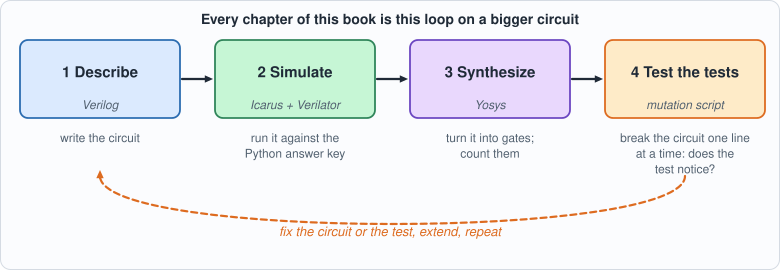
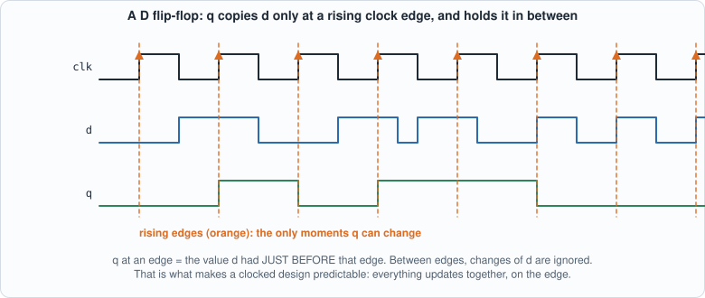
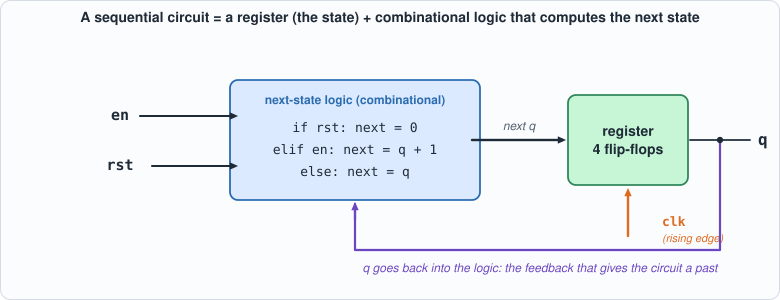
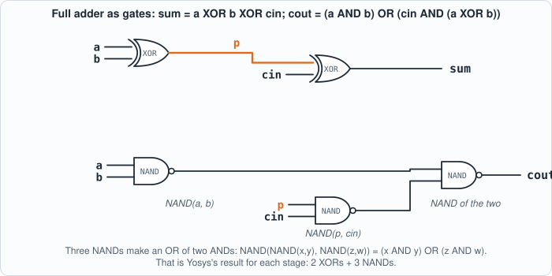
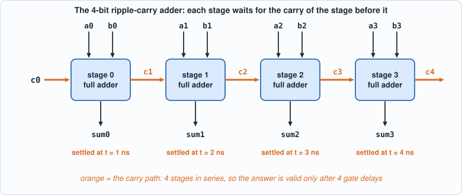
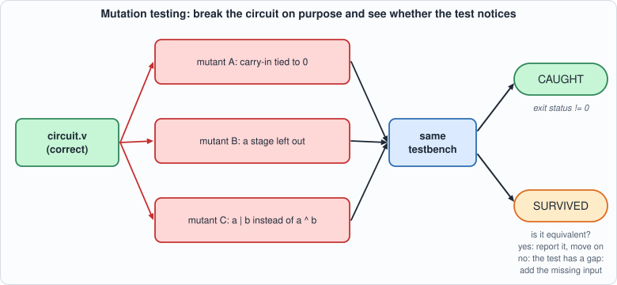

# 1. The Flow: One Circuit Through Four Tools, and a Way to Test the Tests


--8<-- "docs/assets/art/ch-01.md"

**What you will understand:** the loop every chip team lives in, on the smallest circuits that still have all of its parts. You will write a 4-bit adder in Verilog, check it **exhaustively** against an answer key written in Python, run it in **two simulators** that share no code, have **Yosys** turn it into gates and tell you how many, and then **break the circuit on purpose** to find out whether your test would have noticed. You will watch a carry ripple through the adder as a **waveform** drawn in plain text, build your first circuit with **memory** (a counter, with a clock and a reset), and run it through the same loop. Every later chapter is this loop with a bigger circuit.

**What you need to know first:** nothing about hardware. If you can read a few lines of C or Python you can read the Verilog. Install the tools first (see Getting Started). Appendices A and B (digital logic and Verilog primers) are there if you want more background than this chapter gives.

**What this chapter builds:** `rtl/adder4.v` (the circuit), `model/adder4_gold.py` (its answer key), `tb/adder4_tb.v` (the self-checking testbench), `tools/hw.py` (the toolbox that runs everything the same way every time), `tools/mut_ch01.py` (the mutation test), and for the two running examples `rtl/ripple.v`, `rtl/counter4.v`, `model/counter4_gold.py`, `tb/counter4_tb.v`, `tools/vcd_ascii.py`.

## Why start with a loop and not with a circuit

A chip is expensive to get wrong. When a company sends a design to a factory to be manufactured, the first batch can cost millions of dollars and takes months; a bug found afterwards means paying for another batch (a "respin"). Because of that, chip teams spend far more effort *checking* a design than *writing* it: by common estimates, verification takes around half of the engineering time of a chip project, and sometimes more. The craft of hardware design is to find mistakes while they are still cheap, which means in software, before anything is built.

The way a team does that is a loop, and it has the same four steps whether the circuit is a 4-bit adder or a billion-transistor processor:

| Step | Question it answers | Tool in this book |
|---|---|---|
| **Describe** | What circuit do I want? | Verilog, a hardware description language |
| **Simulate** | Does the description do the right thing on test inputs? | Icarus Verilog and Verilator (two different simulators) |
| **Synthesize** | Can the description be turned into real gates, and how many? | Yosys |
| **Test the tests** | If I made a mistake, would my tests have noticed? | a mutation script written for this book |

The fourth step is the unusual one, and the reason this book starts with it. A test that has never failed has never been shown to *be able* to fail. A thousand passing tests of a broken circuit are worth nothing if the tests cannot see the break. So before trusting a test, you break the circuit on purpose, in many small ways, and check that the test complains each time.

The rest of this chapter takes one tiny circuit and one tiny testbench through the full loop, slowly, so that every later chapter can run the same loop on bigger things without re-explaining it.


*Figure 1.1: the four-step loop that every chapter of the book repeats, with the tool used at each step*

## Hardware description, properly

Verilog looks like a programming language and is not one. The most important thing to understand about it is the difference between *describing* a circuit and *executing* a program.

**Everything happens at once.** In a physical circuit, every gate is always working: when an input of a gate changes, its output follows a few picoseconds later, and nothing "runs" in a sequence. Verilog is a notation for what is connected to what. A statement like

```verilog
assign sum = a ^ b ^ cin;
```

does not mean "when execution reaches this line, compute the XOR". It means "the wire `sum` is *always* the XOR of `a`, `b` and `cin`". If you wrote ten `assign` statements, they would have no order; swapping two lines changes nothing. A **simulator** is a program that *imitates* this simultaneity: it keeps a value for every wire, and whenever an input of some expression changes, it recomputes that expression and, if the result changed, propagates the change onward. This is called *event-driven simulation*, an "event" being a change of a value.

**Modules** are the unit of design. A module is a box with named input and output wires:

```verilog
module full_adder (input a, input b, input cin, output sum, output cout);
    ...
endmodule
```

Inside a module there can be wires, assignments and other modules. You do not "call" a module as you call a function: you **instantiate** it, which means *building another copy of the box and connecting its wires*. Four instances of a full adder are four physical adders, all present at once. A design is a tree of instances, with one **top module** at the root.

**Combinational and sequential circuits.** A *combinational* circuit's outputs depend only on its inputs *right now*: an adder, a multiplexer, a decoder. A *sequential* circuit has **memory**: its outputs depend on what happened before. The basic memory element is the **flip-flop**: a one-bit storage cell that copies its input `d` to its output `q` at a particular moment, the rising edge of a **clock** signal, and holds that value until the next edge. Nearly everything interesting (counters, state machines, processors) is combinational logic between banks of flip-flops, all updating on the same clock edge. A **register** is a group of flip-flops holding a multi-bit value.

In Verilog, a flip-flop is written with an `always` block sensitive to the clock edge and **non-blocking assignments** (`<=`):

```verilog
always @(posedge clk) q <= d;      // at every rising edge of clk, q takes the value d had just before the edge
```

The `<=` matters: all non-blocking assignments in a clock edge are evaluated with the values from *before* the edge and take effect *together* after it, which is exactly how real flip-flops behave (they all sample at the same instant). A beginner's most common mistake is to write `=` (a blocking assignment) in a clocked block, which makes the simulation depend on the order of the statements and no longer match the hardware. The rule used throughout the book: **`assign` and `=` for combinational logic, `<=` for clocked registers.**


*Figure 1.2: a D flip-flop: q takes the value d had just before each rising clock edge (orange) and holds it until the next one*


*Figure 1.3: a sequential circuit is a register plus combinational next-state logic, with the register's output fed back as an input*

**Parameters and generate loops.** A module can take **parameters** (constants fixed when you instantiate it, such as a width or a size) and can contain `generate` loops that create many copies of a piece of hardware. The adder below uses one to build its four stages from one description. A `generate for` is not a loop that runs: it is a *macro that stamps out hardware* at elaboration time.

**Time in simulation.** The simulator also has a notion of simulated time. `#10` in a testbench means "wait 10 time units", where the unit is set by a `` `timescale `` line. Time exists only in simulation and in testbenches; synthesis ignores delays, because a synthesized circuit's delays come from its gates, not from a number someone typed. (Running example A uses `assign #1` precisely to *make* the simulator imitate gate delays, so that you can see them.)

**A testbench** is a module with no inputs and no outputs. It instantiates the circuit under test (the **DUT**), drives its inputs from `initial` blocks (code that runs once, at time zero, as a script), observes its outputs, and checks them. Testbenches are the one place Verilog is used like a normal programming language: loops, `if`, printing, reading files. None of that is synthesizable and none of it is meant to be.

## Binary addition by hand

Before reading the circuit, do the arithmetic yourself, the way the circuit does it. A **half adder** adds two bits: the sum bit is `a XOR b` (1 if exactly one input is 1) and the carry is `a AND b`. A **full adder** adds three bits, the two operands and a carry coming in from the stage to its right, and produces a sum bit and a carry going out to the stage on its left:

| a | b | cin | sum | cout |
|---|---|-----|-----|------|
| 0 | 0 | 0 | 0 | 0 |
| 0 | 0 | 1 | 1 | 0 |
| 0 | 1 | 0 | 1 | 0 |
| 0 | 1 | 1 | 0 | 1 |
| 1 | 0 | 0 | 1 | 0 |
| 1 | 0 | 1 | 0 | 1 |
| 1 | 1 | 0 | 0 | 1 |
| 1 | 1 | 1 | 1 | 1 |

The pattern: **sum = a XOR b XOR cin** (the number of 1s among the inputs is odd), and **cout = 1 when at least two of the three inputs are 1**, which can be written `(a AND b) OR (cin AND (a XOR b))`.


*Figure 1.4: a full adder drawn as gates, as Yosys builds it: two XORs for the sum, three NANDs for the carry (a short stub with a name is connected to every other stub of that name)*

Now add 7 and 5 in 4 bits, one column at a time from the right:

```text
           carries:   1 1 1 0     (the carry INTO each column; the right-most column has carry-in 0)
   a = 7 =            0 1 1 1
   b = 5 =            0 1 0 1
                      -------
   column 0 (weight 1):  1 + 1 + 0 = 2 -> sum bit 0, carry 1
   column 1 (weight 2):  1 + 0 + 1 = 2 -> sum bit 0, carry 1
   column 2 (weight 4):  1 + 1 + 1 = 3 -> sum bit 1, carry 1
   column 3 (weight 8):  0 + 0 + 1 = 1 -> sum bit 1, carry 0
   result:               1 1 0 0 = 12,   carry out of the top = 0
```

Each column needs the carry from the column to its right, which is why this is a **ripple-carry adder**: the carry *ripples* from the least significant bit upward, and the last column cannot finish before the first one does. It is slow (four stages in series) and it is tiny, and these two facts are the same fact. Faster adders look ahead to guess carries, at the cost of more gates; the book's hardware never needs the speed, and Chapter 10 measures how much the carry chain costs.


*Figure 1.5: four full adders in a row: each stage's carry-out feeds the next stage's carry-in, so the last sum bit is valid only after four gate delays*

## The circuit: `rtl/adder4.v`

```verilog
--8<-- "rtl/adder4.v"
```

Reading it from the top:

- **`full_adder`** is the table above, as two `assign` statements: one for the sum and one for the carry out. No clock, no memory: combinational.
- **`adder4`** has two 4-bit inputs `a` and `b`, a carry-in `cin`, a 4-bit `sum` and a carry-out `cout`. The wire vector `c` holds the five carries: `c[0]` is the carry-in, `c[1]` goes from stage 0 into stage 1, and so on up to `c[4]`, which is the carry-out.
- The **generate loop** stamps out four copies of `full_adder`, named `stage[0]` to `stage[3]`. Stage `i` takes bit `i` of each operand and carry `c[i]`, and produces sum bit `i` and carry `c[i+1]`. (The block label is `stage` and not `bit`, because `bit` is a keyword in SystemVerilog; the author found that out by getting a syntax error, which is the kind of thing that happens.)

## The answer key: `model/adder4_gold.py`

The golden model is written **in another language by design**. If the Verilog and its checker were written by the same hands in the same notation, a misunderstanding would be copied into both and the test would pass. Here the answer key is a few lines of Python arithmetic (`a + b + cin`, split into a 4-bit sum and a carry), and it enumerates **every** input: 16 values of `a`, 16 of `b`, 2 of `cin`, 512 cases in all. Nothing is sampled: for a circuit this small, *exhaustive* is cheap, and "the testbench passes" then means "the circuit is correct", not "the circuit is probably correct".

```python
--8<-- "model/adder4_gold.py"
```

Notice what the model does *not* contain: any mention of full adders, carries, XOR gates or stages. It knows only what addition *means*. That independence is the whole point. A bug in the circuit's carry logic cannot also be in the model, because the model does not have carry logic.

The file it writes is a list of hexadecimal words, one per case, which the testbench loads into a memory. A text file is a deliberately boring interface: any language can write it, any simulator can read it.

## The testbench: `tb/adder4_tb.v`

```verilog
--8<-- "tb/adder4_tb.v"
```

Line by line:

- `$readmemh("out/adder4_vectors.hex", vec)` loads the hex file into the array `vec`. The path is relative to the directory the simulator is *run from*, which is why every script in the book runs the tools from the book's root.
- The loop applies each case's inputs (`a`, `b`, `cin`) and waits `#1`, one time unit, for the combinational logic to settle. (Zero-delay logic would settle in the same instant, but the `#1` makes the intent explicit and matters when delays are present.)
- The comparison uses **`!==`**, not `!=`. The plain operator returns *unknown* (`x`) when either side contains an unknown bit, and an `if` on an unknown condition counts as false, so a circuit whose output is `x` (for instance a wire nobody drives) would pass silently. `!==` compares the four-valued bits literally: `x` never equals a known bit, so it is a mismatch.
- On the first five mismatches it prints the failing inputs, so you see *what* went wrong. At the end it calls **`$fatal`** if any case failed. That makes the simulator's **exit status non-zero**, and the exit status is what lets a *script* decide pass or fail with no human reading the output. A testbench that only prints "FAIL" in text can't be used for mutation testing: the mutation script needs a machine-readable verdict.

A testbench built this way is **self-checking**: it contains its own answers (through the golden file) and decides for itself. Everything in this book is tested that way.

## The toolbox: `tools/hw.py`

```python
--8<-- "tools/hw.py"
```

Every chapter's test goes through the same small functions around the three programs, so that a result always means the same thing:

- `sim_icarus(files, top)` compiles with `iverilog -g2012` and runs with `vvp`. Icarus Verilog is an **interpreting simulator**: it compiles the Verilog into an intermediate form and executes it step by step, tracking four values for each bit (0, 1, `x` for unknown, `z` for undriven).
- `sim_verilator(files, top)` runs **Verilator**, which works completely differently: it *translates* the design into C++, compiles that with a C++ compiler into a native program and runs it. It is much faster on big designs, and it is **two-valued**: a bit is 0 or 1, never `x`. That difference is exactly why running both is useful (below).
- `synth_stats(files, top)` runs **Yosys** with a script and parses the cell counts from its report.
- `mutate(mutants, files, top, tb_files)` is the mutation tester, used at the end of the chapter. Each mutant is a (file, label, old text, new text) tuple: the function copies the sources to a temporary directory, replaces `old` by `new` (which must occur exactly once, so a typo in a mutant cannot silently do nothing), runs the testbench, and reports whether the simulator's exit status was non-zero ("caught") or the run still ended in `PASS` ("NOT CAUGHT").

## Running the whole flow

```python
--8<-- "tools/ch01_flow.py"
```

**Output (cloud sandbox -- live-executed; Icarus Verilog 12.0, Verilator 5.020, Yosys 0.33)**

```text
--8<-- "out/ch01_flow_out.txt"
```

### Reading it

- **Both simulators pass all 512 cases.** Icarus interprets the design; Verilator translates it to C++ and compiles it. They are different programs written by different people, so a bug in one is unlikely to be a bug in the other. They also differ in a way that matters in later chapters: Icarus is four-valued, Verilator two-valued. A testbench that waits for an unknown value to appear works in Icarus and hangs in Verilator (Chapter 2 shows this happening); a circuit with an unreset register behaves differently in the two (Chapter 10 shows that too). Running every testbench in both is the cheapest independent check there is.
- **Yosys, generic gates: 20 cells.** Eight XORs and twelve NANDs. Each full adder is two XORs (the sum is `a XOR b XOR cin`, two two-input XORs in a row) and three NANDs (the carry `(a AND b) OR (cin AND (a XOR b))` rewritten using the fact that `NOT(NOT(x) AND NOT(y)) = x OR y`: one NAND for `a AND b`, one for `cin AND (a XOR b)`, one to combine them), times four stages. That is the "number of gates" in the sense a textbook means it.
- **Yosys, iCE40: 9 lookup tables.** An FPGA does not have gates; it has **lookup tables (LUTs)**: small memories (here 4 inputs, 1 output) whose contents can implement *any* function of their inputs. The tool packs the logic into them. Nine tables for the same circuit shows why "how big is it?" has no single answer: it depends on the target technology. The book uses both counts, always labelled.

Neither number is an *area* in square millimetres or a *speed*; real figures need a process library and a place-and-route tool, which this book does not use. Chapter 10 introduces a toy cell library so that areas and delays can at least be compared consistently.

## Testing the test

A testbench that passes proves nothing about the testbench. The only way to learn whether a test can fail is to give it a circuit that is wrong. `tools/mut_ch01.py` makes ten **mutants**: copies of the adder with one line broken (a term dropped, a wire crossed, a stage missing), and runs the testbench on each. Every mutant must be **caught**, which here means the simulator's exit status is not zero.


*Figure 1.6: mutation testing: break the circuit in small ways, run the same testbench on each broken copy, and read the verdict*

```python
--8<-- "tools/mut_ch01.py"
```

**Output (cloud sandbox -- live-executed)**

```text
--8<-- "out/ch01_mutation_out.txt"
```

**All ten broken circuits were caught.** The last line is the other half of the lesson: a mutant can *survive* without the test being at fault. Writing the propagate term as `a | b` instead of `a ^ b` changes the text but not the behaviour (when both inputs are 1 the generate term already forces the carry), so no test, however good, can tell the two apart. Such a survivor is called an **equivalent mutant**.

### How to read a mutation result

Mutation testing has a simple logic, and a few cases to keep apart:

| Outcome | What it means | What to do |
|---|---|---|
| mutant **caught** | the test can see this kind of mistake | nothing: this is the goal |
| mutant **survives**, and a short argument shows it behaves identically | an *equivalent mutant*: no test can ever catch it | report it and move on |
| mutant **survives**, and there is an input on which it differs | a **gap in the test**: that input was never tried | add that input to the test, rerun, and say so |
| mutant **fails to build** or the anchor text is not found | the mutant script is wrong, not the test | fix the script |

Keeping the second and third rows apart honestly is most of the discipline. Every later chapter reports its survivors and says, for each, which row it belongs to.

**An experiment to show that exhaustiveness earns its keep.** A testbench that tried only `cin = 0` (half of the 512 cases) would still catch nine of the ten mutants and miss exactly one: the mutant that ties the carry-in to zero. With `cin` always 0, a circuit with `cin` stuck at 0 is indistinguishable. The author ran this experiment to find out which mutant it would be, which is why question 4 below can be answered. That is the typical shape of a weak test: it does not miss the big mistakes, it misses the mistake that needs one particular input, and exhaustive testing leaves no such input unexercised.

## Running example A: watch a carry ripple

The adder is combinational, and in the simulation above it computes its answer in zero time. Real gates take time, and the carry chain is where that shows. This example makes the simulator imitate gate delays so that you can *see* the ripple.

`rtl/ripple.v` is the same adder with `assign #1` in each full adder: the sum and the carry-out each appear 1 ns after the inputs change. (The delays exist only in simulation; synthesis ignores them.)

```verilog
--8<-- "rtl/ripple.v"
```

```verilog
--8<-- "tb/ripple_tb.v"
```

The testbench applies 0 + 0, then 7 + 1 (a carry ripples through three stages), then 15 + 1 (through all four and out of the top), and writes every signal change to a **VCD file** ("value change dump", the standard waveform format that every simulator and viewer understands). Normally you would open a VCD in a viewer such as GTKWave. This book's tool `tools/vcd_ascii.py` draws one as text, so you can read it in a terminal or on this page with nothing to install:

```python
--8<-- "tools/vcd_ascii.py"
```

```python
--8<-- "tools/ch01_example_a.py"
```

Run it from the book's root with `python3 tools/ch01_example_a.py`.

**Output**

```text
--8<-- "out/ch01_example_a_out.txt"
```

### Reading the waveform

Each column is 1 ns. A `#` is a 1, a `_` a 0, `=` means "unchanged", and a hex digit is a bus value. At t = 10 the inputs change to `a = 7`, `b = 1`. The `sum` row then shows `6`, `4`, `0`, `8`, one value per nanosecond, and the last is the right answer. Those first three values are **glitches**: wrong intermediate results that exist because the carry has not yet arrived. The `c` row (the carries, packed into a bus) shows the carry bits turning on one stage at a time: `2`, `6`, `E` is `00010`, `00110`, `01110` in binary. The hand trace in the output walks through the same four nanoseconds one stage at a time.

Three lessons are in this small picture, and the rest of the book depends on them:

1. **A combinational circuit has a settling time.** Its output is valid only after the longest chain of gates has finished. The longest chain is the **critical path**, and the shortest clock period that can safely sample the output is set by it. Chapter 10 measures the critical path of the whole chip.
2. **Glitches are normal and invisible to a zero-delay simulation.** Everything in the book's RTL simulations assumes outputs are sampled after they settle, which a synchronous design guarantees by sampling only at clock edges.
3. **Waveforms are a debugging tool, not a test.** You look at one to understand *why* a test failed. The pass/fail verdict always comes from a self-checking testbench.

**Try it yourself.** (1) Change `rtl/ripple.v` so each full adder's delay is 2 instead of 1 and predict the time at which `sum` settles before you run it (it should double). (2) Extend the adder to 8 bits by changing the generate loop and the port widths, and predict the settling time for `127 + 1`. (3) Add `rtl/ripple.v` a 4-bit `a = 1111`, `b = 1111` case and look at the glitches.

## Running example B: a first clocked circuit

So far everything was combinational. The next circuit has **memory**: a 4-bit **counter** with an enable and a synchronous reset. It is the smallest circuit that needs a clock, and every unit in the book (the multiply-accumulate, the systolic array, the sequencer) is a larger relative of it.

### The circuit: `rtl/counter4.v`

```verilog
--8<-- "rtl/counter4.v"
```

On every rising edge of `clk`: if `rst` is 1, `q` becomes 0 (reset has priority over everything); otherwise, if `en` is 1, `q` increases by one and wraps from 15 back to 0 (a 4-bit value cannot hold 16); otherwise `q` holds its value. Note the **`<=`** in the `always @(posedge clk)` block: these are the flip-flop updates. The output `wrap` is *combinational* (an `assign`): it is 1 during the cycle in which the next clock edge will wrap `q`, which is when `en` is 1 and `q` is 15. It is a useful signal (a counter's carry-out, which can enable the next counter in a chain) and a useful *test case*, because a combinational output of a clocked circuit can be wrong in ways the register cannot show.

**A synchronous reset** means `rst` is looked at only at the clock edge (the `if (rst)` is inside the clocked block). An **asynchronous reset** would act the moment `rst` rises, regardless of the clock. Both exist in real designs; the book uses synchronous resets throughout because they are simpler to reason about, and the last mutant below shows what the *other* kind looks like to a test.

### The answer key: `model/counter4_gold.py`

```python
--8<-- "model/counter4_gold.py"
```

The model is a single function, `step(q, rst, en)`, that takes the current state and the inputs and returns the new state: the textbook way to model a sequential circuit, a **state machine**. The scenario it generates starts with directed phases chosen to hit the interesting corners (reset, a long run of counting that passes a wrap, a hold, a reset **while enabled**, which tests the priority rule) and continues with 3,940 random cycles. The state space here is only 16 values, but the *sequences* are what matter for a sequential circuit: the number of possible input histories is unbounded, which is why Chapter 2 on does not claim "exhaustive" any more.

### The testbench: `tb/counter4_tb.v`

```verilog
--8<-- "tb/counter4_tb.v"
```

Two details separate this from the adder's testbench. First, the inputs change at the **falling** edge of the clock (`@(negedge clk)`), the middle of the cycle, well away from the rising edge at which the circuit samples them. Changing inputs *at* the rising edge would create a race between the testbench and the flip-flops. Second, it checks two things per cycle: `wrap` before the rising edge (it is combinational, a function of the current state and `en`) and `q` just after the edge (`#1` after `@(posedge clk)`, once the non-blocking update has taken effect).

### Running it

```python
--8<-- "tools/ch01_example_b.py"
```

Run it with `python3 tools/ch01_example_b.py`.

**Output**

```text
--8<-- "out/ch01_example_b_out.txt"
```

### Reading it

- **Both simulators pass all 4,000 cycles.** Two simulators plus an independent model: the same evidence as for the adder.
- **The waveform shows the machine.** Look at the first chart: `rst` is high for the first two clock edges and `q` goes from unknown (`?`) to 0 at the first edge: the circuit has no defined state until it has been reset, which is why every testbench starts with a reset. Then `en` goes high and `q` steps 1, 2, 3, ... once per clock, always just *after* a rising edge of `clk`. In the second chart `q` passes `F` and becomes `0`, with `wrap` high during the cycle before. Then `en` goes low and `q` holds at `1` for four edges. In the third chart counting resumes, and when `rst` goes high (while `en` is still 1) the next edge sets `q` to 0: reset wins.
- **Yosys finds four flip-flops, plus nine gates or so** (generic: `$_SDFFE_PP0P_` is a flip-flop with a synchronous reset and an enable, four of them, plus 9 gates; iCE40: 4 flip-flops, 7 lookup tables and 2 carry cells). The incrementer is a tiny adder: the carry chain you met in running example A, with one operand fixed at 1.
- **Nine of nine mutants are caught.** Each of the first eight is the kind of mistake a designer would actually make. The ninth is more instructive: **making the reset asynchronous** is a legitimate change of design, and the test catches it, for a *subtle* reason. The testbench changes `rst` at the falling edge of the clock; an asynchronous reset clears `q` at that instant, so `wrap` (which depends on `q`) changes in the middle of the cycle, while the synchronous circuit holds `q` until the rising edge. The test's check of the combinational `wrap` output is what notices. A test that looked only at `q` after the rising edge would have seen no difference at all, and the mutant would have survived as a *gap in the test*. The lesson, which comes back in Chapters 4, 5 and 7: **check every output of a clocked circuit, not just its registers**.

## Common mistakes, and how they show up

| Mistake | What you see | Fix |
|---|---|---|
| Using `=` instead of `<=` in a clocked block | The simulation may pass but results depend on statement order; synthesis can differ from simulation | Clocked logic uses `<=`, combinational uses `=` or `assign` |
| Using `!=` instead of `!==` in a testbench | A circuit with unknown outputs passes the test | Always `!==` / `===` in checks |
| Forgetting a reset | `q` stays `x` in Icarus forever (and `0` in Verilator, so the two simulators disagree) | Reset first, every time |
| Running the simulator from the wrong directory | `$readmemh` warns that it cannot open the file, and every case then reads as `x` | Run from the book's root; the scripts do |
| Using a SystemVerilog keyword as a name (`bit`, `logic`, `int`, `reg` in some contexts) | A syntax error pointing at an innocent-looking line | Pick other names; compile with `-g2012` |
| Changing testbench inputs exactly at the clock edge | A race: the result depends on which process the simulator runs first | Drive inputs at the opposite edge, or after a delay |
| Trusting a passing test that was never shown to fail | A false sense of safety | Mutate the circuit and watch the test fail |

## What this chapter does and does not establish

- **Exhaustive** means exhaustive: for the adder, the testbench has seen every input. For the multiplier of the next chapter (65,536 pairs) it still can; for the systolic array (inputs of thousands of bits) it cannot, and from Chapter 4 on the book uses random tests, directed corner cases, and the mutation counts to say how much a pass means. For sequential circuits (the counter) "exhaustive over inputs" never applies: there are unboundedly many input sequences.
- **Gate counts here are for a generic library** (NAND, XOR) and for an FPGA's LUTs. They are not areas in square microns, and no timing was measured: the real figures need a process design kit and a place-and-route tool, which this book does not use.
- **Two simulators agreeing is strong evidence, not proof.** They agree on what the Verilog *means*; they cannot catch a design that does the wrong thing correctly. That is the golden model's job, and why it is written separately.
- **A waveform is evidence for a human, not a test.**

## Chapter summary

The flow is: *write the circuit, write an independent answer key, run both in two simulators, synthesize, and break the circuit to see whether the test notices.* You have run it on a 4-bit adder (combinational, exhaustive), watched its carry ripple as a text waveform to see why timing exists, and run it again on a 4-bit counter (sequential, with a clock and a reset), where a mutant showed that a test must look at *all* the outputs. The rest of the book is that loop, applied to a multiplier, a systolic array, a memory system, an instruction set and a compiler.

## Self-check questions

1. Why does the testbench compare with `!==` and not `!=`, and what would a plain `!=` let through?
2. The golden model enumerates all 512 inputs. Roughly how many inputs does a circuit with two 32-bit operands have, and what does that do to the idea of "exhaustive"?
3. Yosys reports 20 gates for the adder and 9 lookup tables for the same design. Why is neither number "wrong", and which would you quote for a chip?
4. A testbench that tried only `cin = 0` would miss exactly one of the ten mutants (the author ran it to find out). Which one, and why does that make exhaustiveness valuable?
5. A mutant survives. What is the first question to ask, and what are the two possible answers?
6. In the ripple example the `sum` bus shows `6, 4, 0, 8` after 7 + 1. Why are there wrong values at all, and how long after the inputs change is the answer valid?
7. Why do clocked blocks use `<=` and not `=`? What goes wrong in a design with two registers that swap their values (`a <= b; b <= a;`) if you write `=`?
8. The asynchronous-reset mutant of the counter is caught only because the testbench checks `wrap`. Explain why a test that checked only `q` after the clock edge would have missed it.

## Exercises

1. **Extend the adder.** Make the adder 8 bits wide by changing the generate loop and port widths (and the golden model and the testbench), and run it. Is it still exhaustive? How many cases is that? (65,536 x 2.) How long does the simulation take?
2. **A decade counter.** Change `counter4` to count 0 to 9 and wrap to 0 (a BCD counter). Update the golden model's `step` first, then the circuit, and make the test pass. Which mutants from running example B still make sense, and what new ones does a decade counter suggest?
3. **Add a load input.** Add `load` and `d` inputs to the counter: when `load` is 1 the counter takes `d`. Decide the priority among `rst`, `load` and `en` in the model, then in the circuit, and write a mutant for each priority mistake.
4. **Break the adder in a way the testbench cannot catch.** Find a change to `adder4.v` that the 512-case testbench passes but that is *not* equivalent. (There is none: say why, by counting the inputs.) Now do the same for a 16-bit adder tested with 1,000 random cases: can you find one?
5. **A waveform of a bug.** Take the mutant "the carry-in is tied to zero" and write a short testbench that dumps a VCD for `a = 3, b = 4, cin = 1`. Use `tools/vcd_ascii.py` to see the wrong answer.
6. **Read the netlist.** Run `yosys -p "read_verilog -sv rtl/adder4.v; synth -flatten -top adder4; abc -g NAND,XOR; write_verilog out/adder4_net.v"` and read the output. Identify the three NANDs of the first stage's carry.
