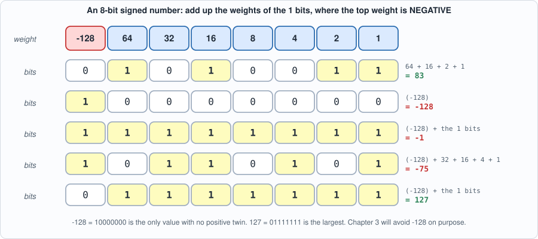
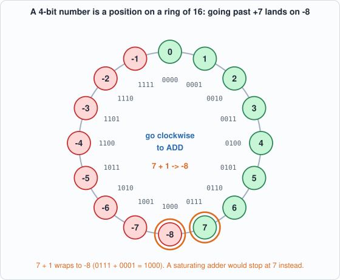
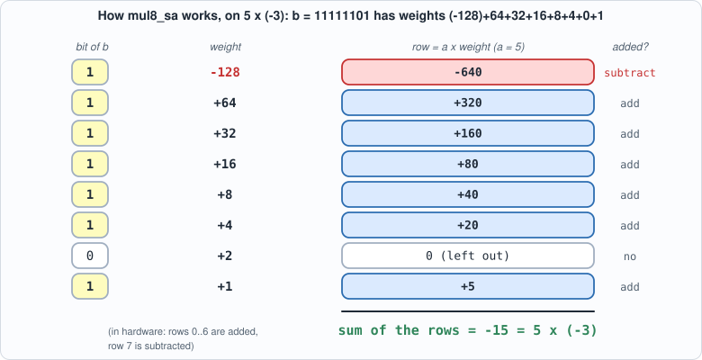
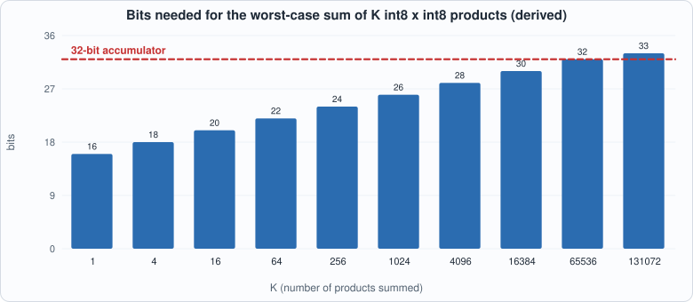
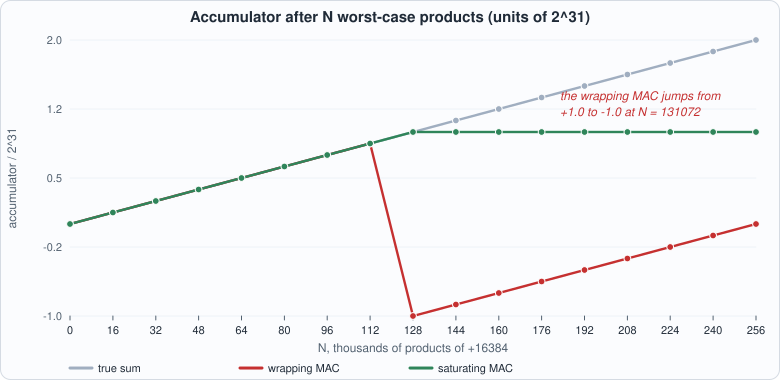
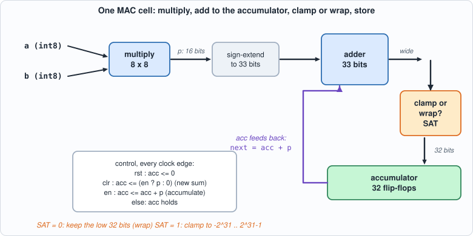

# 2. The MAC and Number Formats: Two's Complement, Overflow, and the Tests That Found Three Holes


--8<-- "docs/assets/art/ch-02.md"


**What you will understand:** how an 8-bit signed number is stored, why the multiply-accumulate (MAC) unit is the atom of every matrix engine, what happens when a sum does not fit (wrap or saturate), and what the same multiplier costs when it is written two different ways. You will also see a test suite that *looked* complete have three holes, found by breaking the circuit on purpose.

**What you need to know first:** Chapter 1 (the flow: golden model, two simulators, Yosys, mutation). Appendix C (number formats) goes deeper on everything in the first half of this chapter.

**What this chapter builds:** `rtl/mul8.v` (two multipliers), `rtl/mac.v` (the multiply-accumulate unit, wrapping or saturating), their golden models `model/mul8_gold.py` and `model/mac_gold.py`, testbenches `tb/mul8_tb.v` and `tb/mac_tb.v`, the mutation script `tools/mut_ch02.py`, and for the two running examples `tb/mac_trace_tb.v`, `tb/mac_overflow_tb.v`, `tools/ch02_example_a.py`, `tools/ch02_example_b.py`.

## Why the MAC is the atom

A large language model, run to produce one token, is almost entirely one operation repeated billions of times: take two lists of numbers, multiply them pairwise, and add the products up. That is a **dot product**, and one output number of a matrix multiplication is one dot product. Everything else in the model (the normalizations, the softmax, the activation functions) is small next to it. When people say an AI accelerator "does 100 trillion operations per second" they are counting multiplies and adds, and nearly all of them are the multiply-add step of a dot product.

The hardware for one step of that is the **multiply-accumulate unit**, MAC for short: it holds a running sum, and each clock cycle it multiplies two inputs and adds the product to the sum. A systolic array (Chapter 4) is a grid of these. The rest of the book is, in a sense, about feeding MACs, emptying them, and keeping them busy; this chapter is about making one MAC *correct*.

"Correct" turns out to need three decisions that look trivial and are not: how a signed number is stored, how wide the running sum must be, and what to do when the sum does not fit. We take them in that order, each one first by hand and then in the circuit.


## Signed numbers: two's complement

The chip stores a number in a fixed count of bits, and we want negatives. The universal answer is **two's complement**: give the top bit a *negative* weight and keep all the other weights as in ordinary binary. For eight bits the weights are -128, 64, 32, 16, 8, 4, 2, 1. A value is the sum of the weights of the bits that are 1.


*Figure 2.1: add up the weights of the 1 bits. Only the top bit has a negative weight.*

Work three of them yourself before reading on: `0101_0011` is 64 + 16 + 2 + 1 = 83. `1011_0101` is -128 + 32 + 16 + 4 + 1 = -75. `1111_1111` is -128 + 127 = -1, which is why "all ones" means minus one and not "very large".

Why do hardware designers prefer this to a sign bit plus magnitude? Because **the same adder works for both**. Add the bit patterns `1111_1111` (-1) and `0000_0001` (+1) with an ordinary unsigned adder and you get `1_0000_0000`; drop the ninth bit and you have `0000_0000` = 0. No special case for negative numbers anywhere. The chip needs only one adder circuit, and the *meaning* of the pattern (signed or unsigned) is a decision made by whoever reads the result.

An equivalent picture is a **ring**. Four bits have sixteen patterns; arrange them round a clock face and count clockwise, and after 7 comes -8:


*Figure 2.2: the two's-complement ring for 4 bits. The 8-bit version has 256 positions and the same jump from +127 to -128.*

That jump is **overflow**, and it is the heart of this chapter: addition on the ring never fails, it just goes round. Whether going round is acceptable depends on what the number means.

The range of eight bits is -128 to +127: one more negative value than positive. The asymmetry matters twice in this book. First, the product -128 x -128 = +16384 is the *largest* product magnitude (127 x 127 = 16129 is smaller). Second, Chapter 3 will choose the quantized range -127..127 on purpose, to keep the format symmetric and avoid ever producing -128 at all.

## Multiplying two signed bytes

You multiply by hand in decimal by writing a shifted copy of the top number for each digit of the bottom one and adding the rows. In binary it is easier: each digit is 0 or 1, so each row is either the top number shifted, or nothing. Two's complement adds one wrinkle: the top bit of the bottom number has weight -128, so its row is **subtracted**.


*Figure 2.3: 5 x (-3) as shift-and-add. Rows for weights +64 ... +1 are added; the row for weight -128 is subtracted (the red row). The sum is -15.*

Check the arithmetic against the figure: 320 + 160 + 80 + 40 + 20 + 5 = 625, and 625 - 640 = -15. If the sign row had been *added* the answer would be +1265, which is the classic mistake, and the first multiplier mutant in the table below makes exactly that change.

An 8 x 8 signed product fits in 16 bits (the largest magnitude, 16384, needs 15 bits plus a sign). That is what `p` is in the MAC.

## Sums grow: how wide must the accumulator be?

One product is 16 bits. A sum of two products can reach twice that, which needs one more bit; a sum of four needs two more. In general a sum of *K* products of at most 2^14 each needs about 15 + log2(K) bits plus a sign bit.


*Figure 2.4 (derived, not measured): the width needed to hold the worst case grows by one bit per doubling of K. 32 bits hold up to K = 131,071 products; the 131,072nd worst-case product needs a 33rd bit.*

So a 32-bit accumulator is **not** unconditionally safe. It is safe for any sum of up to 131,071 products, whatever the data, and for far longer sums of ordinary data (Running example B measures how much). That sounds like plenty: a dot product in a language model is typically 4,096 to 16,384 long. But "safe for realistic inputs" and "safe for every input" are different claims, and the hardware has to do *something* defined for the second case.

## What to do when the sum does not fit

There are exactly two reasonable answers.

- **Wrap.** Keep the low 32 bits and drop the rest. This is what a plain 32-bit adder does for free, and costs nothing. The price: a sum just past +2^31 becomes a hugely *negative* number, silently.
- **Saturate.** Clamp to the nearest representable value, -2^31 or +2^31 - 1. This costs comparators and a multiplexer on the sum, but the answer is wrong "gracefully": it is still the largest value the format can hold, with the correct sign.


*Figure 2.5 (derived from the arithmetic, confirmed on the circuit in Running example B): after 131,072 products of +16384 the true sum is 2^31. The wrapping MAC has jumped to -2^31; the saturating one is parked at 2^31 - 1.*

Which is better depends on the application. For audio or graphics, saturation is the long-standing standard (a clipped sample sounds better than a sign flip). For a neural network, an overflowing accumulator means something has already gone wrong (Chapter 3 chooses scales so that it never happens), so the cheaper option is defensible *if* you prove it cannot happen. This book builds both, measures the cost, and lets Chapter 3 make the larger decision.

## The multiplier, in two styles: `rtl/mul8.v`

```verilog
--8<-- "rtl/mul8.v"
```

**Commentary.** Both modules take two signed bytes and produce a signed 16-bit product.

- `mul8_beh` is one line: `assign p = a * b;`. Because both operands are declared `signed`, Verilog's `*` is a signed multiply, and the synthesis tool decides how to build it.
- `mul8_sa` builds it the way Figure 2.3 draws it. `ax` is `a` sign-extended to 16 bits (so shifting it left never loses the sign). Row *k* is `b[k] ? (ax <<< k) : 0`. The last row is `r7` and it is **subtracted**: `r0 + ... + r5 + r6 - r7`.
- A few details that trip people up: `wire signed [15:0] ax = a;` sign-extends because `a` is signed; writing `{8'b0, a}` would zero-extend and break negative `a` (that is the multiplier mutant "a is zero-extended instead of sign-extended"). `<<<` is the arithmetic left shift (for left shifts it matches `<<`). Every net that takes part in the sum has to be `signed`, or Verilog silently treats the expression as unsigned.

## The MAC: `rtl/mac.v`

```verilog
--8<-- "rtl/mac.v"
```


*Figure 2.6: the MAC datapath. Everything left of the register is combinational; the register is the only state.*

**Commentary, line by line.**

- `wire signed [15:0] p = a * b;` is the product, available a gate-delay-or-so after `a` and `b`. This is a combinational wire, not a register.
- `wire signed [32:0] wide = acc + p;` computes the sum in **33 bits**. The extra bit is the whole trick: it lets the overflow test see the true sum, which does not fit in 32 bits, before it is cut down. If the sum were computed in 32 bits the overflow would already have happened and be invisible (that is the MAC mutant "the sum is only 32 bits wide").
- `summed` chooses by the parameter `SAT`. For `SAT == 0` it is `wide[31:0]`, the low 32 bits (wrap). For `SAT == 1` it compares the true sum against the two limits and returns the limit when it is outside.
- The `always @(posedge clk)` block is the register with its control: priority order is **rst, then clr, then en**. `clr` with `en` loads the *product* alone (a new sum begins with this term); `clr` without `en` loads zero. With none of them, the accumulator holds.
- `mac_sat` is the saturating version wrapped as its own module so that Yosys and later chapters can name it.

Two properties of that design are worth saying out loud, because the testbench must check them. A `clr` cycle with `en = 1` does not *add* to the old sum: it starts a new one. And reset beats everything. A mutant that swaps the priority of `en` and `clr` is plausible, and the tests catch it (the MAC mutant "en takes priority over clr").

## The answer keys

```python
--8<-- "model/mul8_gold.py"
```

```python
--8<-- "model/mac_gold.py"
```

The multiplier is checked **exhaustively**: 256 x 256 = 65,536 pairs. The MAC has state, so its key is a *sequence*: each row is a run of cycles with the expected wrapped and saturated accumulator after it. The sequence contains directed corner cases, an initial post-reset check, upward overflow (4 x 32,768 cycles of -128 x -128, i.e. 2^31 total), downward overflow (5 x 32,768 cycles of -128 x 127), and 3,000 random rows. Word 0 of the vector file is the **row count**: Verilator is a two-state simulator and cannot see an "unknown" end marker, which hung the first version of this testbench (the lesson is in the notes below).

Notice what the Python key does **not** do: it does not look at the Verilog, and it does not use the same method. It models the MAC as plain Python integers with explicit `wrap` and `sat` functions. Independence is the point: if the same person made the same mistake in both, the test would pass and the chip would be wrong, which is why the key is written in a different language from a different mental model (arithmetic on integers, not a circuit).

## The testbenches

```verilog
--8<-- "tb/mul8_tb.v"
```

```verilog
--8<-- "tb/mac_tb.v"
```

## Running it

```python
--8<-- "tools/ch02_run.py"
```

**Output (cloud sandbox -- live-executed; Icarus Verilog 12.0, Verilator 5.020, Yosys 0.33)**

```text
--8<-- "out/ch02_run_out.txt"
```

### Reading it

- **Both simulators pass** both testbenches: all 65,536 multiplier pairs and all 3,039 MAC checkpoints.
- **The two multipliers cost the same.** 401 vs 398 generic gates; 191 vs 192 iCE40 cells. Writing the shift-and-add by hand bought nothing: the synthesis tool already finds a good structure for `*`. *(Measured by Yosys 0.33 with its default flow; a different tool or a hard multiplier block would change this. That is a result about this flow, not a law.)* The practical rule: write the clearest description and let the tool optimize, until a measurement says otherwise.
- **The MAC is dominated by the 32 flip-flops and the adder.** 725 gates of which 32 are registers; saturation adds 28 gates (753) and, on the FPGA mapping, 113 cells (322 -> 435) because the comparators and the mux sit on the 33-bit sum. So the *price of saturation is about 4% in generic gates and 35% on the FPGA mapping*: not nothing, not prohibitive. (Both are measured counts; both depend on the flow.)
- **Nothing here is timing.** Gate and cell counts say nothing about speed; Chapter 10 measures that.

## Running example A: follow the MAC cycle by cycle

*The point of this example:* the MAC is a tiny state machine, and the quickest way to understand a state machine is to follow its state through a short program. The testbench `tb/mac_trace_tb.v` runs ten cycles on the real circuit and prints the accumulator after each one. `tools/ch02_example_a.py` does the same thing in plain Python from the *rules* of the MAC (not from the circuit) and checks that the two tables agree.

```verilog
--8<-- "tb/mac_trace_tb.v"
```

```python
--8<-- "tools/ch02_example_a.py"
```

To compile and run: `python3 tools/ch02_example_a.py` (it needs `iverilog` only).

**Output (cloud sandbox -- live-executed)**

```text
--8<-- "out/ch02_example_a_out.txt"
```

**Walkthrough.** Read the table one row at a time.

1. Cycle 1: `clr = 1, en = 1`. A new sum begins with the first product, 3 x 4 = 12. The old accumulator (zero after reset) is irrelevant.
2. Cycles 2 and 3 accumulate: 12 + (-30) = -18, then -18 + (-200) = -218. Negative products are simply added; the hardware has no subtract step because two's complement made that unnecessary.
3. Cycle 4: `en = 0`. The inputs are 99 x 99 = 9801, a large product, and the accumulator **does not move**. `en` is the gate on the accumulator, not on the multiplier (the multiplier is always computing; the product is just not used).
4. Cycle 5 adds -128 x -128 = +16384, the largest product, taking -218 to 16166. Four cycles of the kind the book will later repeat 131,072 times.
5. Cycle 8: `clr = 1, en = 1`. The accumulator becomes 2 x 2 = 4: the old 15976 is thrown away, *not* added to. That one rule is how a matrix unit starts a new output element without a separate "set to zero" cycle.
6. Cycle 10: `clr = 1, en = 0`. The accumulator becomes 0, even though a and b are 55 and 55. Every one of those rows is a test the mutation table later shows is needed.

## Running example B: overflow, derived, measured and made to happen

*The point of this example:* to put numbers on "rare but real". It does three things in order. (1) **Derives** how many worst-case products fit. (2) **Runs** the real wrapping and saturating circuits on exactly that many, and a few more, and compares them with Python. (3) **Measures** how large the sums of *random* int8 vectors actually get, to show how far typical data stays from the worst case.

```verilog
--8<-- "tb/mac_overflow_tb.v"
```

```python
--8<-- "tools/ch02_example_b.py"
```

To compile and run: `python3 tools/ch02_example_b.py` (it needs `iverilog`; takes a few seconds, because 262,145 clock cycles are simulated).

**Output (cloud sandbox -- live-executed)**

```text
--8<-- "out/ch02_example_b_out.txt"
```

**Walkthrough.**

1. *Derived.* The worst-case product is 128 x 128 = 2^14, so K of them sum to K x 2^14, and 2^31 / 2^14 = 2^17 = 131,072. One short of that, K = 131,071, needs exactly 32 bits (2,147,467,264 < 2,147,483,647). At K = 131,072 the sum is 2^31, which needs 33. This is the number in Figure 2.4.
2. *Run on the circuit.* The table has nine rows, from 1 product to 262,145. The two circuits agree with Python in all nine. The crucial row is 131,072: the wrapping unit's accumulator goes from +2,147,467,264 to -2,147,483,648 in one clock cycle, and the saturating unit goes to +2,147,483,647. That is Figure 2.5, now as numbers from a simulation. After 262,144 products the wrapping unit reads exactly 0: it has gone once all the way round the ring (2^32 / 2^14 = 2^18 products), and its answer is *identically* what an empty sum would have been.
3. *Measured.* For random int8 data the largest |sum| seen at length K grows roughly like the square root of K, while the worst case grows like K. At K = 64 the largest observed sum is 14% of the worst case; at K = 65,536 it is 0.45%. No trial came anywhere near 2^31. So with ordinary data the 32-bit accumulator is enormously safe; with adversarial data it is not. *(These are measurements on uniformly random bytes, seed 5, a few thousand trials: they say nothing about the structure of real activations, which are far from uniform; Chapter 3 measures a real tiny model.)*

**What to take from the two examples together.** The question "can this overflow?" has two answers, *yes in principle* and *no in practice*, and a robust design handles the first and relies on the second for performance. That is why the book builds both policies.

## Testing the tests

```python
--8<-- "tools/mut_ch02.py"
```

**Output (cloud sandbox -- live-executed)**

```text
--8<-- "out/ch02_mutation_out.txt"
```

All 8 multiplier mutants and all 11 MAC mutants are caught. Two survive, and both are **equivalent mutants**: the clamp tests `wide > 2^31-1`; changing it to `>=` makes the circuit clamp when the sum equals 2^31-1 exactly, but clamping that value returns 2^31-1, the same number. The lower clamp is symmetric. Neither is a gap.

### The three holes that the first version had

The tests above are the *second* version. The first one passed all its own checks and still let mutants through, each teaching something:

1. **The downward overflow run was too short.** The first version drove the accumulator down for fewer cycles than it takes to reach -2^31, so the lower clamp was never exercised and "the lower clamp is one too high" survived. The fix is arithmetic, not luck: -128 x 127 = -16256 per cycle needs 2^31 / 16256 ~ 132,100 cycles, so the test runs 5 x 32,768 = 163,840.
2. **No check straight after reset.** "Reset loads 1" survived until a row was added that looks at the accumulator before any `en`.
3. **One mutant was not a mutant.** A "priority" mutant had been written as a rewrite that, on inspection, behaved identically. It was replaced by a true priority swap (`en` beats `clr`), which the tests do catch. Reading a survivor before trying to kill it is the discipline from Chapter 1.

## Two simulators, two kinds of unknown

Icarus is four-state (0, 1, `x`, `z`); Verilator is two-state. A testbench that ends its loop on an `x` sentinel works in Icarus and **hangs in Verilator** (the author watched it use 98% CPU for six minutes before finding out). The book's rule since this chapter: no sentinel values, put the count in word 0. This is also the reason to run every test in both tools: each one hides a different kind of mistake.

## Common mistakes

- **Forgetting `signed`.** In Verilog an expression is signed only if *every* operand is. One unsigned operand in `a * b` makes the whole multiply unsigned, and the product of -1 and 1 becomes 255. The mutant "operands treated as unsigned" is this error on purpose.
- **Sign-extending with zeros.** `{8'b0, x}` zero-extends; `{{8{x[7]}}, x}` sign-extends. In `mac.v` the `clr` path uses the second form. Zero-extending a negative product silently turns it into a large positive number (the MAC mutant "clr with en loads the product without sign extension").
- **Computing the sum in 32 bits and then checking for overflow.** The overflow has already happened by the time the check looks; it needs the 33-bit sum (the same MAC mutant).
- **Testing only the middle of the range.** Random data almost never produces a sum near 2^31, so random testing alone passes the first version of any saturating MAC. The directed overflow runs are what exercise the clamp.
- **Treating "equal gate count" as "equal chip".** The multipliers cost the same here; that is a claim about Yosys 0.33's default flow on these two descriptions, not about silicon.
- **Believing the testbench because it passes.** Every mutant above is a way a plausible engineer might break the circuit; the testbench is trusted *because* it caught them.

## What this chapter does and does not establish

- **The MAC is correct against the golden model** on the vectors used: exhaustive for the multiplier, directed plus 3,000 random sequences for the MAC. Not exhaustive for the MAC (the state space is 2^32 x inputs).
- **The gate counts compare flows, not chips.** "Same cost" is a finding about Yosys's default synthesis.
- **Overflow policy is a decision, not a fact.** Wrapping is cheapest and silently wrong; saturating costs gates and is wrong more gracefully. Chapter 3 will make the larger decision, which is to keep the accumulator wide enough that a real model should never need either.
- **The random-data measurement is a measurement of random data.** It shows the bound is loose for uniform bytes; it does not show a real network stays that far from it.

## Chapter summary

Signed 8-bit numbers range -128..127 and are stored in two's complement: the top bit has weight -128, and one adder serves both signs. A multiplier is a set of shifted copies of one operand, with the sign row subtracted. A MAC adds the product to a 32-bit accumulator that is safe for up to 131,071 worst-case products and typically for far more; beyond that it must wrap or saturate. The unit can do either, and saturation costs about 4% more gates (35% more FPGA cells). The behavioural and hand-built multipliers cost the same in Yosys. The tests were exhaustive for the multiplier, sequence-based for the MAC, and mutation found three holes in the first version.

## Self-check questions

1. Why is the product -128 x -128 the worst case for the accumulator, and how many such products does it take to overflow 32 bits signed?
2. In `mul8_sa`, why must the row for bit 7 of `b` be subtracted?
3. Why does the MAC compute its sum in 33 bits instead of 32?
4. The two multiplier styles cost 401 and 398 gates. What can you conclude, and what can you not?
5. A testbench ends its loop when the expected value is `x`. Why does it work in Icarus and hang in Verilator?
6. The mutant "the upper clamp triggers at the limit itself (`>=`)" survives. Is the test weak?
7. Convert `1100_1010` and `0011_0111` to decimal by hand. What is `1100_1010 + 0011_0111` as an 8-bit pattern, and what does it mean as a signed number?
8. In Running example A, what would the accumulator be after cycle 8 if `clr` with `en = 1` loaded zero instead of the product? Which mutant in the table is that, and which row of the program catches it?
9. Running example B shows the wrapping MAC reads exactly 0 after 262,144 worst-case products. Explain why, and why that is *worse* than reading garbage.

## Exercises

1. **Change the program.** Edit `tb/mac_trace_tb.v` to compute the dot product of `[3, -5, 100, -128]` and `[4, 6, -2, -128]` (a dot product whose last term is the largest possible product), then write the expected value by hand and run the script. Does the final accumulator match your hand result?
2. **Find the break point.** How many products of 127 x 127 = 16129 does it take to overflow 32 bits? Work it out on paper first, then change `tb/mac_overflow_tb.v` (the `a` and `b` ports and the `run_to` counts) and confirm.
3. **A 16-bit accumulator.** If the accumulator were only 16 bits, how many worst-case products would fit? What would the first overflow look like on the ring? Predict, then edit `mac.v` (`acc` and `wide` widths) and run `mut_ch02.py` to see which tests complain, and *why* they do.
4. **Add a mutant.** Write one new mutant for `mut_ch02.py` that you think is plausible (for example, saturating the lower clamp at -2^31 + 1). Predict whether it is caught, then run it. If it survives, decide whether it is equivalent or a gap.
5. **The cost of the policy.** Use `synth_stats` (see `tools/ch02_run.py`) to measure `mac` vs `mac_sat` with `synth_ice40` and with the generic flow. Which part of the 35% FPGA increase do you think is the comparators and which is the multiplexer? (Hint: try a version that only checks the upper limit.)
