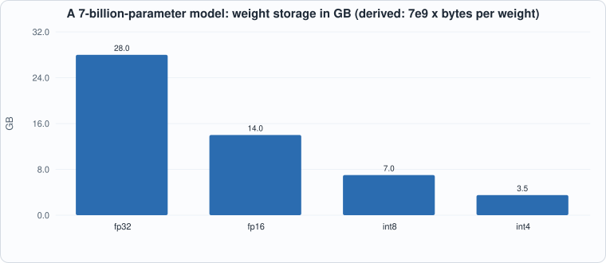
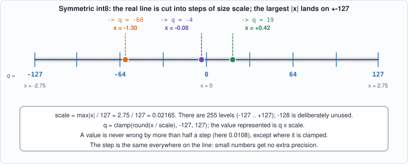
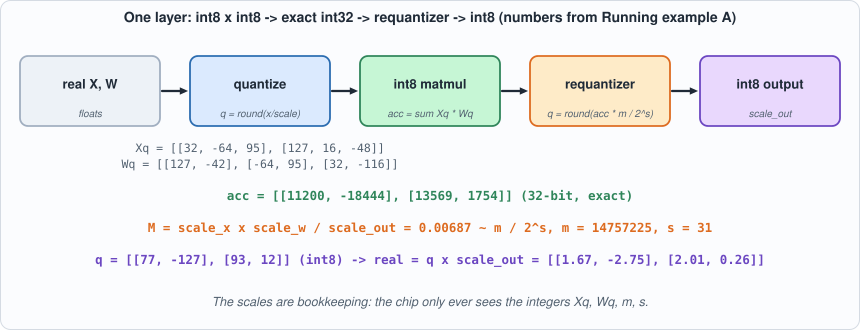
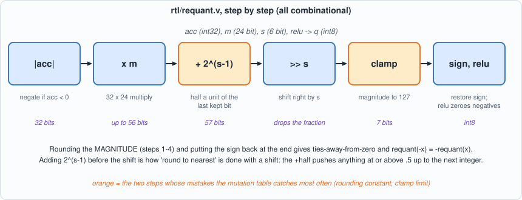
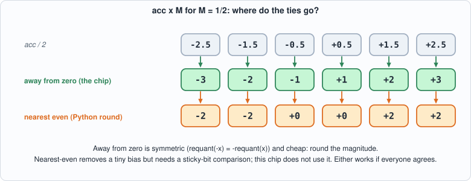
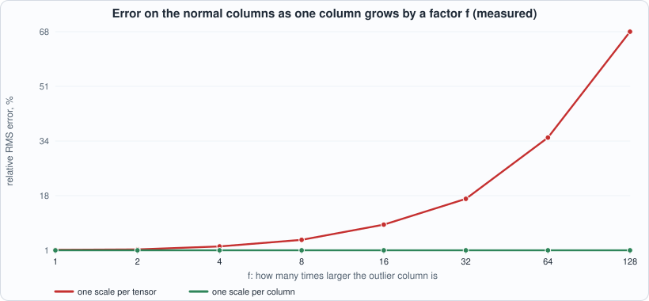
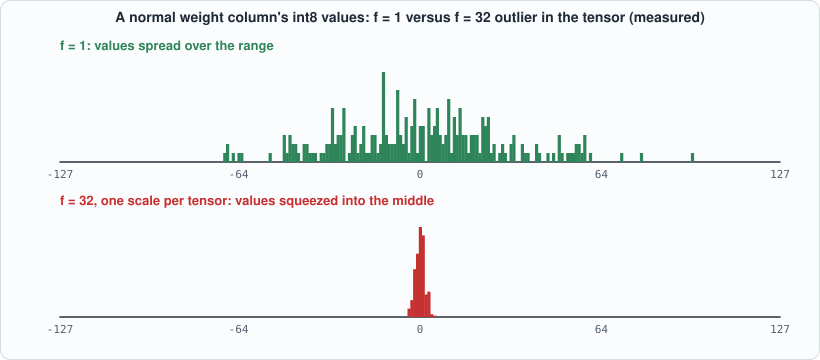

# 3. Quantization: int8 Numbers, the Requantizer, and What Accuracy It Costs


--8<-- "docs/assets/art/ch-03.md"


**What you will understand:** why inference chips compute in 8-bit integers, how a real number becomes an int8 (and why the range is -127..127), how the 32-bit accumulator of a matrix product is brought back to 8 bits by a circuit called the **requantizer**, and how much accuracy all this costs, measured, including the case where one outlier ruins everything else.

**What you need to know first:** Chapter 2 (two's complement, the MAC, overflow). Appendix C (number formats) and Appendix D (ML linear algebra) cover the background if either is new.

**What this chapter builds:** `model/quant.py` (the arithmetic, in plain integers), `rtl/requant.v` (the requantizer circuit), `model/requant_gold.py` and `tb/requant_tb.v` (its test), `tools/mut_ch03.py` (mutation), `tools/ch03_study.py` (the accuracy study), and for the running examples `tb/requant_one_tb.v`, `tools/ch03_example_a.py`, `tools/ch03_example_b.py`.

## Why 8 bits

Every weight of a model has to be read from memory for every token generated, and memory bandwidth, not arithmetic, usually limits inference (Chapter 9 measures this). An int8 weight is one byte: a quarter of fp32, half of fp16. An int8 multiplier is also far smaller than a floating-point one (Chapter 2: about 400 gates). So the chip stores and multiplies small integers, accumulates in 32 bits, and converts back to 8 bits between layers.


*Figure 3.1 (derived): the same model in four formats. Each halving of the format halves the bytes that must stream from memory per token.*

The price is **precision**. A real number is not an integer, so converting loses information, and the whole chapter is about converting in a way that loses as little as possible, doing it with simple hardware, and measuring what is lost.

## From a real number to an int8, by hand

Suppose a layer's activations contain the eight numbers `0.42, -1.30, 2.75, -0.08, 1.91, -2.20, 0.00, 0.66`. We have 255 integer levels, -127 to +127, to represent them. The natural plan: stretch the *largest* magnitude (2.75) to land exactly on the top level, and spread everything else proportionally. The stretch factor is the **scale**:

`scale = max|x| / 127 = 2.75 / 127 = 0.02165`

One integer step is worth 0.02165. To store 0.42 you divide by the scale (0.42 / 0.02165 = 19.4) and round (19). To use it later you multiply back (19 x 0.02165 = 0.411): not 0.42 but close, and the error can never exceed half a step (0.0108).


*Figure 3.2: symmetric int8. The ticks are the 255 representable values; the real number 0.42 is stored as 19, -1.30 as -60 and -0.08 as -4.*

Notice the shape of the error: it is the same everywhere, at most half a step, no matter whether the number is big or small. A value like -0.08 is stored with a *relative* error of 8%, while 2.75 is exact. That is the central trade-off of integer formats, and floating point exists to avoid it (at the cost of larger, slower arithmetic). Running example A below tabulates all eight values.

## The scheme: symmetric int8

A real number `x` is stored as an integer `q` with `x ~ q * scale`.

- `scale = max|x| / 127`, so the largest value maps to +-127.
- `q = clamp(round(x / scale), -127, 127)`. The value -128 is **never used** (Chapter 2): the range is symmetric, so negating a quantized value cannot overflow and a zero-centred distribution loses nothing.
- Rounding is **to nearest, ties away from zero**, done on integers (no floating point in the reference), so every implementation agrees on the half-way cases.

"Symmetric" means the real value 0 maps to the integer 0 and the range is centred on it. The alternative, *asymmetric* quantization, adds a zero-point offset so that a range like 0..6 can use all 256 levels; it costs extra arithmetic in every product (the offsets multiply out into extra terms), which is why many accelerators, this one included, use the symmetric form and accept losing a bit of range on one-sided data.

## A matrix product in int8, and the problem it creates

A matrix product of two int8 tensors accumulates exactly in int32 (`acc = sum a_q * b_q`), and `acc` represents the real value `acc * scale_a * scale_b`. That is exact: no rounding has happened yet, and the Chapter 2 MAC does it.

But the accumulator is 32 bits and the next layer wants 8. Handing it a 32-bit number would need four times the memory bandwidth and wider multipliers everywhere downstream, so the accumulator must be shrunk back. This shrinking step is **requantization**, and it has to choose a new scale for the output, `s_out`, and rescale every accumulator to it:

```text
q_out = round( acc * M ),   M = scale_a * scale_b / s_out     (a real number, typically 2^-16 .. 1)
```


*Figure 3.3: one layer end to end, with the numbers of Running example A. Only the integers move through the chip; the scales are bookkeeping done by the compiler (Chapter 11).*

Hardware does not multiply by a real number. It uses an integer **mantissa** `m` (24 bits, 2^23 <= m < 2^24) and a **shift** `s`: `M ~ m / 2^s`, so `q_out = clamp(round(acc * m / 2^s))`. This is a floating-point number in disguise (the mantissa has 24 bits of precision and the shift is the exponent), but evaluated entirely with an integer multiply and a shift. The relative error of that approximation is at most 2^-24 (measured below).

## The reference: `model/quant.py`

```python
--8<-- "model/quant.py"
```

`round_half_away` works on integers only (`divmod`, then compare twice the remainder with the denominator). `requant` is the function the circuit has to match, bit for bit.

## The circuit: `rtl/requant.v`

```verilog
--8<-- "rtl/requant.v"
```


*Figure 3.4: the datapath of `requant`. The two orange steps (the rounding constant and the clamp) are where the interesting bugs live.*

It is combinational (no clock): take the magnitude of `acc`, multiply by `m` (32 x 24 bits gives up to 56 bits), add the rounding constant `2^(s-1)`, shift right by `s`, clamp the magnitude to 127, restore the sign, and optionally clamp negatives to zero (a fused ReLU). Why add `2^(s-1)` and then shift? Shifting right by `s` is division by 2^s that *rounds down*. Adding half of 2^s first turns "round down" into "round to nearest": a remainder of 0.5 or more carries into the next integer, a smaller one does not. Rounding the **magnitude** gives ties-away-from-zero for both signs, and makes `requant(-x) = -requant(x)`. A `2^31` magnitude fits in 32 unsigned bits, so the most negative accumulator is not special.


*Figure 3.5: the half-way cases. Python's `round` goes to the nearest even number and the chip goes away from zero; the book's rule is that the reference and the circuit use the same one, and here that is away from zero.*

## The answer key and the testbench

```python
--8<-- "model/requant_gold.py"
```

```verilog
--8<-- "tb/requant_tb.v"
```

The key has 201,808 cases: the accumulator at both ends of int32, mantissas at both ends, shifts 0 and 63, **exact ties** at every shift (built so that `acc * m` is exactly `(2k+1) * 2^(s-1)`), results sitting exactly at the clamp limit, and 200,000 random ones, with two thirds of them having small accumulators (below about 2^20 or a few hundred times a power of two) so that the interesting rounding region is exercised.

## Running it

```python
--8<-- "tools/ch03_run.py"
```

**Output (cloud sandbox -- live-executed; Icarus Verilog 12.0, Verilator 5.020, Yosys 0.33)**

```text
--8<-- "out/ch03_run_out.txt"
```

Both simulators agree with the key on all 201,808 cases. The requantizer is **5,322 generic gates / 2,777 iCE40 cells** (measured), about thirteen times a Chapter 2 multiplier. It is a large block for what it does, mostly because of the 32 x 24 multiply; a real design would share one requantizer per row of outputs, or pipeline it. (Not measured here: speed.)

## Running example A: quantize by hand, then run a whole layer

*The point of this example:* to do every step of this chapter once, with numbers small enough to check by eye, and to confirm the *circuit* gives the same answers as the software.

```verilog
--8<-- "tb/requant_one_tb.v"
```

```python
--8<-- "tools/ch03_example_a.py"
```

To compile and run: `python3 tools/ch03_example_a.py` (it needs `iverilog`).

**Output (cloud sandbox -- live-executed)**

```text
--8<-- "out/ch03_example_a_out.txt"
```

**Walkthrough.**

1. *Part 1, one vector.* Every row follows the rule from "From a real number to an int8": divide, round, multiply back. The largest value, 2.75, comes back exactly, as promised. The rest differ from the originals by less than half a step (0.0108): the largest error here, 0.0104, is on 0.66. The value -0.08 comes back as -0.0866: absolute error small, relative error 8%.
2. *Part 2, a whole layer.* `X` and `W` are real 2x3 and 3x2 matrices. Each gets its own scale (2.0/127 and 1.2/127), is quantized, and the *integers* are multiplied: `acc = [[11200, -18444], [13569, 1754]]`. These are exact integer results. Multiplying them by `scale_x x scale_w` (the first two output lines) already gives values close to the real answer (1.6666 vs 1.6500, for instance); the difference is the error of rounding the *inputs*.
3. *The requantizer.* The output scale is chosen from the real answer's range (2.75 / 127). Then `M = scale_x x scale_w / scale_out = 0.00687` becomes a 24-bit mantissa and a shift. Each accumulator times M lands on the output grid: 76.965 becomes 77, -126.745 becomes -127, 93.244 becomes 93, 12.053 becomes 12. The circuit and the software agree on all four.
4. *The real answer.* The final column shows `q x scale_out` next to the true value: 1.6673 versus 1.6500 and so on. The largest error is 0.0173, about 0.8 of an output step. An int8 layer is an approximation of the real layer; this is what the approximation looks like in a case small enough to see.
5. *Part 3, ties.* The six rows with `M = 1/2` show every accumulator that lands exactly half-way. The chip rounds away from zero in both directions (+0.5 goes to 1, -0.5 goes to -1), Python's `round` to the nearest even number. Neither is wrong; the book needs them to be *the same everywhere* and picks the one that is symmetric and cheap.

## Running example B: the outlier experiment, taken apart

*The point of this example:* the 19.5% figure in the accuracy table below is dramatic enough that it deserves explaining. Here the experiment is repeated for a sweep of outlier sizes, and we look at *why* the error grows by counting how many of the 255 levels the normal columns actually use.

```python
--8<-- "tools/ch03_example_b.py"
```

To compile and run: `python3 tools/ch03_example_b.py` (pure Python; runs in about a second).

**Output (cloud sandbox -- live-executed)**

```text
--8<-- "out/ch03_example_b_out.txt"
```


*Figure 3.6 (measured): the per-column error is flat at about 1.2%; the per-tensor error climbs steadily as the outlier grows.*


*Figure 3.7 (measured): the same column of weights. With no outlier it uses 102 distinct levels; with one outlier 32 times larger in the tensor and one scale for the whole tensor, it uses 10.*

**Walkthrough.**

1. *The setup.* Weights are Gaussian; one of the 32 output columns is multiplied by `f`. We measure the error **only on the other 31 columns**, the ones nothing is wrong with.
2. *The numbers.* With per-column scales the error is 1.15% at every `f`, as it should be: each column is quantized to its own range and cannot see the outlier. With a single per-tensor scale the error is 1.30% at `f` = 1, 4.3% at `f` = 8, 16.8% at `f` = 32 and 67.5% at `f` = 128.
3. *The mechanism.* A tensor's scale is `max|x| / 127`. Once the outlier column is 32 times larger than the others, the step is about 32 times larger than a normal column needs, so a normal column's 256 weights land on only 10 distinct integers (between -4 and 5). Figure 3.7 shows the effect as a picture. Weights that differ by up to a step become *equal*; the information is lost at the moment of quantization and no later stage can recover it.
4. *The lesson.* The per-tensor scale is cheap (one number) and fine when a tensor is homogeneous. When columns differ in size, per-column (per-channel) scales are the standard repair, and they cost one extra number per column and a per-column mantissa in the requantizer. Real systems also treat outlier *channels* specially, which this book does not model.

## Testing the tests

```python
--8<-- "tools/mut_ch03.py"
```

**Output (cloud sandbox -- live-executed)**

```text
--8<-- "out/ch03_mutation_out.txt"
```

All 15 real mutants are caught, including the subtle ones: rounding the signed value instead of the magnitude, a shift of 5 bits instead of 6, a product cut to 48 bits, the rounding constant minus one (ties toward zero), and the 31-bit magnitude of the most negative accumulator.

Three mutants survive and each is **equivalent**; none is a gap:

- *"Shift of 0 adds a half."* With `s = 0`, `1 << (s-1)` would be `1 << 63`, but the `half` wire is 56 bits wide, so the 1 falls off the end and the constant is 0 anyway. The special case in the source is documentation, not logic.
- *"Clamp compares against 126."* A magnitude of exactly 127 is returned as 127 either way (clamped or not).
- *"Compare `>= 128` instead of `> 127`."* Same condition on integers.

This is worth knowing for a reason beyond the test: the first two are **dead logic** a synthesis tool will remove, and an honest mutation report finds it.

## How much accuracy does int8 cost?

All figures below are **measured** with `tools/ch03_study.py` (pure Python, fixed seeds, Gaussian random data, relative RMS error against an fp64 reference). They show the *shape* of the effect on random data; real model weights have their own distributions.

```python
--8<-- "tools/ch03_study.py"
```

```text
--8<-- "out/ch03_study_out.txt"
```

### Reading it

- **Plain data: about 1-1.5% error**, and it does *not* grow with the length K of the dot product (1.1% at K=64, 1.4% at K=1024). Rounding errors are random and average out relative to the sum.
- **Per-column scales help a little on plain data** (1.2% vs 1.4%), because each column gets its own `max/127`.
- **One outlier column breaks per-tensor quantization for everyone else.** With one column 30x larger, the single scale is set by the outlier, the other 31 columns use only a few of the 255 levels, and their error is **19.5%** (per-tensor) vs **1.3%** (per-column). This is the reason real systems use per-channel scales and special handling of outliers.
- **The requantizer's own approximation is negligible.** The worst relative error of `m / 2^s` against the exact multiplier over 100,000 random values is 5.9e-8, at the 2^-24 bound.
- **The 32-bit accumulator is generous on this data** (about 40,000 times the largest value seen), consistent with Chapter 2: overflow needs 2^16 worst-case products. Real models with large activations and K in the thousands come closer; this test does not claim they do not.
- **Bytes per weight** are derived, not measured: fp32 4, fp16 2, int8 1, int4 0.5, so a 7-billion-parameter model occupies 28, 14, 7 and 3.5 GB. Chapter 9 turns this into tokens per second.

## Common mistakes

- **Using -128.** It makes the range asymmetric, `-(-128)` does not fit in int8, and the worst-case product becomes reachable. The scheme clamps to -127.
- **Rounding in the wrong place.** Rounding the *signed* product instead of its magnitude makes -2.5 go to -2 and +2.5 go to 3: asymmetric, biased. The mutation table has this exact mutant and the tie tests catch it.
- **Choosing a scale from the wrong range.** The input range must cover everything that will really flow through, not just the calibration sample: values beyond it are clamped to +-127 and clipped silently. Chapter 11 does this with calibration and a safety margin.
- **Forgetting the accumulator scale is a product.** The accumulator is in units of `scale_a x scale_b`, not of either. Dividing by the wrong one gives a result off by a constant factor that no per-element test inside the chip can see.
- **Comparing two roundings that disagree on ties.** Python's `round` and the chip differ on every half-way case; a golden model written with `round()` would fail on the tie tests. The book's key uses integer-only `round_half_away` for that reason.
- **Reporting a quantization error without saying which data.** The 1-1.5% figure is for Gaussian random data; a real model will differ.

## What this chapter does and does not establish

- The requantizer **matches its reference exactly** on 201,808 cases including all the tie and clamp corners; it is not exhaustive (2^63 combinations).
- The accuracy numbers are for random Gaussian data. Whether int8 is accurate enough for a given model is an experiment on that model.
- The gate counts are Yosys generic gates and iCE40 cells, not area or speed.

## Chapter summary

int8 symmetric quantization stores `x` as `q` in -127..127 with `scale = max|x|/127`. The int32 accumulator returns to int8 through a mantissa-and-shift requantizer with round-half-away and a clamp; the circuit matches the integer reference on all 201,808 cases and all 15 real mutants are caught (3 equivalents explained). The accuracy cost is about 1-1.5% on plain data, but a single outlier ruins per-tensor quantization for the rest, which per-column scales fix.

## Self-check questions

1. Why does the scheme avoid -128, and what would break if it were allowed?
2. The requantizer rounds the magnitude, not the signed value. What would change for an accumulator of -3 with M = 1/2?
3. Why does the error not grow with K, and why does an outlier column hurt the other columns?
4. The mutant "shift of 0 adds a half" survives. Why is that not a test gap?
5. A 7B-parameter model in int8 needs 7 GB of weights. If a chip can read 100 GB/s, what is the upper bound on tokens per second, and what are you assuming?
6. Quantize `[0.5, -2.0, 1.0, 0.0]` with the symmetric scheme by hand: what is the scale, and what are the four integers? What does each one dequantize to?
7. In Running example A, `m = 14757225` and `s = 31`. Verify by hand that `m / 2^s` is within 2^-24 of 0.00687187 (relative), and say what would happen to the result if `s` were 30 with the same `m`.
8. Why does the per-column error in Running example B not change with `f`, while the per-tensor error does? Name the number in the system that changes.

## Exercises

1. **Quantize your own numbers.** Edit the list `x` in `tools/ch03_example_a.py` to a vector of ten numbers where one is 20 times larger than the rest. Predict the integers for the small ones, then run the script. How many of the nine small numbers quantize to 0?
2. **A different layer.** Replace `X` and `W` with a 3x4 and a 4x2 matrix of your choice. Work out `acc` for one entry by hand and compare. Does the circuit still agree with the software?
3. **Find the tie.** Choose an accumulator and a mantissa and shift such that `acc x m / 2^s` is exactly a half-integer (the ties in `requant_gold.py` show how). Run it through `requant_one_tb` and confirm the result is away from zero for both signs.
4. **Sweep K.** In `ch03_example_b.py`, change `K` to 64 and to 1024. Does the per-tensor error at `f = 32` depend on K? Explain.
5. **A third scheme.** Keep the per-tensor scale but clip the outlier column to the 99th percentile of |W| before quantizing. Measure the error on the normal columns and on the outlier column. What did you trade?

