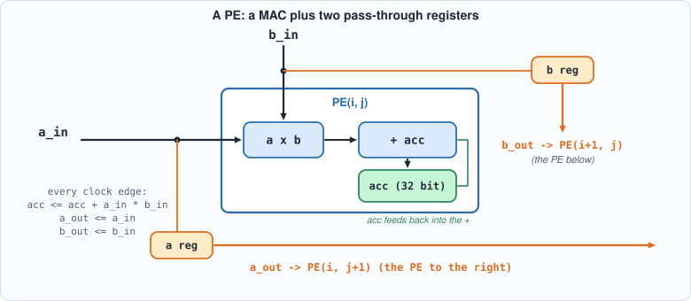
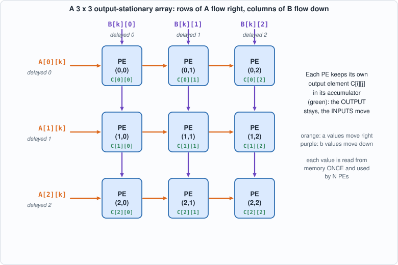
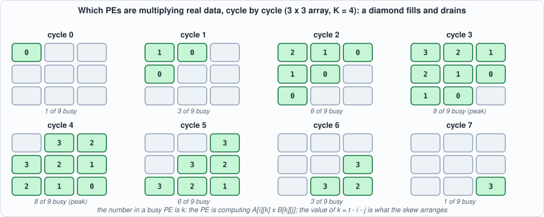
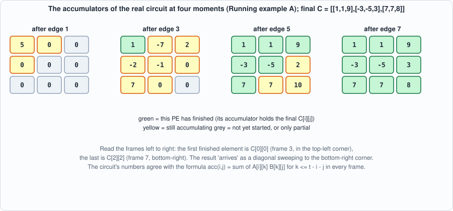
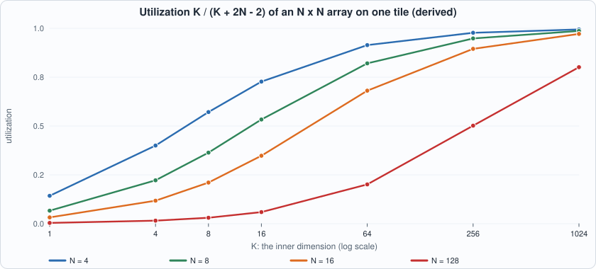
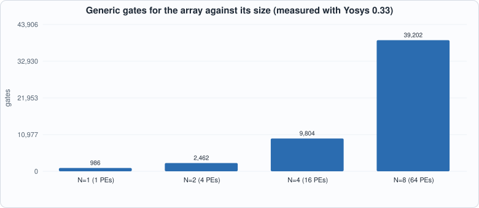
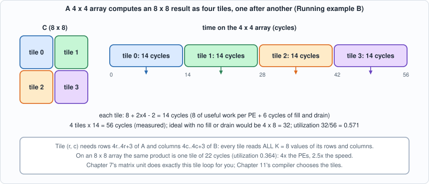

# 4. The Systolic Array: N x N Multiplies Per Cycle, and the Schedule That Makes It Work


--8<-- "docs/assets/art/ch-04.md"


**What you will understand:** how a grid of multiply-accumulate units computes a whole matrix product without anyone ever fetching a value twice. You will build an output-stationary systolic array in Verilog (any size N), see the exact cycle on which each product happens, derive its utilization from the schedule, check the circuit against ordinary matrix multiplication for six array shapes in two simulators, and break it sixteen ways to see whether the tests notice.

**What you need to know first:** Chapter 2 (the MAC) and Chapter 3 (int8 and the int32 accumulator).

**What this chapter builds:** `rtl/systolic.v` (the PE and the N x N array), `model/systolic_model.py` (the answer key and the wavefront printer), `tb/systolic_tb.v` (the self-checking testbench), `tools/mut_ch04.py` (mutation), and for the running examples `tb/systolic_trace_tb.v`, `tb/systolic_tiles_tb.v`, `tools/ch04_example_a.py`, `tools/ch04_example_b.py`.

## The bottleneck a systolic array removes

One output element of a matrix product is a dot product of K pairs. With the Chapter 2 MAC we could compute one pair per clock cycle, and an N x N result of inner length K would take N x N x K cycles. We can do better by using many MACs at once; the question is how to *feed* them.

Here is the trap. If every MAC is wired to a memory that supplies its two operands every cycle, then N x N MACs need 2 x N x N operand reads per cycle. Memories cannot do that: a typical on-chip memory delivers one or two words per port per cycle. The arithmetic is cheap and the **data movement** is the cost. That is true on every modern chip, and it is why a matrix unit is organized the way this chapter shows.

The key observation is that the same number is used many times. In `C = A x B`, the value `A[i][k]` is needed by *every* column j of C (N different outputs), and `B[k][j]` by every row i. If a value is read from memory once and then passed from PE to PE, each memory read can feed N multiplications instead of one. A systolic array is the layout that makes that passing automatic.

## The idea

A matrix product `C = A x B` with `A` of size N x K and `B` of size K x N needs `N * N * K` multiply-accumulates. A naive processor fetches an `A` value and a `B` value from memory for every one of them. A **systolic array** (the name is from the heart: data pulses through rhythmically) avoids that:

- There is one **processing element (PE)** per output element: PE(i,j) owns `C[i][j]` and keeps its partial sum in its own accumulator. That is why this layout is called **output-stationary**: the outputs stay still, the inputs move.
- Row `i` of `A` enters PE(i,0) from the left, and every PE hands the `a` value it just used to its right neighbour (through a register). Column `j` of `B` enters PE(0,j) from the top and moves down the same way.
- Each value is read from memory **once** at the edge and then used N times by N different PEs, each one on a different output element.


*Figure 4.1: one PE. The MAC from Chapter 2 plus a register for `a` (to the right) and one for `b` (downwards).*


*Figure 4.2: the 3 x 3 array. Orange arrows carry values of A to the right, purple arrows carry values of B downwards; each green label is the output element that PE owns.*

For PE(i,j) to multiply the right pair, `A[i][k]` and `B[k][j]` must arrive on the same cycle. The trick is to **skew** the inputs: delay row `i` of `A` by `i` cycles and column `j` of `B` by `j` cycles. Then `A[i][k]` reaches PE(i,j) at cycle `k + i + j`, and so does `B[k][j]`. In the circuit below that is nothing but registers; the skew is applied by whoever feeds the edges (in this chapter the testbench, in Chapter 7 the sequencer).

**Check it by hand.** `A[i][k]` enters at the left edge of row i at cycle `k + i` (the row delay i). It then moves one PE to the right per clock, so it reaches column j after j more cycles: cycle `k + i + j`. `B[k][j]` enters the top of column j at cycle `k + j`, moves down one PE per cycle, and reaches row i at cycle `k + j + i`. Both arrive at the same time, in every PE, for every k. Skewing is what makes the two streams meet.


*Figure 4.3: the wavefront for a 3 x 3 array and K = 4. The number in a busy PE is k, the index of the product it is computing. The busy region is a diamond: one PE at the start, eight of nine at the peak, one at the end.*

## The circuit: `rtl/systolic.v`

```verilog
--8<-- "rtl/systolic.v"
```

**Commentary.** `pe` is a MAC with two pass-through registers: on every clock edge it adds `a_in * b_in` to `acc` *and* copies `a_in` to `a_out` and `b_in` to `b_out`, so each neighbour sees the value one cycle later. That one-cycle delay per hop is exactly the skew arithmetic above. `systolic` `systolic` is two nested `generate` loops that wire PEs into a grid: `aw[i][j]` is the `a` value entering PE(i,j) from the left (and leaving PE(i,j-1)), `bw[i][j]` the `b` value entering from above. `clr` clears the accumulators **and** the pass-through registers, because values left in the pipeline from the previous product would otherwise be multiplied into the next one. There is no enable: a zero fed to a PE adds zero.

## The answer key and the wavefront: `model/systolic_model.py`

```python
--8<-- "model/systolic_model.py"
```

The key is plain matrix multiplication in exact integers; it shares no code and no structure with the circuit. The file also prints the **wavefront**: which PEs are working in each cycle and on which `A[i][k] * B[k][j]`.


*Figure 4.4: the accumulators of the real circuit (Running example A) at four moments. The results finish diagonally, from the top-left PE to the bottom-right.*

## The testbench: `tb/systolic_tb.v`

```verilog
--8<-- "tb/systolic_tb.v"
```

The testbench applies the skew itself, runs exactly `K + 2N - 2` cycles and then compares all `N * N` accumulators. Reading at exactly that cycle is part of the test: a version of the circuit with an extra pipeline register would have unfinished sums at that point, and a version that finished earlier would be producing wrong sums.

## Running it

```python
--8<-- "tools/ch04_run.py"
```

**Output (cloud sandbox -- live-executed; Icarus Verilog 12.0, Verilator 5.020, Yosys 0.33)**

```text
--8<-- "out/ch04_run_out.txt"
```

### Reading it

- **The wavefront is a diamond.** The array fills diagonally (one PE busy in cycle 0, 8 of 9 in cycles 3-4) and drains the same way. For 3 x 3 PEs and K = 4 that is 36 multiply-accumulates in 8 cycles, utilization 0.5.
- **Utilization = K / (K + 2N - 2).** This is derived from the schedule: each PE does exactly K useful MACs, and the product takes `K + 2N - 2` cycles because the last PE, PE(N-1,N-1), starts only at cycle `2N - 2`. The Python model counts the busy PEs cycle by cycle and agrees: 0.400 for N=4, K=4; 0.914 for N=4, K=64; 0.821 for N=8, K=64. **Small matrices waste an array**, and long inner dimensions amortize the fill and drain. This single formula is why Chapter 9 will batch requests.


*Figure 4.5 (derived from the formula): utilization against the inner dimension K. The larger the array, the longer the inner dimension needed to keep it busy: a 128 x 128 array is at 20% for K = 64.*
- **All six array shapes pass in both simulators**, including non-square products (K different from N, so a transposed or swapped index shows up), K = 1 (almost all pipeline), and N = 8 with K = 33 (47 cycles).
- **Cost is linear in the number of PEs.** About 612 generic gates per PE (39,202 for N=8), 44 flip-flops per PE on average (the 32-bit accumulator plus the two 8-bit pass-through registers, less the unused ones at the edges). The single-PE case (N=1) came out larger per PE (986 gates); the author did not investigate why, and the figure is reported as measured. *(Yosys 0.33 default flow; iCE40 cells are for an FPGA and the figures say nothing about timing or about a real chip's area.)*


*Figure 4.6 (measured): the gate count grows with the number of PEs, i.e. with N squared.*

## Running example A: watch the diamond on the real circuit

*The point of this example:* Figure 4.3 is a picture of the schedule. This example runs the actual Verilog and shows that the accumulators evolve exactly as that picture says. The testbench `tb/systolic_trace_tb.v` multiplies a 3x4 matrix `A` by a 4x3 matrix `B` (small numbers, so that you can check by hand), applies the skew, and prints all nine accumulators after every clock edge. `tools/ch04_example_a.py` then compares each frame with a formula derived from the schedule alone: the accumulator of PE(i,j) after edge t holds the sum of `A[i][k] * B[k][j]` over all `k <= t - i - j`.

```verilog
--8<-- "tb/systolic_trace_tb.v"
```

```python
--8<-- "tools/ch04_example_a.py"
```

To compile and run: `python3 tools/ch04_example_a.py` (it needs `iverilog` only).

**Output (cloud sandbox -- live-executed)**

```text
--8<-- "out/ch04_example_a_out.txt"
```

**Walkthrough.**

1. *Edge 0.* Only PE(0,0) has received data, so only it moves: `1 x 1 = 1`. Every other accumulator stays 0 because zeros are being fed to the rest of the array.
2. *Edge 1.* PE(0,0) adds `A[0][1] x B[1][0] = 2 x 2 = 4`, so 1 + 4 = 5. The first values of `A` and `B` have reached the neighbours, but their products are still in flight; the accumulators of PE(0,1) and PE(1,0) are still zero because the *second* register stage has not delivered yet.
3. *Edge 2.* Six PEs have started. For instance PE(2,0) holds 5: it just computed `A[2][0] x B[0][0] = 5 x 1`. PE(0,2) holds 2 = `A[0][0] x B[0][2] = 1 x 2`.
4. *Edge 3.* PE(0,0) finishes (its fourth product, `4 x (-1) = -4`, takes 5 down to 1). The first output element `C[0][0] = 1` is final; the other PEs are partway through their sums (PE(1,1), for instance, is on its second product).
5. *Edges 4 to 6.* The finished region grows as a diagonal band toward the bottom-right. PE(2,2) finishes last, at edge 7 = `i + j + K - 1 = 2 + 2 + 3`, the exact cycle the formula gives. Total: K + 2N - 2 = 8 edges (0 to 7).
6. *Edges 8 and 9.* The values hold, because zeros keep being fed and `acc + 0 x 0` changes nothing. This is why `systolic.v` needs no `en` input.
7. *The check.* All ten frames match the closed-form prediction, and the final accumulators equal `C = A x B` computed in Python: `[[1, 1, 9], [-3, -5, 3], [7, 7, 8]]`. Hand-check `C[0][0]`: 1x1 + 2x2 + 3x0 + 4x(-1) = 1.

## Running example B: a matrix bigger than the array

*The point of this example:* real matrices are larger than the array. A 4 x 4 array cannot hold an 8 x 8 result, so the product is cut into **tiles** and the tiles are computed one after another. This example does it on the real circuit, stitches the four 4 x 4 results into an 8 x 8 matrix, and compares with the product computed in Python; then it repeats the product on an 8 x 8 array, and compares the two in cycles.

```verilog
--8<-- "tb/systolic_tiles_tb.v"
```

```python
--8<-- "tools/ch04_example_b.py"
```

To compile and run: `python3 tools/ch04_example_b.py` (it needs `iverilog`; runs in a few seconds).

**Output (cloud sandbox -- live-executed)**

```text
--8<-- "out/ch04_example_b_out.txt"
```


*Figure 4.7: the tile loop. Each tile uses 8 + 2 x 4 - 2 = 14 cycles; four of them take 56.*

**Walkthrough.**

1. *Tiling.* The 8 x 8 result C has four 4 x 4 corners. Tile `(r, c)` needs rows `4r..4r+3` of `A` (a 4 x 8 slice) and columns `4c..4c+3` of `B` (an 8 x 4 slice): both with the *full* inner length K = 8. Because the inner dimension stays whole, every tile is a complete product and tiles never need to be added together. (Splitting K as well is possible and is a different design, Chapter 7's `MM` accumulation.)
2. *The measured result.* The four tiles are run back to back on the circuit; the stitched 8 x 8 matrix equals the Python product (`True`). The testbench counts the cycles it drives: 4 tiles x 14 = 56. *(That count is by construction `K + 2N - 2` per tile; the measurement is that the circuit is **correct** when read after exactly that many cycles, which is what `systolic_tb` also checks.)*
3. *Utilization.* 512 multiply-accumulates in 56 cycles on 16 PEs: 512 / (56 x 16) = 0.571. A perfect array would need 512 / 16 = 32 cycles; the extra 24 are the fill and drain (6 per tile).
4. *A bigger array is not proportionally faster.* The 8 x 8 array does the whole product as one tile in 22 cycles (2.5 times faster with four times the PEs) at 0.364 utilization. For small K the fill and drain dominate.
5. *The table.* From the formula `K / (K + 2N - 2)`: a 4 x 4 array at K = 1024 is 99% busy, a 128 x 128 one 80%. Real accelerators avoid wasting the fill and drain by **overlapping** one tile's drain with the next tile's fill. This model does not (Chapter 7's matrix unit runs one tile at a time), which makes its cycle counts slightly pessimistic for long runs. That is a design simplification worth knowing about, not a hidden flaw.

## Testing the tests

```python
--8<-- "tools/mut_ch04.py"
```

**Output (cloud sandbox -- live-executed)**

```text
--8<-- "out/ch04_mutation_out.txt"
```

All 16 broken arrays are caught, in both shapes (3 x 3 with K=5, and 4 x 4 with K=7). The list covers the three places an array goes wrong: the arithmetic in the PE (subtraction, unsigned, 16-bit truncation, double counting), the pass-through (a or b not passed, b replaced by a, passed to the wrong neighbour), and the plumbing (rows or columns entering in reverse, the top edge wired to the wrong bus, the result transposed), plus the three `clr` variants (accumulator not cleared, either pass-through register not cleared). The `clr` mutants are the interesting ones: they only fail on the **second** and later products, because stale values are only left behind once a product has run. A test that does one product per power-up would miss all three.

One mutant survives and is an **equivalent mutant**: writing the sum as `a_in * b_in + acc` instead of `acc + a_in * b_in`. Addition commutes; the synthesized circuit is the same.

## Common mistakes

- **Applying the skew to only one operand.** If `A` is skewed and `B` is not, `A[i][k]` and `B[k][j]` meet at different cycles for different (i, j) and the products are paired wrongly. The result is a plausible-looking matrix that is simply not `A x B`. The mutants "b replaced by a" and "rows or columns in reverse" are of this family.
- **Reading the result one cycle early or late.** Exactly `K + 2N - 2` cycles after the first input. One early and the bottom-right PE is missing its last product; one late is harmless *only* if zeros are being fed, which is true here but must be arranged in a pipeline that also changes inputs.
- **Forgetting that `clr` must clear the pass-through registers too.** The previous product's last values are still in flight when it ends. Clearing only the accumulators leaves stale `a` and `b` values that are multiplied into the next product (all three `clr` mutants).
- **Confusing the two dimensions.** `A` is N x K and `B` is K x N; the array side N is *not* the inner dimension K. A test with only K = N cannot see a transposed or swapped index; the six shapes include K != N for this reason.
- **Quoting peak throughput as real throughput.** N x N MACs per cycle is the peak; the real number is peak x utilization, and the formula gives the utilization for one tile.
- **Assuming an array is as good at small sizes as large.** See Figure 4.5.

## What this chapter does and does not establish

- **Correct**: for six shapes (N=2..8, K=1..33) the circuit computes exactly the integer matrix product, on directed corners (zeros, the largest possible sums, an identity, a patterned matrix) and random int8 matrices, back to back with `clr` between products.
- **Not covered**: accumulator overflow (K never reaches 2^16 here), timing, and non-square arrays (N x M). An array that is not square is a different design.
- **The cycle counts are the model's.** The wall-clock time of one product is the cycle count divided by a clock frequency this book never measures.

## Chapter summary

A systolic array puts a MAC at every output element, streams skewed rows of A and columns of B through it, and finishes after `K + 2N - 2` cycles with utilization `K / (K + 2N - 2)`. The Verilog is two small modules; the schedule is the design. The circuit matched the golden model on six shapes in two simulators, and all 16 mutants were caught, including the three `clr` bugs that only show on a second product.

## Self-check questions

1. At which cycle does PE(2,1) multiply `A[2][3]` by `B[3][1]`?
2. Derive the number of cycles for a K-long product on an N x N array, and the utilization for N = 4, K = 4.
3. Why does `clr` also clear the pass-through registers? Which mutants show it?
4. A tester runs one matrix product per simulation, starting from reset. Which of the 16 mutants would it miss?
5. A 128 x 128 array (as in a commercial matrix unit) multiplies matrices with K = 64. What is the utilization, and what does that suggest about small batches?
6. In Running example A, PE(1,2) holds 2 after edge 5 and 3 after edge 6. Which products of `A[1][k] x B[k][2]` does that correspond to? (Use A[1] = [0, -1, 2, 1] and column 2 of B = [2, 0, 1, 1].)
7. A 4 x 4 array multiplies a 4 x 16 matrix by a 16 x 4 matrix. How many cycles does it take, and what is the utilization? The same 256 multiply-accumulates could instead be done as sixteen separate products with K = 1: how many cycles would that take, and what does the comparison say?
8. Tile (1, 0) of Running example B needs which rows of `A` and which columns of `B`?

## Exercises

1. **Change the matrices.** Edit `A` and `B` in `tb/systolic_trace_tb.v` and in `tools/ch04_example_a.py` (they must match), run it, and confirm the circuit and the prediction still agree frame by frame.
2. **A non-square case.** Make the array 3 x 3 but the product 3 x 6 by 6 x 3 (K = 6). Predict the cycle count and when PE(2,2) finishes; check with the wavefront printer (`python3 model/systolic_model.py --wave 3 6`).
3. **Overlap the tiles.** Suppose the array could start tile n+1's fill while tile n drains. For the 4-tile, K = 8 product on 4 x 4, what is the best possible total cycle count, and what utilization does that give? (This is derived, not simulated: it needs a different feed schedule.)
4. **Break the skew.** Remove the delay on `B` in `systolic_trace_tb.v` (feed `B[t][i]` instead of `B[t - i][i]`) and watch what the accumulators do. Which entries of the final matrix are still correct, and why?
5. **Pick an array.** For a workload whose inner dimension is K = 64, and a budget of 64 PEs, compare one 8 x 8 array with four 4 x 4 arrays working on different tiles. Which finishes an 8 x 8 output sooner? (Hint: use the formula and the tiling example.)

