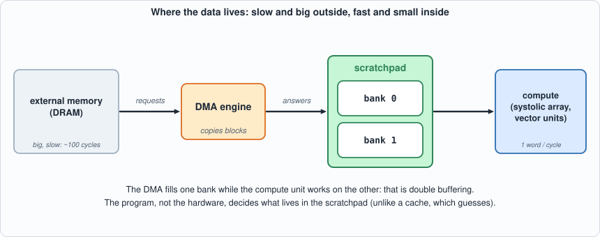
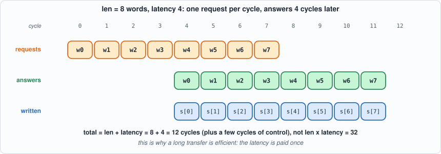
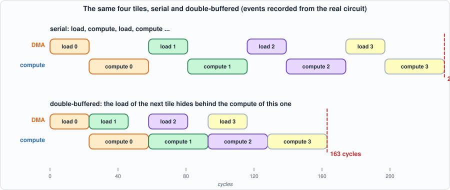
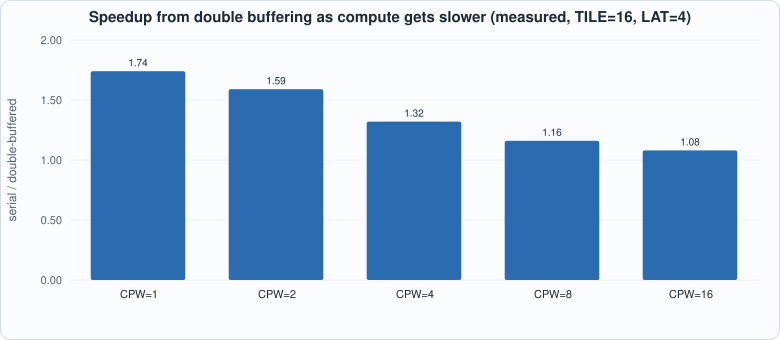
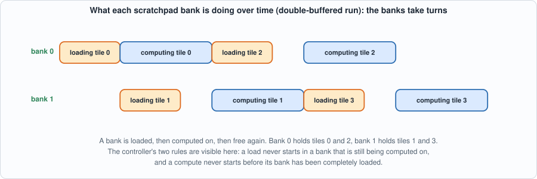
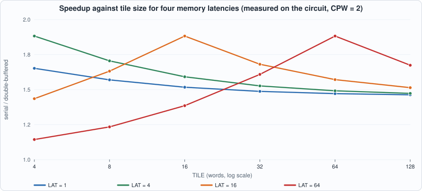

# 5. The Scratchpad, the DMA Engine, and Double Buffering


--8<-- "docs/assets/art/ch-05.md"


**What you will understand:** why an accelerator has its own small memory instead of a cache, how a DMA engine moves data without the compute units waiting on it, and how **double buffering** hides memory latency behind arithmetic. You will build all three, derive the cycle count of the whole stream as a formula, check the formula against the circuit to the cycle on eight shapes, and see which shapes of test are needed to catch the bugs in the controller.

**What you need to know first:** Chapters 1-4. No new arithmetic: this chapter is about *time*. Appendix F (memory systems and DRAM) gives the background on why memory is slow.

**What this chapter builds:** `rtl/sram.v` (the scratchpad), `rtl/dma.v` (the DMA engine), `rtl/dbuf.v` (the double-buffering controller), `model/dbuf_gold.py` (answer key and schedule model), `tb/extmem.v` and `tb/dbuf_tb.v` (the external-memory model and the testbench), `tools/mut_ch05.py` (mutation), and for the running examples `tb/dbuf_trace_tb.v`, `tools/ch05_example_a.py`, `tools/ch05_example_b.py`.

## The problem: compute is fast, memory is slow

The systolic array of Chapter 4 consumes new operands every cycle. External memory (DRAM) answers a request only many cycles later (its **latency**), though it can accept a new request every cycle (it is *pipelined*). If the array asks for data and waits, it spends most of its life waiting. The accelerator therefore has:

- a **scratchpad**: a small on-chip memory the *program* manages explicitly (unlike a cache, which guesses). Its read takes one cycle, always.
- a **DMA engine** (direct memory access): a little state machine that copies a block from external memory into the scratchpad on command, so nothing else has to be involved.
- a **controller** that overlaps the two: while the compute unit works on the tile in one half of the scratchpad, the DMA fills the other half with the next tile. That is **double buffering**.


*Figure 5.1: the four parts. Slow and large on the left, fast and small on the right; the DMA engine is the only thing that talks to DRAM.*

An analogy: a cook (the compute unit) works at a counter (the scratchpad); the pantry is down the hall (DRAM). A bad cook walks to the pantry for each ingredient. A good one has an assistant (the DMA) who keeps the counter stocked: the cook works on this dish while the assistant fetches the ingredients for the next. Double buffering is two counter areas, one being used and one being stocked. The assistant makes one trip carrying a whole tray, not one trip per ingredient, because the walk is the expensive part.

## The scratchpad: `rtl/sram.v`

```verilog
--8<-- "rtl/sram.v"
```

One write port, one read port, synchronous read: the address goes in, the data comes out *next cycle*. If a read and a write hit the same address in the same cycle, the read returns the old value. The controller below is designed so that it never relies on that.

## The DMA engine: `rtl/dma.v`

```verilog
--8<-- "rtl/dma.v"
```

On `start` it remembers a source address, a destination and a length. Every cycle it issues the next request; every answer, which arrives `LAT` cycles later, is written to the scratchpad at the next destination address. When the last answer is written it pulses `done`. Because requests are pipelined, a transfer of `len` words takes about `len + LAT` cycles, not `len * LAT`.


*Figure 5.2: a pipelined transfer. Requests go out in cycles 0-7, answers come back in cycles 4-11. The latency is paid once, at the start, not once per word.*

## The controller: `rtl/dbuf.v`

```verilog
--8<-- "rtl/dbuf.v"
```

The controller streams `T` tiles of `TILE` words, adds up each tile (a stand-in for "compute": one word every `CPW` cycles, so `CPW` says how slow the arithmetic is relative to the memory) and reports each sum. Two rules do all the work:

- *A load of tile `n` into bank `n % 2` may start when that bank is empty* (and, in serial mode, when nothing at all is full or computing).
- *A bank becomes empty only when the compute on it has finished*, so a load can never overwrite data that is still being read.

With `dbl = 0` the second clause of the first rule makes it serial: load, compute, load, compute. With `dbl = 1` the load of tile `n+1` runs during the compute of tile `n`.

**Commentary.** Read `dbuf.v` as three small state machines side by side. The *DMA side* (`can_load`) decides when to start a transfer and marks the bank full when `d_done` arrives. The *compute side* (`can_comp`) starts a tile when its bank is full, reads one word per `CPW` cycles through the scratchpad's one-cycle-late read port (`rd_v` is that delay), and finishes after a `drain` cycle. The *two bits `full[1:0]`* are the only communication between them, which is why the safety of the whole design reduces to the two rules above. Notice that nothing in the file mentions double buffering by name: the single input `dbl` just removes one condition from `can_load`.

## The schedule model: `model/dbuf_gold.py`

```python
--8<-- "model/dbuf_gold.py"
```

The answer key has two parts. The sums are exact (mod 2^32; tile 0 is all ones so the sum wraps). The cycle counts come from a **schedule model**, which is derived from the picture of the pipeline:

- loading one tile takes `L = TILE + LAT + L0` cycles (one request per word, then wait for the last answer);
- computing it takes `C = TILE * CPW + C0`;
- serial: `T * (L + C)`;
- double-buffered: `L + (T - 1) * max(L, C) + C`. The first load cannot be hidden, the last compute cannot be hidden, and in between **the slower of the two sets the pace**.


*Figure 5.3: the effect of the one-bit difference between the two modes. Serial: 232 cycles. Double-buffered: 163 cycles. The compute of tile 1 starts the cycle after the compute of tile 0 ends; only the first load is exposed.*

*How much of this is derived and how much measured?* The two formulas are derived. The four small constants `L0, C0, S0, D0` are controller handshake overheads, which a diagram cannot give; they were read from the first shape and then fixed. Every other shape is therefore a prediction, and the testbench fails if a prediction is off by even one cycle.

## The testbench and the run

```verilog
--8<-- "tb/extmem.v"
```

```verilog
--8<-- "tb/dbuf_tb.v"
```

`extmem` models DRAM: a request is accepted every cycle and the answer appears `LAT` cycles later. The testbench runs the same stream twice, serial and double-buffered, and checks four things: every tile sum, the number of sums, the number of cycles against the schedule model, and the number of words requested from external memory (exactly `T * TILE`).

```python
--8<-- "tools/ch05_run.py"
```

**Output (cloud sandbox -- live-executed; Icarus Verilog 12.0, Verilator 5.020, Yosys 0.33)**

```text
--8<-- "out/ch05_run_out.txt"
```

### Reading it

- **All eight shapes pass in both simulators, to the cycle.** They include a load-bound stream (memory slower than compute), compute-bound ones, a latency of 1 and of 30, a single tile (where double buffering cannot help: 34 cycles either way, as the model says) and a wrapped sum.
- **Double buffering helps most when load and compute are balanced.** The sweep (measured in simulation) goes from 1.74x faster at `CPW=1`, where the two times are close (L=23, C=19), down to 1.08x at `CPW=16`, where the compute is eleven times the load and there is little to hide. The best possible gain is 2x: when `L = C`, the total halves. Beyond that, the stream runs at the speed of the slower side, and no amount of overlap makes the slower side faster.

*Figure 5.4 (measured): the gain shrinks as compute gets slower than the load, because there is less load to hide.*

- **The scratchpad costs memory, not logic.** In the generic gate count the 256 x 32-bit memory becomes thousands of flip-flop-equivalent gates (17,750 for the whole block); mapped to an FPGA, the same memory becomes **2 block RAMs** and the logic is only 762 cells. A real chip would use a memory compiler's SRAM macro. The DMA engine on its own is small (227 gates), as is the whole control. *(Measured by Yosys; area and timing of a real SRAM are not measured here.)*

## Running example A: see the overlap on the real circuit

*The point of this example:* Figure 5.3 is only convincing if it is drawn from the actual circuit. `tb/dbuf_trace_tb.v` runs the controller and prints the cycle at which every load and every compute starts and finishes, by looking at the controller's own decision signals (`can_load`, `d_done`, `can_comp`, `c_finish`). `tools/ch05_example_a.py` runs it twice, serial and double-buffered, tabulates the events, draws a text timeline, and checks the totals against the schedule model.

```verilog
--8<-- "tb/dbuf_trace_tb.v"
```

```python
--8<-- "tools/ch05_example_a.py"
```

To compile and run: `python3 tools/ch05_example_a.py` (it needs `iverilog`).

**Output (cloud sandbox -- live-executed)**

```text
--8<-- "out/ch05_example_a_out.txt"
```


*Figure 5.5: the two banks in the double-buffered run. Bank 0 holds tiles 0 and 2, bank 1 holds tiles 1 and 3, and each is loaded while the other is computed on.*

**Walkthrough.**

1. *Serial.* Tile 0 loads for cycles 0-22 and computes for 23-57, tile 1 loads from 58: each stage waits for the previous. Four tiles take 4 x (23 + 35) = 232 cycles, exactly what the formula says. The timeline shows the DMA idle while compute works and the reverse.
2. *Double-buffered.* The load of tile 1 starts at cycle 23, the same cycle the compute of tile 0 starts, and overlaps it entirely (it needs 23 of the 35 cycles). From then on the compute unit never waits: tile 1's compute starts at 58, the cycle after tile 0's finishes. Total: 23 + 3 x 35 + 35 = 163 cycles. The first load (23 cycles) is exposed and nothing can hide it.
3. *Why the DMA idles.* Compute (35) is slower than load (23), so the DMA has spare time. Load 2 does not start at cycle 46, when load 1 ends; it starts at 58, when compute 0 finishes and bank 0 becomes empty. This is rule 2 at work: a bank is free only when the compute on it has finished. The DMA is waiting for the compute, not the other way round.
4. *Model versus circuit.* The measured durations count 23 and 35 cycles when both the first and last cycle are included, matching `L = TILE + LAT + 3` and `C = TILE x CPW + 3`. The totals, 232 and 163, agree with the model exactly.

## Running example B: how big must a tile be to hide the latency?

*The point of this example:* in practice the latency of the memory is a given, and the tile size is a choice. This example asks the design question directly. For four memory latencies (1, 4, 16 and 64 cycles) and six tile sizes (4 to 128 words), the *real circuit* is run serial and double-buffered, and the measured speedups are compared with a formula derived from the schedule.

```python
--8<-- "tools/ch05_example_b.py"
```

To compile and run: `python3 tools/ch05_example_b.py` (it needs `iverilog`; 24 runs, a few seconds each).

**Output (cloud sandbox -- live-executed)**

```text
--8<-- "out/ch05_example_b_out.txt"
```


*Figure 5.6 (measured): each curve peaks at 1.88 where the tile size equals the latency (the break-even point, where load and compute take equally long) and falls on either side.*

**Walkthrough.**

1. *The derived rule.* Double buffering hides the load completely when the compute of a tile takes at least as long as the load of the next: `C >= L`, i.e. `TILE x CPW + 3 >= TILE + LAT + 3`, i.e. `TILE >= LAT / (CPW - 1)`. For `CPW = 2` that is `TILE >= LAT`. The last column of the table lists it.
2. *The measurement agrees.* Each curve in Figure 5.6 peaks at its break-even tile: 1.88 at `TILE = 4` for `LAT = 4`, at 16 for `LAT = 16`, and at 64 for `LAT = 64`. (`LAT = 1` peaks below 4, outside the swept range.) Left of the peak the load is the bottleneck: the pace is set by the DMA and double buffering can only overlap the compute. Right of the peak the compute is the bottleneck, and the gain tails off because there is less load left to hide.
3. *The practical lesson.* A slow memory is not a reason to give up on overlap; it is a reason to use bigger tiles. With a latency of 64, a tile of 4 words is nearly useless (speedup 1.14), and one of 64 words is nearly ideal (1.88). The cost is scratchpad space: two banks of 64 words is 128 words, which is why the scratchpad has the size it has.
4. *The limit.* The speedup can never exceed 2: the two stages are at best equal, and the stream then takes half the serial time. Anything beyond that would need a faster compute unit or a faster memory.

## Testing the tests

```python
--8<-- "tools/mut_ch05.py"
```

**Output (cloud sandbox -- live-executed)**

```text
--8<-- "out/ch05_mutation_out.txt"
```

All 20 broken circuits are caught, but the table has a lesson in its right-hand column. Two mutants are caught by **only one of the two test shapes**:

- *"A load may overwrite a bank that is still full"* is not caught by the load-bound shape (16 words, `CPW=1`): there the load is the slow side, so by the time the controller wants to load into a bank, compute has long emptied it, and the missing guard is never needed. (This is reasoning from the schedule, which is consistent with the result, rather than something separately measured.) It is caught by the compute-bound shape, where the DMA is ready long before the bank is free and the missing guard lets it overwrite data still being read.
- *"A word is read in the first cycle of its slot"* changes nothing when `CPW = 1`: the first and last cycle of a one-cycle slot are the same cycle. At `CPW=4` they are not, and the timing check sees it.

A test suite that used only the first shape would have passed both bugs. **The shape of the test has to cover the regime in which each rule matters.** That is why this chapter's testbench is run for eight shapes and the mutation run uses one load-bound and one compute-bound shape. Nothing survived, and no equivalent mutants were found in this circuit.

## Common mistakes

- **Marking a bank empty when compute starts.** The data is still being read; a load that arrives early overwrites it. The compute-bound test shape catches this.
- **Assuming serial equals double-buffered for a single tile.** With one tile there is nothing to overlap (34 cycles either way). Double buffering helps *streams*.
- **Measuring only the shape that is easy to pass.** In the load-bound regime a missing "bank full" guard can never trigger, so a test suite that runs only that shape passes a broken design (see the two mutants above).
- **Using a tile that is too small for the latency.** The speedup at LAT = 64 is 1.14 for 4-word tiles and 1.88 for 64-word ones. Tile size is a design parameter set by the memory, not by taste.
- **Forgetting the first load.** The first tile's load cannot be hidden. For short streams that fixed cost dominates (T = 1: no gain at all).
- **Trusting a cycle count that was read off, not predicted.** Four constants of the schedule model were read from the first shape; the other seven shapes (and the 24 runs of Example B) are the real test.

## What this chapter does and does not establish

- **Correct**: the sums for all eight shapes, and the controller's rules, as far as the 20 mutants probe them.
- **A model, not a memory system.** The external memory has a fixed latency and unlimited bandwidth for one word per cycle; real DRAM has banks, row buffers, refresh, and contention. The conclusions about *overlap* hold; the cycle counts do not carry over.
- **Only one tile in flight per bank.** More general schemes (three buffers, strided or 2-D transfers) are not covered.

## Chapter summary

A scratchpad is a software-managed on-chip memory; a DMA engine fills it without the compute units waiting; double buffering overlaps the next load with the current compute. The stream's time is `L + (T-1) * max(L, C) + C`, so overlapping can at best halve the time and only when load and compute are balanced. The circuit matched this to the cycle on eight shapes, and two controller bugs were visible to only one of the two kinds of test shape.

## Self-check questions

1. For `TILE = 16`, `LAT = 4`, `CPW = 2` the model gives L = 23 and C = 35. Compute the serial and double-buffered cycles for T = 6 tiles (with S0 = D0 = 0), and check them against the run.
2. Why can double buffering never give a speedup of more than 2x?
3. Why must a bank be marked empty when the compute *finishes* and not when it starts?
4. Which of the two bugs that only one shape caught would also be missed by a testbench that runs only the serial mode?
5. A real DRAM has a latency of about 100 cycles and returns 64 bytes per request. What would you change in the DMA engine so that a tile of 1 KB is loaded efficiently?
6. For TILE = 32, CPW = 2, LAT = 16, compute L and C and say which sets the pace. For 16 tiles, what are the serial and double-buffered cycle counts and the speedup? (Check with the table in Running example B.)
7. For LAT = 64 and TILE = 16, who sets the pace? What is the smallest TILE (for CPW = 2) that makes the compute the bottleneck?
8. In Figure 5.3 (double-buffered), load 2 starts at cycle 58 and not at cycle 46 when load 1 ends. Why?

## Exercises

1. **A different shape.** Run `python3 tools/ch05_example_a.py` after changing `TILE, CPW, LAT, T` at its top to `8, 3, 20, 5`. Before you do, predict L, C, both totals and who sets the pace. Does the circuit agree?
2. **Draw your own Gantt chart.** Using the formulas only, draw (on paper) the double-buffered timeline for T = 3, L = 10, C = 6. Where is the DMA idle? Then run it with `TILE=4, LAT=3, CPW = ...` choices that give those numbers (L = TILE + LAT + 3, C = TILE x CPW + 3) and compare.
3. **Three banks.** The controller has two banks. If it had three, could the stream be faster when load and compute are balanced? Explain from the schedule why or why not, then think about when a third bank would help (variable load times).
4. **Break the rule.** Change `dbuf.v` so that the bank is marked empty when compute *starts*. Run the testbench and the mutation script: which shape detects it, and what does the wrong output look like?
5. **A wider memory.** Real DRAM returns 64 bytes (16 words) per request. Modify `extmem.v` and `dma.v` so one request returns 4 words. What happens to L, and how does the break-even tile size change?

