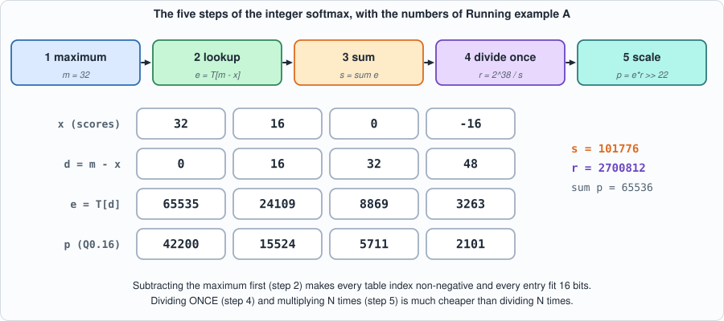
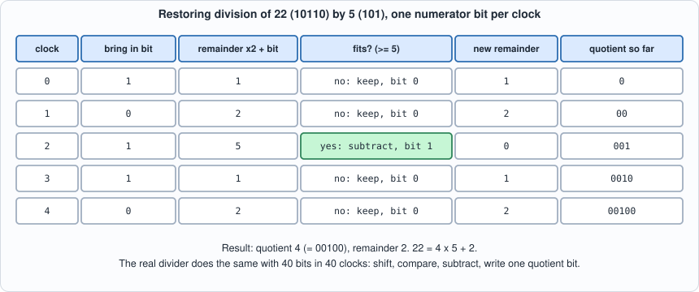
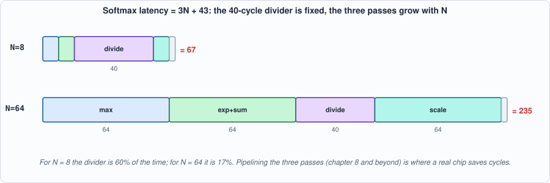
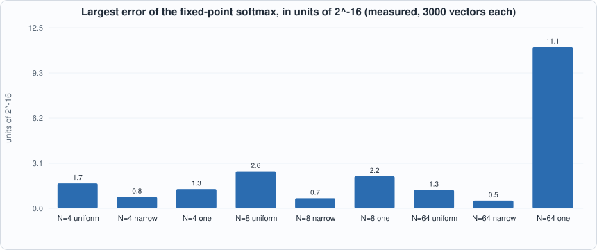
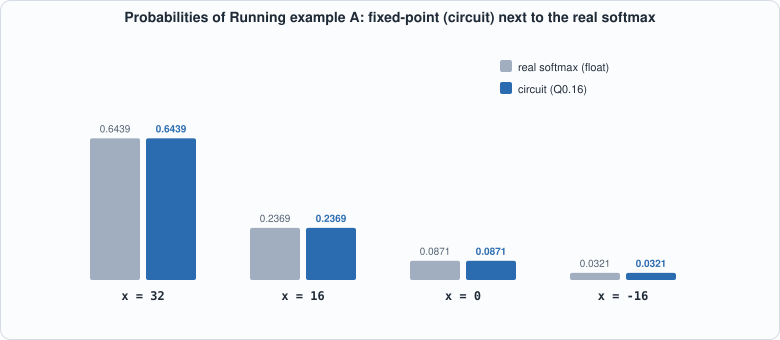
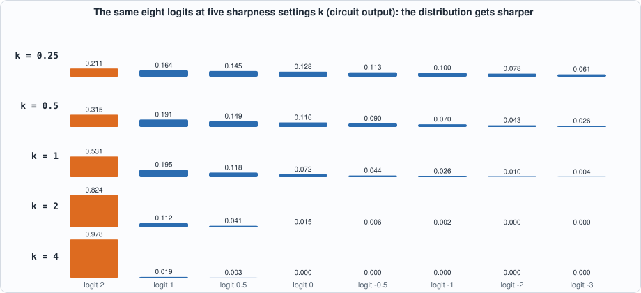

# 6. The Vector Unit: A Lookup-Table Exponential, a Divider, and Fixed-Point Softmax


--8<-- "docs/assets/art/ch-06.md"


**What you will understand:** the part of a transformer that is *not* a matrix product. Attention needs **softmax**, which needs an exponential and a division, and a chip with only integer multipliers must do both in integers. You will build the three pieces (an exp lookup table, a bit-serial divider, and the softmax unit that uses them), check each one against Python **bit for bit**, measure how far the result is from the real softmax, and meet a test that would have passed a bug until a new check was added.

**What you need to know first:** Chapter 3 (fixed-point numbers, scales) and Chapter 5 (cycle-level thinking). Appendix E (transformers and LLM inference) says where softmax sits in a model.

**What this chapter builds:** `tools/gen_exp_lut.py` and `rtl/exp_lut.v` (the exponential table), `rtl/divu.v` (the divider), `rtl/softmax.v` (the unit), `model/softmax_gold.py` (three answer keys), `tb/exp_lut_tb.v`, `tb/divu_tb.v`, `tb/softmax_tb.v`, `tools/mut_ch06.py`, `tools/ch06_study.py`, and for the running examples `tb/softmax_one_tb.v`, `tools/ch06_example_a.py`, `tools/ch06_example_b.py`.

## Why a chip full of multipliers still needs a special unit

Chapters 2 to 5 built the part of the chip that does matrix products. A transformer is not only matrix products. Between the two matrix products of *attention* sits a step that turns a row of scores into a set of weights that are positive and add up to one, so they can be used to average the values. That step is softmax. It appears in every attention head of every layer, once per generated token per row: it is a small fraction of the arithmetic but, as the cycle counts below show, not a small fraction of the *time* unless it is built with care.

The difficulty is that softmax is made of operations a multiplier array cannot do: an exponential and a division. The next sections show how each is replaced by something a chip can do cheaply.

## Softmax, and why it is awkward in hardware

For scores `x_1 ... x_N`, softmax turns them into probabilities:

```text
p_i = exp(x_i) / sum_j exp(x_j)
```

Three things are hard for a small integer chip: `exp` is not a multiply or add; the exponent of a big score overflows any fixed-width number; and the sum needs a division, which is slow and large in hardware. The standard answers:

1. **Subtract the maximum first.** `softmax(x) = softmax(x - max x)`. Now every exponent is `<= 0`, so every `exp` is in `(0, 1]` and fits a fixed-width fraction. This is the same trick floating-point libraries use to avoid overflow.
2. **Look the exponential up in a table.** The scores are int8 (a real number times 16, i.e. Q4.4), so the distance below the maximum `d = max - x` is an integer 0..255. A 256-entry table gives `exp(-d/16)` in 16 bits. No arithmetic.
3. **Divide once, multiply many times.** Compute one reciprocal `r = 2^38 / sum` with a divider, then `p_i = e_i * r` with a multiplier.


*Figure 6.1: the five steps, with the numbers of Running example A. Follow one column: x = 16 gives d = 16, e = 24109, p = 15524, which is 0.2369 of 65536.*

## The table: `tools/gen_exp_lut.py` and `rtl/exp_lut.v`

The table is *generated*, not typed in: entry `d` is `round(65535 * exp(-d/16))`. The generator uses Python's `decimal` module at 50 digits, whereas the golden model uses floating-point `math.exp`, so the circuit's table and the answer key's table come from two different computations and the test fails if they ever disagree.

```python
--8<-- "tools/gen_exp_lut.py"
```

![the exp table T[d] against d, a decaying curve that reaches zero from d = 189](../assets/fig/ch06-table.svg)
*Figure 6.2: the 256-entry table. It falls from 65535 at d = 0 to 7 at d = 188 and is rounded to 0 from d = 189 on.*

The first lines of the generated Verilog (the file has 256 entries; 67 of them are 0, from `d = 189` on, where `exp(-189/16) = 7.4e-6` is below half a unit of 65535):

```text
module exp_lut(input [7:0] d, output reg [15:0] e);
    always @* begin
        case (d)
        8'd0: e = 16'd65535;
        8'd1: e = 16'd61564;
        8'd2: e = 16'd57834;
        ...
```

## The divider: `rtl/divu.v`

```verilog
--8<-- "rtl/divu.v"
```

**Restoring division**, one quotient bit per clock: shift the remainder left, bring in the next bit of the numerator, and if the divisor fits, subtract it and write a 1. It is small, slow (40 cycles for 40 bits) and exactly what a school long division does in binary. Division by zero is *defined* (quotient all ones, remainder = numerator), because hardware cannot raise an exception and an undefined case is a hole in the test.


*Figure 6.3: restoring division in miniature (5 bits instead of 40). Each clock brings in one numerator bit, compares, and either subtracts (quotient bit 1) or keeps (bit 0). After 5 clocks: 22 = 4 x 5 + 2.*

**Commentary.** `shifted` is the remainder moved one place left with the next numerator bit appended; `fits` asks whether the divisor can be subtracted; `r_next` and `q_next` are the two possible outcomes selected by `fits`; `cnt` counts down from W. The module has no data-dependent timing at all: it always takes W cycles, which is what lets a controller schedule around it.

## The softmax unit: `rtl/softmax.v`

```verilog
--8<-- "rtl/softmax.v"
```

A state machine in five steps: find the maximum (N cycles), look up and sum the exponentials (N cycles), start the divider and wait (40+ cycles), then scale each element (N cycles). The output is `N` probabilities in Q0.16, where 65536 means 1.0; `(e_i * r + 2^21) >> 22` includes the rounding constant `2^21`, half of the final unit.

**Commentary.** `softmax` is a state machine with five states (`MAXS`, `EXPS`, `DIVS`, `WAITD`, `MULS`) that visit the stored inputs with one index `idx`. `dfull` is `m - x` for the current element, computed in 9 bits so it cannot go negative once `m` is the maximum; `lut_e` is the table's answer for it. Notice what is *not* here: no per-element division and no floating point; the single `divu` instance runs once, between the second and third passes.

*Why `2^38`?* The sum `s` of the table entries is at least 65535 (the maximum element contributes exactly `exp(0)`) and below `64 * 65535` for up to 64 elements, i.e. under `2^22`. Then `r = 2^38 / s` is between 2^16 and 2^22.01 (23 bits), the product `e_i * r` is under 2^39, and `>> 22` leaves a number up to `2^16 = 65536`: 17 bits. The chapter's study prints these ranges.

## The answer keys: `model/softmax_gold.py`

```python
--8<-- "model/softmax_gold.py"
```

Three answer keys in one file: the table (with `math.exp`), the divider (Python's `//` and `%`, plus the defined divide-by-zero), and the whole softmax in plain integers. The divider cases include corners (dividing by one, by itself, zero numerator, all ones, divisors that just fit and just miss) and random operands of every bit width; the softmax cases include constant vectors, extremes, single outliers, and narrow ranges where exponentials differ by little.

## The testbenches

```verilog
--8<-- "tb/exp_lut_tb.v"
```

```verilog
--8<-- "tb/divu_tb.v"
```

```verilog
--8<-- "tb/softmax_tb.v"
```

Two details worth reading. The divider testbench checks the **number of cycles** as well as the answer: done must arrive exactly 40 cycles after the start, whatever the operands (a fixed-latency unit is what lets a controller schedule around it). And on every odd case it pulses `start` again in the middle of the division, with garbage operands; a divider must ignore that. The softmax testbench checks that every input takes the same number of cycles.

## Running it

```python
--8<-- "tools/ch06_run.py"
```

**Output (cloud sandbox -- live-executed; Icarus Verilog 12.0, Verilator 5.020, Yosys 0.33)**

```text
--8<-- "out/ch06_run_out.txt"
```

### Reading it

- **The table matches on all 256 entries and the divider on all 24,157 cases**, in both simulators, each division in exactly 40 cycles.
- **The softmax unit matches the integer model on every case, for six vector lengths** (1, 2, 5, 8, 16, 64), in both simulators.
- **The cycle count is `3N + 43`**, derived from the structure (three passes over `N` elements, the 40-cycle division, three cycles of control) and confirmed by measurement for all six lengths. Softmax over a 64-long row takes 235 cycles on this unit.


*Figure 6.4: where the cycles go. The divider is a fixed 40-cycle cost; the three passes grow with N.*
 Compare Chapter 4: a 4 x 4 matrix product of K = 64 takes 70 cycles. *Softmax is not free*, and an unpipelined one like this is slow next to the array; Chapter 8 keeps that in mind.
- **Cost (Yosys, generic gates):** the table 442 gates, the divider 769 (249 flip-flops: it carries the 40-bit numerator, quotient and remainder), the whole unit for N=8 about 5,600 gates and 474 flip-flops. The unit stores the inputs and the exponentials in registers, which is why the flip-flops dominate. *(Gate counts only; no timing, no area.)*

## How close is it to the real softmax?

The integer model is checked bit-exact against the circuit; this section asks how it compares with the **mathematical** softmax computed in floating point on `x/16`. These figures are *measured* (3000 random vectors per row, fixed seeds, `tools/ch06_study.py`).

```python
--8<-- "tools/ch06_study.py"
```

```text
--8<-- "out/ch06_study_out.txt"
```

- **The error is a few units in the last place.** For N=8 the largest probability error in the study is `3.9e-05`, 2.6 units of 2^-16. The sum of the probabilities differs from 1 by at most `3e-05` at N=8 and `2e-04` at N=64.
- **The largest error is the case with many tiny terms** (N=64, one big score, 63 small ones): `1.7e-04`, 11 units. This is consistent with the table's rounding (each small entry is rounded to the nearest 1/65535 and everything beyond d = 188 is dropped to zero, which shifts the sum by up to 63 half-units); the study does not isolate the cause further.

*Figure 6.5 (measured): largest error in units of 2^-16. Most families are within 3 units; one big score among 63 small ones reaches 11.*

- **The ordering is always preserved.** Whatever the input, the elements with the largest score get the largest probability (the "argmax kept" column is 1.000 in every row), which is what a greedy language-model decoder uses.
- **Anything more than about 11.8 below the maximum gets probability exactly 0.** That is a property of a 16-bit table, and a deliberate trade: those probabilities are below `7.4e-6`.

## Running example A: one softmax, step by step, on the circuit

*The point of this example:* to compute one small softmax by hand, in the same integers the chip uses, and then check that the circuit gives exactly the same numbers. The scores are `[32, 16, 0, -16]`: real values 2, 1, 0 and -1, in Q4.4 (value times 16).

```verilog
--8<-- "tb/softmax_one_tb.v"
```

```python
--8<-- "tools/ch06_example_a.py"
```

To compile and run: `python3 tools/ch06_example_a.py` (it needs `iverilog`).

**Output (cloud sandbox -- live-executed)**

```text
--8<-- "out/ch06_example_a_out.txt"
```


*Figure 6.6: real softmax (grey) and circuit (blue) for Running example A. The bars are indistinguishable at this scale; the largest difference is 0.44 of a unit of 2^-16.*

**Walkthrough.**

1. *Maximum.* m = 32, the first score.
2. *Distances and lookups.* d = [0, 16, 32, 48], so the table is read at those four indices: 65535, 24109, 8869, 3263. The hand check shows the table is just exp: 65535 x exp(-1) = 24108.98, which rounds to 24109. The scale is 16: a distance of 16 means a real distance of 1.
3. *Sum and one division.* s = 101,776; r = 2^38 / s = 2,700,812. The division is the 40-cycle step and happens once.
4. *Scaling.* Each `e` times `r`, plus half a unit, shifted right by 22: p = [42200, 15524, 5711, 2101]. As a fraction of 65536 these are 0.6439, 0.2369, 0.0871, 0.0321.
5. *The comparison.* The real softmax of (2, 1, 0, -1) is (0.6439, 0.2369, 0.0871, 0.0321). The fixed-point values differ by 0.01 to 0.44 of a unit of 2^-16, i.e. in the sixth decimal digit. The sum of the four is exactly 65536 in this case.
6. *The circuit.* The simulation outputs the same four integers, and takes 55 cycles = 3 x 4 + 43: four to find the maximum, four to look up and sum, 40 for the division, four to scale, three of control.

## Running example B: temperature, and what the table throws away

*The point of this example:* to see two properties of the integer softmax that matter when it is used inside a model. The first experiment runs the real circuit on the same eight logits scaled by five different sharpness factors k (this is how a language model's *temperature* works: dividing the logits by a temperature is multiplying by k = 1/temperature). The second looks at the table's cut-off: what happens when many small scores sit far below the maximum.

```python
--8<-- "tools/ch06_example_b.py"
```

To compile and run: `python3 tools/ch06_example_b.py` (it needs `iverilog`).

**Output (cloud sandbox -- live-executed)**

```text
--8<-- "out/ch06_example_b_out.txt"
```


*Figure 6.7: circuit output at five sharpness settings. At k = 0.25 the distribution is nearly flat (top element 0.21); at k = 4 it is concentrated (top element 0.98).*

**Walkthrough.**

1. *Temperature.* At k = 1 the top probability is 0.531. Scale the logits by 0.25 and it falls to 0.211 (nearly uniform over eight elements would be 0.125). Scale them by 4 and it rises to 0.978. In every row the circuit agrees with the integer model, which is the same function the golden model computes.
2. *The Q4.4 limit.* At k = 4 the first score would be 128 and clips to 127, and the last two scores clip at -128: an int8 score cannot express a distribution sharper than the range allows. This is a consequence of choosing 8-bit scores with scale 1/16; Chapter 11's compiler pins the softmax input scale to exactly that, so a trained network must work within it.
3. *The cut-off.* In the second table there is one big score and 63 small ones at distance d below it. Up to d = 188 the table's entry is not zero (it is 1 at d = 180 and 188). At d = 189 the entry rounds to 0 and the 63 small probabilities become exactly 0.
4. *The consequence.* At d = 189 the real probability of the big score is 0.9995, and the circuit says 1.0000: the difference, 3.1e-4 = 30 units of 2^-16, is the 63 small probabilities (7.4e-6 each) that were dropped. This constructed case is harsher than the random vectors of the accuracy study (largest 11 units), because all 63 small entries are identical and so their errors add instead of averaging.
5. *What is preserved.* The big score always has the largest probability, so a greedy decoder (which picks the argmax) never sees a difference. A sampler (which draws from the distribution) would see a slightly truncated tail. That is a design trade-off, consistent with the book's rule that a "model of a chip" states what it approximates.

## Testing the tests

```python
--8<-- "tools/mut_ch06.py"
```

**Output (cloud sandbox -- live-executed)**

```text
--8<-- "out/ch06_mutation_out.txt"
```

All 5 table mutants, 8 divider mutants and 14 softmax mutants are caught (the softmax ones at both N=8 and N=3). One equivalent mutant is reported: the `default` branch of the table's `case` can never run, because all 256 values of the 8-bit `d` are listed.

**One test was added because a mutant got through.** The divider mutant *"a start during a division restarts it"* was not caught by the first version of the divider testbench, which only ever pulsed `start` when the unit was idle. The author checked this by running the mutant against the old testbench, which let it pass. The fix is the garbage `start` in the middle of every odd case, after which the mutant is caught. The general rule: a **handshake** (start, busy, done) has behaviour in the cases the normal flow never visits, and those cases need their own test.

## Common mistakes

- **Not subtracting the maximum.** `exp(x)` of a score of 100 is huge: without the subtraction the table would need entries far beyond 16 bits, or the sum would overflow.
- **Dividing N times.** Each division is 40 cycles; the unit does one and multiplies. For N = 64 that is the difference between 40 and 2,560 cycles.
- **Rounding the reciprocal instead of the product.** The rounding constant belongs in the final `>> 22`, where it is half a unit; adding it elsewhere shifts every probability.
- **Assuming the probabilities sum to exactly 1.** They sum to 65536 within a few units; code that consumes them must not rely on equality.
- **Testing the handshake only on the happy path.** A divider that restarts when `start` arrives mid-division passed the first test suite. The mutation run found it; the fix was a test that pulses `start` at the wrong moment.
- **Reading the accuracy numbers as universal.** They are for random integer scores. A trained model's scores have their own distribution.

## What this chapter does and does not establish

- **Bit-exact** against the integer model for the table (all 256), the divider (24,157 cases, not exhaustive: the input space is 2^80), and the softmax (907 cases for each of six lengths).
- **Accurate to a few 2^-16** against the real softmax on random integer inputs, as measured here. Not shown: behaviour on the score distributions of a particular trained model.
- **Slow by design.** A real chip would pipeline the stages, use several lookups per cycle, and avoid the divider by using a reciprocal table. This unit is the simplest correct one.

## Chapter summary

Softmax on an integer chip is: subtract the maximum, look the exponential up in a 256-entry table, add the entries, divide once, multiply by the reciprocal. The table, the 40-cycle restoring divider and the 3N+43-cycle softmax unit all match their integer reference exactly, and the fixed-point result is within a few units of 2^-16 of the real softmax. Mutation testing found that the divider's handshake had never been tested against a mid-division `start`.

## Self-check questions

1. Why is subtracting the maximum necessary, and what would the table need to hold without it?
2. How many cycles does a 128-element softmax take on this unit, and what part of that is the division?
3. The sum of the probabilities is not exactly 65536. Why, and by how much at most in the study?
4. The divider testbench pulses `start` in the middle of a division on odd cases. What bug does that catch, and why did the original testbench not?
5. The table is zero from `d = 189`. What does that do to a vector with 200 equal low scores and one high score?
6. By hand: scores `[16, 0]` (real 1 and 0). Look up T[0] and T[16] (65535 and 24109), find the sum and r, and compute both probabilities. How close are they to the real softmax (0.7311, 0.2689)?
7. Why is the softmax unit's cycle count independent of the data, and why does that matter to the sequencer of Chapter 7?
8. In the temperature table, why does the top probability at k = 4 (0.978) not reach 1.0, even though the last two scores clip at -128?

## Exercises

1. **Your own scores.** Run `softmax_one_tb` on a vector of eight scores of your choice (see how `ch06_example_b.py` builds the `+bus=` argument) and check by hand the maximum, the distances and the first two table lookups.
2. **A flat vector.** What does the unit output for eight equal scores? Predict the integer, then run it. Why is the sum 65536 and not 65535 or 65537?
3. **Shrink the table.** The table has 256 entries. Suppose it only had 64 (distance up to 63, i.e. 3.9 in real units, everything beyond giving 0). Use `softmax_fixed` from `model/softmax_gold.py` with a modified table to estimate the error on the random vectors of `ch06_study.py`. Is it acceptable?
4. **Temperature in the other direction.** Take k = 0.1 for the eight logits. What happens to the output, and to the information the logits carried?
5. **A reciprocal table.** Sketch (on paper) how a small table of 1/s indexed by the top bits of s plus one multiply could replace the 40-cycle divider. What accuracy would you need from it, given the 2^-16 target?

