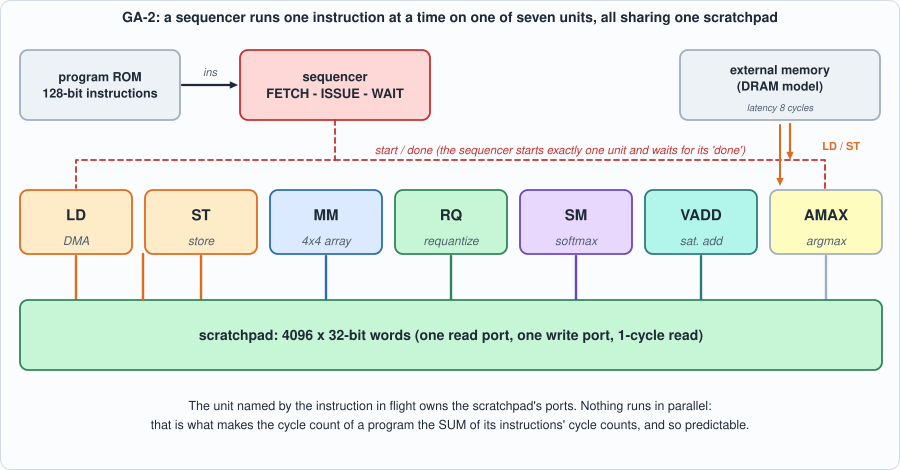
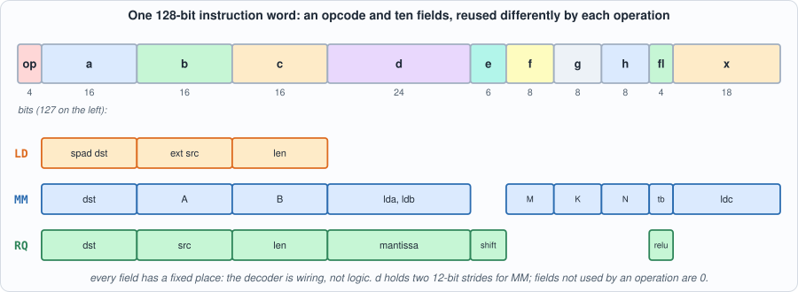
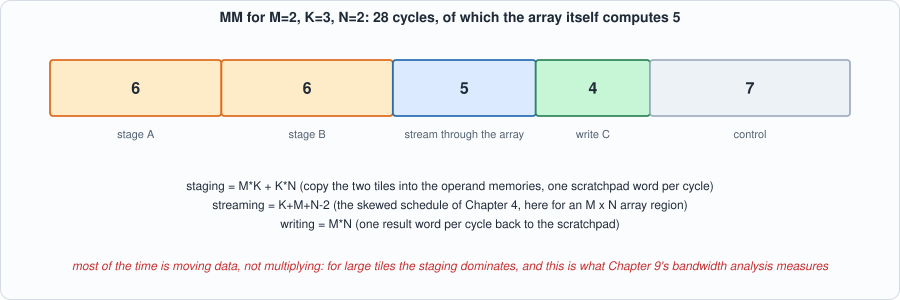
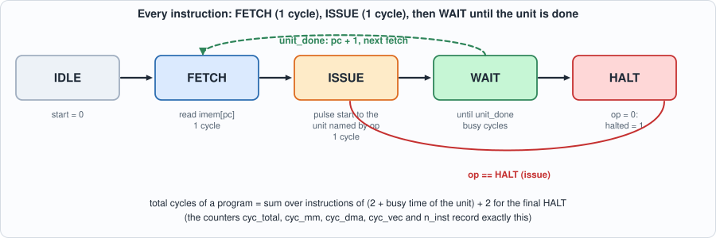
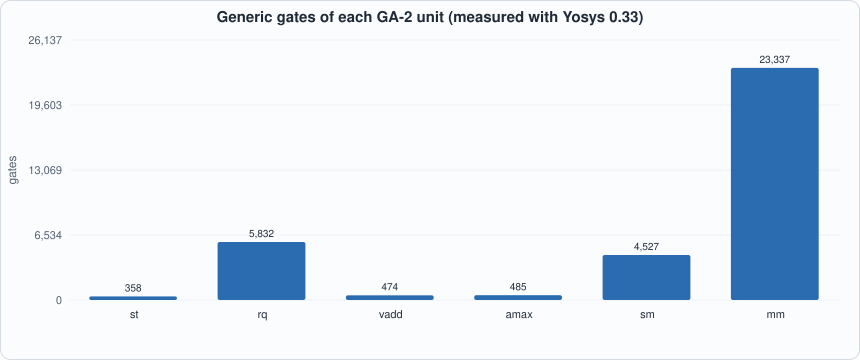
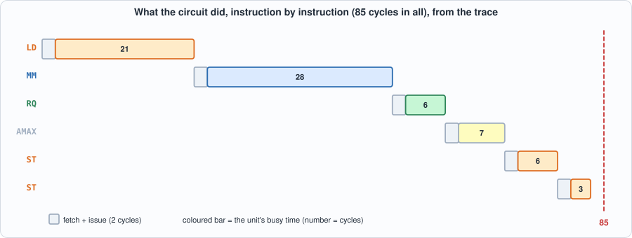
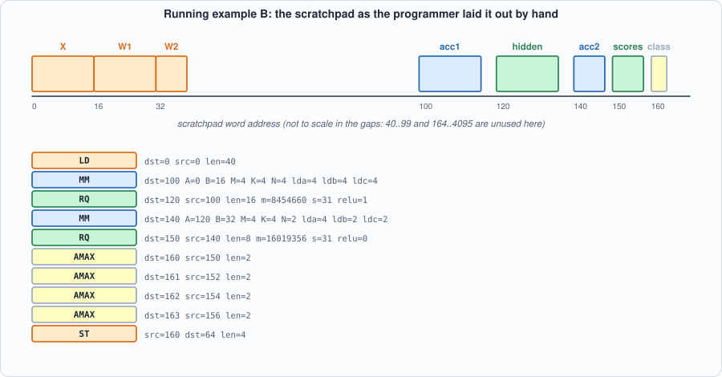

# 7. GA-2: An Instruction Set, a Sequencer, and the Whole Chip


--8<-- "docs/assets/art/ch-07.md"


**What you will understand:** how the pieces of Chapters 3-6 become one machine that runs *programs*. You will meet the instruction set (eight instructions, 128 bits each), write an assembler for it, build the execution units and the sequencer that drives them, check the whole chip against a Python reference simulator on 78 programs (memory contents **and** cycle counts, to the cycle), break it 49 ways, and learn what a test generator must never produce.

**What you need to know first:** Chapters 1-6. This chapter is mostly wiring and control, so the arithmetic is already trusted: the matrix unit *is* the Chapter 4 array, the requantizer *is* Chapter 3's circuit, the softmax *is* Chapter 6's algorithm. Appendix B (Verilog) covers the state-machine style used by the sequencer.

**What this chapter builds:** `model/ga2_isa.py` (instruction set, assembler, reference simulator, cycle model), `rtl/ga2_vec.v`, `rtl/ga2_sm.v`, `rtl/rowmem.v`, `rtl/ga2_mm.v`, `rtl/ga2.v` (units and sequencer), `model/ga2_progs.py` (program suites), `tb/ga2_tb.v` and `tb/extmem_rw.v`, `tools/ch07_calibrate.py`, `tools/mut_ch07.py`, and for the running examples `tb/ga2_trace_tb.v`, `tools/ch07_example_a.py` and `tools/ch07_example_b.py`.

## From parts to a computer

Chapters 2 to 6 produced parts: a MAC, an array, a requantizer, a scratchpad with a DMA, and a softmax unit. Each works on its own with its own testbench. A chip is more than a bag of parts. Something has to decide *which* part runs *when*, with *which data*, and that something has to be told what to do: a **program**.

This chapter adds exactly three things. An **instruction set** (the contract between the program and the chip: what operations exist and how they are encoded). A **sequencer** (the control circuit that reads one instruction, starts the unit it names, and waits). And a way to **know the chip is right**: a Python simulator of the instruction set that predicts the contents of memory *and the number of clock cycles* for any program.

The design principle is "as simple as can be made correct". Instructions run one at a time. Every value takes a 32-bit word. There is no pipelining between instructions, no caches, no interrupts. This is deliberate: it makes the machine small enough to verify completely in a book, and it makes the cycle count of a program a simple sum, which is the property the compiler of Chapter 11 and the performance analysis of Chapter 9 both rely on. A real accelerator would overlap instructions to hide the waiting; Chapter 9 measures what that would buy.

## The machine


*Figure 7.1: the machine. One sequencer, seven units that take turns, one scratchpad that they share, and DRAM reachable only through LD and ST.*

The design is deliberately **simple**: instructions run one at a time, in order, never overlapped; every value occupies one 32-bit word (an int8 is stored sign-extended). That makes the cycle count of a program the sum of the cycle counts of its instructions, which is what lets this chapter *predict* it exactly. Chapter 9 asks what overlap would buy.

## The instruction set

```python
--8<-- "model/ga2_isa.py"
```

The top of that file is the specification; the rest is the assembler, a reference simulator, and the cycle model.


*Figure 7.2: one fixed layout for every instruction. A field means different things to different operations, but it is always in the same place, so the decoder is wiring.* Eight instructions (a ninth, `UNPACK`, is added in Chapter 13 for 4-bit weights and appears in the code listings below, but nothing in Chapters 7 to 12 uses it):

| op | name | does |
|---|---|---|
| 0 | `HALT` | stop (an all-zero word is a HALT) |
| 1 | `LD dst src len` | external memory -> scratchpad (the DMA of Chapter 5) |
| 2 | `ST src dst len` | scratchpad -> external memory |
| 3 | `MM dst A B M K N tb lda ldb ldc` | `C = A x B`, int8 in, int32 out; M, N <= 4, K <= 64; `tb` reads B transposed; the `ld*` are row strides |
| 4 | `RQ dst src len m s relu` | requantize int32 -> int8 (Chapter 3) |
| 5 | `SM dst src len` | softmax of int8 scores -> Q0.16 probabilities (Chapter 6) |
| 6 | `VADD dst src1 src2 len` | saturating int8 add (residual connections) |
| 7 | `AMAX dst src len` | index of the first maximum (greedy decoding picks the next token with it) |

Two design choices to notice. `MM` has **strides** (`lda`, `ldb`, `ldc`) so that one instruction can multiply a tile of a bigger matrix without copying it out: Chapter 8's attention reads the keys of the cache straight from where they sit. And `MM` is limited to a 4 x 4 output tile; it is the compiler's job (Chapter 11) to cut a big product into such tiles. Hardware that does less makes the compiler's job real, which is the point of this book.

An example, in the assembler's syntax (comments after `;`):

```text
--8<-- "out/ch07_run_out.txt:2:9"
```

## The execution units

Each unit takes the 128-bit instruction when `start` pulses, owns the scratchpad ports while it is busy, and pulses `done` after its last write. Because the scratchpad read is synchronous (address now, data next cycle), every unit is a small pipeline: issue read `i` in one cycle, process word `i` in the next.

### Store, requantize, add, argmax: `rtl/ga2_vec.v`

```verilog
--8<-- "rtl/ga2_vec.v"
```

`ga2_rq` instantiates Chapter 3's `requant` combinationally between the read and the write. `ga2_vadd` has only one read port, so it takes two cycles per element (read one operand, read the other) and clamps to -127..127 as Chapter 3 requires. `ga2_amax` keeps the best value so far with a *strict* greater-than, so ties give the first index.

### Softmax: `rtl/ga2_sm.v`

```verilog
--8<-- "rtl/ga2_sm.v"
```

This is Chapter 6's algorithm, rebuilt around the scratchpad: pass 1 finds the maximum, pass 2 writes the exponentials *into the destination* and sums them, one division, pass 3 rescales them in place. Because it reads and writes memory it handles any length, not only the 8 or 64 of Chapter 6 (the suite includes a 600-element softmax).

### The matrix unit: `rtl/rowmem.v`, `rtl/ga2_mm.v`

```verilog
--8<-- "rtl/rowmem.v"
```

```verilog
--8<-- "rtl/ga2_mm.v"
```

The array needs `N` operands of `A` and `N` of `B` every cycle, but the scratchpad delivers one word per cycle. So the unit first **stages** the tiles: A's row `m` into operand memory `m`, B's column `n` into operand memory `n` (that is what `rowmem` is: eight small memories, each with one read address). Then it streams them skewed (memory `i` is read at position `t - i`, exactly the schedule of Chapter 4) through the 4 x 4 array, and finally writes the `M x N` result back, one word per cycle. 
*Figure 7.4: where the 28 cycles of the example's MM go.*

Its time is `M*K + K*N` (staging) `+ (K+M+N-2)` (streaming) `+ M*N` (writing) plus a few cycles of control. **Most of it is staging**, not arithmetic: a point Chapter 9 returns to.

### The sequencer: `rtl/ga2.v`

```verilog
--8<-- "rtl/ga2.v"
```


*Figure 7.3: the sequencer. FETCH and ISSUE take one cycle each; WAIT lasts as long as the unit is busy; an all-zero word is HALT.*

Three states do the work: FETCH (read the instruction at `pc`), ISSUE (start the unit named by the opcode), WAIT (until that unit says `done`). The unit named by the instruction in flight owns the scratchpad ports, selected by `cur`. The five counters are the profile Chapter 9 will use.

## The reference simulator and the cycle model

`model/ga2_isa.py` (above) contains `Machine`, a Python simulator of the ISA that shares no code with the Verilog, and `wait_cycles`, the cycle model: each instruction takes `2` cycles of fetch and issue plus its unit's busy time, a formula in the operands:

| instruction | busy cycles |
|---|---|
| `LD` | `len + LAT + c` |
| `ST` | `len + c` |
| `MM` | `M*K + K*N + (K+M+N-2) + M*N + c` |
| `RQ` | `len + c` |
| `SM` | `3*len + 41 + c` |
| `VADD` | `2*len + c` |
| `AMAX` | `len + c` |

The **shape** of each formula is derived from the structure of the unit (three passes and a 40-cycle division for softmax; two reads per element for the add...). The **constants** `c` are control overheads that a diagram cannot give; they were read off the circuit by running each instruction alone with several sizes and subtracting the operand-dependent part:

```python
--8<-- "tools/ch07_calibrate.py"
```

```text
--8<-- "out/ch07_calibrate_out.txt"
```

If the structural part were wrong, the "left over" column would change with the size. It does not: one constant per instruction type (`LD` 1, `ST` 2, `RQ` 2, `SM` 6, `VADD` 2, `AMAX` 3, `MM` 7). **Those are the only measured numbers in the model**; everything the next sections check is a prediction.

## The test programs: `model/ga2_progs.py`

```python
--8<-- "model/ga2_progs.py"
```

Eighteen directed programs (every instruction alone, length-one operands, the largest tile, transposed `B`, vectors of 500 to 1500 elements to exercise the upper bits of every length field, an immediate HALT) and a generator of **random programs**: each loads four arenas of data, then 10-25 random instructions with random sizes, strides and addresses, then stores the results. Everything is checked: the whole external memory afterwards and all five cycle counters.

```verilog
--8<-- "tb/ga2_tb.v"
```

```verilog
--8<-- "tb/extmem_rw.v"
```

## Running it

```python
--8<-- "tools/ch07_run.py"
```

**Output (cloud sandbox -- live-executed; Icarus Verilog 12.0, Verilator 5.020, Yosys 0.33)**

```text
--8<-- "out/ch07_run_out.txt"
```

### Reading it

- **The example program runs.** Two matrices are loaded, multiplied (`C = [[4,5],[10,11]]`), requantized, the largest result's index found (3), and all stored: 93 cycles in total, split into 28 on the matrix unit, 36 on DMA (loading 12 words costs 21 of them: the memory latency is paid once per load), and 13 on the vector units. The circuit and the reference agree, and the cycle counters match the model's prediction to the cycle.
- **78 programs, then 200 more, pass in both simulators, memory and counters.** That is 710,814 cycles of random programs checked against the reference.
- **The same suite passes at a different memory latency** after changing a single constant in the model (`LAT`).
- **Cost (Yosys, iCE40 mapping):** the whole chip is 21,543 cells with 5,151 flip-flops and 34 block RAMs (32 of them are the 4096 x 32-bit scratchpad). The requantizer is the largest unit by far (5,832 generic gates, mostly the 32 x 24-bit multiplier) and the softmax the second (4,527). The matrix unit's 23,337 gates are mostly the systolic array and the operand memories (3,957 flip-flops, because Yosys mapped most of them to registers). *(Yosys counts; no timing, no area. The totals include the UNPACK unit added in Chapter 13, which is why they differ slightly from the version of this chapter that preceded it.)*


*Figure 7.5 (measured): gate counts per unit.*

## Running example A: follow a program through the sequencer

*The point of this example:* the instruction set is a contract; the sequencer is the thing that honours it. This example runs a seven-instruction program on the circuit with a **trace** of the sequencer's state machine (`tb/ga2_trace_tb.v` prints a line at every FETCH, ISSUE and DONE), and puts the measured start, end and busy time of every instruction next to the cycle model's prediction.

```verilog
--8<-- "tb/ga2_trace_tb.v"
```

```python
--8<-- "tools/ch07_example_a.py"
```

To compile and run: `python3 tools/ch07_example_a.py` (it needs `iverilog`).

**Output (cloud sandbox -- live-executed)**

```text
--8<-- "out/ch07_example_a_out.txt"
```


*Figure 7.6: the trace as a timeline. Grey squares are the two overhead cycles of every instruction; the coloured bar is the unit working.*

**Walkthrough.**

1. *FETCH, ISSUE, WAIT.* The first instruction is fetched at cycle 0, issued at cycle 1, and its unit (the DMA) works until cycle 22: 21 busy cycles. The next FETCH is at cycle 23: the sequencer takes one cycle after `done` to latch the next instruction word. Every row of the table shows the same pattern.
2. *The loads.* `ld len=12` takes 21 cycles = 12 words + 8 cycles of memory latency + 1 of control. The latency is paid once, not per word (Chapter 5).
3. *The matrix unit.* `mm` takes 28 cycles for a 2x3 by 3x2 product. Of those, only K + M + N - 2 = 5 are the array computing; 12 are staging the two tiles into the operand memories and 4 writing the result; 7 are control. For small tiles the overhead dominates, which is the lesson of Chapter 4's utilization formula seen from a different side.
4. *The vector units.* `rq` takes 6 cycles for 4 words (len + 2), `amax` 7 (len + 3 plus the final compare), the two `st` instructions 6 and 3.
5. *The totals.* The six instructions plus the final HALT give 85 cycles, and the circuit's counters read `[85, 28, 30, 13, 6]`: total, matrix-unit, DMA, vector-unit cycles and instructions. The model predicts exactly the same, and the external memory afterwards is identical to the reference simulator's. (The instruction list is the one from the original version of this chapter without the extra `st` of the raw int32 result, hence 85 and not 93.)
6. *What the check proves.* The model's constants were calibrated on single instructions (the table above); this program is a *prediction*, and it is right to the cycle. That is the property the rest of the book leans on.

## Running example B: a neural network written by hand

*The point of this example:* to feel what the chip is like to program, and so to understand why Chapter 11 builds a compiler. The task: a tiny network with four inputs, four hidden units with ReLU, and two outputs, applied to a batch of four samples. The weights are chosen so that the network can be understood: hidden unit 0 measures how much the first two inputs exceed the last two (`x0 + x1 - x2 - x3`), hidden unit 1 is its negative, and the other two are distractors. The task is to classify each sample, and the program does that in ten instructions.

```python
--8<-- "tools/ch07_example_b.py"
```

To compile and run: `python3 tools/ch07_example_b.py` (it needs `iverilog`).

**Output (cloud sandbox -- live-executed)**

```text
--8<-- "out/ch07_example_b_out.txt"
```


*Figure 7.7: the memory map the programmer had to invent (inputs and weights at 0 to 39, accumulators at 100, hidden activations at 120, scores at 150, classes at 160) and the program that uses it.*

**Walkthrough.**

1. *The floating-point network.* Computed first in plain Python: hidden activations such as `[1.7, 0, 0.2, 0.3]` and scores such as `[1.65, 0.05]`; the classes are `[0, 1, 1, 0]`.
2. *Quantizing by hand.* Chapter 3's rules give a scale for each of five quantities (x, W1, hidden, W2, scores), and the two requantizers get mantissa and shift pairs `(8454660, 31)` and `(16019356, 31)`. Each came from `M = scale_a x scale_b / scale_out`. A wrong digit here gives plausible garbage.
3. *The program.* One `ld` brings in everything (X, W1 and W2 sit next to each other in external memory). The first `mm` is a 4x4x4 product: layer 1. `rq ... relu=1` is the requantizer and the ReLU in one instruction (the fused ReLU of Chapter 3). The second `mm` is 4x4x2: layer 2. The second `rq` makes int8 scores; four `amax` instructions find each sample's class (an argmax over two numbers, repeated); one `st` writes the four answers.
4. *Result.* The circuit, the reference simulator and the floating-point network all classify the four samples as `[0, 1, 1, 0]`. The program took 237 cycles, with exact agreement between model and circuit: 112 on the matrix unit (47%), 55 on DMA (23%), 48 on vector units (20%).
5. *What it cost the programmer.* Three address spaces (external memory, scratchpad, and the strides of the matrix multiplies), two scale pairs worked out on paper, and every operand typed by hand. And this network fits one tile: a real one would need dozens of `mm` instructions per layer, each with its own addresses. Getting one address wrong, or the wrong shift, gives a result that is not obviously broken. This is the work the compiler takes over.

## Testing the tests

```python
--8<-- "tools/mut_ch07.py"
```

**Output (cloud sandbox -- live-executed)**

```text
--8<-- "out/ch07_mutation_out.txt"
```

All 49 broken chips are caught, among them the bugs this kind of design actually has: a field read from the wrong bits, a stride swapped for a size, a unit on the wrong bus, an off-by-one in the streaming time, a missing clear between products, a transposed store, ties resolved the wrong way, a clamp one off.

Four survivors, each **equivalent** and each of a different kind:

- *VADD reads its two sources in the other order*: addition commutes. A true equivalent.
- *Rows of A beyond M are not masked*: PE(i,j) depends only on row i of A and column j of B, so the extra rows change nothing observable (they would cost power).
- *M is a 3-bit field instead of 4*: every legal value (1 to 4) fits in 3 bits. **Equivalent within the ISA**, not in general.
- *The load source address is 12 bits instead of 16*: the test memory has 2048 words, so no test can reach an address that needs the upper bits. **Equivalent within the tested range.** A bigger memory would remove this survivor, and the author reports it rather than calling it harmless.

### What the process found

1. **The first run disagreed with the model on 71 of 72 programs, by a few cycles each.** Not a bug: the constants had been guessed before they were measured. Calibrating them (the table above) fixed all of those at once. The memory contents had been right from the first run.
2. **One program differed in memory in both simulators.** The cause was in the *generator*: it produced `SM dst=2184 src=2174 len=64`, source and destination overlapping partially. The units are pipelined, so this is undefined, and the reference simulator (which reads everything before writing) and the circuit (which writes while still reading) give different answers. The ISA now says "operand regions of RQ, SM and VADD must be identical or disjoint", and the generator produces only those. The lesson is general: **undefined behaviour has to be written into the specification and kept out of the tests**, otherwise a test failure cannot tell you which side is wrong.
3. **One mutant was badly designed by the author** ("M is a 3-bit field") and survived because it was not a bug. It was reclassified as equivalent and replaced by a real one (a 2-bit field), which is caught.
4. **Before adding the 500-1500-element programs** the length-field mutants (8-bit lengths) would have survived, since the random programs only reach length 255. They are the reason the directed suite has long vectors.

## Common mistakes

- **Writing a test program with overlapping operands.** `SM dst=2184 src=2174 len=64` has partially overlapping regions; the units are pipelined, so what happens is undefined and the circuit and the reference legitimately differ. The specification forbids it and the generator avoids it.
- **Guessing the cycle model's constants.** The first version of the constants was guessed and disagreed on 71 of 72 programs. They were measured on single instructions instead.
- **Forgetting that an int8 occupies a whole 32-bit word.** Addresses count words; `len=16` is 16 words, not 16 bytes. The bandwidth analysis of Chapter 9 therefore counts bytes of the logical type, not words.
- **Believing that a field mutant that survives is a gap.** "M is a 3-bit field" survives because every legal M fits in 3 bits. It is equivalent within the ISA; the report says so.
- **Using `MM` with `K > 64` or `M, N > 4`.** The hardware does not support it; the compiler must tile. The tests never produce it.
- **Reading the matrix unit's time as the array's time.** In Figure 7.4 the array computes 5 of 28 cycles.

## What this chapter does and does not establish

- **Verified**: the chip computes what the reference simulator computes, and takes exactly the cycles the model says, on 78 + 218 + 48 program runs, in two simulators (the later two in Icarus only). The reference simulator is itself checked only through this comparison and through the unit-level golden models of Chapters 3-6.
- **Not verified**: timing (no clock period is measured), instruction sequences longer than 255, behaviour with a different clock for memory, and anything the generator cannot produce (for instance, `MM` with `K` above 64 is illegal and is not tested).
- **Simplifications that matter later**: one element per 32-bit word (so the scratchpad is 4x bigger than the data would need), strictly serial instructions (no overlap of a load with a compute: the double buffering of Chapter 5 is not used by this design), and one set of operands per instruction.

## Chapter summary

GA-2 is eight instructions executed one at a time by a sequencer that fetches, starts the unit the instruction names, and waits. The matrix unit stages two tiles, streams them through Chapter 4's array and writes the result; the vector units are small pipelines around Chapter 3's requantizer and Chapter 6's softmax. A Python reference predicts the whole external memory and every cycle count; the chip matches on 344 program runs; 49 of 49 mutants were caught and the four survivors are explained.

## Self-check questions

1. `MM dst=100 A=0 B=64 M=2 K=5 N=3 tb=1 lda=5 ldb=5 ldc=3`: where in the scratchpad is `B[k][n]` and where is `C[m][n]`?
2. How many busy cycles does the model give for that instruction? Which part is arithmetic and which is data movement?
3. Why does the ISA forbid partially overlapping operand regions for `SM`?
4. A mutant changes the load's source-address field from 16 bits to 12. Why did no test catch it, and what would catch it?
5. Why is the cycle model's constant for `MM` (7) bigger than the ones for the vector units (2 to 6)? Name two things in `ga2_mm.v` that it contains.
6. In Running example A, instruction 1 (`mm`) is fetched at cycle 23 although instruction 0 finished at cycle 22. Where does the cycle go, and what does it add up to over a long program?
7. Using the model's formulas, compute the busy cycles of `rq len=16`, `mm M=4 K=4 N=4` and `mm M=4 K=4 N=2`, and check the total 237 of Running example B (do not forget the fetch and issue cycles and the final HALT).
8. Why would a second `ld` for W2 (instead of one `ld len=40`) cost more cycles? How many more?

## Exercises

1. **Add an instruction to the program.** Append `st src=150 dst=72 len=8` to the program of Running example B (before `halt`), predict the new cycle count with the model, run it, and read the stored scores.
2. **A different network.** Change `W2` in `ch07_example_b.py` so that hidden unit 2 votes for class 1 instead of 0. Does the classification of any sample change? Is the quantized circuit still in agreement with floating point?
3. **Stride practice.** Write the `mm` instruction that multiplies rows 2 and 3 of `X` (a 2x4 block starting at scratchpad address 8) by the first two columns of `W1` (a 4x2 block, leaving the rest of its rows untouched). Which of `lda`, `ldb`, `ldc` are not equal to the matrix width?
4. **Break the contract.** Make `rq` overlap partially with its source (`dst=104 src=100 len=16`), run the circuit and the reference simulator, and compare. What does each produce, and why is this undefined by the ISA?
5. **Count the overhead.** For Running example B, what fraction of the 237 cycles are FETCH and ISSUE cycles? How would doubling the number of instructions (with the same work) change the total?

