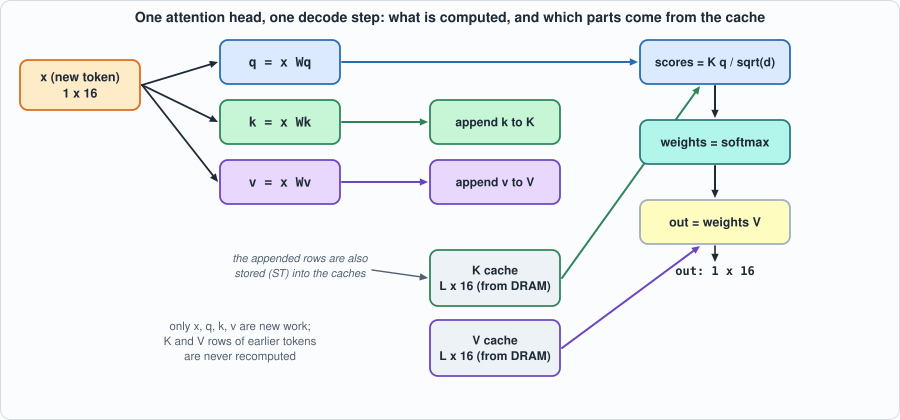
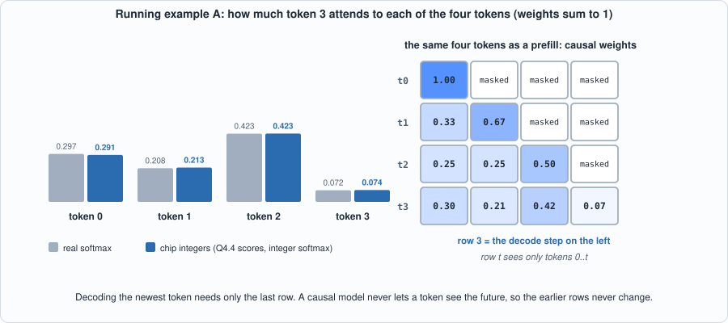
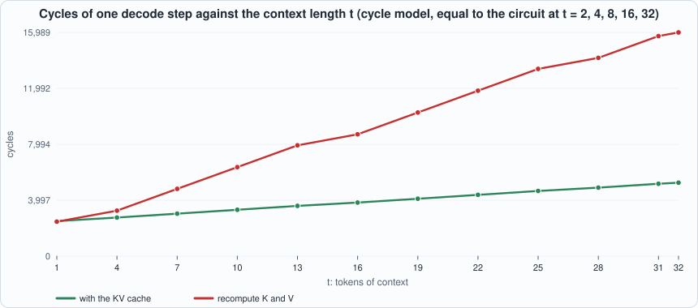
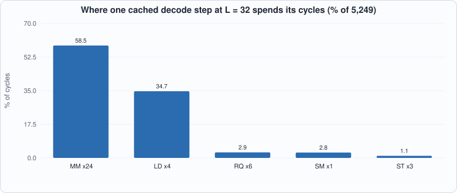
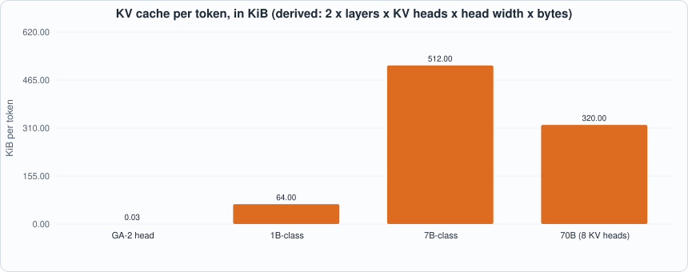
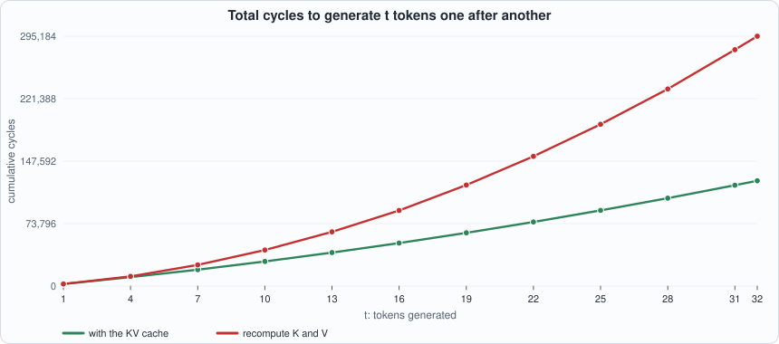
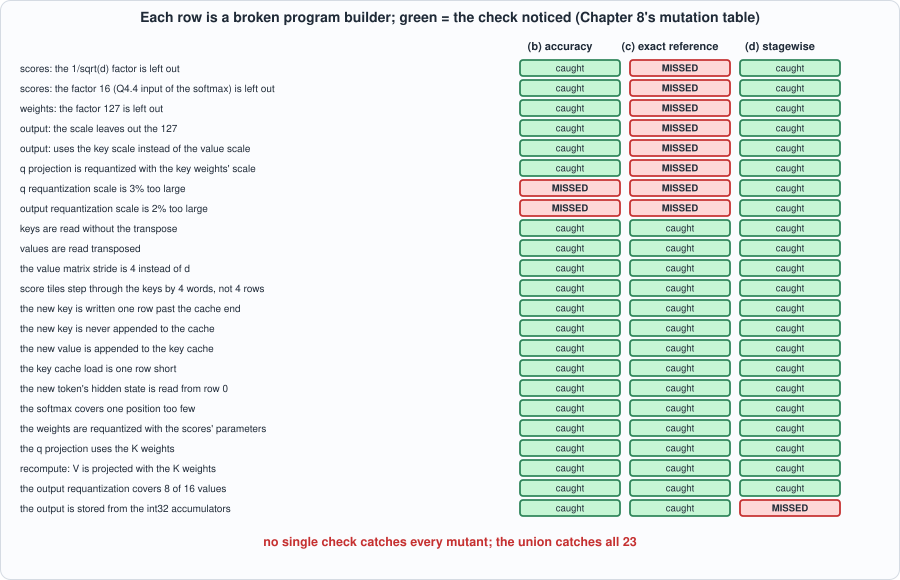

# 8. Attention and the KV Cache: One Decode Step, From Hidden State to Output


--8<-- "docs/assets/art/ch-08.md"


**What you will understand:** what a language model actually computes to produce one token, why it keeps a **KV cache**, and what the cache costs and saves, measured in cycles on the chip of Chapter 7. You will write the decode step as a GA-2 program (the hand-written forerunner of the compiler of Chapter 11), run it on the RTL, compare its answer with floating-point attention, see where the quantization error comes from, and then test the *program builder* by mutation, where three different kinds of check turn out to have three different blind spots.

**What you need to know first:** Chapters 3 (quantization), 6 (softmax) and 7 (the GA-2 instruction set). Appendix E (transformers and LLM inference) explains the model around this step if you have not met attention before.

**What this chapter builds:** `model/attn.py` (the attention step as GA-2 programs, in two variants, plus an integer reference and a stage-by-stage checker), `tools/ch08_run.py`, `tools/ch08_study.py`, `tools/mut_ch08.py`, and for the running examples `tools/ch08_example_a.py` and `tools/ch08_example_b.py`.

## Why this chapter: the part of a language model that remembers

A language model writes text one token at a time. To choose the next token it must look back at *all* the previous ones: which earlier words matter for this one? That look-back is **attention**, and it is the only place in a transformer where tokens interact. Everything else (the feed-forward blocks, the normalizations) processes each token on its own.

For a chip designer, attention is where two expensive things meet. It needs **memory that grows**: the model must keep something about every earlier token. And it needs **arithmetic that is awkward for a systolic array**: products of a single vector with a big matrix, which use a small fraction of the array. The first is the **KV cache**; the second is the subject of Chapter 9. This chapter builds the step, measures it on the chip of Chapter 7, and shows what the cache buys.

## What a decode step computes

A transformer generates text one token at a time. For each new token, every attention head does this (one head shown; `d` is its width):

```text
q = x Wq       k = x Wk       v = x Wv        x: the hidden state of the newest token
scores  = K q / sqrt(d)                        K: the keys of ALL tokens so far, one row each
weights = softmax(scores)
out     = weights V                            V: the values of all tokens so far
```


*Figure 8.1: one attention head, one decode step. Green and purple are the cache; only the four boxes on the left are new work.*


*Figure 8.1: one attention head, one decode step. Green and purple are the cache; only the boxes on the left are new work.*

The matrices `K` and `V` have one row per token. The key insight is that **the rows for old tokens never change**: token 5's key is `x_5 Wk` whatever token 6 is. So instead of recomputing `K` and `V` for the whole prefix at every step, the model **stores** them: that is the **KV cache**. Each step computes `k` and `v` only for the new token, appends them, and attends over the stored rows.

Because each step attends to the new token and all earlier ones (never later ones), the **causal mask** is automatic in decoding: there is nothing "later" in the cache to hide. (Masks matter in *prefill*, where a whole prompt is processed at once.)

## A tiny example by hand

Before the machine, the arithmetic on numbers small enough to check. Four tokens, vectors of width 2. The newest token's query is `q = [1, 0.5]`; the keys are `[[1,0],[0,1],[1,1],[-1,0]]`. Each score is a dot product divided by sqrt(2): `[0.707, 0.354, 1.061, -0.707]`. Softmax turns those into weights `[0.297, 0.208, 0.423, 0.072]`: token 2 gets the most, because its key `[1,1]` is the most similar to the query. The output is the weighted average of the four value vectors. Running example A below does exactly this, then repeats it in the chip's integers and as a causal prefill.


*Figure 8.2: left, the weights of the decode step in real numbers and in the chip's integers (the largest difference is 0.006, almost all of it from rounding the scores to 1/16). Right, the same four tokens processed as a prefill: row t attends only to tokens 0..t; the last row is the decode step.*

## A tiny example by hand

Before the machine, the arithmetic on numbers small enough to check. Four tokens, vectors of width 2. The newest token's query is `q = [1, 0.5]`; the keys are `[[1,0],[0,1],[1,1],[-1,0]]`. Each score is a dot product divided by sqrt(2): `[0.707, 0.354, 1.061, -0.707]`. Softmax turns those into weights `[0.297, 0.208, 0.423, 0.072]`: token 2 gets the most, because its key `[1,1]` is the most similar to the query. The output is the weighted average of the four value vectors. Running example A below does exactly this, then repeats it in the chip's integers and as a causal prefill.


*Figure 8.2: left, the weights of the decode step in real numbers and in the chip's integers (the largest difference is 0.006, almost all of it from rounding the scores to 1/16). Right, the same four tokens processed as a prefill: row t attends only to tokens 0..t; the last row is the decode step.*

## The same step as GA-2 programs: `model/attn.py`

```python
--8<-- "model/attn.py"
```

The file builds two programs for the same step:

- **cached**: load the new token's hidden state, the weights and the L-1 cached rows of K and V; project q, k, v for the new token; requantize them to int8; *append* k and v to the caches in external memory (two `ST`s); then attend.
- **recompute**: no cache. Project K and V for *all* `L` tokens from their hidden states, in 4 x 4 tiles, then attend.

Attention itself (`tail`) is the same in both, and each line is an instruction of Chapter 7: scores for four positions at a time (`MM` with `tb=1` so the key rows are read as columns, straight out of the cache with no copy), `RQ` into the softmax's Q4.4 input range, `SM`, `RQ` to int8 weights, `MM` of weights by V four output columns at a time, `RQ` to int8, `ST`. Below is the cached program for the third token, as assembled:

```text
--8<-- "out/ch08_run_out.txt:3:34"
```

Every requantizer in it has its own scale, and the scales have to be right. `rq_params` derives them from the six tensor scales: for example the scores' multiplier is `scale_q * scale_k / sqrt(d) * 16` (the `16` because the softmax unit's input is the score times 16). This is the kind of arithmetic a compiler must do for the user, and a place where bugs hide.


*Figure 8.3: the cycle model's cost of one decode step as the context grows, with and without the cache (equal to the circuit's counter at the five lengths it was run).*


*Figure 8.3: the cycle model's cost of one decode step as the context grows, with and without the cache (equal to the circuit's counter at the five lengths it was run).*

## Running it on the chip

```python
--8<-- "tools/ch08_run.py"
```

**Output (cloud sandbox -- live-executed; Icarus Verilog 12.0, Verilator 5.020, Yosys 0.33)**

```text
--8<-- "out/ch08_run_out.txt"
```

### Reading it

- **All ten programs (cached and recompute, for L = 2, 4, 8, 16, 32) pass in both simulators**: the RTL produces exactly the memory contents and cycle counts of the reference simulator, and the two programs give identical outputs at every step of a decode loop.
- **The cache saves little at the start and a lot later.** At L = 2 the cached step is 1.05x faster; at L = 32 it is 3.04x (5,251 cycles against 15,989). Between L = 16 and L = 32 the recompute step costs about 455 more cycles per extra token of context ((15,989 - 8,709) / 16) and the cached step about 89 ((5,251 - 3,827) / 16): recomputation redoes the K and V projections of every token every step, so over a whole generation of `n` tokens its total work grows with `n` squared, while the cached total grows far more slowly.

*Figure 8.4: where a cached step spends its time: matrix instructions 58.5%, cache loads 34.7%.*


*Figure 8.4: where a cached step spends its time: matrix instructions 58.5%, cache loads 34.7%.*

- **Even the cached step is dominated by the matrix unit (58.5% of cycles at L = 32), and not because of arithmetic.** Of its 24 matrix instructions, 12 project the new token and cost the same at any context length, and in every one `M = 1`: a decode step multiplies a *vector* by a matrix, so only one row of the 4 x 4 array has anything to do, and the staging of operands (Chapter 7) dominates. This is the central inefficiency of decoding, and the reason Chapter 9 looks at batching: with four requests in flight, `M = 4` costs almost the same as `M = 1`.
- **Loading the caches is 34.7% of the cycles** (4 `LD` instructions: 1,820 cycles) and grows linearly with `L`: every step re-reads the whole cache from DRAM.

## How big is a cache?

The printed arithmetic at the end of the output is derived, not measured: one GA-2 head stores `2 x 16 x 1 byte = 32` bytes per token. For a 7B-class transformer (32 layers x 32 heads of width 128) in fp16 it is `2 x 32 x 32 x 128 x 2 = 524,288` bytes per token: **512 KiB per token, 2 GiB for a 4,096-token context** (1 GiB with an int8 cache), per sequence being served. The cache, not the weights, is what limits how many conversations fit in a chip's memory.


*Figure 8.5 (derived): bytes of cache per token. The 70B-class figure is lower than the 7B's because it shares KV heads (Chapter 14).*


*Figure 8.5 (derived): bytes of cache per token. The 70B-class figure is lower than the 7B's because it shares KV heads (Chapter 14).*

## How accurate is it?

```python
--8<-- "tools/ch08_study.py"
```

```text
--8<-- "out/ch08_study_out.txt"
```

These are measured on random Gaussian data with scales calibrated on the same example (a real system calibrates on a separate data set, so these numbers are optimistic).

- **int8 inputs and weights cost the most** (1.7% mean error), then the int8 attention weights (+1.1 points). Rounding the scores to 1/16 costs about half a point.
- **Replacing the softmax by Chapter 6's integer softmax adds nothing visible** (the stage "+ integer softmax" is the same as the one before to two decimals). That is the result of Chapter 6's accuracy study showing up in context.
- **The whole int8 step is 1% to 5% from floating point on average**, with outliers of 8-11% at larger `L`. Error grows a little with context length (more terms rounded), and these figures say nothing about a trained model's tolerance.

## Running example A: attention on four tokens, by hand and in integers

*The point of this example:* to see attention as arithmetic on numbers you can check, in three views: real numbers, the chip's integers, and the prefill with the causal mask.

```python
--8<-- "tools/ch08_example_a.py"
```

To compile and run: `python3 tools/ch08_example_a.py` (pure Python, instant).

**Output (cloud sandbox -- live-executed)**

```text
--8<-- "out/ch08_example_a_out.txt"
```

**Walkthrough.**

1. *Scores.* The newest query `[1, 0.5]` against each key: `[1,0]` gives 1, `[0,1]` gives 0.5, `[1,1]` gives 1.5, `[-1,0]` gives -1; divided by sqrt(2) these are the four scores. Token 2 wins because its key points the way the query does.
2. *Softmax and the weighted average.* The weights are positive and sum to 1. The output `[1.07, 1.334]` is `0.2968 x [1,0] + 0.2084 x [0,2] + 0.4227 x [2,2] + 0.0722 x [-1,1]`, and the printed check of the first component works it out. An attention output is always a weighted average of the value vectors, so it lies among them.
3. *In the chip's integers.* Scores times 16 rounded to int8 are `[11, 6, 17, -11]`; Chapter 6's integer softmax gives Q0.16 weights; times 127 and rounded they are the int8 weights `[37, 27, 54, 9]`. The differences from the real weights (up to 0.006) are dominated by rounding the scores to a 1/16 grid: the Chapter 6 softmax itself is accurate to 0.00002.
4. *Prefill.* The same tokens processed all at once: each row of the weight matrix applies the same recipe to a different query, with the **causal mask** (a token may not see a later one). Token 0 attends only to itself (weight 1.0); token 1 to tokens 0 and 1, and so on. Row 3 is the decode step of part 1, identical to the last digit.
5. *The point.* The three earlier rows of the matrix never change as more tokens arrive. That is what lets a decoder keep **only the keys and values** of old tokens and compute just the last row: the KV cache.

## Running example B: what the cache saves over a whole generation

*The point of this example:* the table in "Reading it" compares single steps. Real generation runs a *loop*; this example sums the cost over 32 steps and puts the memory side next to it.

```python
--8<-- "tools/ch08_example_b.py"
```

To compile and run: `python3 tools/ch08_example_b.py` (needs the output of `ch08_run.py`; it compares the cycle model with the circuit's counters at five context lengths).

**Output (cloud sandbox -- live-executed)**

```text
--8<-- "out/ch08_example_b_out.txt"
```


*Figure 8.6: total cost of generating t tokens. The recompute curve bends upward (each step costs more than the last, by a lot); the cached curve bends much less.*

**Walkthrough.**

1. *Per step.* At context length 1 the cached step is not cheaper (2,500 against 2,460 cycles: it pays two extra stores to fill the cache). At 32 tokens it is 5,251 against 15,989 cycles, 3.04 times faster. The model's cycle counts equal the circuit's at every length the circuit was run.
2. *Per token of extra context.* The cached step grows by about 89 cycles per extra token (the cache load and the longer score and weighted-sum products); the recompute step by about 436 (all of K and V are projected again).
3. *Over 32 tokens.* 124,346 cycles with the cache and 295,184 without, a factor of 2.37. The ratio keeps growing with the length: recompute does work proportional to t at step t, so a generation of n tokens does work proportional to n squared; the cached generation does a roughly constant amount of projection per step plus a linear attention.
4. *The price: memory.* The cache grows by 32 bytes per token for this head. For a 7B-class model it is 512 KiB per token and 16 GiB for a 32,768-token context, per conversation. A chip serving several users at once is limited by the memory for caches, not by arithmetic. A model that shares key and value heads between query heads (Chapter 14) cuts that proportionally, which is why the 70B-class row is smaller than the 7B's.
5. *And the bandwidth.* Every step reads the whole cache from memory again. Chapter 9 turns that into a limit on tokens per second.

## Running example A: attention on four tokens, by hand and in integers

*The point of this example:* to see attention as arithmetic on numbers you can check, in three views: real numbers, the chip's integers, and the prefill with the causal mask.

```python
--8<-- "tools/ch08_example_a.py"
```

To compile and run: `python3 tools/ch08_example_a.py` (pure Python, instant).

**Output (cloud sandbox -- live-executed)**

```text
--8<-- "out/ch08_example_a_out.txt"
```

**Walkthrough.**

1. *Scores.* The newest query `[1, 0.5]` against each key: `[1,0]` gives 1, `[0,1]` gives 0.5, `[1,1]` gives 1.5, `[-1,0]` gives -1; divided by sqrt(2) these are the four scores. Token 2 wins because its key points the way the query does.
2. *Softmax and the weighted average.* The weights are positive and sum to 1. The output `[1.07, 1.334]` is `0.2968 x [1,0] + 0.2084 x [0,2] + 0.4227 x [2,2] + 0.0722 x [-1,1]`, and the printed check of the first component works it out. An attention output is always a weighted average of the value vectors, so it lies among them.
3. *In the chip's integers.* Scores times 16 rounded to int8 are `[11, 6, 17, -11]`; Chapter 6's integer softmax gives Q0.16 weights; times 127 and rounded they are the int8 weights `[37, 27, 54, 9]`. The differences from the real weights (up to 0.006) are dominated by rounding the scores to a 1/16 grid: Chapter 6's softmax itself is accurate to 0.00002.
4. *Prefill.* The same tokens processed all at once: each row of the weight matrix applies the same recipe to a different query, with the **causal mask** (a token may not see a later one). Token 0 attends only to itself (weight 1.0); token 1 to tokens 0 and 1, and so on. Row 3 is the decode step of part 1, identical to the last digit.
5. *The point.* The three earlier rows of the matrix never change as more tokens arrive. That is what lets a decoder keep **only the keys and values** of old tokens and compute just the last row: the KV cache.

## Running example B: what the cache saves over a whole generation

*The point of this example:* the table in "Reading it" compares single steps. Real generation runs a *loop*; this example sums the cost over 32 steps and puts the memory side next to it.

```python
--8<-- "tools/ch08_example_b.py"
```

To compile and run: `python3 tools/ch08_example_b.py` (it reads the output of `ch08_run.py` and compares the cycle model with the circuit's counters at five context lengths).

**Output (cloud sandbox -- live-executed)**

```text
--8<-- "out/ch08_example_b_out.txt"
```


*Figure 8.6: total cost of generating t tokens. The recompute curve bends upward (each step costs more than the last, by a lot); the cached curve bends much less.*

**Walkthrough.**

1. *Per step.* At context length 1 the cached step is not cheaper (2,500 against 2,460 cycles: it pays two extra stores to fill the cache). At 32 tokens it is 5,251 against 15,989 cycles, 3.04 times faster. The model's cycle counts equal the circuit's at every length the circuit was run.
2. *Per token of extra context.* The cached step grows by about 89 cycles per extra token (the cache load and the longer score and weighted-sum products); the recompute step by about 436 (all of K and V are projected again).
3. *Over 32 tokens.* 124,346 cycles with the cache and 295,184 without, a factor of 2.37. The ratio keeps growing with the length: recompute does work proportional to t at step t, so a generation of n tokens does work proportional to n squared; the cached generation does a roughly constant amount of projection per step plus a linear attention.
4. *The price: memory.* The cache grows by 32 bytes per token for this head. For a 7B-class model it is 512 KiB per token and 16 GiB for a 32,768-token context, per conversation. A chip serving several users at once is limited by the memory for caches, not by arithmetic. A model that shares key and value heads between query heads (Chapter 14) cuts that proportionally, which is why the 70B-class row is smaller than the 7B's.
5. *And the bandwidth.* Every step reads the whole cache from memory again. Chapter 9 turns that into a limit on tokens per second.

## Testing the tests: the program builder

The chip has been tested since Chapter 7. What is new here is a *program*, written by hand, with tiling, strides, scales and a cache protocol, and a hand-written program is exactly where a compiler would be wrong. So this chapter mutates the **builder** (`model/attn.py`) one line at a time and asks which checks notice:

- **(a)** the cached and recompute programs give identical outputs at every step of a decode loop (always applied);
- **(b)** the error against floating point stays under 12% (twice the worst error the correct builder has on these examples);
- **(c)** the output equals an *integer reference* exactly, a plain-Python implementation of the maths with no instructions, tiles or addresses (`int_reference`);
- **(d)** every stage's int8 values are within one level of the real-number arithmetic its scale stands for (`stagewise_problems`): the int8 `q` must equal `round(x Wq * scale_x * scale_w / scale_q)` computed in floating point from the quantized inputs, and so on for k, v, scores, weights and output.

```python
--8<-- "tools/mut_ch08.py"
```

**Output (cloud sandbox -- live-executed)**

```text
--8<-- "out/ch08_mutation_out.txt"
```


*Figure 8.7: the mutation table of this chapter as a picture. The red cells are the blind spots; every row has at least one green cell.*


*Figure 8.7: the mutation table of this chapter as a picture. The red cells are the blind spots; every row has at least one green cell.*

Every mutant is caught by at least one check, and **no single check catches all of them**:

- **(c) the exact integer reference misses 8 of 23.** All eight are scale errors. The reference shares `rq_params` with the builder, so a wrong scale is wrong in both and the two agree perfectly. An exact comparison is only as independent as what it does not share.
- **(b) the accuracy bound misses two small scale errors** (3% and 2% too large): they are below the quantization noise (1-5%) and the 12% bound cannot see them.
- **(d) the stage-wise real-number check catches those**, because it checks each stage against what its scale *means* and shares nothing with the builder. Its one miss is a plumbing bug (the output stored from the wrong buffer), which it does not look at, and which (b) and (c) catch.
- Everything about tiling, strides, the cache protocol and which weights are used is caught by (a) already: for instance *"the new key is never appended"* is caught only because the test runs a **whole decode loop** with the cache persisting from step to step. A single step cannot see it, since the append matters only on the next step.

Two further changes survive and are **equivalent**: always computing 4 scores in the last tile, or 4 rows in the last projection block, only writes extra values that nothing reads.

## Common mistakes

- **Forgetting the 1/sqrt(d) in the scores.** Without it the scores are too large, the softmax too sharp, and the output wrong in a way an exact test against the same builder cannot see (the first mutant in Figure 8.7).
- **Treating the causal mask as something to implement in decode.** There is nothing in the cache to mask; the mask belongs to prefill.
- **Computing the new key and value but not appending them.** One step looks fine; the next one is missing a token. Only a test that runs a whole decode loop sees it.
- **Mixing up the scales of q, k and v.** Each tensor has its own scale and each requantizer must use the right pair; two wrong ones in the mutation table survive the exact-reference check.
- **Reading the key rows without the transpose.** `tb=1` is what lets the product read the cache straight; without it the scores are those of a different matrix.
- **Believing the cached step is cheap because it is cheaper.** It still re-reads the whole cache and uses a quarter of the array (Chapter 9).

## Common mistakes

- **Forgetting the 1/sqrt(d) in the scores.** Without it the scores are too large, the softmax too sharp, and the output wrong in a way an exact test against the same builder cannot see (the first mutant in Figure 8.7).
- **Treating the causal mask as something to implement in decode.** There is nothing in the cache to mask; the mask belongs to prefill.
- **Computing the new key and value but not appending them.** One step looks fine; the next one is missing a token. Only a test that runs a whole decode loop sees it.
- **Mixing up the scales of q, k and v.** Each tensor has its own scale and each requantizer must use the right pair; two wrong ones in the mutation table survive the exact-reference check.
- **Reading the key rows without the transpose.** `tb=1` is what lets the product read the cache straight; without it the scores are those of a different matrix.
- **Believing the cached step is cheap because it is cheaper.** It still re-reads the whole cache and uses a quarter of the array (Chapter 9).

## What this chapter does and does not establish

- **Verified**: the cached and recompute programs agree with each other at every step of a decode loop (L = 1 to 24, several seeds) and with an integer reference; the RTL matches the reference simulator on ten programs up to L = 32; each stage is consistent with its real-number meaning.
- **Not covered**: more than one head or layer (they repeat the same program), layer normalization and the feed-forward block (Chapter 12 builds a complete, if tiny, transformer), prefill of long prompts (needs `K > 64` tiles), and trained weights. The scratchpad layout of this builder supports up to 32 tokens.

## Chapter summary

A decode step is: project the new token, append its key and value to the cache, score the new query against every cached key, softmax, and average the cached values. The cache turns work that grows with the square of the context into work that grows linearly, but every step still re-reads it all from memory, and the matrix-vector products leave three quarters of the array idle. The step runs correctly on the chip, within 1-5% of floating point. A hand-written program needs its own tests, and the three kinds used here, whole-loop equality, exact reference, and real-number meaning of each scale, each have a blind spot the others cover.

## Self-check questions

1. Why does a decode step need no causal mask?
2. A model has 24 layers, 16 heads of width 64 and an fp16 cache. How many bytes per token and for a 2,048-token context?
3. In the cached program at L = 32, 12 of the 24 `MM` instructions do not depend on the context length. Which ones, and what is their total cycle cost?
4. Why does the exact integer reference miss "q requantization scale is 3% too large" while the stage-wise check catches it?
5. Why can no single-step test catch "the new key is never appended to the cache"?
6. In Running example A, the weight of token 0 is 0.297 in real numbers and 0.291 in the chip's integers. What causes the difference, and how would it change if the scores were kept to 1/32?
7. Using the "How big is a cache?" arithmetic, how many bytes of cache does a 4,096-token context need for a model with 12 layers, 12 heads of width 64 and an int8 cache?
8. Why is the cached step *not* faster at context length 1?

## Exercises

1. **Change the query.** In `ch08_example_a.py` set `q = [0, 1]` (the last row of `Q`) and predict which token gets the largest weight before running it.
2. **Longer context.** Run `ch08_example_b.py` after changing the range of `t` to 1..64 (the chip's scratchpad layout supports 32 tokens, but the cycle model does not mind). Does the ratio of recompute to cached keep rising?
3. **Memory budget.** A chip has 16 GiB for caches. How many 2,048-token conversations of a 7B-class fp16 model fit? How many with an int8 cache? With a 70B-class model that has 8 KV heads?
4. **A new mutant.** Add a mutant to `tools/mut_ch08.py` that scales the scores by `sqrt(d)` instead of dividing by it. Predict which of the three checks catch it, then run it.
5. **Read the program.** In the assembled cached program (L = 3) find the instruction that appends the new key to the cache, and explain what would go wrong at the next step if its destination were off by one row.

6. In Running example A, the weight of token 0 is 0.297 in real numbers and 0.291 in the chip's integers. What causes the difference, and how would it change if the scores were kept to 1/32?
7. Using the "How big is a cache?" arithmetic, how many bytes of cache does a 4,096-token context need for a model with 12 layers, 12 heads of width 64, an int8 cache?
8. Why is the cached step *not* faster at context length 1?

## Exercises

1. **Change the query.** In `ch08_example_a.py` set `q = [0, 1]` and predict which token gets the largest weight before running it. Which row of the prefill matrix does it match now?
2. **Longer context.** Run `ch08_example_b.py` after changing the range of `t` to 1..64 (the scratchpad layout supports up to 32 tokens on the chip, but the cycle model does not mind). Does the ratio of recompute to cached keep rising? Roughly where does it reach 5?
3. **Memory budget.** A chip has 16 GiB for caches. How many 2,048-token conversations of a 7B-class fp16 model fit? How many with an int8 cache? With a 70B-class model that has 8 KV heads?
4. **A new mutant.** Add a mutant to `tools/mut_ch08.py` that scales the scores by `sqrt(d)` instead of dividing by it. Predict which of the three checks catch it, then run it.
5. **Read the program.** In the assembled cached program (L = 3) find the instruction that appends the new key to the cache, and explain what would go wrong at the next step if its destination were off by one row.

