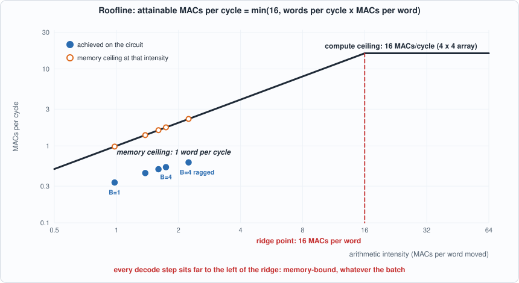
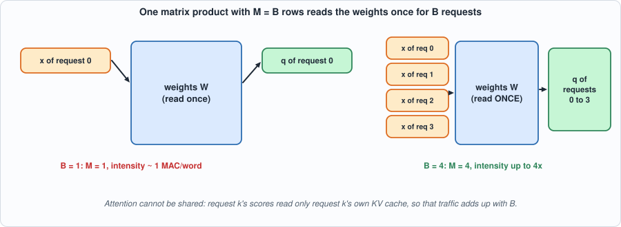
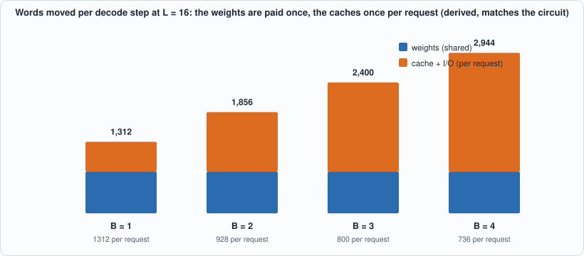
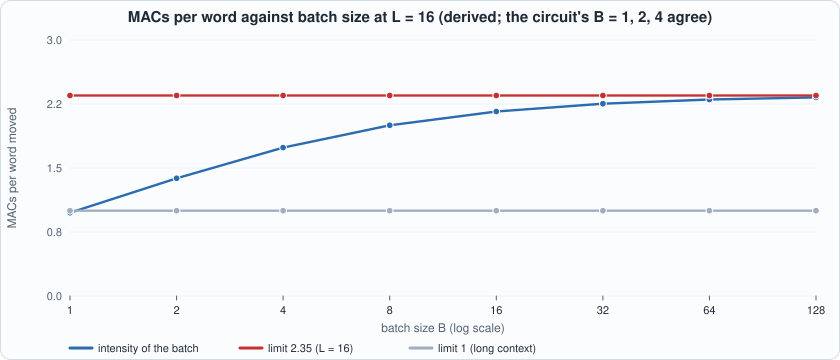
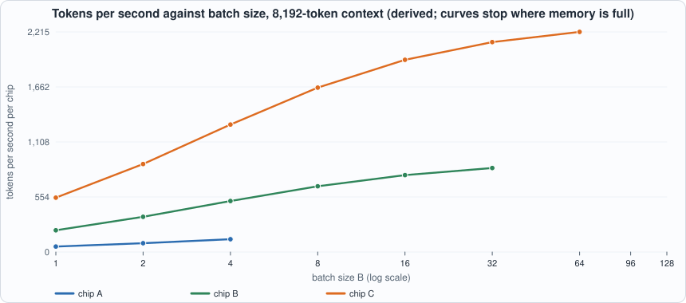
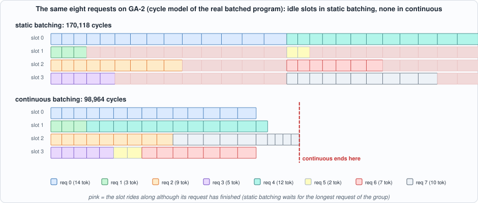

# 9. Batching and Bandwidth: Why Decoding Is Slow, and What Helps


--8<-- "docs/assets/art/ch-09.md"


**What you will understand:** the one idea that explains most of the economics of running a language model: **decoding is limited by memory traffic, not by arithmetic.** You will measure it on the chip, build the standard remedy (batching several requests so they share the weights), see exactly how much of the problem it fixes and what it cannot touch, state the limit with a **roofline**, and test the batched program builder with the oracle that batching makes possible: *a request must get the same answer whether or not other requests ride along.*

**What you need to know first:** Chapter 7 (the chip and its counters) and Chapter 8 (the decode step). Appendix F (memory systems and DRAM) explains where the bandwidth limit comes from.

**What this chapter builds:** `model/batch.py` (the batched decode-step builder and its invariance test), `tools/ch09_run.py`, `tools/mut_ch09.py`, and for the running examples `tools/ch09_example_a.py` (a capacity planner) and `tools/ch09_example_b.py` (static versus continuous batching).

## Why this chapter: the economics of running a model

Chapter 8 ended with a puzzle. The cached decode step is much cheaper than recomputing, and yet it keeps the matrix array mostly idle, because each step multiplies a single vector by a big matrix. This chapter explains why that is not a quirk of GA-2 but a property of the whole business of serving language models, gives the standard remedy, and measures how far the remedy goes.

Think of a restaurant kitchen whose cook is very fast but whose ingredients are in a warehouse across town. Cooking one meal at a time means a trip across town per meal, and the cook mostly waits. Cooking four meals that use the same ingredients means one trip. Batching is that: the "ingredients" are the model's weights, which must be read from memory for every token, and the "meals" are the requests. The twist the chapter will show is that some ingredients cannot be shared: each meal also needs its own side dish, and that is the KV cache.

## Arithmetic intensity: how much work per byte moved

Every program does some number of multiply-accumulates (MACs) and moves some number of bytes to and from memory. The ratio is its **arithmetic intensity**, in MACs per byte. A chip has two ceilings:

- a **compute ceiling**: the most MACs per cycle it can do (here 16, a 4 x 4 array, at best);
- a **memory ceiling**: bytes per cycle it can move times the program's intensity.

The attainable speed is the *lower* of the two. This is the **roofline model**. The *ridge point* is the intensity at which the two ceilings meet: below it a program is **memory-bound** (faster arithmetic would not help), above it **compute-bound**. For GA-2 the memory moves one word per cycle (one int8 element per word in the design's logical accounting) and the array peaks at 16 MACs per cycle, so the ridge point is 16 MACs per word. A program needs to do 16 MACs for every word it moves just to keep the array busy.


*Figure 9.1 (measured points on a derived roofline): the dark line is the best any program could do at each intensity. All of the circuit's decode steps (blue) sit well left of the ridge and below the memory ceiling (orange).*

Now look at what a decode step does. Each weight is used **once** per token: a matrix-vector product reads every element of the matrix and uses it in one multiply. Intensity is about 1 MAC per word, 16 times below the ridge. That is true of every chip and every model: for a single sequence, a decode step is memory-bound by a wide margin.

## Batching: reuse the weights

If `B` requests are decoded together, their `B` new tokens can be stacked as the rows of one matrix, and **one** matrix product with `M = B` rows does the projection for all of them. The weights are read once for the whole batch, so intensity rises by up to `B`. On a 4 x 4 array `M = 4` costs almost the same as `M = 1`, so a batch of four is nearly free in the projections.


*Figure 9.2: batching stacks the requests' vectors as rows of one matrix, so the weights stream through once.*

What batching **cannot** share is attention: each request has its own cache, and its scores and weighted sum read only that cache. Those costs add up per request.

## The batched program builder: `model/batch.py`

```python
--8<-- "model/batch.py"
```

`program(seqs, ts, P)` builds one decode step for a list of sequences, with `ts[i]` tokens each (the lengths may differ: a server's requests arrive at different times). The projections are three loops of four `MM` instructions with `M = n`; the caches are per sequence; attention is a loop over sequences. `check_batching` is the test, explained below.

**Commentary.** Read `program` from the top. First one `LD` per sequence brings in its hidden state (one row of `SP_X`), then **one** `LD` brings in all three weight matrices: that is the shared traffic. Then each sequence loads its own K and V cache rows (`SP_KC(j)`, `SP_VC(j)`): the per-sequence traffic. The three projections are loops of `MM` with `M = n`, the number of sequences, and are the only instructions where batching shows up as a different `M`. The new key and value rows are appended to each sequence's own cache at *its own* position `ts[j] - 1`. The final loop does attention for each sequence separately, with `L = ts[j]`. Because `ts` can differ per sequence, the program handles requests at different points of their generation, which is the normal case in a server.

## Running it on the chip

```python
--8<-- "tools/ch09_run.py"
```

**Output (cloud sandbox -- live-executed; Icarus Verilog 12.0, Verilator 5.020, Yosys 0.33)**

```text
--8<-- "out/ch09_run_out.txt"
```

### Reading it

- **The batched programs run correctly on the chip** (five programs, both simulators, memory and cycle counters exactly as the reference), including a ragged batch where four requests are at tokens 3, 9, 1 and 14 in the same step.
- **Batching helps, by less than you might hope.** Cycles per token fall from 3,827 (batch of 1) to 2,419 (batch of 4), a 1.58x gain, and the MACs per word rise from 0.98 to 1.74. The projections are shared, but the attention work, which does not shrink, becomes the bulk of the step.

*Figure 9.3: the traffic is a fixed 768 words of weights plus 544 words per request.*

- **The words moved per step follow a formula, and the measured programs match it exactly**: `768 + 544 B` (768 words of weights, loaded once; 544 words of cache and input/output per sequence at L = 16): 1,312 for one request, 2,944 for four, as measured. Section 4 extends the formula: with an unlimited batch the intensity tends to 2.35 MACs per word at L = 16, and **to 1 as the context grows**, because each cached key and value is used for exactly one multiply per step. No batch size gets attention across the ridge point.


*Figure 9.4 (derived from the formula, matching the circuit at B = 1, 2, 4): the intensity of the whole step rises with the batch but flattens at 2.35 MACs per word at L = 16.*
- **The achieved speed is about a third of the memory ceiling and rises no higher.** `achieved` (MACs per cycle) is 0.33 to 0.53; the `ceiling` is the intensity itself, 0.98 to 1.74. About 30% of it is reached, whatever the batch. The reasons are in Chapter 7: instructions run one at a time (a load never overlaps a compute), and the matrix unit stages operands before streaming them. The last column estimates what overlapping would give if every load ran in the shadow of compute: **1.4x to 1.55x faster**. That is derived from the counters (total divided by the larger of the DMA and non-DMA times), not built, and the gain would be the double buffering of Chapter 5.

## What it means for a real model (derived, with an assumed chip)

The last table is arithmetic, not a measurement, and it assumes a chip with 1 TB/s of memory bandwidth that is limited only by memory traffic. Tokens per second per chip is `B x BW / (weight bytes + B x cache bytes)` for a 7B-class model with an int8 cache of 256 KiB per token and a 4,096-token context (1.07 GB per request):

- At batch 1, the speed is set by the weights alone: 66, 124 and 219 tokens/s for fp16, int8 and int4 weights. **Halving the bytes per weight doubles the speed**, which is why inference chips push to 8 and 4 bits.
- As the batch grows, throughput rises and then **flattens at 931 tokens/s per chip**, whatever the weights: the cache of each request must be read once per token, and that traffic does not amortize.
- The **cache equals the weights in size at a batch of 13 (fp16), 6.5 (int8) and 3.3 (int4)**. Quantizing the weights more aggressively makes batching run out of road sooner. This is why long-context serving is limited by the size and bandwidth of the KV cache, and why techniques that shrink the cache (fewer key-value heads shared by many query heads, a smaller cache dtype, evicting old tokens) matter as much as ones that shrink the weights.

## Running example A: a capacity planner

*The point of this example:* the table above assumes a chip with unlimited memory. Real chips have a *capacity* as well as a bandwidth, and capacity decides how many requests can be in the batch at all. This script is a small planner: give it a model, a context length and a chip, and it says how many requests fit, how fast the chip can go at each batch size, and which limit you hit first. Everything it prints is **derived arithmetic for assumed chips** (labelled A, B and C; none is a real product), meant to be edited.

```python
--8<-- "tools/ch09_example_a.py"
```

To compile and run: `python3 tools/ch09_example_a.py` (pure Python, instant).

**Output (cloud sandbox -- live-executed)**

```text
--8<-- "out/ch09_example_a_out.txt"
```


*Figure 9.5 (derived): throughput against batch size for the three assumed chips. Each curve stops where the memory is full.*

**Walkthrough.**

1. *The formula.* A step reads the weights once and every request's cache once, so a chip with bandwidth BW does `B x BW / (weights + B x KV)` tokens per second. The KV term is the context length times 256 KiB per token (this model, int8 cache).
2. *The capacity limit.* `weights + B x KV <= memory` gives the largest batch. At a 2,048-token context chip B can hold 135 requests; at 32,768 tokens only 8: the cache grows 16 times, so the batch shrinks about 16 times.
3. *Where the curve flattens.* As B grows the weights become negligible and the speed tends to `BW / KV` (the "limit" column): 3,725 tokens/s for chip B at 2,048 tokens, 233 at 32,768. Long context lowers both the ceiling and the batch that can reach it.
4. *The practical lessons.* (a) At small batch the speed is set by the weights: 66, 265, 663 tokens/s on chips A, B, C at B = 1. (b) Memory *capacity* is what lets you batch, and bandwidth is what you get for it. (c) A larger context costs throughput twice: fewer requests fit and each step reads more cache. This is the quantitative reason the techniques of Chapters 13 to 15 (smaller weights, shared KV heads, evicting old cache) exist.

## Running example B: static against continuous batching

*The point of this example:* so far every batch had requests at the same point. A real server's requests start and end at different times. There are two ways to run a batch. **Static batching** takes four requests and runs the group until the longest one finishes; shorter requests finish early but their slots ride along idle. **Continuous batching** refills a slot the moment its request ends, so the batch stays full. This example runs both on the cycle model of the *real batched program* of this chapter (the step costs are the program's cycle counts, equal to the circuit's counters as the run above showed), for eight requests that want 14, 3, 9, 5, 12, 2, 7 and 10 tokens, with room for four at a time.

```python
--8<-- "tools/ch09_example_b.py"
```

To compile and run: `python3 tools/ch09_example_b.py` (needs nothing but Python; the cycle model builds the batched programs but does not simulate them).

**Output (cloud sandbox -- live-executed)**

```text
--8<-- "out/ch09_example_b_out.txt"
```


*Figure 9.6: static batching (top) leaves slots idle (pink) while it waits for the longest request of the group; continuous batching (bottom) keeps every slot busy.*

**Walkthrough.**

1. *The cost of a step.* The first table shows that GA-2 batching works as the chapter says: one sequence at token 8 costs 3,115 cycles; four of them cost 6,829, i.e. 1,707 per token. The batch shares the projections, not the attention.
2. *Static.* The first group of four runs 14 steps (until the 14-token request ends) but the 3-, 5- and 9-token requests are done after 3, 5 and 9 steps; their slots ride along. The second group does the same with a 12-token request. 170,118 cycles in total.
3. *Continuous.* Whenever a request finishes, the next waiting one takes the slot. The batch is four-wide for 14 steps, then drains as the queue empties. 98,964 cycles in total: 1.72 times faster for the same 62 tokens.
4. *Latency too.* The mean completion time falls 1.58 times, because a short request no longer waits for the group's longest.
5. *The waste.* Static batching spends 42 of its 104 sequence-slots on finished requests (40%). Continuous batching spends none.
6. *Why the chip's ragged batch matters.* The circuit run in this chapter (lengths 3, 9, 1, 14 in one step) is not an exotic test: it is the *normal state* of a continuously batched server, and the test suite exercises it because the program had to be correct there.

## Testing the tests: batch invariance

A batched program is easy to get subtly wrong: a row index off, a cache in the wrong slot, a length taken from the wrong request. The test that finds all of these has a beautiful form that needs no knowledge of the arithmetic: **a request must produce the same output and the same cache rows whether it is decoded alone or in a batch with others.** `check_batching` runs batches of 1 to 4 and a ragged batch, compares every sequence with the same sequence decoded alone at every step, and also compares each sequence decoded alone with the integer reference.

```python
--8<-- "tools/mut_ch09.py"
```

**Output (cloud sandbox -- live-executed)**

```text
--8<-- "out/ch09_mutation_out.txt"
```

All 16 broken builders are caught, and the second column shows what each part of the test is worth:

- Without the **ragged batch** (sequences of different lengths in one step) three mutants survive: *"attention length of every sequence is the first sequence's"*, *"the new key is appended at the first sequence's position"* and *"a sequence's cache is loaded with the first sequence's length"*. In a batch where every sequence has the same length, the first sequence's length is everybody's length, so these bugs are invisible. Ragged batches are what real servers have.
- An earlier version of the test checked the integer reference only for a batch of one, i.e. only for sequence 0. The mutant *"every sequence reads the hidden state of sequence 0"* then passed in lock-step batches: the batched run and the single run **shared the bug**, so they agreed, and only sequence 0 was compared with the reference. Checking every sequence against the reference closed the hole (it is the version in `model/batch.py` above). Batch invariance is a strong oracle, but like any comparison between two things built from the same code it is blind to a bug that both contain.

## Common mistakes

- **Assuming batching helps attention.** It shares the weights, not the caches. Quoting a batching speed-up without separating the two overstates it.
- **Choosing the batch by arithmetic and forgetting capacity.** The batch is limited by memory (Example A), long before arithmetic is the limit.
- **Testing batches whose members are all alike.** A bug that mixes up the first sequence with the others is invisible if all sequences have the same length. The ragged batch is the test.
- **Trusting a comparison between two things built from the same code.** The batched and single runs shared a bug in the first version of the test; only the exact reference for every sequence caught it.
- **Reading roofline "achieved" as a verdict on the arithmetic.** The chip reaches a third of the memory ceiling because instructions do not overlap (Chapter 7), not because the array is slow.
- **Quoting tokens per second without the context length.** The same chip gives 3,725 tokens/s at 2,048 tokens and 233 at 32,768 in Example A.

## What this chapter does and does not establish

- **Measured on the chip**: batched decode steps for 1 to 4 sequences (L = 16) and a ragged batch, with exact agreement with the reference simulator; cycles per token, words moved, and MACs per word.
- **Derived, not built**: the estimate of 1.4x to 1.55x from overlapping loads with compute; the limit of 2.35 MACs per word (and 1 for long contexts); the tokens-per-second table for a 7B-class model on an assumed 1 TB/s chip.
- **Not covered**: more than four sequences (the scratchpad layout holds four), contexts above 16 tokens in the batched layout, compute-bound phases (prefill, with long matrix products, is the opposite case and sits near the ridge), and real DRAM behaviour.

## Chapter summary

A decode step uses each weight once, so its arithmetic intensity is about 1 MAC per byte against a ridge point of 16: memory-bound, on this chip and any other. Batching stacks requests into one matrix product so the weights are read once, which raised the speed per token by 1.58x at a batch of 4; it cannot touch attention, whose traffic is each request's own KV cache. The cache, not the weights, is what bounds throughput at large batch and long context. A batched program is tested by the invariance of each request to its company, with a ragged batch, plus an exact reference for each sequence alone.

## Self-check questions

1. What is GA-2's ridge point, and which side of it is a decode step on?
2. The words moved per step are `768 + 544 B`. Where do 768 and 544 come from?
3. Why does the batch's MAC-per-word figure approach 2.35 but not 16?
4. Using the table, at what batch size does the KV cache equal the weights for int8 weights, and what does that say about adding more batch beyond it?
5. Why did the first version of the batch test miss "every sequence reads the hidden state of sequence 0", and what fixed it?
6. In Running example A, chip B has 80 GB and the model's weights are 7 GB. At a 8,192-token context a request needs 2.0 GiB of cache. Verify the printed maximum batch of 33.
7. In Running example B, how many sequence-slots does static batching spend on a group of four requests of lengths 14, 3, 9 and 5? How many are useful?
8. The chapter says batching cannot lift attention across the ridge point. Using the 2.35 limit, what is the best fraction of the array's peak that attention-dominated decoding could ever reach on GA-2 at L = 16?

## Exercises

1. **Your own chip.** Edit `CHIPS` in `ch09_example_a.py` to a memory and bandwidth of your choice (say 16 GB and 0.3 TB/s) and a context of 4,096; predict the maximum batch and the batch-1 speed before running.
2. **Int4 weights.** Change `weight_bytes` to 3.5e9 (int4) and rerun. What happens to the speed at batch 1, and at the limit? Which table column does not change, and why?
3. **A different mix.** Change `LENS` in `ch09_example_b.py` so that all eight requests want 8 tokens. How do static and continuous compare now? What does that say about when continuous batching matters?
4. **Capacity 8.** Set `CAP = 8` in Example B (the program supports up to four sequences, but the cycle model does not mind for this experiment; note that this goes beyond the layout of `model/batch.py`). Is the gain larger or smaller than with four slots?
5. **A new mutant.** Add a mutant to `tools/mut_ch09.py` that gives every sequence the second sequence's cache base instead of its own. Predict which part of the test (lock-step batches, ragged batch, exact reference) catches it.

