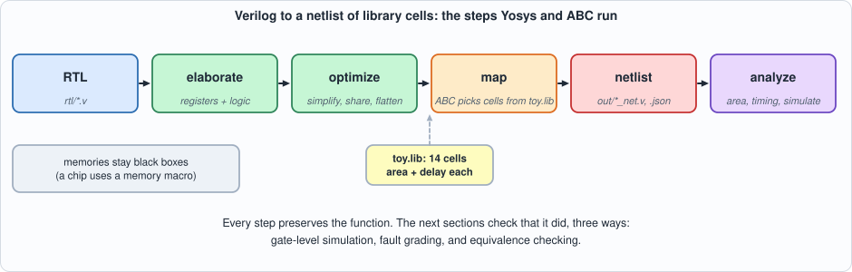
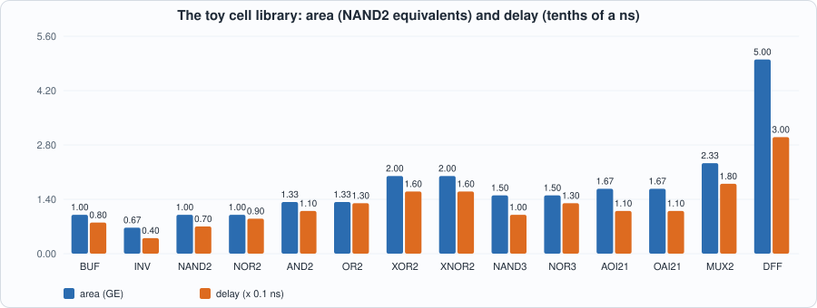
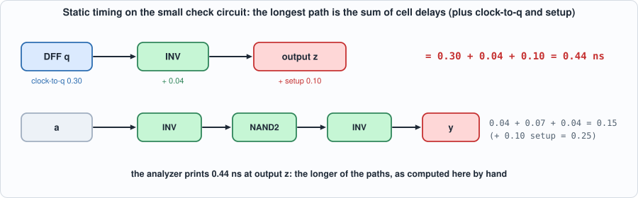
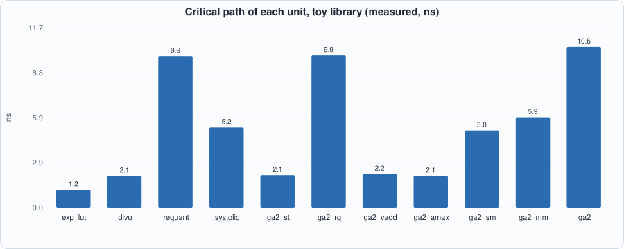
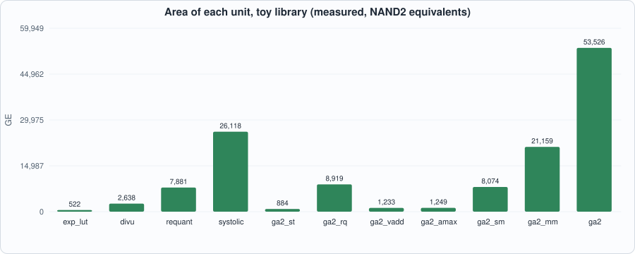
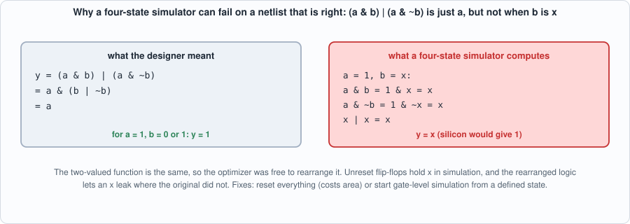
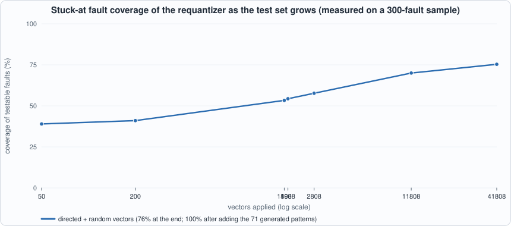
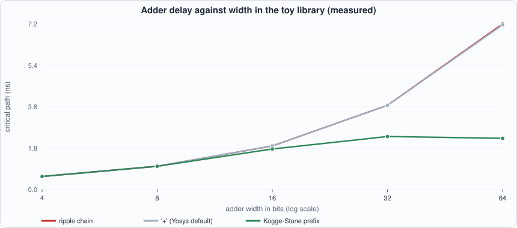
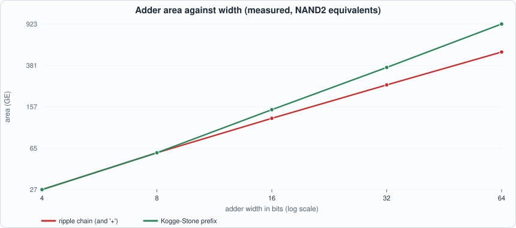
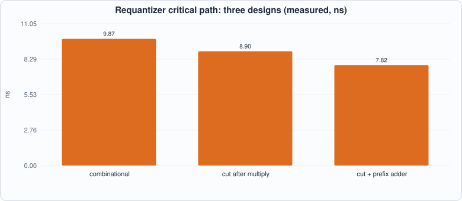

# 10. Synthesis, Timing and Gate-Level Verification


--8<-- "docs/assets/art/ch-10.md"


**What you will understand:** what happens between "the Verilog passes its tests" and "there is a netlist of gates you could manufacture": **synthesis** to a standard-cell library, **area and timing** read off the result, and the three ways a chip team checks that the netlist still does what the RTL did: **gate-level simulation**, **fault grading**, and **equivalence checking**. Along the way the flow hits a famous trap (X-pessimism) and the tests find a bug in the *testbench*.

**What you need to know first:** Chapters 1-9. Appendix G (the EDA flow) is the background on synthesis, libraries and timing. Every number below is for a **toy cell library** invented for this book (areas in NAND2 equivalents, one made-up delay per cell). It is a scale for comparing designs and a way to exercise a real flow, not a process: no number here predicts a real chip's area, speed or power.

**What this chapter builds:** `tools/gen_toylib.py` (the toy library), `tools/synth.py` (the Yosys flow and a 60-line static timing analyzer), `tools/netlist.py` and `tools/ch10_faults.py` (fault grading and test generation), `tools/ch10_run.py`, `tools/mut_ch10.py`, and for the running examples `rtl/demo_add.v`, `tb/demo_add_tb.v`, `rtl/requant_p2.v`, `tb/requant_p2_tb.v`, `tb/requant_p2k_tb.v`, `tools/ch10_example_a.py` and `tools/ch10_example_b.py`.

## Why this chapter: "it passes the tests" is not "it can be built"

Until now the circuits were *descriptions*: they simulate correctly, and Yosys has given us gate *counts*. A chip needs more. It needs a **netlist** mapped onto the cells the factory's library actually provides, an answer to "how fast can the clock run?", and some evidence that the netlist still does what the RTL did. Each of those is a place where a correct design can go wrong without anyone writing a bug: the optimizer is not perfect, the simulator can be too pessimistic, and the tests may never have exercised half the gates.

Two questions organize the chapter. **How fast, and what sets the clock?** (timing) and **are we sure?** (verification of the netlist). The two examples at the end answer the first with experiments you can change and rerun.

## The flow

Synthesis turns the RTL into a **netlist**: a graph of library cells and flip-flops.


*Figure 10.1: the flow. Mapping chooses cells from the library; the netlist is then analysed and simulated.*

```text
RTL (Verilog)  --elaborate-->  logic + registers  --optimize-->  --map to cells-->  netlist
                                                                    (Yosys + ABC, toy library)
```

Memories are not synthesized into flip-flops: a chip uses a **memory compiler's macro**. Here the scratchpad and the operand memories stay as black boxes in the netlist and are simulated by their behavioural models.

### The toy library: `tools/gen_toylib.py`

```python
--8<-- "tools/gen_toylib.py"
```


*Figure 10.2: the toy library: a NAND2 is the unit of area (1.0); an XOR is twice as big and about twice as slow; a flip-flop is five NAND2s.*

One table generates both the file synthesis reads (`lib/toy.lib`) and the simulation models (`lib/toy_cells.v`), so the two cannot disagree. (Chapter 10's mutation run deliberately breaks that guarantee to see if the tests notice.)

### The flow and a small timing analyzer: `tools/synth.py`

```python
--8<-- "tools/synth.py"
```

`synth` runs Yosys: elaborate, optimize, flatten, legalize the flip-flops, map them and the logic to the toy library, write a Verilog netlist and a JSON netlist. `sta` is a **static timing analyzer** in 60 lines: it adds up cell delays along the longest path between flip-flops (or macros, or ports). It ignores wires, fan-out and clock skew. **How to read timing.** Every path starts at a flip-flop (or an input) and ends at a flip-flop (or an output). Its delay is the clock-to-q of the starting flip-flop, plus the delay of each gate on the way, plus the setup time of the end. The slowest path sets the **clock period**: the clock cannot tick faster than the signal can cross it. A **cell's delay depends on what it is**, a gate's **depth** is how many cells deep the path is, and a design is *as fast as its slowest path*, however fast the rest is. Is the analyzer right? It is checked on a circuit small enough to do by hand:

```text
--8<-- "out/ch10_run_out.txt:17:19"
```


*Figure 10.3: the hand check of the timing analyzer. The output z is reached through a flip-flop (0.30 clock-to-q), an inverter (0.04) and the 0.10 setup: 0.44 ns.*

## Results

```python
--8<-- "tools/ch10_run.py"
```

**Output (cloud sandbox -- live-executed; Yosys 0.33, Icarus Verilog 12.0, Verilator 5.020)**

```text
--8<-- "out/ch10_run_out.txt"
```

### Reading it

- **Area.** The whole chip, apart from its memories, is 31,580 cells: 53,526 NAND2 equivalents and 1,987 flip-flops. The biggest pieces are the matrix unit (21,159 GE, containing the 4 x 4 array), the softmax unit (8,074) and the requantizer (7,881, and again inside `RQ`). The array synthesized on its own comes out larger (26,118 GE) than the matrix unit that contains it; the reason was not investigated (plausibly, outputs that the matrix unit never uses are pruned there). The 4,096 x 32-bit scratchpad is not in the count: it is a macro.
- **Timing.** The longest path in the whole chip is 10.47 ns (81 gates deep), about **96 MHz in this toy library**, and it ends at the scratchpad's write data. It begins at the scratchpad's read data: the path **scratchpad read -> requantizer -> scratchpad write**, all in one cycle. The requantizer alone is 79 gates deep (9.87 ns): the 32 x 24-bit multiplier, the rounding adder, the shifter and the clamp are all in one combinational stretch. Every other unit is 2 to 6 ns. **One unit sets the clock for the whole chip.** The fix real designs make is to pipeline it, with a register in the middle and an extra cycle of latency. Running example B below does that experimentally, and finds that *where* the register goes, and what else is on the path, matter more than one might expect: a first attempt, cutting after the multiplier, gains only 1.11x, and the cure turns out to be a faster adder.

*Figure 10.4 (measured): critical path by unit. The requantizer (9.9 ns) and the RQ unit that wraps it are far above every other unit; the chip's 10.5 ns is their path plus the scratchpad's access time.*


*Figure 10.5 (measured): area by unit. The array and the matrix unit dominate; the requantizer is the biggest vector unit.*

- **Registers.** Only the units with state have flip-flops (the divider's 249 are its numerator, quotient and remainder).

## Gate-level simulation: the same tests on the netlist

The strongest cheap check that synthesis did not change behaviour is to run the **same testbench and the same programs** on the netlist. The gate-level run drives the netlist of toy cells with Chapter 7's 78-program suite and compares memory and all five cycle counters with the Python reference. In Verilator it **passes: the synthesized chip takes exactly the same cycles and produces exactly the same memory** (219,583 cycles; the netlist now includes the UNPACK unit of Chapter 13). It runs slowly (about two minutes in Verilator for the whole suite, five in Icarus): a 31,000-cell netlist is a lot to evaluate.

### The trap: X-pessimism


*Figure 10.6: the mechanism. The expression is just `a`, but evaluating each piece with an unknown `b` gives `x`.*

In Icarus the same netlist **fails** from the very first program, with the external memory left unchanged. Verilator passes. The cause is not a logic error, and the evidence is that giving the flip-flops a defined power-up value (the `POWERUP_ZERO` option of the cell model) makes Icarus pass the same programs with the same counters.

Icarus is four-state (0, 1, `x`, `z`). In the RTL, registers that are not reset simply hold `x` until the first time they are loaded, and nothing reads them before that. After synthesis, the logic has been rearranged by an optimizer that only had to preserve the *two-valued* function. A rearrangement that is equivalent for 0 and 1 may not be for `x`: for example `(a & b) | (a & ~b)` is just `a`, but with `b = x` the unsimplified form evaluates to `x`. Idle units' unreset address registers therefore leak `x` into the scratchpad's write address. This is **X-pessimism**: the simulator is more pessimistic than silicon, which has a definite 0 or 1 in every flip-flop. Teams respond by resetting every flop (which costs area) or by starting gate-level simulations from a defined state. The book does the second and says so.

That raises a fair question: *does the chip work from any power-up state?* Verilator can start every register at a random value. With three different random seeds the 30-program suite passes each time.

**A bug in the testbench.** The first random power-up run (seed 1) failed. The symptom was a stray word `deadbeef` at the front of the data: the testbench's memory model returns that value for out-of-range addresses, and it had answered a request issued by the chip's random power-up state in the very first clock, *before reset had taken effect*. The answer arrived while the real first load was starting. A real memory system is reset with the chip, so the fix is in the testbench: the memory model now discards every request in flight when `rst` is high (`tb/extmem_rw.v`). The chip was right; the first test had been written for a world in which power-up state is always zero.

## Fault grading: how good are the tests at the gate level?

A manufactured chip can have defects. The simplest model of one is a **stuck-at fault**: one gate output is permanently 0 or 1. A test set is judged by the fraction of faults it **detects**, meaning it makes some output differ from a good chip. This is the gate-level answer to the question mutation testing answered for the RTL.

```python
--8<-- "tools/ch10_faults.py"
```

```verilog
--8<-- "tb/requant_fault_tb.v"
```

**Output (cloud sandbox -- live-executed)**

```text
--8<-- "out/ch10_faults_out.txt"
```

The experiment samples 150 of the requantizer's 5,403 gate outputs (300 stuck-at faults) and applies the golden vectors until each fault is detected.

- **Directed and random vectors alone detect 76% of the testable faults**, even with 41,808 vectors: coverage rises quickly at first (39% after 50 vectors) and then crawls (70% after 11,808, 75% after 41,808). The directed tests of Chapter 3 detect 53% by themselves.
- **Faults the vectors missed were not redundant.** An **equivalence checker** (ABC's `cec`, which proves two netlists compute the same function or produces an input on which they differ) was asked, for each of the 74 undetected faults, whether the faulty circuit is equivalent to the good one *with the mantissa normalized* (its top bit held at 1, the book's operating condition). In 3 cases it is: those faults are **redundant** (no input can ever show them, so no test can detect them and they are not defects that matter). For the other 71 it returned a distinguishing input.
- **Those 71 inputs are test vectors.** They are legal operands (e.g. `acc = 997757377`, `m = 12553790`, `s = 48`) with carry patterns in the 56-bit rounding adder that random operands almost never produce. Appending them as golden vectors raises the detection to **297 of 297 testable faults (100%)**. This is **automatic test pattern generation** (ATPG) by equivalence checking: the tool, not the engineer, finds the missing tests.
- **The lesson for a functional test suite.** Thousands of random vectors that pass the golden-model comparison say little about whether *every gate* is exercised. Real chips therefore add **design-for-test** structures (scan chains, which let a tester set and read every flip-flop) and run an ATPG tool. The mutation score of Chapter 3 (15 of 15) and the 76% fault coverage describe the same suite from two sides: it is good at catching mistakes a designer would make and weaker at exercising every gate.

*(Sample size: 150 nets, not all 5,403. The percentages describe that sample.)*


*Figure 10.7 (measured): the coverage curve is steep at first and then nearly flat. Closing the last 24% took 71 specific vectors from the equivalence checker.*

## Running example A: how fast can an adder be?

*The point of this example:* the whole chapter's timing story rests on one fact, that a long chain of dependent gates is slow. The adder is the cleanest place to see it, and to see a choice a designer actually has. This example synthesizes adders of width 4 to 64 in three styles to the toy library and times each with the book's analyzer: `a + b` (let the tool choose), a hand-built **ripple-carry** chain (Chapter 1's design), and a **Kogge-Stone parallel-prefix** adder, which computes every carry in log2(width) levels. The three are first proved equal to `a + b` on all 65,536 pairs of 8-bit inputs in both simulators.

```verilog
--8<-- "rtl/demo_add.v"
```

```python
--8<-- "tools/ch10_example_a.py"
```

To compile and run: `python3 tools/ch10_example_a.py` (about a minute; it runs Yosys 30 times). The correctness check is `iverilog -g2012 -s demo_add_tb rtl/demo_add.v tb/demo_add_tb.v && vvp -n a.out` (PASS on all 65,536 pairs in both Icarus and Verilator).

**Output (cloud sandbox -- live-executed; Yosys 0.33, toy library)**

```text
--8<-- "out/ch10_example_a_out.txt"
```


*Figure 10.8 (measured): the ripple chain and the tool's `+` coincide and climb linearly; the prefix adder flattens.*


*Figure 10.9 (measured): the price of speed. At 64 bits the prefix adder has 1.8 times the ripple chain's area.*

**Walkthrough.**

1. *Reading a netlist.* The 4-bit `+` became 17 cells. Follow bit 1: `NAND2(a1, b1)` and `XOR2(a1, b1)` feed an `XNOR2` that makes `s[1]`; the carry out of bit 1 is `OAI21(_00_, _02_, _01_)`. That one OAI21 is the entire carry logic of the stage: it takes `NAND(a0, b0)` (the carry from bit 0), `NOR(a1, b1)` and `NAND(a1, b1)`. Each stage's carry waits for the previous stage's, which is the ripple.
2. *Delay is proportional to width for a ripple chain:* 0.57, 1.01, 1.89, 3.65 and 7.13 ns for 4, 8, 16, 32 and 64 bits, almost exactly doubling with width.
3. *The tool's `+` is that same chain.* Yosys 0.33's default flow maps `+` to a ripple structure (its numbers equal the hand-built chain's within rounding). This is a finding about this flow; a commercial tool, or Yosys with other options, may do otherwise. The practical rule: **do not assume the tool will make an adder fast.**
4. *The prefix adder.* At 64 bits it is 2.22 ns against 7.17: 3.2 times faster, with 1.8 times the area (923 against 507 GE). Its delay grows by 3.9x for a 16-fold increase in width, against 12.6x for the ripple chain. It starts to win between 8 and 16 bits (the small-width numbers are equal).
5. *The lesson for the rest of the chapter.* The requantizer's critical path is 79 gates deep, and a good share of that is two long ripple adders (the multiplier's final addition and the 57-bit rounding adder). Example B uses exactly this fix.

## Running example B: pipelining the requantizer

*The point of this example:* the chip's clock is set by the requantizer (Figure 10.4). Real designs fix this by **pipelining**: put a register in the middle of the long path so that each half has a full clock period, at the price of an extra cycle of latency and some flip-flops. Here the requantizer is cut in two, proved correct, timed, and then improved a second time. It is an experiment with a surprise.

```verilog
--8<-- "rtl/requant_p2.v"
```

```python
--8<-- "tools/ch10_example_b.py"
```

To compile and run: `python3 tools/ch10_example_b.py` (about a minute). It first regenerates the 201,808 golden vectors of Chapter 3 and runs both pipelined designs against them (one-cycle latency) in both simulators.

**Output (cloud sandbox -- live-executed; Yosys 0.33, toy library)**

```text
--8<-- "out/ch10_example_b_out.txt"
```


*Figure 10.10 (measured): three versions of the requantizer.*

**Walkthrough.**

1. *Correctness first.* Both pipelined versions match the golden vectors on all 201,808 cases in Icarus and Verilator, with the one-cycle latency the testbench allows for. A change that makes a unit faster has to pass the *same* tests as the original, and does.
2. *The first cut disappoints.* Putting the register after the multiplier gives 8.90 ns against 9.87: **only 1.11x faster**. Looking at the two halves separately explains why: stage 1 (the multiplier) is 8.23 ns, but stage 2 is 8.39 ns and 72 gates deep, although all it does is add a constant, shift and clamp.
3. *The reason is a ripple chain.* Stage 2's 57-bit addition is built by Yosys as a ripple chain (Example A). Replacing it with a Kogge-Stone adder takes stage 2 from 8.39 to 4.76 ns, and the whole two-stage design to **7.82 ns, 1.26x faster than the original**, for 64 flip-flops and about 4% more area, plus one cycle of latency per requantization.
4. *What is left.* Now stage 1, the multiplier (about 8 ns), is the limit. Going further means pipelining *inside* the multiplier or choosing a different multiplier structure. Each added stage costs a cycle of latency per `RQ` and 64-odd flip-flops.
5. *The whole chip (an estimate, not a re-synthesis).* The chip's 10.47 ns path goes scratchpad read, requantizer, scratchpad write. If only the requantizer improves by 1.26x, scaling that path gives about 8.3 ns: still the slowest block in the chip. To reach the next-slowest unit (the matrix unit at 5.9 ns) the requantizer would need a third stage. (An earlier version of this page said that a single cut would reach 5 to 6 ns. The experiment shows that was too optimistic.)
6. *A caveat about noise.* ABC maps each synthesis run separately, so a block's delay changes by a few percent between standalone and inside a bigger design. Read the 1.11x and 1.26x as the right order of magnitude, not as exact figures.
7. *The cost to the program.* Chapter 7's cycle model gives `RQ` on n words as n + 2 cycles; a two-stage requantizer makes it n + 3. A program with R requantize instructions loses R cycles in total, tiny against thousands of cycles of work, in exchange for a clock about a quarter shorter.

## Testing the tests of the flow

The flow itself can be wrong: the library description that synthesis reads can disagree with the simulation models. The mutation script gives synthesis a wrong function for one cell at a time and checks that gate-level simulation of the requantizer notices.

```python
--8<-- "tools/mut_ch10.py"
```

**Output (cloud sandbox -- live-executed)**

```text
--8<-- "out/ch10_mutation_out.txt"
```

Every wrong function that the mapper actually *used* is caught: XNOR2, NAND2, NOR2, MUX2, AOI21 and AND2 (the mapper used between 126 and 1,298 of each) fail the simulation, and the INV and BUF mistakes break synthesis itself. Five survive and each is an **equivalent mutant of the flow**: the mapper used **zero** XOR2, OAI21, NAND3, NOR3 and OR2 cells for this design, so a wrong description of them cannot change the netlist. (It would for another design. The check is only as broad as the circuit it runs on.)

## Common mistakes

- **Reading a gate count as a speed.** Cell counts are area; speed is the longest path. Two adders with equal area can differ by a factor of three in delay.
- **Assuming the tool picks the fast structure.** Yosys's default `+` is a ripple chain (Example A). Check the netlist or the timing, and ask for the structure you want.
- **Pipelining at the wrong place.** The first cut of Example B improved the clock by 11%. Time the halves separately before deciding where the register goes.
- **Forgetting that pipelining changes latency.** The pipelined requantizer is correct only if everything around it expects its result one cycle later (the testbench, the sequencer, the cycle model).
- **Trusting a four-state simulation of a netlist from reset-less flops.** X-pessimism makes a correct netlist fail; start from a defined state, or reset.
- **Treating coverage by random vectors as proof.** 41,808 vectors found 76% of the gate-level faults; an equivalence checker found the rest.
- **Taking toy-library numbers as predictions.** They compare designs against each other; they say nothing about any real process.

## What this chapter does and does not establish

- **Established**: GA-2 synthesizes to 31,580 cells plus macros; the netlist runs all 78 programs with identical memory and cycle counters; it also passes from three random power-up states; a wrong cell description is caught whenever the design uses the cell; stuck-at fault coverage of the requantizer sample goes from 76% to 100% with generated patterns.
- **Not established**: anything about a real process. The areas and delays are those of a toy library; there is no place-and-route, wire delay, clock tree, power analysis or manufacturing test flow. The timing analyzer is a model. Formal equivalence was shown on the requantizer's faults, not between the RTL and the netlist of the whole chip.

## Chapter summary

Synthesis maps the RTL onto a cell library; area and a longest-path timing figure follow from the netlist (here 53,526 NAND2 equivalents and a 10.5 ns critical path through the requantizer, which is the unit to pipeline). The netlist passes the same program suite as the RTL, but a four-state simulator needs a defined power-up state to avoid X-pessimism, and random power-up testing exposed a stray-response bug in the testbench. Fault grading shows that a suite that finds every RTL mutant still detects only 76% of gate-level faults, and equivalence checking both classifies the rest and generates the missing tests.

## Self-check questions

1. Why does the toy library come with two files generated from one table?
2. The critical path of the chip is `sp.rdata -> ... -> sp.wdata`. Which unit is on it, and what would you change?
3. What is X-pessimism, and what evidence shows that the Icarus failure was not a logic error?
4. Why did the first random power-up run produce `deadbeef` in the data, and who was at fault?
5. What does it mean that 3 faults were "proven redundant", and why is detecting them not a goal?
6. A path has a flip-flop (clock-to-q 0.30), gates of delay 0.07, 0.16, 0.11 and 0.04, and a setup of 0.10. What is the shortest clock period this path allows?
7. In Running example A the 64-bit prefix adder is 3.2 times faster than the ripple chain with 1.8 times the area. If the adder were on the critical path of a design that is 20% adder and 80% other logic at the same clock, how much faster could the whole design clock?
8. Why does Running example B's first cut (after the multiplier) improve the clock by only 11%?

## Exercises

1. **Another width.** Run Example A for width 12 and 24 (not powers of two). Does the Kogge-Stone design still work (it passes the 8-bit exhaustive test; try your own check at 12 bits with random inputs) and where does it land between its neighbours?
2. **Add a stage.** In `requant_p2.v`, add a second pipeline register that splits stage 1 (for example, register the magnitude before the multiplier). Predict whether that helps, then measure. What is the new latency of `RQ`?
3. **Another library.** Change the delay of XOR2 in `tools/gen_toylib.py` to 0.30 ns (a slow XOR) and rerun Example A. Which adder style is hurt most, and why?
4. **Balanced cuts.** Find the best position for a single register in the combinational requantizer by trying three cuts of your own design (for example, after the rounding addition). Report the critical path of each.
5. **Reset everything.** Add a reset to every flip-flop of the Chapter 7 chip's units (or just to `ga2_rq`), resynthesize and compare area with the X-pessimism fix the book uses. What does "reset everything" cost?

