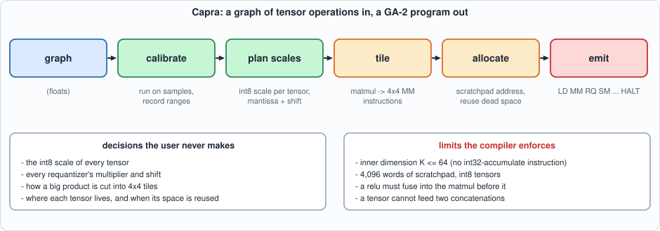
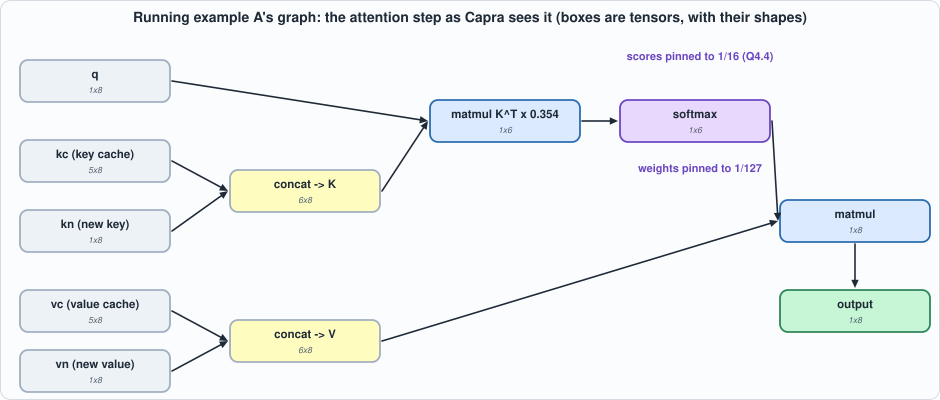
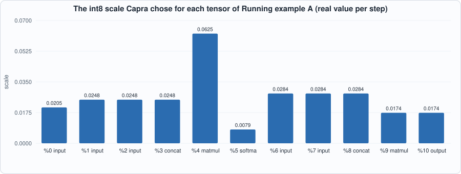
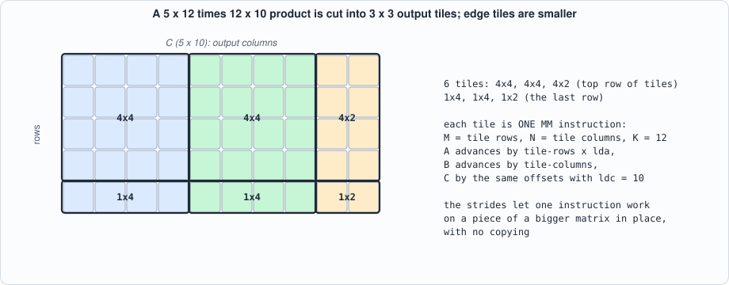
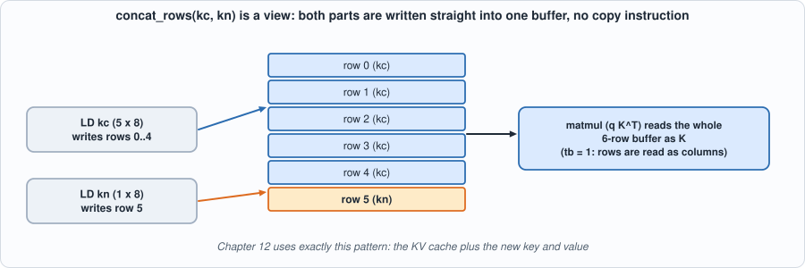
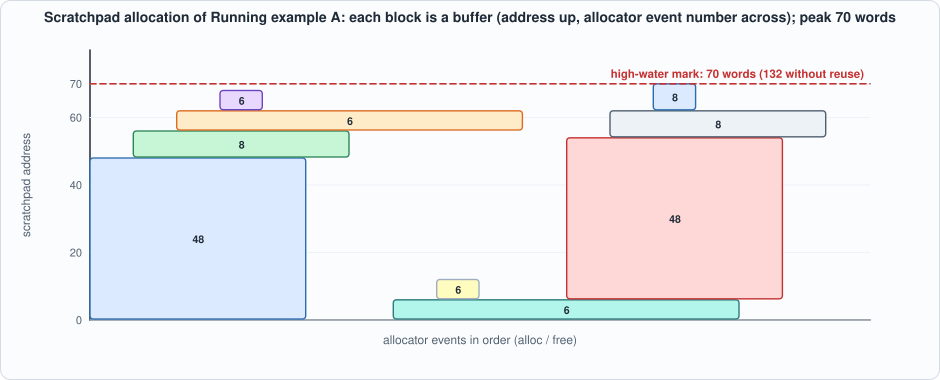
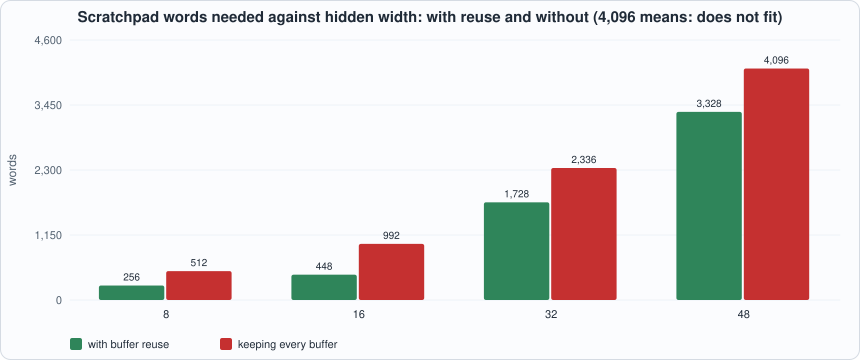
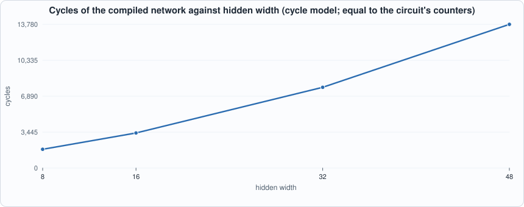
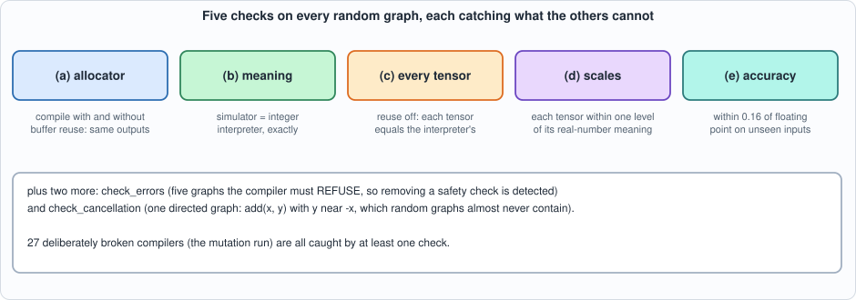

# 11. Capra, the Compiler: From a Tensor Graph to GA-2 Instructions


--8<-- "docs/assets/art/ch-11.md"


**What you will understand:** how **Capra** (named for *Capra*, the genus of the wild goats and ibexes) turns a model, written as a graph of tensor operations in floating point, becomes a program for the chip of Chapter 7 that no human wrote: how the compiler **chooses an int8 scale for every tensor**, **cuts big matrix products into the 4 x 4 tiles** the hardware can do, **places tensors in the 4,096-word scratchpad and reuses the space** as soon as they are dead, and **emits** instructions. You will also see how a compiler is tested: against a plain-Python interpreter, against the meaning of each number, against its own allocator, and against graphs it must refuse.

**What you need to know first:** Chapters 3 (quantization), 7 (the ISA) and 8-9 (programs written by hand, which is what this chapter automates). Appendix D (ML linear algebra) covers matrices and matrix products if they are unfamiliar.

**What this chapter builds:** `model/capra.py` (the compiler: graph IR, calibration, scale planning, tiling, allocator, emitter, two interpreters), `model/capra_tests.py` (the test battery), `tools/ch11_run.py`, `tools/mut_ch11.py`, and for the running examples `tools/ch11_example_a.py` (compile one graph pass by pass) and `tools/ch11_example_b.py` (write your own graph).

## Why a compiler

Chapters 7 to 9 showed what programming this chip by hand is like. For the 10-instruction network of Chapter 7 it was tolerable. For the attention step of Chapter 8 it took several screens of Python that chose addresses, strides, tile loops, and eight pairs of requantizer constants; a single wrong address or shift gave a plausible, wrong answer. A real model has hundreds of such steps. The work is mechanical, error-prone and exactly the kind a program should do.

A **compiler** is that program. The user writes *what* to compute (a graph of tensor operations, in ordinary floating point) and the compiler decides *how* the chip does it: which int8 scale each tensor gets, how a product that is too big for the array is cut up, where each tensor lives in the scratchpad and when that space can be reused, and which instructions to emit. The name **Capra** is the genus of the wild goats and ibexes: surefooted animals that find a route up a cliff, a fair description of what a compiler does with a graph and a very small memory.

The compiler is also where the whole book's methods meet. It must be *correct for every graph* (not just for the ones its author tried), so it is tested against an interpreter, against the real-number meaning of each tensor, against itself with the allocator switched off, and against graphs it must refuse.

## Where the compiler sits

```text
 graph of tensor ops (float)
        |  calibrate: run on sample data, record each tensor's range
        v
 scale planning   -> an int8 scale per tensor; a multiplier + shift per requantizer
        v
 tiling           -> each matmul becomes 4 x 4 output tiles (MM instructions)
        v
 allocation       -> a scratchpad address for every tensor, reusing dead space
        v
 emission         -> LD / MM / RQ / SM / VADD / AMAX / ST ... HALT
```


*Figure 11.1: the pipeline. Each stage hands a more concrete description to the next.*

The input is a small **graph IR**: tensors are 2-D, and the operations are `input`, `weight`, `matmul` (optionally with the second operand transposed and a constant factor), `softmax` (per row), `add`, `relu`, `concat_rows`, `argmax` (per row) and `output`. That is exactly what a transformer decode step needs; Chapter 12 uses it for one.

## Capra: `model/capra.py`

```python
--8<-- "model/capra.py"
```

**Reading the code.** Four things are worth looking for. `Graph` and `Node` are the whole IR: a graph is a list of nodes, each with an operation, the ids of its inputs and a shape; the methods (`matmul`, `softmax`, `concat_rows`...) check shapes at construction, so a bad graph fails when built. `plan_scales` uses a union-find to group tensors that must share a scale, then looks at calibration ranges. `Allocator` is a first-fit allocator with coalescing: the classic malloc algorithm on a 4,096-word arena. `compile_graph` is one pass over the nodes in order, emitting instructions as it goes; the tiling loops are the two nested `for` loops over `i0` and `j0` in the `matmul` branch.

What it decides, in order:

1. **Calibration** (`plan_scales`). The graph is evaluated in floating point on sample inputs; each tensor's largest absolute value gives its int8 scale (`max / 127`). Tensors that must share a scale form a group: the parts of a concatenation and its result, or the input and output of a `relu`. Two scales are **pinned** by the hardware: a softmax's input must be in Q4.4 (1/16) and its output is a probability (1/127). An `add` does *not* force a shared scale: the compiler **rescales** an operand whose scale differs from the sum's, with an `RQ` from int8 to int8.
2. **Requantizers.** For `matmul` the multiplier is `factor x scale_a x scale_b / scale_out`, turned into the 24-bit mantissa and shift of Chapter 3.
3. **Tiling.** A product of an `M x K` and a `K x N` matrix becomes `ceil(M/4) x ceil(N/4)` `MM` instructions, each with the right strides (`lda`, `ldb`, `ldc`) and the transpose flag. The matrix unit's limit `K <= 64` is a compile error, not a surprise.
4. **Allocation.** Each tensor gets a buffer; a concatenation's inputs become **views** of its output buffer (so the concatenation costs no instructions: the producers write straight into place), and a fused `relu` shares the buffer of its producer. Buffers are allocated first-fit when first needed and **released after their last consumer**, with coalescing.
5. **Emission.** Weights and inputs are loaded just before first use, outputs stored at the end, softmax and argmax emitted row by row.

Two interpreters accompany it (`interpret` and `stagewise_problems`), written for testing and discussed below.

## An example, compiled

```python
--8<-- "tools/ch11_run.py"
```

**Output (cloud sandbox -- live-executed; Icarus Verilog 12.0, Verilator 5.020)**

```text
--8<-- "out/ch11_run_out.txt"
```

### Reading it

- **Section 1** shows the whole pipeline on a two-layer network with a residual connection and a softmax head. The compiler chose a scale for every tensor, fused the `relu` into the first matmul's requantizer, inserted two rescales (instructions 17 and 18) for the residual `add`, whose operands (scales 0.0376 and 0.0325) differ from the sum's (0.0438), emitted 38 instructions in all, and needed 280 of the 4,096 scratchpad words. The class decision agrees with floating point on all five rows, and the probabilities are 2.0% off.
- **Section 2** compiles twelve random graphs the test battery has never seen, puts them on the RTL, and compares with the reference simulator: **identical memory and cycle counters, in both simulators**. Their error against floating point is 0-3.7%.
- **Allocation matters.** On those graphs, reuse cuts the scratchpad footprint to 43-85% of what keeping every buffer would need. In section 3 a six-layer network of 32 x 32 layers compiles to 111 instructions in **1,792 words** with reuse, and **fails** without it ("scratchpad is full"): its weights alone (6 x 1,024 words) exceed the memory.

## Running example A: compile one attention step, pass by pass

*The point of this example:* to see every decision the compiler makes, in order, on a graph small enough to follow. The graph is a single decode-step attention head (Chapter 8's computation): a query against a key cache plus a new key, a softmax, and a weighted sum of a value cache plus a new value. The script prints what each stage decided, records the allocator's events as it runs, and checks the result.

```python
--8<-- "tools/ch11_example_a.py"
```

To compile and run: `python3 tools/ch11_example_a.py` (pure Python; instant).

**Output (cloud sandbox -- live-executed)**

```text
--8<-- "out/ch11_example_a_out.txt"
```


*Figure 11.2: the graph the user writes in ten lines.*

**Walkthrough, pass by pass.**

1. *Pass 0, the graph.* Eleven nodes. Node %4 is a matmul with `^T` (the key matrix is used transposed) and a constant factor 0.3536 = 1/sqrt(8), the attention scaling. The two `concat` nodes append the new key and value to the caches.
2. *Pass 1, calibration.* The graph is evaluated in floating point on 20 sample input sets, and each tensor's largest absolute value is recorded: the scores reach 2.55, the softmax output 0.74, the final output 2.21.
3. *Pass 2, scales.* Normally scale = range / 127. Three things are different here. The scores (%4) are **pinned** to 1/16 because the softmax unit's input format is Q4.4: that scale is 0.0625, not 0.0201. The softmax output (%5) is pinned to 1/127 (a probability). And `kc`, `kn` and `kc`'s concatenation share **one** scale (0.02484, the largest of the three ranges), as do `vc`, `vn` and their concat: a buffer holds one scale. That is why `kn` shows range/127 = 0.0224 but scale 0.0248.
4. *Pass 3, requantizer parameters.* For the first matmul `M = 0.3536 x scale_q x scale_K / 0.0625 = 0.002874`, stored as the integer pair (12345120, 32), i.e. 12345120 / 2^32. Each requantizing node has such a pair.
5. *Pass 4, tiling.* Both matmuls have one row, so each becomes two `MM` instructions: columns 0-3 and the remaining columns (2 or 4 wide). A real model's matmuls would have many more tiles (Figure 11.4).
6. *Pass 5, allocation.* The allocator events show first-fit at work. The first four allocations (48, 8, 6 and 6 words) are the key buffer (cache plus new key, one buffer), the query, the scores, and the matmul's int32 accumulator. Once the scores are computed the key buffer and the query are released, and later the value buffer (48 words) is placed at address 6, on addresses the key buffer had used. The peak is **70 words** instead of 132 without reuse: a 47% cut on a graph with no waste to speak of.
7. *Pass 6, emission.* 15 instructions. `LD` brings in the cache and the new key (the cache and the new row are loaded into one buffer, as the figure below shows), two `MM` tiles with `tb=1` compute the scores, one `RQ` brings them to Q4.4, `SM` is the softmax, `RQ` makes int8 weights, a second `LD` brings the value cache, two more `MM` tiles do the weighted sum, an `RQ` and an `ST` finish. On GA-2 it takes 484 cycles.
8. *Checks.* The simulator's output is **exactly** the integer interpreter's; the stage-wise real-number check finds no problems; the error against floating point is 2.4%.


*Figure 11.3: the scales. The two pinned tensors (the scores at 1/16 = 0.0625 and the softmax output at 1/127 = 0.0079) stand out; the others follow their ranges.*


*Figure 11.4: tiling a larger product (the five-row product of Section 1's graph). Each outlined tile is one `MM` instruction; the edge tiles are smaller.*


*Figure 11.5: a concatenation is a view. Both parts are written into the same buffer at the right row offsets, so the concatenation costs no instruction.*

*Later chapters extend the IR.* Chapter 13 adds `weight(..., bits=4)` (packed int4 weights) and Chapter 16 adds `slice_rows`, the reverse of `concat_rows`: a **view** of some rows of a tensor, with no instruction and no copy, which is how a causal mask is built without a mask operation.


*Figure 11.6: the allocator's events drawn as a memory map. The key-side buffers (left) are freed before the value-side buffers (right) are placed, partly on top of the same addresses.*

## Running example B: write your own graph

*The point of this example:* the compiler is only useful if you can give it your own network. `tools/ch11_example_b.py` is a template: the function `build` makes a residual network with a softmax head; edit it to describe yours. The script compiles it, runs it on the reference simulator and on the RTL in both simulators, compares with floating point, sweeps the hidden width to see how footprint, cycles and accuracy move, and shows the exact messages for the graphs Capra refuses.

```python
--8<-- "tools/ch11_example_b.py"
```

To compile and run: `python3 tools/ch11_example_b.py` (about a minute; it runs the RTL twice).

**Output (cloud sandbox -- live-executed; Icarus Verilog 12.0, Verilator 5.020)**

```text
--8<-- "out/ch11_example_b_out.txt"
```


*Figure 11.7 (measured): footprint against width. At width 48 the program needs 3,328 words with reuse; without reuse it does not fit.*


*Figure 11.8 (cycle model, equal to the circuit's counters): cycles grow faster than linearly with width, since the weight matrices grow with its square.*

**Walkthrough.**

1. *The default graph.* 40 instructions, 1,728 scratchpad words, 7,740 cycles. The compiled class decisions agree with floating point, the probabilities are 2.9% off, and **the RTL in both simulators matches the reference simulator's memory and cycle counters exactly** (7,740 cycles). The program that no human wrote runs on the chip.
2. *The width sweep.* With hidden width 8, 16, 32 and 48 the program grows from 28 to 48 instructions, and the scratchpad need from 256 to 3,328 words with reuse. Without reuse the 48-wide network (4,096 words or more) does not fit at all. At width 64 even reuse does not help: a single 64 x 64 weight is the whole scratchpad, and Capra reports it.
3. *A class that flipped.* At hidden width 8 one sample gets class 1 instead of 6. The two largest floating-point probabilities for that sample are 0.166 and 0.165, a gap of 0.001: with an error of about 2% in the probabilities such a near-tie can reorder. The decision is unstable in the *floating-point* model too; nothing is wrong with the compiler. This is why accuracy is judged on probabilities, not on argmax, in check (e).
4. *Refusals.* Four of the five things the compiler will not do are shown with the exact messages: an inner dimension of 65 (the hardware has no instruction to accumulate across matrix-unit passes), a relu that cannot be fused into a requantizer, mismatched shapes, and a graph whose tensors do not fit the scratchpad. Each message names the cause, and each has a fix. A compiler that refuses clearly is much better than one that emits a wrong program.

## How a compiler is tested


*Figure 11.9: the battery. Each check sees a different kind of bug; the table of mutants shows what each one catches.*

A compiler's output is a program, and "does the program run" is not the question; the question is whether it computes the right thing for *every* graph. The battery in `model/capra_tests.py` generates random graphs (random shapes, matmul chains, fused relus, self-products, softmax heads, residual adds, concatenations, argmax outputs), compiles each twice (with and without buffer reuse), and applies five checks:

```python
--8<-- "model/capra_tests.py"
```

- **(a) The allocator.** The program with buffer reuse and the one that keeps every buffer alive must give identical outputs. A buffer freed too early, or two live buffers given overlapping space, makes them differ.
- **(b) Meaning.** The simulator's outputs must equal the integer **interpreter's**, which runs the graph in plain Python with no instructions, tiles or addresses.
- **(c) Every tensor.** With reuse off, every tensor read back from the scratchpad must equal the interpreter's, so a bug in the middle of the graph cannot hide behind a correct-looking output.
- **(d) Scales.** Every tensor must be within one level of the *real-number meaning* of its operation applied to the dequantized inputs (`stagewise_problems`). This check uses the planned scales but not the requantizer parameters, so it sees a wrong multiplier that (b) cannot (the interpreter shares the parameters with the compiler).
- **(e) Accuracy.** The dequantized outputs must stay within 0.16 of the floating-point result (relative error) on inputs **not** used for calibration; 0.16 is twice the worst error the correct compiler has on the 60 battery graphs (0.079).

Beyond random graphs, `check_errors` lists **five graphs the compiler must refuse** (inner dimension 65, a relu that cannot be fused, a tensor feeding two concatenations, buffers larger than the scratchpad, a relu on a tensor with another consumer) and `check_cancellation` is a directed case described below.

### What the tests found while the compiler was being written

None of these is an invented example; each was a failing check:

1. **A fused relu lost its place.** In a graph that concatenated the output of a relu with another tensor, the placement code gave the relu's output a view inside the concatenation buffer and then *overwrote* that placement with its producer's separate buffer. Check (a) failed, (b) failed, and (c) pointed at the exact tensor. The fix: the matmul under a relu takes the *relu's* location.
2. **Forced scale sharing saturates.** The first version made both operands and the result of an `add` share one scale. When one operand was a softmax output (pinned to 1/127, a range of 1.0) and the other an ordinary tensor reaching 3, the ordinary tensor clipped at 1.0 and the error was 50-100%. The principled fix is the rescale instruction described above. A second fix followed: the sum's scale must hold both **operands** (not just the sum) because two large operands that cancel would otherwise be clipped when rescaled.
3. **The generator was wrong too.** Concatenating a unit-variance input onto a tensor of magnitude 0.01 forces one scale on both and ruins the small one. That is not a compiler bug: real concatenations (a key cache and a new key) have matching magnitudes. The generator now creates partner inputs at the magnitude of what they join.
4. **A limit of per-tensor static scales.** Repeated squaring (`x x^T`, three times) spans orders of magnitude between samples; no single scale serves it. The generator allows one self-product per graph. This is a property of the technique, not a defect to fix.
5. **Cancellation.** In `add(x, y)` with `y` close to `-x`, int8 cannot hold the tiny sum however the compiler behaves: the correct compiler gets this wrong by 100% in relative terms. The accuracy check therefore cannot judge it. But a **compiler bug** that chooses the sum's scale from the sum alone (ignoring the operands) makes the rescaled operands clip, which the real-number check (d) sees. So the battery includes this one graph, with checks (a)-(d) only. Random graphs almost never contain a cancellation, and an experiment showed the mutant surviving until this directed case was added.

## Testing the tests

```python
--8<-- "tools/mut_ch11.py"
```

**Output (cloud sandbox -- live-executed)**

```text
--8<-- "out/ch11_mutation_out.txt"
```

All 27 broken compilers are caught: tiling mistakes (edge tiles, offsets, strides, the transpose flag), quantization mistakes (a dropped constant factor, a wrong operand's scale, a lost relu flag, a wrong probability scale, a wrong pinned scale, calibration keeping the smallest range), lowering mistakes (rows reading the wrong row, wrong destinations, a missing rescale, concatenation parts overlapping, a truncated load or store, overlapping external regions), allocator mistakes (releasing a buffer a step early, merging free blocks across a gap) and removed safety checks (the inner-dimension limit, relu fusion with another consumer, a tensor feeding two concatenations). The removed checks are caught only because the battery contains graphs the compiler must refuse; without `check_errors` those mutants survive.

One change survives and is **equivalent in effect**: an allocator that takes the next larger hole instead of an exact fit only differs when memory is nearly full.

## Common mistakes

- **Calibrating on too little data.** A range seen in 20 samples is not the range of the real inputs; values beyond it clip at +-127. Chapter 12 fixes the ranges of the KV cache from outside for this reason (`ranges=`).
- **Assuming per-tensor scales suit every graph.** Repeated squaring (`x x^T` three times) spans orders of magnitude and no single scale serves it. The technique has limits; the generator avoids that case and the page says so.
- **Forgetting that a relu must be fused.** In this IR a relu is not a separate instruction: it is a flag on the requantizer of the matmul before it. A relu after an `add` is refused.
- **Letting a tensor feed two places.** A tensor that is part of two concatenations cannot be a view of both. The compiler refuses; restructure the graph.
- **Trusting an accuracy number from a graph with cancellation.** `add(x, y)` with y near -x loses its significant bits in int8 however good the compiler is. The directed cancellation test checks the compiler's *behaviour*, not the accuracy.
- **Testing a compiler on the graphs its author thought of.** The random graphs and the five refusal graphs found bugs the author's examples did not.
- **Reading the compiled program as if it were hand-written.** It reuses scratchpad addresses on purpose: an address that looks overwritten is a buffer whose last reader has run.

## What this chapter does and does not establish

- **Verified**: on 60 battery graphs and 12 fresh ones, the compiled programs match the interpreter exactly, every tensor is consistent with its real-number meaning, the allocator is correct under reuse, and the programs run on the RTL with exactly the reference's memory and cycle counters.
- **Not covered**: a matrix product with `K > 64` (it needs an int32 accumulate instruction the ISA does not have; the compiler refuses it); scratchpad spilling; scheduling that overlaps loads with compute (the machine of Chapter 7 runs one instruction at a time); other operations (layer normalization, GELU); dynamic shapes; and anything about calibration data beyond random Gaussians. The accuracy numbers say nothing about a trained model.

## Chapter summary

The compiler turns a float graph into a GA-2 program in five steps: calibrate, plan scales, tile, allocate with reuse, emit. It was tested against an interpreter and the real-number meaning of every tensor, against itself with and without reuse, and against graphs it must refuse; 27 of 27 broken compilers were caught, and the process found a placement bug, a scale-sharing flaw in `add`, and a blind spot (cancellation) that needed a directed case.

## Self-check questions

1. Why does the compiler reject a matmul with `K = 65`, and what would the hardware need to support it?
2. Why was forcing both operands of an `add` to share a scale wrong, and what does the compiler do instead?
3. Why is check (c) run with buffer reuse switched off?
4. Which check catches "buffers are released one step too early", and why do the others not?
5. Why is the cancellation graph tested without an accuracy bound, and what bug does it exist to catch?
6. In Running example A, why does the scores tensor have scale 0.0625 although its range divided by 127 is 0.0201? What would go wrong with 0.0201?
7. In the 5 x 12 times 12 x 10 product of Figure 11.4, how many `MM` instructions are emitted, and what are their (M, N) values? What are `lda`, `ldb` and `ldc`?
8. At hidden width 48 the compiled network needs 3,328 scratchpad words with reuse and does not fit without it. At width 64 it fails even with reuse. Why?

## Exercises

1. **Your own graph.** Edit `build` in `ch11_example_b.py` so that the second layer is `matmul(h, w2, transpose_b=True)` with a square weight, and compile it. Does the output change? Why does it not change the footprint?
2. **Add a layer.** Add a third hidden layer to `build`. Predict whether it still fits the scratchpad at width 32, then check. Which of the checks would you rerun first after such a change?
3. **A refusal.** Make a graph that applies `relu` to the output of an `add` and read the error. Rewrite it so that the relu follows a matmul and compiles.
4. **Pin a scale.** Add `ranges={"tag": 4.0}` to a compile of a graph whose tensors you tag (`g.tag(node, "tag")`). What happens to that tensor's scale, and to the neighbours that share it?
5. **Read the allocator.** Modify Example A's graph so that the value cache is 20 rows instead of 5. Predict the new high-water mark before running, then check. Which buffer defines it?

