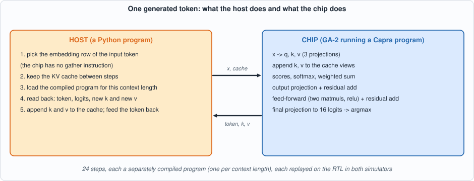
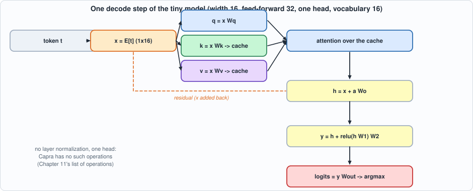
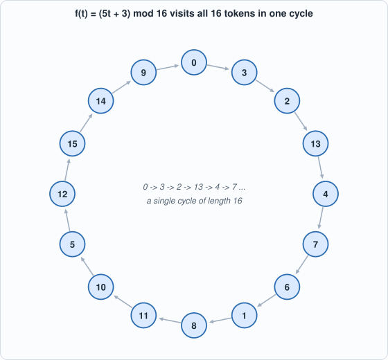
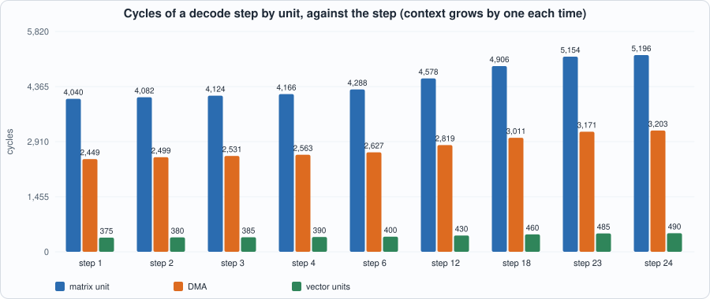
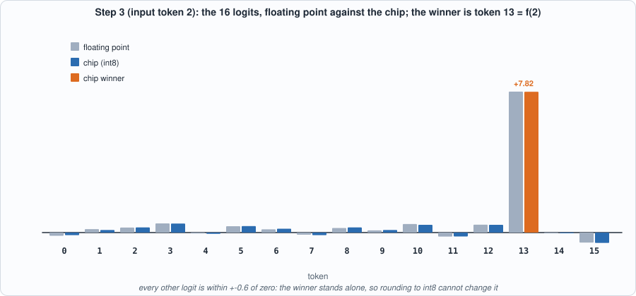
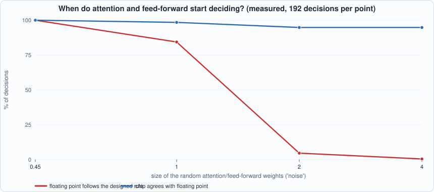

# 12. Capstone: A Tiny Transformer Decodes on the Chip


--8<-- "docs/assets/art/ch-12.md"


**What you will see:** everything in this book working together. A one-layer transformer written as a floating-point graph is turned by the compiler of Chapter 11 into GA-2 programs; a host loop feeds each chosen token back and keeps the KV cache of Chapter 8; the programs run on the Verilog of Chapter 7 in two simulators; and the 24 tokens that come out are the ones floating point produces and the ones a formula predicts. Then the capstone is turned on the hardware as a *test*, and it shows what an end-to-end workload can and cannot tell you about a chip.

**What you need to know first:** Chapters 7-11. There is little new machinery here: this chapter is the assembly and the audit. Appendix E (transformers and LLM inference) describes the model that this chapter builds in miniature.

**What this chapter builds:** `model/tiny_lm.py` (the model, its floating-point reference, the graph builder and the host loop `Chip`), `tools/ch12_run.py`, `tools/mut_ch12.py`, and for the running examples `tools/ch12_example_a.py` and `tools/ch12_example_b.py`.

## Why a capstone

Eleven chapters built and tested pieces. A reader should be allowed to ask whether the pieces work *together*, and the honest way to answer is a workload that exercises all of them: a language model that produces text, token after token, through the compiler, the instruction set, the scratchpad, the matrix, vector and softmax units, and the Verilog, in both simulators.

A language model here is a function from a token (a number from 0 to 15) to the next token, built from the operations of Chapter 8's attention step plus a feed-forward block, with the KV cache kept between steps. It generates by feeding its own output back as input, one token per step. Nothing about the loop is specific to this size: a model with billions of weights does the same thing with bigger matrices.

The capstone is deliberately designed to be *checkable*. Its weights are built so that the right next token is known in advance by a formula; then three independent routes (the formula, a floating-point implementation, and the chip) must agree, and a disagreement points at the pipeline, not at a vague question of whether the model is good.


*Figure 12.1: the division of labour. The chip runs a compiled program per token; everything the instruction set has no instruction for (the embedding lookup, the cache) belongs to the host.*

## The model, and what it is not

```python
--8<-- "model/tiny_lm.py"
```


*Figure 12.2: the model's decode step. The dashed line is the residual connection that adds the input back.*

A decode step is: embed the token (the **host** picks the row; GA-2 has no gather instruction), project `q, k, v`, append `k` and `v` to the cache, attention over the whole cache, an output projection and a residual add, a two-layer feed-forward block and another residual add, a final projection to 16 logits, and `argmax`. That is a complete, if small, transformer block; it lacks layer normalization and GELU (the compiler has no such operations), uses one head, and has a 16-token vocabulary.


*Figure 12.3: the designed rule. Starting at 0 the chain 0, 3, 2, 13, 4, 7, 6, 1, 8, 11, 10, 5, 12, 15, 14, 9 visits every token once and returns to 0. A permutation with a single cycle makes every step's answer different from its neighbours, so a bug that repeated or skipped a token would be seen.*

**The weights are constructed, not trained.** Training a model is outside this book. To give the run a checkable answer, the 16 embeddings are the orthogonal rows of a Hadamard matrix and the output projection is arranged so that the model's next token is `f(t) = (5 t + 3) mod 16`, a permutation with a single cycle of length 16. Attention and the feed-forward block have random weights and really run, but they are small: measured in floating point along this generation, the attention output has 7% of the norm of the embedding and the feed-forward output 14%. They perturb the logits by about 16% (switching both off changes the logits by that much, but not the chosen tokens); the embeddings decide the token. So **this tests the pipeline, not the model**: whether the compiler, the scales, the cache, the instructions and the chip compute what the graph says. A second, generic model with random weights (below) measures how faithful the int8 chip is when the answer is not designed.

## Running it

```python
--8<-- "tools/ch12_run.py"
```

**Output (cloud sandbox -- live-executed; Icarus Verilog 12.0, Verilator 5.020)**

```text
--8<-- "out/ch12_run_out.txt"
```

### Reading it

- **Three ways to the same 24 tokens.** The formula, the floating-point model (written without the graph IR) and the compiled programs on the reference simulator all produce `0, 3, 2, 13, 4, 7, 6, 1, 8, 11, 10, 5, 12, 15, 14, 9, 0, 3, ...`: the cycle of the permutation, twice around.
- **The 24 programs run on the RTL**, in both simulators, with exactly the memory contents and cycle counters of the reference. The chip decodes the tokens the host chose.

*Figure 12.4 (measured on the circuit): cycles by unit for selected steps. Every bar grows with the context, but the matrix unit's 4,040 cycles at step 1 are mostly the projections and feed-forward, which do not depend on the context.*

- **The cost of a token.** A step takes 7,000 cycles with a one-token context and 9,039 with 24. Most of the cost does **not** depend on the context: 7,000 of 9,039 cycles are the projections and feed-forward matrices, whose weights (2,304 words in all) are re-read from external memory on every token. Only about 2,000 cycles are the cache and the attention. This is Chapter 9's lesson in a running model: at batch 1 a decode step is dominated by reading the weights again.
- **The margin is wide in this model**, which is why it works: the best logit exceeds the second best by 81% or more of the full logit range, against quantization noise of 1-3%.
- **A generic model.** With random weights and random embeddings (so there is no designed answer), the chip picks the same token as floating point on **559 of 576 decisions (97.0%)** when both are given the same tokens, with a relative logit error of 2.3% on average and 6.1% at worst. Roughly 3% of decisions flip where two logits are within the noise. That is the honest accuracy of per-tensor int8 on this architecture and these data; a trained model's tolerance would have to be measured.
- **The clock-rate caveat.** At the toy-library timing of Chapter 10 (96 MHz, a 10.47 ns critical path) the average cycle count would be about 11,950 tokens per second. That number is the arithmetic of two toy quantities (a made-up library and no memory timing), and should not be quoted as speed. It is here to say that the whole stack, from a graph to cycles, is connected.

## Running example A: watch the model decode, step by step

*The point of this example:* the totals in "Reading it" are summaries. This example prints eight decode steps one at a time, and one step in full: the 16 logits (the model's score for each possible next token) as the chip computed them next to what floating point computes, and how far the winner stands above the field.

```python
--8<-- "tools/ch12_example_a.py"
```

To compile and run: `python3 tools/ch12_example_a.py` (pure Python and the reference simulator; a few seconds).

**Output (cloud sandbox -- live-executed)**

```text
--8<-- "out/ch12_example_a_out.txt"
```


*Figure 12.5 (measured): the logits at step 3. The winner, token 13, is at +7.8; every other logit is within 0.6 of zero.*

**Walkthrough.**

1. *The table.* Each row is one step. The input token goes in; the chip's winner comes out; floating point's winner is the same; the **gap** between the best and the second-best logit is 81% to 90% of the whole range of logits. For an int8 chip with 1-3% rounding noise a 5% gap would already be safe; this is wide.
2. *The three biggest logits per step.* The winner is around +7.3 to +9.1; the runners-up are at +0.2 to +1.4. The attention and feed-forward blocks do contribute (they give the small, structured differences among the losers) but the embeddings and the output matrix decide the winner.
3. *One step in detail.* At step 3 the input is token 2, and the rule says f(2) = 13. Token 13 scores +7.82 on the chip and +7.83 in floating point. The other fifteen logits differ between chip and floating point by up to 0.05 (rounding of int8), and none of them comes near the winner.
4. *What the host did.* At each step the host looked up the embedding row for the input token, kept the KV cache in its own memory (the chip returned the new k and v and the host appended them), and fed the chosen token back. This is the structure of every LLM server in miniature.

## Running example B: change the rule, and find where the design stops being "designed"

*The point of this example:* two questions about the capstone. First, is it really the *weights* that carry the rule, so that a different rule needs only different weights and the same compiler and chip? Second, how big can the "real" parts of the model (attention and the feed-forward block) be before the designed answer stops being the answer? The second tells you how much to trust the capstone as a test.

```python
--8<-- "tools/ch12_example_b.py"
```

To compile and run: `python3 tools/ch12_example_b.py` (about four seconds).

**Output (cloud sandbox -- live-executed)**

```text
--8<-- "out/ch12_example_b_out.txt"
```


*Figure 12.6 (measured, 192 decisions per point): as the random weights grow, the model stops following the designed rule (red) while the chip stays close to floating point (blue).*

**Walkthrough.**

1. *A new rule.* Part 1 changes the rule to f(t) = (3t + 7) mod 16 (a permutation because 3 is odd, hence invertible modulo 16). Only the weights change: the embeddings and the output matrix. The same Capra compiler and the same chip decode the new cycle (0, 7, 12, 11, 8, 15, 4, 3, then back to 0) exactly as the formula and floating point do.
2. *The noise knob.* The attention and feed-forward weights are random with a size set by `noise`. At the book's setting (0.45) floating point follows the designed rule on 100% of the steps and the chip agrees with floating point on 100%.
3. *When they take over.* At noise 1.0 floating point still follows the rule 84% of the time; at noise 2.0, only 5%; at 4.0, 0.5%. The random parts now decide the tokens and the "designed" answer no longer exists.
4. *The chip stays close.* Even then the chip agrees with floating point on 95% of decisions, with a logit error of about 3%. When the answer is not designed to be obvious, the int8 chip follows floating point except where two logits are nearly tied, which is the 97% figure of the generic model above.
5. *The lesson for using this test.* The capstone checks the pipeline *because* its answer is dominated by the embeddings. It would be a weaker check with a larger noise (the formula would no longer give the answer), and the comparison would fall back on floating point alone. Part 2 shows the comparison with floating point is still what the chip passes, to about 95%.

## The capstone as a test of the hardware

Chapter 7's 78 purpose-built programs caught all 49 hardware mutants. How many does the capstone catch? The 24 decode steps (programs from the compiler) were replayed on each broken chip, for the designed model and for a random-weights model:

```python
--8<-- "tools/mut_ch12.py"
```

```text
--8<-- "out/ch12_mutation_out.txt"
```

**A realistic workload catches 38-39 of 49, not 49.** The random model misses ten mutants and the structured one the same ten plus one more (an `AMAX` that returns the last maximum instead of the first: its logits have no ties). They have a pattern: they are **features the compiler never emits**.

- `MM` with `lda` and `ldc` different from `K` and `N`: the compiler always uses dense matrices, so "A's row step uses K instead of lda" is not a bug *for programs the compiler writes*. The same holds for the field-width mutants `K is a 6-bit field` (no product has `K = 64`) and `M is a 2-bit field` (a decode step has `M = 1`).
- `VADD` clamps (three mutants) and `VADD`'s 8-bit length: the residual sums here never reach ±127, and the vectors are 16 words long.
- Two `SM` mutants: here every softmax input has a non-negative maximum, so a maximum that starts at 0 is no different, and writing the output in every pass is harmless when destination and source differ.

None of this makes the capstone a poor *workload*; it makes it a poor *test of the chip*. A compiler uses a subset of an ISA, and a workload exercises the subset the compiler uses. Chapter 7's directed and random programs exist to cover the whole ISA, including the instructions and operand ranges no compiler may ever produce, and **are the right test of the hardware**; the capstone is the right test of the *stack*. The first number to quote about a chip is how it does on the suite designed to break it.

## Common mistakes

- **Reading the capstone's agreement as a verdict on a model.** It is a verdict on the pipeline. The weights are constructed, not trained, and the designed rule dominates.
- **Quoting the tokens-per-second figure.** It is the arithmetic of a toy library and a memory with no timing; it connects the stack, it does not measure speed.
- **Taking a workload's coverage for a test of the chip.** The capstone catches 38-39 of 49 hardware mutants; the purpose-built suite catches all 49. A workload exercises what the compiler uses.
- **Forgetting the host.** The embedding lookup, the cache and the token loop are the host's. A chip that cannot gather needs a host that can.
- **Calibrating each step separately.** Capra is given the KV cache's range (`ranges=`) so that the cache keeps *one* scale from step to step; otherwise rows written at step 3 would be read at step 10 with the wrong scale.
- **Expecting 100% agreement with floating point on an arbitrary model.** Near-ties flip; the generic model agrees on 97%.

## What the whole book established, and did not

**Established, with the tests that show it:** each circuit (multiplier, MAC, requantizer, systolic array, DMA and double buffering, divider, softmax) matches an independent Python model, bit for bit or cycle for cycle; the instruction set and chip match a reference simulator on 344 programs and, after synthesis, on the gate-level netlist; a compiler turns a graph into programs that match an integer interpreter and the real-number meaning of each tensor; and a tiny transformer decodes on the chip as floating point does. Each claim was put through mutation or fault tests, and each chapter reports what its tests found and which survivors are equivalent.

**Not established:** anything about a real process (area, speed, power: the library and timing are toys), real memory systems (one fixed-latency model), training or accuracy of trained models, models larger than a few thousand words per tensor, floating-point formats, multiple chips, and a complete operation set (no layer normalization, GELU, rotary embeddings, grouped-query attention). A chip is a model here, not a chip.

## Where to go from here

- **The ISA first.** Add an `MM` accumulate flag so `K > 64` compiles; add a fused gather so the host is not needed for embeddings; add a layer-norm unit (a reciprocal square root is the divider of Chapter 6 with a table).
- **The memory system.** Replace the one-instruction-at-a-time machine with the double buffering of Chapter 5: the DMA queue and the roofline analysis of Chapter 9 say that is where the next factor of 1.5 lives.
- **The tools.** Run the same RTL through a place-and-route flow with a real open PDK (OpenROAD with SkyWater's 130 nm library is the natural next step), where the toy numbers of Chapter 10 become real ones.

## Self-check questions

1. The model's next token is `f(t) = (5t + 3) mod 16` although attention and the feed-forward block are running. Why does the output not depend on them, and what does that imply for what this test can show?
2. A decode step costs 7,000 cycles at context 1 and 9,039 at context 24. What does the 7,000 consist of, and what would batching change?
3. The chip agrees with floating point on 97% of the random model's decisions. Why is the agreement not 100%, and what would you measure on a trained model?
4. The capstone catches 38-39 of the 49 hardware mutants and Chapter 7's suite catches all of them. Name two mutants the capstone misses and say why they are not bugs for programs the compiler writes.
5. Which tests in this book would you rerun first after changing the compiler's tiling, and which after changing the requantizer's RTL?
6. Verify by hand the first four tokens of the sequence from f(t) = (5t + 3) mod 16 starting at 0. For the rule f(t) = (3t + 7) mod 16, verify the first four tokens too.
7. In Running example A the winner at step 3 is token 13 with a logit of +7.82, and the next largest logit is about +0.5. If the chip's rounding error on each logit were as large as 5.0 (a hundred times larger than the measured 0.05), would the decision change? What does that say about margins?
8. Why must the compiler be told the range of the KV cache from outside (`ranges=`) in this capstone, rather than discovering it per step?

## Exercises

1. **Your own permutation.** In `ch12_example_b.py`, change `f2` to (7t + 1) mod 16 (a permutation, 7 is odd), run it, and verify the closed form against the chip's tokens.
2. **Break the rule.** Choose a function that is not a permutation, for example f(t) = (4t + 3) mod 16. What goes wrong inside `make_custom`, and why?
3. **More noise.** Run part 2 of Example B for noise 0.7 and 1.4. Where does floating point stop following the rule? Is the chip's agreement with floating point monotonic in the noise?
4. **Context length.** Change `N` in Example A to 20 and compare the cycle counts of step 20 with the chapter's table. How many cycles does each extra token of context add on average?
5. **A host with a bug.** Modify `Chip.generate` so that it forgets to append the new `v` to the cache. Predict how the tokens change and then run the structured model: is the capstone able to see this bug? (Compare with Chapter 8's mutation table.)

