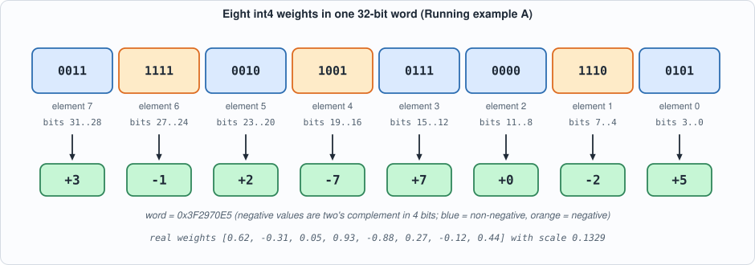
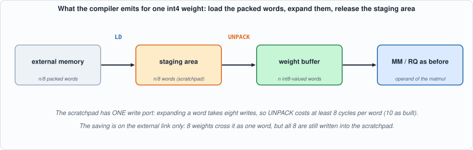
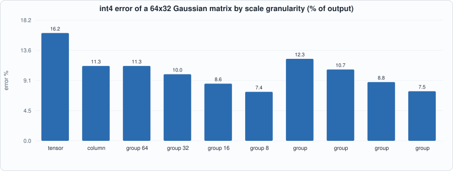
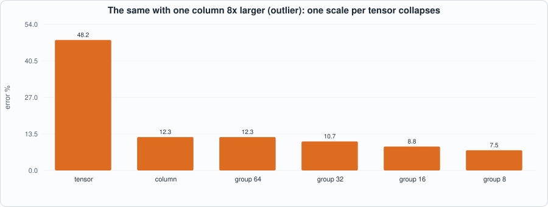
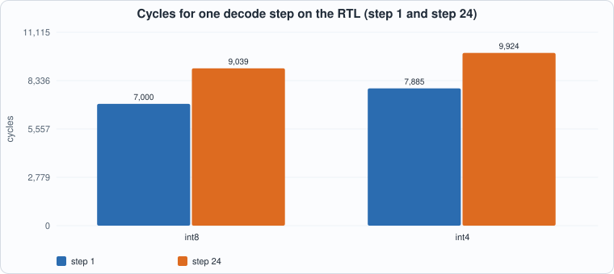
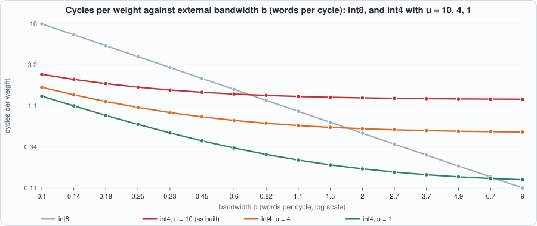

# 13. int4 Weight-Only Quantization


--8<-- "docs/assets/art/ch-13.md"


**What you will see:** weights stored in four bits instead of eight, end to end. A new compiler option, `weight(..., bits=4)`, packs eight weights into one 32-bit word; the compiler emits an `UNPACK` instruction (hardware built in this chapter's circuit) after the load; the same tiny language model of Chapter 12 decodes the same 24 tokens with int4 weights, on the RTL, in both simulators. Along the way you will measure what four bits cost in accuracy, how much external traffic they save, and, honestly, why on this chip they do *not* make a token faster.

**What you need to know first:** Chapter 3 (quantization), Chapter 7 (the instruction set, the vector unit), Chapter 11 (the compiler) and Chapter 12 (the tiny model). Appendix C (number formats) is the primer for two's complement and scales.

**What this chapter builds:** `rtl/ga2_vec.v` (the `ga2_unp` unit), `model/unpack_progs.py`, the int4 additions to `model/capra.py` (`weight(bits=4)`, scale `range/7`, packing, `UNPACK` emission), `wbits` options in `model/capra_tests.py` and `model/tiny_lm.py`, `tools/ch13_run.py`, `tools/mut_ch13.py` and `tools/mut_ch13_compiler.py`, and the running examples `tools/ch13_example_a.py` and `tools/ch13_example_b.py`.

!!! note "Where this chapter sits"
    Part 6 is a set of case studies. Each takes a technique that real LLM accelerators use, adds it to the chip and the compiler, and then measures it with the book's usual discipline: an independent model, self-checking testbenches, and mutation tests. This first case study is the one with the largest effect on real systems: *shrink the weights*.

## Why four bits

Chapter 9's roofline said it in one line: at batch 1 a decode step reads every weight once and does about one multiply per weight, so the speed is set by **bytes of weights per second**. Halve the bytes per weight and the ceiling doubles. The measured ceiling on a 7-billion-parameter model at 1 TB/s was 66, 124 and 219 tokens per second for fp16, int8 and int4 weights (derived in Chapter 9, not measured on this chip). That is why production inference stacks ship weights at 4 bits.

**Weight-only** quantization is the version that is easiest to adopt: only the *weights* shrink. The activations stay at the precision the matrix unit already handles (int8 here). The weights are expanded back to the matrix unit's input width *just before use*. So the circuit that multiplies does not change; what changes is how weights travel and wait.

## The number format

A 4-bit signed integer has 16 codes, `-8 .. 7`. We use the **symmetric** range `-7 .. 7` and leave `-8` unused, as Chapter 3 did for int8 (which uses `-127 .. 127`): the range is then symmetric, a negation never overflows, and zero is exactly zero. The scale is

```
scale = max|w| / 7        q = round(w / scale)        w ~ q * scale
```

so the largest weight maps to exactly +-7 and every other weight is within half a step (`scale / 2`) of its quantized value. Compare the step: int8's step is `max|w| / 127`; int4's is **18 times coarser**, and that single fact drives every accuracy number in this chapter.

**Packing.** Eight 4-bit fields fit in a 32-bit word. Element `j` of a group of eight goes to bits `4j+3 .. 4j` as two's complement:


*Figure 13.1: Running example A's eight weights packed into the word `0x3F2970E5`. Element 0 is the least significant nibble. A negative value has its top bit set (orange) and is sign-extended when unpacked.*

## The hardware: UNPACK

GA-2 gains one instruction, opcode 8:

| field | meaning |
|---|---|
| `src` | scratchpad address of the packed words |
| `dst` | scratchpad address to write the expanded values |
| `len` | number of packed words (each expands to 8 output words) |

The unit is a three-state machine. It reads a packed word (`S_RD`), waits one cycle for the scratchpad's read latency (`S_LAT`), then writes the eight nibbles one per cycle (`S_WR`), each sign-extended to 32 bits so the result is an ordinary int8-valued word the matrix unit already understands.

```verilog
--8<-- "rtl/ga2_vec.v:82:103"
```

The cost follows from the structure: **1 read + 1 latch + 8 writes = 10 cycles per packed word**, plus 1 for the instruction: `UNPACK = 10 * len + 1`. The eight writes are not a design flaw to be tuned away: the scratchpad has **one write port**, so eight values need at least eight write cycles. That is the central fact of the chapter's last section.


*Figure 13.2: what the compiler emits for each int4 weight. The staging area is released as soon as the UNPACK finishes, so it costs scratchpad space only briefly.*

## The compiler: three changes

1. **The IR.** `Graph.weight(name, array, bits=8)` accepts `bits` 4 or 8; anything else is a `CompileError`. `bits` is an attribute of the weight node and the rest of the compiler (calibration, tiling, requantizers) is unchanged: after the UNPACK an int4 weight is just an int8-valued tensor whose scale is `range / 7` instead of `range / 127`.
2. **The scale.** At the end of `plan_scales` the int4 weights get their scale (`max|w| / 7`, using 1 if the range is zero so a zero matrix does not divide by zero). Everything downstream, including each matmul's requantizer (`scale_a * scale_b / scale_out`), already reads the scale from the table, which is why no other pass changes.
```python
--8<-- "model/capra.py:95:98"
```
3. **The lowering and the external image.** The weight occupies `ceil(n / 8)` words of external memory instead of `n`. `ensure()` loads those packed words into a temporary staging area, emits `UNPACK` into the weight's own buffer, and releases the staging area; `ext_image` packs the integers:
```python
--8<-- "model/capra.py:172:177"
```
```python
--8<-- "model/capra.py:223:228"
```

## Tests

The tests are the same shape as in Chapters 7 and 11, extended.

- **UNPACK on the RTL.** `model/unpack_progs.py` writes 8 directed programs (lengths 1, 2, 7, 33 and 64 words; 100 words, which exercises the upper bits of the output counter; 300 words, which exercises the upper bits of the length field; and unpacked values used as the *B* operand of a matrix product) on an external image of random words and the extreme patterns (all -1, all 0, all -8, all +7), plus 40 random programs. Together that is 48 programs. The Python reference machine `ga2_isa.py` executes the same programs; the testbench compares memory and all five cycle counters, in Icarus and in Verilator.
- **The compiler battery** from Chapter 11 (60 random graphs: compiled program equals the plain-Python meaning of the graph, buffers never collide, result close to floating point) now takes a `wbits` argument. With int4 weights the error bound is loosened from 0.16 to 0.72: the *worst measured* error is 0.0788 for int8 and 0.3586 for int4, and the bound is set at about twice the worst seen, with the logic of a bound that must hold for any seed and still catch a gross error.
- **The refusal** of an unsupported width (`bits=5`).

```python
--8<-- "tools/ch13_run.py"
```

To compile and run: `python3 tools/ch13_run.py` (about a minute). Recorded output:

```text
--8<-- "out/ch13_run_out.txt"
```

## Running example A: four bits, by hand

Eight real weights are quantized with int4 and int8, packed into a single word, then **really run on the chip**: `LD` the word, `UNPACK` it, multiply a row of activations by the unpacked weights with the matrix unit, and store both. Every step is checked against the hand computation. The program is only seven instructions, so the cycle count is something you can verify with the formulas of Chapter 7: `LD` of one word is `1 + 8 + 1 = 10`, `UNPACK` of one word is `10 + 1 = 11`, and so on.

```python
--8<-- "tools/ch13_example_a.py"
```

To compile and run: `python3 tools/ch13_example_a.py` (a few seconds; needs Icarus Verilog).

```text
--8<-- "out/ch13_example_a_out.txt"
```

**Reading the output.** Section 1: the largest error is 0.0500, which is just under half a step (0.0664): the bound `|w - q*scale| <= scale/2` holds for every weight. Section 2: the packed word `0x3F2970E5` is the nibbles `5 E 0 7 9 2 F 3` read from the most significant end, which is Figure 13.1. Section 3: the circuit's unpacked values equal the hand-unpacked ones, and the product `49` equals the product computed by hand from the same integers; the chip's cycle counters equal the Python model's (97 in all). Section 4 is a caution: for this one dot product int4's error (0.05) is larger than int8's (0.023), but a single sample means little. The next example measures many.

## Running example B: what four bits cost, and what they buy

```python
--8<-- "tools/ch13_example_b.py"
```

To compile and run: `python3 tools/ch13_example_b.py` (about a minute: it decodes the tiny model four times and replays two decodes on the RTL in both simulators).

```text
--8<-- "out/ch13_example_b_out.txt"
```

### Accuracy: the scale decides everything


*Figure 13.3: the same 64 x 32 Gaussian matrix quantized to int4 under different scale granularities. One scale per tensor gives 16.2% error; one per group of 8 weights gives 7.4%.*

The first table of the output is a *study of dequantized weights*: the weights are quantized and expanded in Python, and the error of `x W` is measured on 200 random inputs (a **measured** result on a Gaussian matrix, not a property of real models). Three lessons:

1. **int8 is nearly free; int4 is not.** Under one scale for the whole tensor the error is 0.88% at int8 and 16.2% at int4: the 18x coarser step costs about 18x in error, as the format arithmetic predicted.
2. **Finer scales buy accuracy.** Each halving of the group size lowers the int4 error: 11.3% (per column or per group of 64: the same thing here, since the inner dimension is 64) down to 7.4% at 8 weights per scale. The price is more scale values to store and apply.
3. **An outlier ruins a shared scale.**


*Figure 13.4: when one column of the matrix is 8 times larger than the others, one scale per tensor makes the ordinary columns use only about 1 in 8 of the 15 codes: the int4 error rises from 16% to 48%. A scale per column is unaffected.*

**What the chip implements, and what it does not.** Capra implements the *per-tensor* scale only (one `scale` per weight node, one requantizer per matmul). Per-column and per-group scales are studied here in dequantized form because they need a different datapath: a per-column scale needs the requantizer's multiplier to change per output column, and a per-group scale needs partial sums rescaled between groups. Both are real techniques in production stacks; neither is in this chip, and the table is the argument for adding them.

### The model: does it still decode?

| weights | tokens correct (of 25) | external words, step 1 / 24 |
|---|---|---|
| int8 (all) | 25 | 2,369 / 3,105 |
| int4 (all) | 25 | 353 / 1,089 |
| int4 except `Wout` | 25 | 577 / 1,313 |

The designed model of Chapter 12 is *easy*: its answer is decided by embeddings and the output matrix with large margins, so it survives even 18x coarser weights. That is a statement about the test's difficulty, not about int4. The **generic random model** (3 models x 16 starts x 12 steps = 576 teacher-forced decisions, the harder test) shows the real cost:

| weights | agreement with floating point | relative logit error: mean / worst |
|---|---|---|
| int8 | 559 / 576 = 97.0% | 2.3% / 6.1% |
| int4 | 523 / 576 = 90.8% | 18.7% / 37.3% |

Four bits cost six points of agreement and an eight-fold increase in logit error on this model. A real trained model's sensitivity differs, and that is the open question the book can only mark: **measure on the trained model you intend to run.**

The external traffic falls from 3,105 words to 1,089 at step 24 (2.85x). It is not 8x because the *activations* and the KV cache are still int8 words: only the weights shrank.

### The speed: the honest result


*Figure 13.5: cycles of one decode step on the RTL (the same counts in Icarus and Verilator). int4 is slower by about 885 cycles per step.*

Measured on the RTL, an int4 decode step is about **885 cycles slower** (7,885 against 7,000 at context 1; 9,924 against 9,039 at context 24; over 24 steps 213,950 against 192,710 cycles, +11%). The DMA time fell (3,203 to 1,187 cycles at step 24) and the vector unit's time rose (490 to 3,377), because UNPACK runs in the vector unit and it costs more than the load it saves.

The reason is derived from the formulas, not tuned: loading `n` int8 weights over a link of `b` words per cycle takes `n / b` cycles. Loading them as int4 takes `n / (8 b)` cycles for the packed words plus `n / 8` UNPACK words of `u` cycles each:

```
int4 is faster  <=>  n/b  >  n/(8b) + n*u/8  <=>  b  <  7 / u
```


*Figure 13.6: int4 pays only where the link is slower than `7/u` words per cycle. As built (`u = 10`) the break-even is 0.7 words per cycle; this chip's link is 1 word per cycle, so int4 is a loss. With `u = 1`, as it would be if dequantization happened in the operand path, the break-even is 7.*

| u (cycles per packed word) | where | break-even `b* = 7/u` |
|---|---|---|
| 10 | as built | 0.70 words/cycle |
| 8 | one write per output, no other overhead | 0.88 |
| 4 | two write ports (derived) | 1.75 |
| 1 | dequantize in the operand path (derived) | 7.00 |

**The lesson, and why it matters for real chips.** Production accelerators do *not* unpack through the scratchpad. They expand int4 to int8 *between the memory and the multiplier*, in the operand path, where the unpack costs no cycles and no scratchpad writes: that is the `u -> 0` row, and it is why Chapter 9's roofline numbers (66, 124, 219 tokens per second) assume the speed is set by weight bytes alone. This chapter's UNPACK is the *simple, correct* implementation: it proves the number format, the packing and the compiler end to end, and the measurement tells you precisely what the better design must remove. Exercise 4 is that design.

## Mutation tests

Two suites, because there are two sets of code to test.

**The circuit (`tools/mut_ch13.py`):** twelve one-line changes to the UNPACK unit and its wiring, each run against the programs of `unpack_progs.py`.

```text
--8<-- "out/ch13_mutation_out.txt"
```

All 12 are caught: fields in reverse order, no sign extension, wrong output stride, one source word too many, the last field skipped, a latch before the data is valid, a read from the wrong address, a narrowed length field, a mixed-up destination field, and three faults in the sequencer's hookup (the write enable dropped, UNPACK counted as DMA time, completion never seen).

**The compiler (`tools/mut_ch13_compiler.py`):** eleven changes to the int4 path in `capra.py`, each run against the int4 battery and the refusal test.

```text
--8<-- "out/ch13_compiler_mutation_out.txt"
```

All 11 are caught (scale `range/8`, reversed packing order, missing mask, missing padding, packed length rounded down, UNPACK left out, UNPACK one word short, only one word loaded, UNPACK reading the wrong source, an unrounded buffer, a bit width of 5 accepted). One further change, **never giving the staging area back**, is *not* caught, and it is a real gap, not an equivalent mutant: the leaked words would only matter in a graph whose int4 weights nearly fill the scratchpad, and no graph in the battery does. Exercise 5 closes it.

## What this chapter established, and what it did not

**Established, with the tests that show it:** the UNPACK unit matches an independent model, bit for bit and cycle for cycle, in two simulators (and 12 of 12 mutants are caught); the compiler's int4 path matches the plain-Python meaning of 60 random graphs and lands within the stated bound of floating point (and 11 of 11 mutants are caught); the tiny model decodes 24 tokens correctly with int4 weights on the RTL.

**Not established:** the accuracy of int4 on any *trained* model (the designed model is easy and the random model is a stand-in); per-column and per-group scales *on the chip* (only studied in dequantized form); any speed gain (there is none on this chip, as measured); real memory timing (one fixed-latency link).

## Self-check questions

1. Why does the symmetric int4 format use `-7 .. 7` and not `-8 .. 7`? Name one property that would be lost.
2. The scale of int4 weights is `max|w| / 7`. A matrix has `max|w| = 0.7`. What is the scale, what does `w = 0.33` quantize to, and what is the dequantized value and its error?
3. Pack the eight integers `[1, -1, 2, -2, 3, -3, 4, -4]` into one 32-bit word using this chapter's order. Give the hexadecimal value.
4. UNPACK costs `10 * len + 1` cycles. Where do the 10 come from, and why can it not be less than 8 with this scratchpad?
5. Derive the break-even bandwidth `b* = 7 / u` yourself from `n/b` and `n/(8b) + n*u/8`.
6. Why does the external traffic fall by 2.85x and not by 8x?
7. Why can the designed model decode correctly with int4 while the random model loses 6 points of agreement?
8. A per-column scale needs a change in the *requantizer*, not in the weights. Why?

## Exercises

1. **Another matrix.** In `ch13_example_b.py`, change the Gaussian weights to uniform in `[-1, 1]` and rerun section 1. Which scheme's error changes most, and why does the uniform case hurt a shared scale less?
2. **Two outliers.** Make two columns 8x larger and 4x larger. Does per-column still win? What happens to per-group-64?
3. **Mixed precision.** Using the `wbits` dictionary of `build_graph`, quantize only `W1` and `W2` (the feed-forward matrices) to int4 and measure the agreement of the random model. Which matrices tolerate four bits best?
4. **Cheaper unpack.** Modify `ga2_unp` to write two outputs per cycle (needs a second write port: say what you would change in `sram.v`). Predict `u`, then the new break-even from `b* = 7/u`, and measure with the example.
5. **Close the gap.** Add a graph to the int4 battery whose int4 weights would overflow the scratchpad if the staging area leaked, so that the "never given back" mutant is caught.
6. **Per-column scales, in software.** Quantize each column of a weight with its own scale, run the matmul on the chip with the *per-tensor* requantizer, and then correct each output column on the host by `col_scale / tensor_scale`. How many extra host operations per token, and does the result match the dequantized study?
