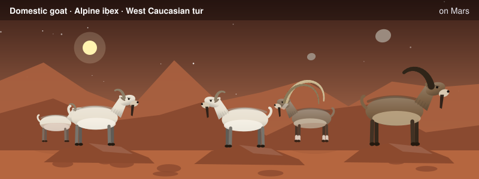
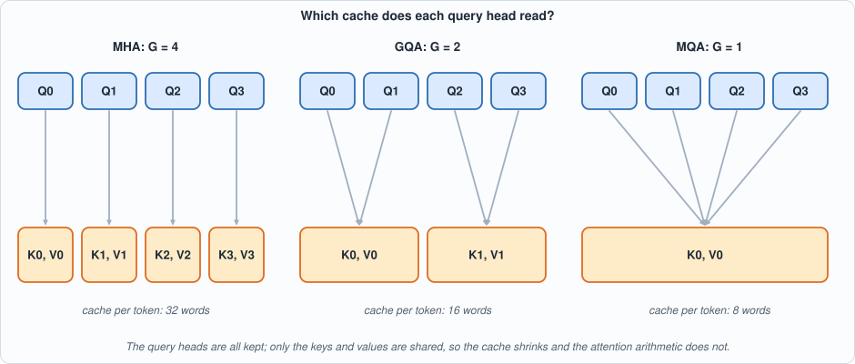
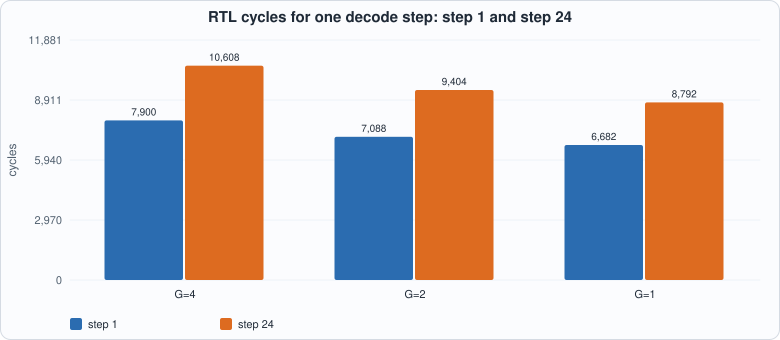
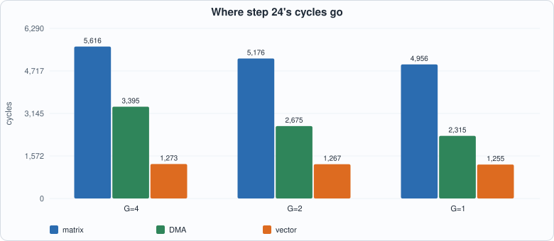
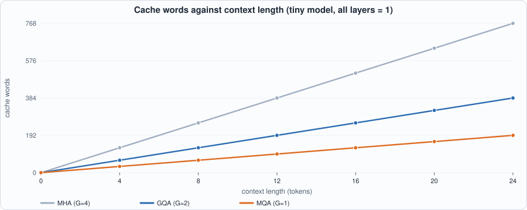
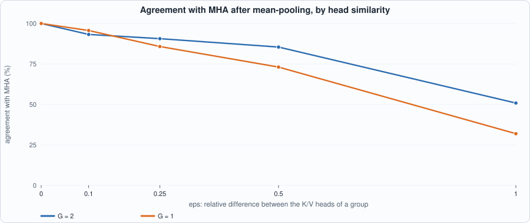
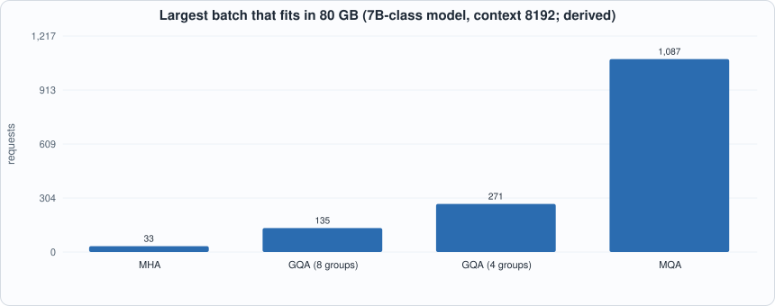
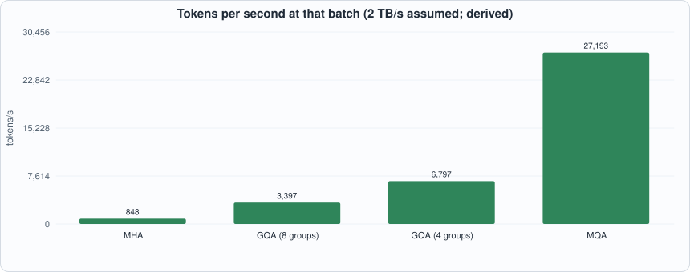

# 14. Grouped-Query Attention



--8<-- "docs/assets/art/ch-14.md"


**What you will see:** attention in which several query heads share one set of keys and values. The tiny model of Chapter 12 grows to four query heads; the number of key/value *groups* `G` is a knob: `G = 4` is ordinary multi-head attention (MHA), `G = 2` is grouped-query attention (GQA), `G = 1` is multi-query attention (MQA). The compiler of Chapter 11 compiles all three with no new instruction; the chip decodes the same 24 tokens in each case, in both simulators; and you measure what sharing saves (cache, cycles, serving capacity) and what it costs when a model is converted without retraining.

**What you need to know first:** Chapter 8 (attention and the KV cache), Chapter 9 (the capacity and bandwidth arithmetic of serving), Chapter 11 (the compiler) and Chapter 12 (the tiny model). Appendix E is the primer on attention.

**What this chapter builds:** `model/gqa_lm.py` (the model, its float reference, the graph builder and the host loop), `model/gqa_tests.py` (the software checks), `tools/ch14_run.py` (tests and the RTL replay), `tools/mut_ch14.py`, and the running examples `tools/ch14_example_a.py` and `tools/ch14_example_b.py`. **No hardware and no compiler change**: this chapter shows that a technique that matters a great deal for serving is a change of *graph*, not of chip.

## Why share keys and values

Chapter 9 ended on a fact: as the batch grows, the **KV cache** takes over. A request at 8,192 tokens of context holds 2 GiB of cache on a 7B-class model, and the chip's memory fills with caches, not weights. Every decode step also *reads* the whole cache of every request. The cache is made of keys and values, one pair per head per layer per token. Attention's cost structure suggests an economy: the work of attention is in the *queries* (each head asks its own question), while keys and values are what is *stored*. If several query heads read the same keys and values, the cache shrinks by that factor and each head still asks its own question.

- **MHA:** every query head has its own key and value head. Cache per token: `2 * G * d` with `G = H`.
- **MQA** (Shazeer, 2019): all query heads share one key/value head (`G = 1`): the smallest cache, the largest quality risk.
- **GQA** (Ainslie et al., 2023): `G` between 1 and `H`: the compromise most current open models use (for example 8 groups for 32 query heads).


*Figure 14.1: head `h` reads group `h // (H / G)`. The four query heads are kept in all three variants; only the cache (orange) shrinks.*

## The model

```python
--8<-- "model/gqa_lm.py"
```

Three points need care.

1. **Two forms, written differently on purpose.** The floating-point reference uses *fused* matrices (`Wq`, `Wk`, `Wv` are `D x D`; head `h` is columns `4h .. 4h+3`) and slices them the way a framework does. The graph that the compiler sees has *one small weight per head and per group*, because Capra has no column slice. Both describe the same function, and the tests below check that.
2. **No head concatenation.** The output projection of a transformer multiplies the concatenation of the head outputs by `Wo`. Because `[a0 a1 a2 a3] Wo = a0 Wo_0 + a1 Wo_1 + a2 Wo_2 + a3 Wo_3` (with `Wo_h` the rows of `Wo` belonging to head `h`), the graph multiplies each head's output by its own slice of `Wo` and adds. Capra has `matmul` and `add`; that is all it needs.
3. **The cache is `G` pairs of small tensors.** Each group has its own `kc`/`vc` input of shape `(L-1) x 4`, concatenated with the new row by the existing `concat_rows` (Chapter 11's concat views, so no copy).

**Conversion.** A model trained with MHA is turned into GQA by **mean-pooling** the key and value projections of the heads within each group (`to_groups`), the recipe of the GQA paper (which then fine-tunes briefly). Here nothing is fine-tuned, so the conversion measures exactly the damage that the fine-tuning exists to repair.

## Tests

`model/gqa_tests.py` holds seven groups of checks. The ones that need the most thought are the ones where an obvious test is *circular*:

```python
--8<-- "model/gqa_tests.py"
```

1. **The grouped step equals an MHA step with replicated K/V heads.** A GQA model is the same function as an MHA model whose heads in a group carry identical key/value weights. The test builds that MHA model (written without grouping logic) and compares logits.
2. **Compiled equals interpreted, and chip logits are close to float** (random models, `G = 4, 2, 1`, relative error under 15%).
3. **The structured model follows its rule** `f(t) = 5t + 3 mod 16` for all three `G`.
4. **The cache-size formula.**
5. **An independent reference step** (`ref_step`): written head by head with an explicit group list `[0,0,1,1]` and explicit slices, no `h // r`. The first mutation run (below) showed why: with checks 1-4 alone, six mutants survived, because checks 1 and 2 compare the model with *itself* or with a tolerance too loose for attention's small contribution.
6. **The pooled weights equal literal averages** (`(W[:,c] + W[:,4+c]) / 2` for group 0, written with literal indices).
7. **Attention output, new key and new value** are returned by the chip and compared with float tensor by tensor (relative error under 12%): a check at the *tensor*, not the final logits, where attention's effect is large enough to see.

The RTL replay is in `tools/ch14_run.py`:

```python
--8<-- "tools/ch14_run.py"
```

To compile and run: `python3 tools/ch14_run.py` (about 30 seconds). Recorded output:

```text
--8<-- "out/ch14_run_out.txt"
```

**Reading the output.** Part 1: the grouped float step and the replicated-MHA step agree to the last bit. Part 2: for every one of the 24 steps of every `G`, the compiled program equals the plain-Python meaning of the graph (0 mismatches), and the logits are within 1.6% of floating point. Part 3: all three variants follow the rule. Part 4: Icarus and Verilator agree with the Python reference on memory and on all five cycle counters, and the table is the **measured** cost.

## Cost on the chip (measured)


*Figure 14.2: RTL cycles of one decode step, at the first and the last step. Sharing saves 11% of the cycles at `G = 2` and 17% at `G = 1` over 24 steps.*

| G | cache words / token | instructions at step 24 | cycles, step 1 | cycles, step 24 | 24 steps |
|---|---|---|---|---|---|
| 4 (MHA) | 32 | 161 | 7,900 | 10,608 | 223,384 |
| 2 (GQA) | 16 | 142 | 7,088 | 9,404 | 198,308 |
| 1 (MQA) | 8 | 132 | 6,682 | 8,792 | 186,110 |

Where do the savings come from? Two places, and only one is the cache:


*Figure 14.3: all three components fall. The matrix time falls because fewer key and value projections are computed; the DMA time falls because fewer key/value weights and fewer cache words are loaded.*

1. **The cache** (grows with the context): at step 24 the chip loads `23 * 32 = 736` cache words for MHA, 368 for GQA and 184 for MQA.
2. **The key and value projection weights** (fixed): `Wk` and `Wv` are `16 x 16` for MHA but `16 x 8` for GQA and `16 x 4` for MQA, so they shrink with `G` too. A real GQA model shrinks them as well, which is part of why GQA models are slightly smaller than their MHA counterparts. In this *tiny* model the weights are a large share of the traffic; at 8,192 tokens of context on a real model the cache dominates.


*Figure 14.4: the cache grows linearly with the context, with slope `2 * G * d` words per token. At this model's size the numbers are small; Example B scales the same formula to a 7B-class model.*

## Running example A: one step by hand, and what the compiler emits

```python
--8<-- "tools/ch14_example_a.py"
```

To compile and run: `python3 tools/ch14_example_a.py` (a few seconds).

```text
--8<-- "out/ch14_example_a_out.txt"
```

Part 1 prints the mapping of Figure 14.1. Part 2 is one decode step with three tokens of context under GQA with `G = 2`: heads 0 and 1 read the *same three keys* and, because their queries differ, produce different attention patterns (head 0 puts 68% on the third token; head 1 puts 70% on the second). That is the whole idea: the keys and values are shared; the questions are not. (For this display only, `Wq` and `Wk` are multiplied by 6, because the untouched random model attends almost uniformly at three tokens.) Part 3 is the compiler's output at context 8: the matrix-multiply count falls from 56 to 52 to 50, the loads from 28 to 20 to 16, and the instruction `SM` (softmax) stays at 4, one per head, because every head still asks its own question.

## Running example B: what conversion costs, and what sharing buys

```python
--8<-- "tools/ch14_example_b.py"
```

To compile and run: `python3 tools/ch14_example_b.py` (about 20 seconds).

```text
--8<-- "out/ch14_example_b_out.txt"
```

### Converting without retraining


*Figure 14.5: agreement with the original MHA model after mean-pooling, against `eps`, how different the heads of a group were to begin with.*

Part 1 is a sobering **measured** result on a *random* model, whose heads are statistically independent: pooling two heads into one leaves only 50.9% agreement with the original, and pooling all four leaves 31.9%. Pooling dissimilar heads averages away exactly what made them different. Part 2 shows why real conversions work at all: if the heads of a group were already similar (`eps` small), the pooled model is nearly the original (93-96% agreement at `eps = 0.1`), and at `eps = 0` the conversion is exact. Real trained models are in between, and the GQA recipe's short *fine-tuning after pooling* closes the remaining gap; this book does no training, so it cannot measure that step. (The small non-monotonic wobble between `G = 2` and `G = 1` at `eps = 0.1` is within the noise of 576 decisions.)

### What sharing buys in serving

This part is **derived** arithmetic for an **assumed** chip (80 GB, 2 TB/s) running a 7B-class model (32 layers, 32 query heads, head width 128, int8 weights and cache, context 8,192), using Chapter 9's formulas. The MHA row reproduces Chapter 9's 256 KiB per token and its maximum batch of 33.


*Figure 14.6: capacity. Sharing the cache multiplies the batch by the sharing factor.*


*Figure 14.7: throughput at that batch. At B = 1 the weights dominate and sharing helps by only 29% (219 to 283 tokens/s); at the largest batch the larger batch and the smaller cache reads compound to 4x for GQA with 8 groups and 32x for MQA.*

## Mutation tests

Fourteen one-line changes to the model, graph and host: group map `h % r` in the float step and in the graph, scores not scaled by `sqrt(d)`, values taken from the keys' columns, keys summed instead of averaged, only one head kept per group, a shifted query slice, group 0's key weights for every group, the wrong rows of `Wo`, a head dropped from the sum, scale `1/d`, a wrongly cut cache, keys and values swapped on the way back, and the cache-size formula without its factor 2.

```text
--8<-- "out/ch14_mutation_out.txt"
```

All 14 are caught. **This is the second run.** The first run, against checks 1-4 only, caught 8 of 14: six mutants survived, and each survivor was a genuine gap in the tests, not an equivalent mutant. The cause was the same each time: the tests compared the model to itself, or compared logits through a tolerance wide enough to hide attention's small contribution. Checks 5-7 close those gaps, one for each cause: an independent reference for the arithmetic (5), literal values for the conversion (6), and tensor-level comparison where the effect is visible (7).

## What this chapter established, and what it did not

**Established, with the tests that show it:** GQA is the same function as an MHA model with replicated heads; the compiler turns it into programs that equal the plain-Python meaning of the graph; those programs run identically on the RTL in both simulators; sharing cuts the cache per token by `H / G` and decode cycles by 11% (`G = 2`) and 17% (`G = 1`) on this model; all fourteen mutants are caught.

**Not established:** the *quality* of a converted or natively trained GQA model (the models here are constructed or random, nothing is trained or fine-tuned); anything about real model sizes beyond the derived serving arithmetic; speedups from bandwidth (this chip's memory is one fixed-latency link).

## Self-check questions

1. With `H = 8` query heads and `G = 2` groups, which group does head 5 read? How many cache words per token does a head width of 16 give for `G = 8`, 2 and 1?
2. Why is the output projection split into `H` products of `d x D` slices that are added, and why is that the same as multiplying the concatenation?
3. Why are `Wk` and `Wv` smaller under GQA? Does the number of query-side weights change?
4. Pooling two independent random heads gives 51% agreement but two nearly equal heads gives 93-96%. Explain with the argument that pooling is an average.
5. In Figure 14.3 the *matrix* cycles fall with `G` even though the query, score and output matmuls do not change. Where does the fall come from?
6. Reproduce the 256 KiB per token of MHA for the 7B-class model, then the 64 KiB of GQA with 8 groups.
7. Why did the first mutation run miss "scores are not divided by sqrt(d)" in the float step even though the chip does divide?
8. A check compares chip logits with float and passes with a 15% bound. Why is that not enough to show that attention is correct?

## Exercises

1. **Eight query heads.** Change `H` to 8 and `DH` to 2 in `gqa_lm.py` (and the tests' group list) so that `G` can be 8, 4, 2, 1. Does the chip still decode the structured rule?
2. **Retrain by pooling plus noise.** In Example B part 2, add a short "fine-tuning" step of your own (for example re-solving `Wo` by least squares on the pooled model's activations) and measure how much of the lost agreement it recovers.
3. **Cache in int4.** Combine Chapter 13 with this chapter: what is the cache per token for GQA with 8 groups and int4 *activations*? (The chip cannot do this: say what would be needed.)
4. **A group that does not divide.** What should `to_groups` do for `H = 4, G = 3`? Implement the refusal and write the test.
5. **A sixth survivor.** Add a mutant to `mut_ch14.py` that the checks do *not* catch (try changing the calibration range of `v`). Report whether it is equivalent or a gap, and close the gap if it is one.
