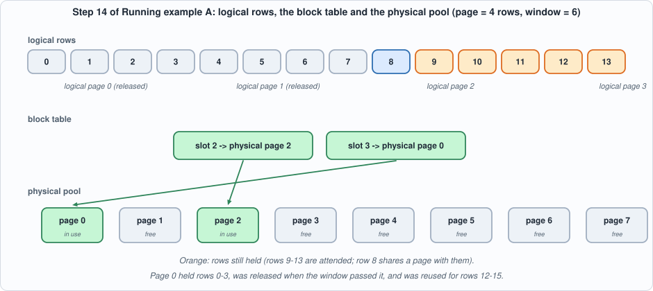
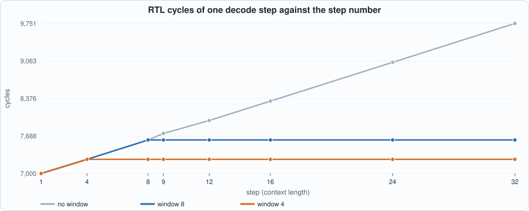
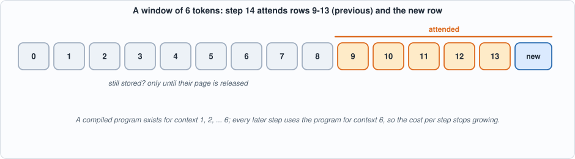
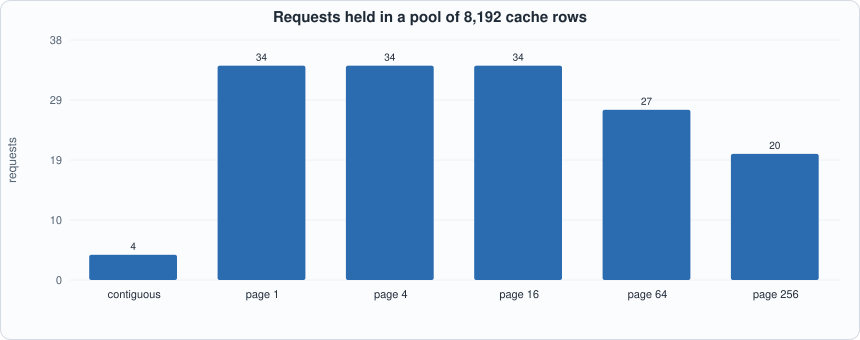
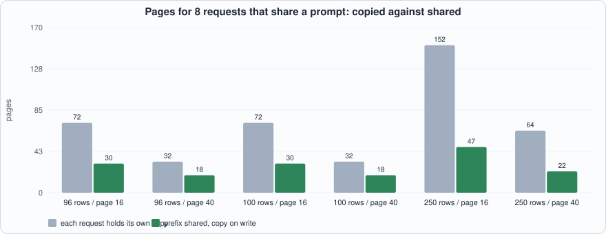
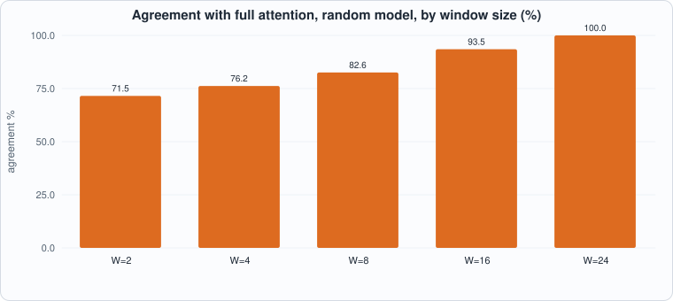
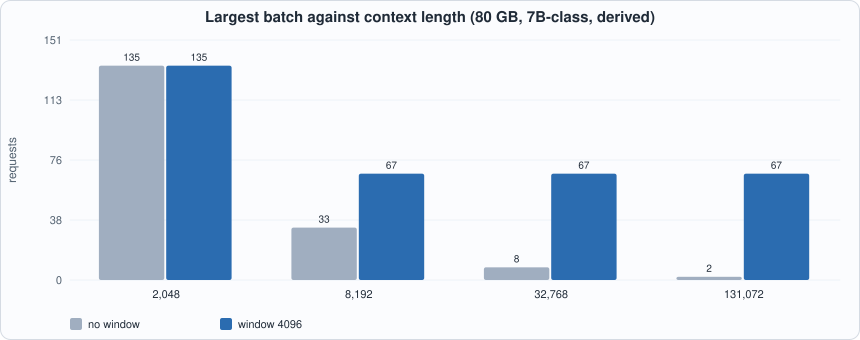

# 15. A Paged KV Cache and Sliding-Window Attention


--8<-- "docs/assets/art/ch-15.md"


**What you will see:** two ideas that decide how many requests a serving system can hold. A **paged cache** stores each request's keys and values in fixed-size pages taken from a shared pool, with a per-request block table, so memory is claimed as a request grows instead of reserved for its longest possible length; pages can be shared between requests (a common prompt) and are copied before a shared page is written. A **sliding window** limits attention to the last `W` tokens, so a request's cache stops growing and a decode step stops getting slower. The tiny model of Chapter 12 decodes 32 tokens with no window, a window of 8 and a window of 4, in both simulators; the page table is tested against a shadow model under 2,400 random operations; eighteen mutants are run against the tests.

**What you need to know first:** Chapter 8 (the KV cache), Chapter 9 (capacity and bandwidth), Chapter 11 (the compiler) and Chapter 12 (the host loop). Chapter 14 is not required, but it explains why caches are the thing worth saving.

**What this chapter builds:** `model/paged_lm.py` (the page table, the windowed reference and the paged host), `model/paged_tests.py`, `tools/ch15_run.py`, `tools/mut_ch15.py`, and the running examples `tools/ch15_example_a.py` and `tools/ch15_example_b.py`. **No hardware and no compiler change**: the chip never sees a page. The host gathers the rows a window needs into the same contiguous `kc`/`vc` inputs as before.

## The problem: reserving for the longest request

A serving system does not know how long a request will run: a chat may stop after 30 tokens or go on to 3,000. A cache that must be one contiguous block per request forces a choice at the start: reserve for the longest allowed length (and waste most of it), or reserve too little and move the request later. Operating systems solved the same problem for program memory decades ago with **virtual memory**: split memory into fixed-size pages, give each program a table that maps its logical pages to whatever physical pages are free, and take a page only when the program reaches it. The **paged KV cache** (the idea behind vLLM's PagedAttention) is that, applied to the cache.

- **Block table.** For each request, a list: logical page `i` is stored in physical page `table[i]`.
- **Free list.** Physical pages nobody owns.
- **Reference counts.** A physical page may be in several block tables (a shared prompt); it is freed when its last owner lets go.
- **Copy-on-write.** If a request needs to write into a page that others also hold, it first copies the page and writes into its own copy.

The **sliding window** adds a second saving. If attention only ever looks at the last `W` tokens, then rows older than that will never be read again: their pages can be released, and the request's footprint is bounded by `ceil((W-1)/P) + 1` pages, however long it runs.


*Figure 15.1: logical rows, a block table and the physical pool. The two released logical pages leave a hole at the front of the table; physical page 0 was freed and reused.*

## The model

```python
--8<-- "model/paged_lm.py"
```

**The chip is oblivious.** The chip's programs are exactly those of Chapters 11-12: a decode step with a context of `n` tokens takes the `x` input, a `kc`/`vc` input of `n-1` rows and returns the logits and the new `k`, `v`. What changes is *who builds `kc` and `vc`*: before, the host kept a plain list and passed all of it; now it gathers rows `lo .. L-2` through the block table, where `lo = L - min(L, W)`. With a window of `W` tokens, the contexts that ever occur are `1, 2, ..., W` and no others, so only `W` programs are compiled (4 for `W = 4`, 8 for `W = 8`, against 32 with no window), and **every step after the window fills uses the same program**.

**Two decisions to notice.** (1) *Pages are released with a rule that is easy to get wrong by one*: after step `L` the next step needs rows `>= L + 1 - W`, so `trim(keep_from = L + 1 - W)` releases a page only when it lies entirely below that row (`(dropped + 1) * P <= keep_from`). A page that still holds one needed row stays. (2) *A freed page goes back to the free list and is reused*: the page 0 of Figure 15.1 first held rows 0-3 and later held rows 12-15, which is what makes memory bounded.

## Tests

```python
--8<-- "model/paged_tests.py"
```

1. **The page table against a shadow model.** Six random sequences of 400 operations (`new`, `append`, `fork`, `trim`, `release`) are run on the page table and, in parallel, on a plain dictionary of Python lists (the shadow). After **every** operation the checker verifies: every page's reference count equals the number of block-table entries that name it; no page is on the free list twice, or both free and referenced; every page is either free or referenced (no leak); and every live request's rows, read back through the block table, equal the shadow's. At the end every request is released and the pool must be completely free.
2. **Exhaustion** raises `OutOfPages` and a failed append leaves the length unchanged.
3. **Exact page counts.** At every step the number of pages in use must equal what the window rule alone predicts: `ceil((L-1)/P) - floor(keep_from/P)`. This is a stronger check than a bound; the first mutation run showed why (below).
4. **Paged host equals plain host.** For five `(window, page)` pairs, including pages of 1 row and a window that is not a multiple of the page, the paged host and a host that keeps ordinary lists produce *identical integers* from the chip at every step.
5. **The window is a window.** With `W >= L` the windowed float step equals the full one; with `W = 3` they differ on a random model (so the window is really applied); and the windowed float step equals a **from-scratch recomputation** over exactly the last `W` tokens: the keys and values of those tokens recomputed from the token ids, not read from the cache. The chip follows the windowed float reference within 15% on a random model.
6. **The structured rule** `f(t) = 5t + 3 mod 16` holds under every window.

```python
--8<-- "tools/ch15_run.py"
```

To compile and run: `python3 tools/ch15_run.py` (about 40 seconds). Recorded output:

```text
--8<-- "out/ch15_run_out.txt"
```

## Cost on the chip (measured)


*Figure 15.2: RTL cycles per step. The three curves coincide until the window fills, then the windowed ones stop. Without a window the step keeps getting slower by about 89 cycles per extra token.*

The table in the output is **measured on the RTL, identical in Icarus and Verilator**: step 32 costs 9,751 cycles with no window, 7,615 with a window of 8 and 7,259 with a window of 4. Over 32 steps the totals are 268,346, 241,286 and 231,792 cycles: 10% and 14% less, and the gap widens with every token that follows. The reason is the one Chapter 9 gave in words: a step reads the whole cache, and a window caps the cache. (The cost of the *host's* gather is not in these cycle counts: the host is Python here. It is `W - 1` row copies per step, independent of the context.)


*Figure 15.3: the window. Rows before it are never read again, so their pages can be given back.*

## Running example A: the page table, event by event

```python
--8<-- "tools/ch15_example_a.py"
```

To compile and run: `python3 tools/ch15_example_a.py` (instant).

```text
--8<-- "out/ch15_example_a_out.txt"
```

**Part 1.** Pages of 4 rows, window of 6, a pool of 8 pages, 14 steps. The first four steps fill page 0; step 5 takes page 1. At step 9 the window has passed row 3, so page 0 is released (`dropped pages 1`, page 0 back on the free list); at step 13 page 1 is released and the next row goes to *physical page 0 again* (`table [2, 0]`). Two pages hold the request from then on, however long it runs; a request with no window would hold four after 14 steps and a new page every four tokens thereafter. **Part 2.** `fork` makes request B share all of A's pages (reference counts 2, no data copied). When B appends, A's last page has room but is *shared*, so B copies it first (page 3 is B's private copy) and the counts become `{2: 1, 3: 1}` for the two versions of the tail; A's rows are unchanged. Releasing B returns page 3 to the free list and decrements the shared pages to 1.

## Running example B: what paging, sharing and windows buy

```python
--8<-- "tools/ch15_example_b.py"
```

To compile and run: `python3 tools/ch15_example_b.py` (about 20 seconds).

```text
--8<-- "out/ch15_example_b_out.txt"
```

### Memory: paging against reservation


*Figure 15.4: the same pool and the same 400 request lengths (mean 274 rows, longest 1,884). Reserving the longest allowed length (2,048 rows) holds 4 requests and wastes 87.5% of what it reserved. Paging with a page of 16 rows holds 34 and wastes 3.2%.*

This part is a **simulation on a sampled length distribution** (long-tailed on purpose, like real traffic), not a measurement of a deployed system. It shows the two sides of the page-size trade-off that every paging system has: *small pages waste little but make bigger block tables and more, smaller gathers; large pages are cheap to manage but waste on average half a page per request*: at 256 rows per page the waste is 31% and only 20 requests fit.

### Sharing a prefix


*Figure 15.5: eight requests that start with the same prompt. Sharing the prompt's pages, with copy-on-write for the tail, saves 44-69% of the pages.*

When a prompt ends exactly at a page boundary (96 rows with 16-row pages) the requests never write into a shared page and no copy is made: 30 pages instead of 72. When it ends mid-page (100 rows with 16-row pages, or 96 rows with 40-row pages) each request's first append copies the shared tail page: 8 copies, one per request, each a whole page. With small pages the copies are cheap (still 30 pages for 100 rows); with large pages they are a visible part of the total (18 pages, a 44% saving, for 96 rows with 40-row pages, against 30 pages and 58% for the same prompt with 16-row pages). *Choosing the page size so that common prompts end on a page boundary is a real trick;* some systems pad the shared prefix to the boundary for this reason.

### What a window costs in accuracy


*Figure 15.6: agreement with full attention on a random model, teacher-forced, 1,152 decisions per window size.*

A window removes information, and what it removes costs accuracy: on this random model (whose attention matters, by construction) a window of 8 agrees with full attention on 82.6% of decisions and a window of 16 on 93.5%. This is the worst case for a window, because nothing in the random model *prefers* recent tokens. Real language models do (most of what a token needs is nearby) and models built for windows (a window in every layer, with the layers stacked so that information still travels further) are trained for it, which this book cannot do. So read the table as "a window is not free"; not as "a window of 16 loses 6.5%".

### What a window buys in serving


*Figure 15.7: derived serving arithmetic (80 GB chip, 7B-class model, 256 KiB of cache per token). Without a window the batch falls from 135 at 2,048 tokens of context to 2 at 131,072; with a window of 4,096 it never falls below 67.*

## Mutation tests

Eighteen one-line changes: a freed page not returned, returned too early (while shared), fork not counting the new owner, no copy-on-write, an empty copy, the copy keeping the shared reference, a wrong page offset, the block-table lookup ignoring dropped pages, trim releasing too much or too little, release forgetting the pages, exhaustion not reported, the float window keeping `W` rows instead of `W-1`, the chip's context being `W+1`, a gather starting one row late, keys and values swapped, pages never released, and the trim point one token late.

```text
--8<-- "out/ch15_mutation_out.txt"
```

All 18 are caught. **This is the second run.** The first run caught 15: three mutants survived, each a real gap. (1) *Trim keeps an extra page* and (2) *the trim point is one token late* survived because the page-count check was a bound and the mutants are merely wasteful, never wrong: the data stays correct and only memory leaks. The exact-count check (3) caught both. (3) *The float window keeps `W` rows instead of `W-1`* survived because the chip is compared with the float reference under a 15% tolerance, wide enough to hide one extra token among many. The recomputation from scratch over exactly the last `W` tokens (5) caught it. The lesson repeats Chapter 14's: a test that compares a system with itself, or that is loose where the effect is small, cannot see a conservative error.

## What this chapter established, and what it did not

**Established, with the tests that show it:** the page table keeps its invariants under 2,400 random operations (no leaks, no double frees, correct reference counts, correct copy-on-write); the paged host produces integers identical to a plain host; the windowed programs run identically on the RTL in both simulators; and with a window the cost of a step stops growing (measured: 7,615 and 7,259 cycles flat from step 8 and 4 on); eighteen of eighteen mutants are caught.

**Not established:** the quality of any window on a *trained* model; the host cost of gathering (Python); performance with many concurrent requests (the chip runs one at a time here); and any real memory system. The page-size trade-off and the serving arithmetic are simulation and derivation, not measurement of a deployed server.

## Self-check questions

1. A request has 9 rows with pages of 4. How many pages does its block table hold? How many rows are unused?
2. After step `L` with window `W`, which row is the first one the *next* step needs? For `W = 6` and `L = 8`, which pages (page size 4) can be released?
3. Why does a freed page go back to the front of the free list rather than being kept aside? What would happen to memory use over a long run if it were not reused?
4. Two requests share a page (reference count 2); one finishes. What happens to the page? And if both finish?
5. What is copy-on-write needed for? What goes wrong if two requests write into a shared page without it?
6. Why is the number of compiled programs `W` and not the number of steps? What does this save?
7. Why did the check "pages in use never exceed a bound" miss two mutants that the exact count caught?
8. Derive the 87.5% waste of the contiguous scheme in Figure 15.4 from the numbers (4 requests of 2,048 reserved rows; 1,022 rows used).

## Exercises

1. **A different page size.** Run the paged host with pages of 1, 2, 8 and 16 and the window 8. Which page size keeps the fewest rows reserved at the end of 32 steps? Which has the largest block table?
2. **Cache-friendly admission.** Write an admission rule for the pool of Example B that accepts a request only if the free pages cover its *expected* length instead of one page. Measure how many requests are held and how many hit `OutOfPages` later.
3. **Attention sinks.** Many windowed models keep the first few tokens too ("sinks"). Change the host to gather the first 2 rows plus the last `W-2` and compare with the window alone on the random model. (The compiler needs no change: the context is still `W` rows.)
4. **Prefix alignment.** Make `fork` pad the shared prefix to a page boundary and count the pages saved against Example B part 2.
5. **A fourth survivor.** Add a mutant to `mut_ch15.py` that the tests do *not* catch (try `trim` releasing pages in the wrong order). Is it equivalent or a gap? Close it if it is a gap.
