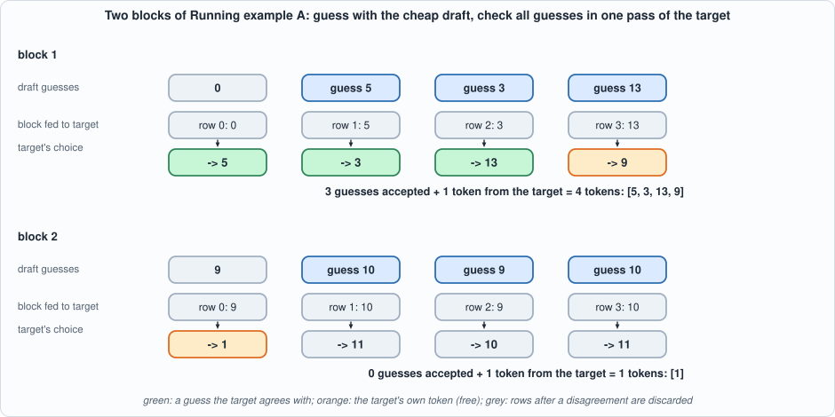
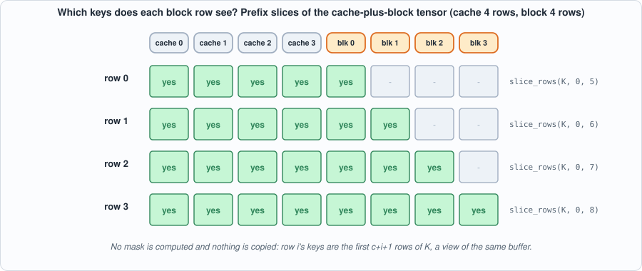
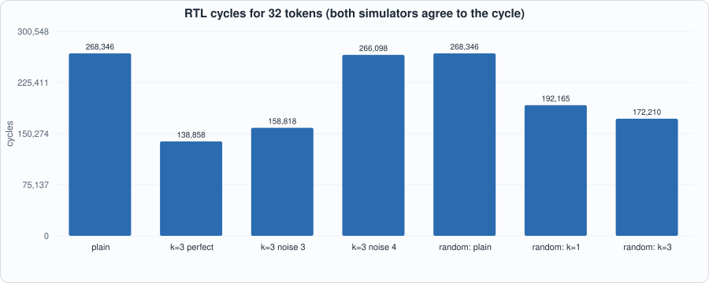
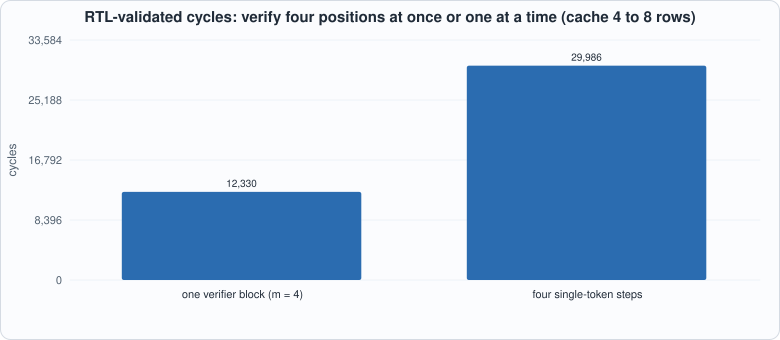
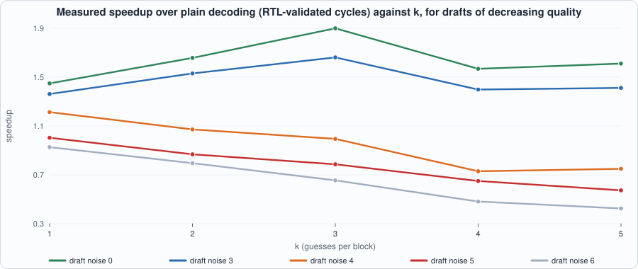
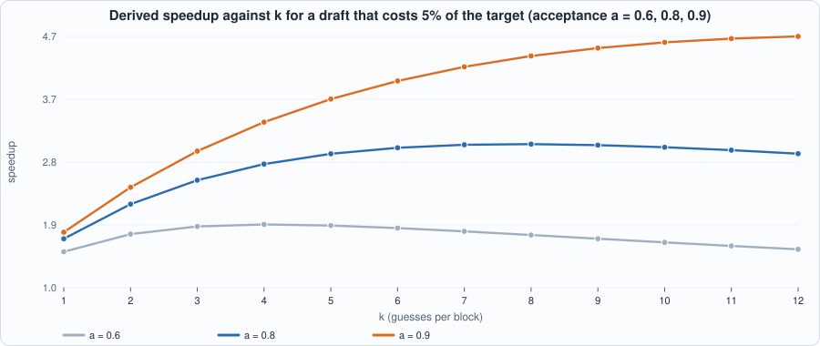

# 16. Speculative Decoding


--8<-- "docs/assets/art/ch-16.md"


**What you will see:** a way to get several tokens out of one pass over the target model's weights, without changing a single token it would have produced. A cheap **draft** model guesses the next `k` tokens; the target model **verifies** all of them (and one more position) in one batched pass; the longest agreeing prefix is accepted and the target's own token at the first disagreement comes free. To build the verifier the compiler learns one new operation, `slice_rows`, a *view* that makes a causal mask out of prefix slices. On the RTL, in both simulators, a perfect draft decodes 32 tokens in 138,858 cycles against 268,346 for plain decoding (1.93x), a poor draft makes it *slower*, and a generic random target gets 1.56x with a bigram draft.

**What you need to know first:** Chapter 9 (why decode is limited by the weights), Chapter 11 (the compiler) and Chapter 12 (the tiny model and its host loop). Chapters 14 and 15 are not required.

**What this chapter builds:** the `slice_rows` operation in `model/capra.py` and its battery in `model/capra_tests.py`; `model/spec_lm.py` (verifier graph, block float reference, draft model, host loop), `model/spec_tests.py`; `tools/ch16_run.py`, `tools/mut_ch16.py`, `tools/mut_ch16_compiler.py`; and the running examples `tools/ch16_example_a.py` and `tools/ch16_example_b.py`. **No hardware change.**

## Why guess

A decode step at batch 1 loads every weight once (Chapter 9: 2,304 words here, 7 GB on a real model) to produce one token, and the multiplier is idle for most of it. If we could process *several* tokens in the same pass, the weights would be loaded once for all of them. The obstacle is that token *t+1* is not known until token *t* has been chosen. Speculative decoding (Leviathan et al. and Chen et al., 2023) gets around it by **guessing** the following tokens cheaply, then checking the guesses in parallel.

1. **Draft.** A small, fast model proposes `k` tokens one after another: `d_0, d_1, ... d_{k-1}`. Here the draft is a bigram table (one matmul).
2. **Verify.** The target processes the block `[last token, d_0, ..., d_{k-1}]` (`m = k+1` rows) in one pass. Row `i` produces the target's logits after seeing the cache, the last token and guesses `d_0 .. d_{i-1}`; its argmax `p_i` is what the target would choose at that point.
3. **Accept.** Guess `d_j` is right if `d_j = p_j`. Take the longest prefix of right guesses, say `a` of them. Row `a` was computed after exactly the accepted tokens, so its choice `p_a` is the target's genuine next token: it is appended **for free**. The block yields `a + 1` tokens, between 1 and `k + 1`.
4. **Keep the cache rows** for the tokens that are now committed (rows `0 .. a`) and drop the rest.


*Figure 16.1: two blocks of Running example A. In block 1 the draft guesses 5, 3, 13 and the target agrees with all three and adds 9: four tokens for one pass. In block 2 the first guess is wrong, so one token is gained: the same as plain decoding, plus the cost of the wasted guesses.*

### Why the output is exactly the target's

Every token in the output is either a guess the target itself chose at that position (`d_j = p_j`) or a token the target chose (`p_a`). Each of those choices was computed from a prefix that consists only of already-accepted tokens. So the output sequence is, by construction, the sequence that greedy decoding with the target would produce, *whatever the draft says*. A better draft only changes **how many** tokens come out of each pass; a terrible draft cannot change **which** tokens. (This is the greedy version. Sampling needs a rejection rule that preserves the target's probability distribution; this book does not cover it.)

**The caveat for a chip.** The argument is exact when the target's choice for a position does not depend on how the computation is batched. In floating point it does not (the test below shows it to 1e-9). In int8 arithmetic, different program shapes have different scales and different rounding, so a verifier of four rows can in principle choose a different token than a single-row step would. The book therefore reports what it can measure: the speculative output equals the chip's own plain greedy output on both models tested (32 of 32 tokens, identical), and the exactness is *proved* in the floating-point model for every draft the tests try.

## The compiler's new operation: `slice_rows`

The verifier needs, for each block row `i`, a query row and a **prefix** of the keys: row `i` may attend the cache and block rows `0 .. i`, nothing later. Capra has no mask operation, and adding one would mean a new instruction. But a mask of this shape is a *slice*: the keys visible to row `i` are the first `c + i + 1` rows of the cache-plus-block tensor `K`. `concat_rows` already turned "append to the cache" into a *view* (two loads into one buffer); `slice_rows` is its mirror, "a part of a tensor" as a view: **no instruction, no copy**, only an offset into the source's buffer.

```python
--8<-- "model/capra.py:39:43"
```

Where the work is done:

- **Scale.** A slice has the scale of its source (the same group as `relu` and `concat`), because it is the same numbers.
- **Placement.** After the buffers are planned, a slice's location is its source's buffer at an offset of `start` rows (`loc[slice] = (buffer of source, offset + start)`).
- **Lifetime.** The source's buffer must stay alive as long as any slice of it is read; the allocator's usual rule (a buffer is last used when its last member is read) covers this because the slice is a member of the buffer.
- **Refusal.** A range outside the tensor, an empty range, and a slice that feeds a concatenation or a relu (which would need a *copy* where views are all the compiler can do) are refused.

**Tests for the new operation** are random graphs built around slices (slices of a product, of a concatenation, of a slice, of an input, of a weight; feeding matmuls, softmaxes, scores and argmax), run through the same checks as Chapter 11: compiled program equals the integer interpreter; every tensor read back from the scratchpad equals it; reuse equals no-reuse; error against float within a bound (0.40, set above the worst 0.28, caused by the quadratic scores operation whose range the calibration cannot always predict, as in Chapter 11); and the three refusals.

```text
--8<-- "out/ch16_compiler_mutation_out.txt"
```

Ten of ten broken compilers are caught. The eleventh change, giving a slice a buffer of its own that the next loop immediately replaces, **is equivalent**: it only leaves an unused entry in a list. Listing it as equivalent rather than as "caught" is the point.

## The verifier graph

```python
--8<-- "model/spec_lm.py"
```

`build_verify(m, c, model)` is Chapter 12's decode step with `m` rows at once. The projections `Q`, `K_new`, `V_new` are single `m x 16` matmuls (the weights are loaded and multiplied **once** for all rows), and then each row's attention uses slices:

```
qi = slice_rows(Q, i, 1)              # row i of the queries
Ki = slice_rows(K, 0, c + i + 1)      # the cache and block rows 0..i
Vi = slice_rows(V, 0, c + i + 1)
ai = matmul(softmax(matmul(qi, Ki^T)), Vi)
```


*Figure 16.2: the mask for a cache of 4 rows and a block of 4 rows. Green cells are the keys each row's slice contains; the program does no masking arithmetic.*

The row outputs `a_i` are concatenated back into an `m x 16` tensor (using `concat_rows`, again a view), and the output projection, the feed-forward block and the final projection run once for all rows. The verifier also returns the attention output (for the tensor-level tests), the new keys and values (so the host can keep the right ones) and the argmax of every row.

**The block float reference (`float_block`)** is written independently of the single-token step: it forms the whole score matrix and applies an explicit mask (`-1e30` for later positions). The first test checks that it equals the one-token-at-a-time `float_step` exactly.

## Tests

```python
--8<-- "model/spec_tests.py"
```

1. **Block form equals sequential form** (floating point, random models, several cache and block sizes): logits, keys and values to 1e-9.
2. **Exactness, with the float verifier.** Speculative decoding produces *exactly* the target's greedy tokens for every draft tried: random tokens, a constant, and bigram tables with noise 0, 3 and 100, for three models, for `k = 1, 2, 3, 5`. The bookkeeping must be consistent: tokens emitted equals accepted guesses plus blocks, and the cache length equals the tokens emitted.
3. **Causality on the chip, in integers.** Run the compiled verifier on `[1,2,3,4]` and `[1,2,3,12]`: the integer logits of rows 0-2 must be **bit-identical** (the last token is invisible to earlier rows); run it on `[1,2,9,4]`: row 2 and later must differ, and row 0 and 1 must not; run it on `[5,2,3,4]`: row 0 and later must differ. This uses a model with *sharp* attention (`Wq` and `Wk` multiplied by 4), because in the structured model attention is nearly uniform and a wrong mask is invisible.
4. **The compiled verifier equals the interpreter**, and its logits, attention output, new keys and values are within 15%, 12%, 12% of floating point.
5. **The rule** `f(t) = 5t + 3 mod 16` is followed through the chip's speculative loop for `k = 1, 2, 4` and three draft qualities; a **perfect draft is accepted completely**; and the draft's chip program picks the same token as the float draft.

```python
--8<-- "tools/ch16_run.py"
```

To compile and run: `python3 tools/ch16_run.py` (about 60 seconds). Recorded output:

```text
--8<-- "out/ch16_run_out.txt"
```

## Cost on the chip (measured)


*Figure 16.3: every program each run executed was replayed on the RTL; Icarus and Verilator give identical cycle counts, equal to the reference model's.*

| run | tokens equal | accepted / guessed | blocks | RTL cycles | speedup |
|---|---|---|---|---|---|
| plain greedy decoding | yes | | | 268,346 | 1.00x |
| k = 3, perfect draft | yes | 24 / 24 | 8 | 138,858 | 1.93x |
| k = 3, noisy draft | yes | 26 / 27 | 9 | 158,818 | 1.69x |
| k = 3, poor draft | yes | 18 / 45 | 15 | 266,098 | 1.01x |
| random target, plain | yes | | | 268,346 | 1.00x |
| random target, k = 1 | yes | 15 / 17 | 17 | 192,165 | 1.40x |
| random target, k = 3 | yes | 24 / 30 | 10 | 172,210 | 1.56x |

("Tokens equal" compares with the rule for the structured model, and with the chip's *own* plain greedy tokens for the random model, which is the strongest comparison available.)


*Figure 16.4: where the gain comes from. Verifying four positions costs 41% of four separate steps, because the weights are loaded once.*

## Running example A: three blocks, the program, and causality

```python
--8<-- "tools/ch16_example_a.py"
```

To compile and run: `python3 tools/ch16_example_a.py` (a few seconds).

```text
--8<-- "out/ch16_example_a_out.txt"
```

**Part 1** traces three blocks: block 1 accepts all three guesses and gains four tokens; block 2 is rejected at the first guess and gains one; block 3 accepts all three again. After three blocks ten tokens have been committed and they equal the target's greedy tokens. **Part 2** is the anatomy of the verifier: 56 matrix instructions, 10 loads, 4 softmax rows, 4 argmax, one pass over the 2,304 weight words, 12,330 cycles for four positions; four ordinary steps for the same positions load the weights four times and cost 29,986. **Part 3** shows causality in integers: the four blocks differ in one token each, and the printed rows show precisely which rows move.

## Running example B: when does speculation pay?

```python
--8<-- "tools/ch16_example_b.py"
```

To compile and run: `python3 tools/ch16_example_b.py` (about 40 seconds).

```text
--8<-- "out/ch16_example_b_out.txt"
```


*Figure 16.5: measured speedup (cycles identical on the RTL) against the number of guesses, for drafts of decreasing quality. The best draft peaks at `k = 3`; the worst never pays.*

**Part 1 (measured).** Three things stand out. (1) *A good draft is a large gain and a bad one is a loss*: a perfect draft gives 1.93x at `k = 3`; a draft that is right only 40% of the time gives 1.01x, and worse drafts fall to 0.43x. Speculation is not free: every wrong guess still costs a draft step and the wider verifier. (2) *More guesses is not always better*: with a perfect draft `k = 3` (1.93x) beats `k = 4` (1.59x) and `k = 5` (1.64x), because 32 tokens divide unevenly into blocks of 5 and 6 (the last block overshoots) and the verifier's cost grows with `m`. (3) *Every run gave exactly the plain decoder's 32 tokens.*

**Part 2 (a model).** The speedup of block size `k` with independent acceptance `a` is `E[tokens per block] * t_plain / (k * t_draft + t_verify)`, with `E = (1 - a^(k+1)) / (1 - a)`. With the measured unit costs (a draft step 810 cycles, a plain target step about 8,400, a four-row verifier 12,000-17,500 depending on the cache) it predicts 1.92x for the perfect draft (measured 1.93x) but under-predicts the poor draft (0.78x against 1.01x), because acceptance is not independent from guess to guess: some positions are easy for the draft and some are hard.


*Figure 16.6: the derived curve for a real-sized setting. Each acceptance rate has a best `k`, and a lower acceptance rate has a smaller best `k`.*

**Part 3 (derived).** For a 7B target and a draft costing `c` times as much per token (`c = 0.01` is a 70M-parameter draft), the speedup at batch 1 is `E / (1 + k c)`: at 80% acceptance and `k = 4` to `8`, 3.2x to 4.0x for a very cheap draft (`c = 0.01`), 2.8x to 3.1x for `c = 0.05` and about 2x for a draft that costs 15% of the target. This is arithmetic, not measurement: it assumes the verifier's pass costs the same as one plain step (true while the pass is limited by loading weights, as at batch 1 on a bandwidth-bound chip), and that acceptance is independent from guess to guess.

## Mutation tests

Nineteen one-line changes: the accept rule (one too many accepted, first guess unchecked, off by one row, inverted), the bonus token (draft's token instead of the target's, from the previous row, dropped), the cache (rejected rows kept, the bonus row dropped, keys and values swapped), the block (last token left out), the draft chain (guesses from the committed token), the mask (a row sees one later row, cannot see itself, values see everything, wrong query row), the output assembly (reversed), the float block's mask, and the draft table.

```text
--8<-- "out/ch16_mutation_out.txt"
```

All 19 are caught. **This took three runs.** The first run caught 14 of 19. The survivors were instructive: (1) *the bonus token not appended* and *the draft chain starting over from the committed token* are **quality or bookkeeping** bugs that cannot change the output tokens (the next block recomputes the dropped token; a worse draft is still exact), so a test of the output alone cannot see them. They needed tests of the *accounting* (emitted equals accepted plus blocks, the cache length equals the tokens emitted) and of the *draft's quality* (a perfect draft must be accepted completely). (2) *A row cannot see itself* and *the wrong query row* survived because the structured model's attention is almost uniform, so these changes are invisible in the outputs. The second run added the accounting checks and a tensor-level check of the attention output, and caught 18; the last survivor needed the **sharp-attention model**, which makes attention matter. The lesson is the one of Chapters 14 and 15, with a new twist: a test model has to be one on which the thing under test *matters*.

## What this chapter established, and what it did not

**Established, with the tests that show it:** the new `slice_rows` operation is a correct, zero-cost view (10 of 10 compiler mutants caught; one equivalent change identified); the block form of the verifier equals the sequential step in floating point; speculative decoding returns exactly the target's greedy tokens for every draft tried (floating point) and exactly the chip's own plain greedy tokens for both models run on the RTL; the verifier is causal bit-for-bit on the chip; the measured gains are 1.93x (perfect draft), 1.69x (noisy), 1.01x (poor) and 1.56x on a random target, identical in two simulators; 19 of 19 mutants caught.

**Not established:** exactness *in int8 for every input* (the output matched on all runs, but different program shapes have different rounding, so it cannot be guaranteed in general); a *learned* draft (the draft here is a bigram table fitted to the target); sampling (only greedy decoding); batch sizes above 1; and the serving numbers of Part 3, which are derivations.

## Self-check questions

1. A block has `k = 3` guesses and the target's choices after rows 0-3 are `[7, 2, 9, 4]` while the guesses are `[7, 2, 5]`. How many guesses are accepted, which tokens are emitted, and which cache rows are kept?
2. Why is the output independent of the draft in floating point? Which sentence of the argument would a poor draft break if the verifier were wrong?
3. With `k = 4` and 100% acceptance, how many tokens per block, and how many blocks produce 32 tokens? Why is `k = 5` not faster than `k = 3` in Example B?
4. Why is `slice_rows` a view, and why can it not feed a concatenation?
5. The expected tokens per block with acceptance `a` is `(1 - a^(k+1))/(1 - a)`. Derive it for `k = 2` as `1 + a + a^2`.
6. Compute the derived speedup for `a = 0.8`, `k = 4` and `c = 0.05`.
7. Why does the causality test use a model with sharp attention? What would a change to a later token do in the structured model?
8. The first mutation run missed "the bonus token is not appended". Explain why the output tokens do not change and which check finally caught it.

## Exercises

1. **A better draft.** Replace the bigram by a draft that sees the last two tokens (a table of 256 entries is enough for 16 tokens). Measure the acceptance on the random target.
2. **The best `k`.** For the random target, sweep `k = 1..6`. Where is the best, and does the formula of Part 2 find it?
3. **Tree of guesses.** Instead of one chain of `k` guesses, verify two alternatives for the first guess at once (a block of `2 + ...` rows with a different mask). What would the verifier's slices look like? (Hint: they are no longer all prefixes.)
4. **Sampling.** Write down (do not implement) the acceptance rule that keeps the target's probabilities when tokens are sampled: accept guess `x` with probability `min(1, p_target(x) / p_draft(x))`, and on rejection sample from the normalized positive part of `p_target - p_draft`.
5. **A twentieth mutant.** Add a mutant of your own to `mut_ch16.py` that survives. Is it equivalent, or a gap? Close the gap if it is one.
