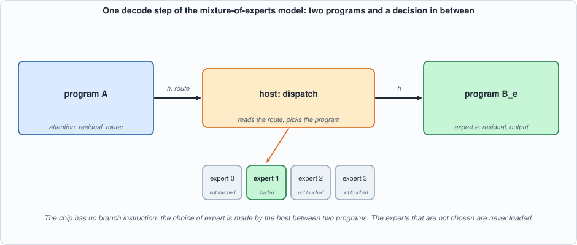
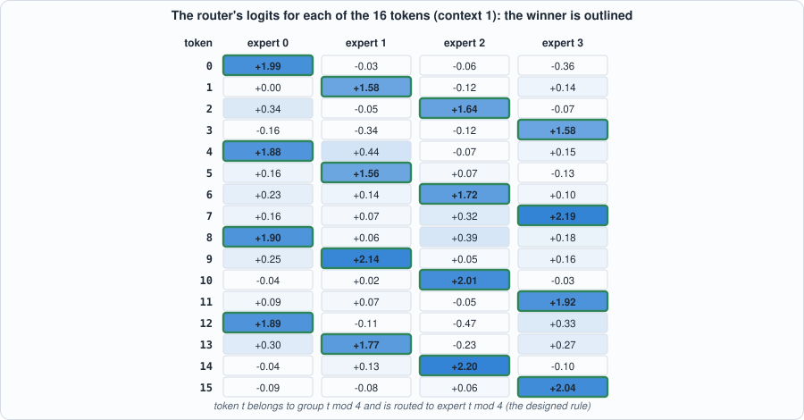
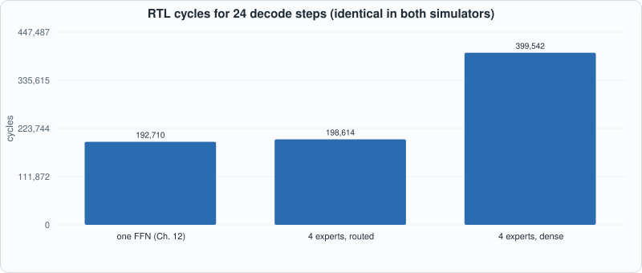
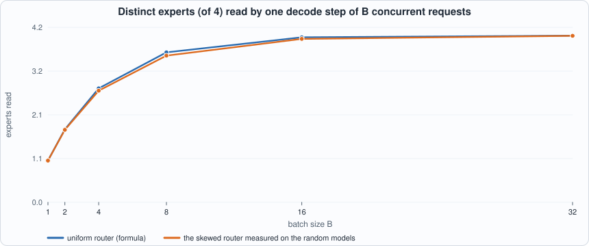
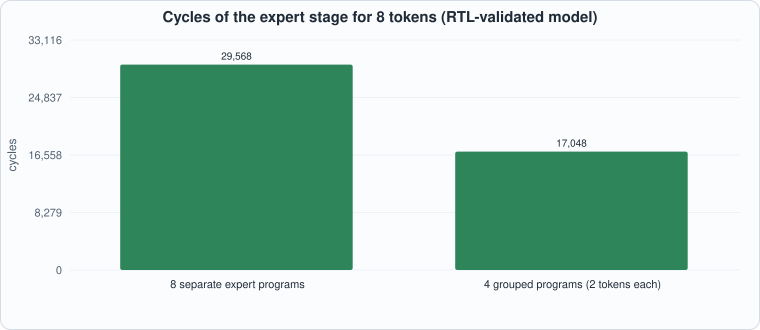
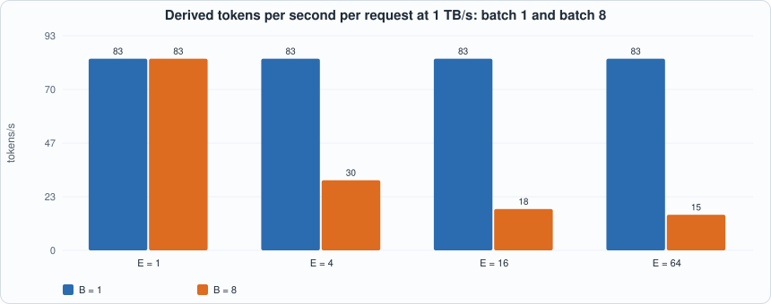

# 17. Mixture-of-Experts Routing


--8<-- "docs/assets/art/ch-17.md"


**What you will see:** a model that stores four times the feed-forward knowledge and, per token, uses a quarter of it. The feed-forward block of the tiny model of Chapter 12 is replaced by **four experts** and a **router**; each token is sent to one expert (top-1 routing). Because the chip has no branch instruction, a decode step becomes **two programs with the host's decision in between**: program A (attention and the router) hands over `h` and the chosen expert; the host picks that expert's program B; B loads only that expert's weights. On the RTL, in both simulators, four experts cost **3% more cycles** than the single feed-forward block of Chapter 12 (198,614 against 192,710 for 24 steps), while evaluating every expert costs 2.07 times as much (399,542). The model is built so that **only the right expert knows the answer**, which makes a wrong dispatch visible as a wrong token.

**What you need to know first:** Chapter 11 (the compiler), Chapter 12 (the tiny model and its host loop), Chapter 9 (weight traffic). Chapter 15 (the host doing work around the chip) helps.

**What this chapter builds:** `model/moe_lm.py` (model, graphs, host loop, the dense comparison), `model/moe_tests.py`, `tools/ch17_run.py`, `tools/mut_ch17.py`, and the running examples `tools/ch17_example_a.py` and `tools/ch17_example_b.py`. **No hardware or compiler change**: routing is the host's job and everything else is operations the compiler already had.

## Why experts

A dense model's capacity grows with its parameters, and so does the cost of every token: each one reads every weight. A **mixture of experts** (MoE) breaks that link. The feed-forward block, which holds most of a transformer's parameters, is split into `E` experts, and a small **router** looks at each token's hidden state and picks which expert (or, in most models, the best two) should process it. The model has `E` times the feed-forward parameters, but a token reads and multiplies only its chosen expert's. Production models of this family (Switch Transformer, Mixtral, DeepSeek-MoE and others) use 8 to 256 experts.

```
h      = x + attention(x)                      # as before
r      = h Wr                                  # one score per expert (the router)
e      = argmax(r)                             # top-1
y      = h + expert_e(h) = h + relu(h W1_e) W2_e
logits = y Wout
```

**Simplifications, stated.** Top-1 routing without a gate weight. Real MoE layers multiply the expert's output by the router's softmax probability for it, which is what lets training send gradient to the router. Capra has no element-wise multiply, and nothing here is trained, so the gate is left out; the routing decision is the same. The router, experts and attention are not trained: the structured model's weights are constructed, as in Chapter 12.


*Figure 17.1: a step of the MoE model. The host reads the route that program A wrote out, and runs the program of that expert only.*

## The model, and why the dispatch matters

```python
--8<-- "model/moe_lm.py"
```

**The structured model is built so that routing is not optional.** The 16 embeddings are the orthogonal Hadamard rows of Chapter 12. Token `t` belongs to group `t mod 4`.

- *The router* has one column per expert: column `e` is twice the sum of the embeddings of group `e`'s four tokens. For `h ~ embedding[t]` the score is about 2 for the token's own group and about 0 for the others.
- *Expert `e`* has four hidden units, one per token of its group: unit `j` fires when `h` matches that token and writes `embedding[f(t)] - embedding[t]` into the output (the rule `f(t) = 5t + 3 mod 16` of Chapter 12). The other 28 hidden units are small noise.
- *The output matrix* reads the embeddings: logit `j` is `8 <y, embedding[j]>`.

So with the right expert, `y = embedding[t] + (embedding[f(t)] - embedding[t]) = embedding[f(t)]` and the logit of `f(t)` wins. With a **wrong** expert none of its hidden units fires, `y = h`, and the model predicts the token it was just given. In Chapter 12 the feed-forward block only perturbed the logits; here it decides them, so a router or dispatch bug cannot hide.


*Figure 17.2: the router's float logits for each token at context 1 (Running example A). Every token's winner is expert `t mod 4`; the margins are large (winners between 1.6 and 2.2, every other expert at most 0.44), which is why routing survives int8 on this model.*

## The programs

- **`build_A(L)`** is Chapter 12's attention step through the residual `h`, then the router: `r = h Wr`. It outputs `h` (as int8 with its scale), the **argmax** of `r` (the route, computed on the chip with the `AMAX` instruction), the router logits (for the tests), and the new key and value.
- **`build_B(e)`** takes `h` as an input, runs expert `e`'s two matrices, the residual and the output matrix, and outputs the chosen token and the logits.
- **`build_dense_all`** is the comparison: every expert is evaluated and all outputs are added. On the structured model it computes the *same function* (the experts that do not know the token output about zero), at the cost of loading all four experts.

**The hand-over.** Program A's `h` is an int8 tensor with a scale; the host dequantizes it and gives it to B as the input `h`, which B quantizes with the scale the compiler planned for it. Both tensors carry the tag `h`, so the compiler gives them the same calibrated range, and the only extra rounding is the round trip. The cost of splitting the step is exactly this round trip plus B's own load of the output matrix.

## Tests

```python
--8<-- "model/moe_tests.py"
```

1. **Routing is necessary** (float): the router sends every token to its group's expert; the model follows the rule; and forcing *any* of the three other experts for *any* of the 16 tokens gives the wrong token (48 cases).
2. **The chip's decode** follows the rule through the two-program step; **its route equals the float route at every step**; compiled A programs (three context lengths) and all four B programs equal the integer interpreter.
3. **Tensor-level closeness:** the chip's logits and router logits are within 15% of float.
4. **A random model, teacher-forced:** the chip's route equals the float route unless the float router's top two scores are within 6% of the logit range (a near-tie that int8 noise may flip), and the logits stay within 25% when the routes agree.
5. **The dense model** (every expert) decodes the same tokens as the routed model.
6. **The hand-over is what it should be:** the program that ran is the program of the expert the router chose; and the memory image given to B holds exactly the `h` that A produced (the second check was added after the mutation run showed no test looked at it).

```python
--8<-- "tools/ch17_run.py"
```

To compile and run: `python3 tools/ch17_run.py` (about 30 seconds). Recorded output:

```text
--8<-- "out/ch17_run_out.txt"
```

## Cost on the chip (measured)


*Figure 17.3: four times the feed-forward parameters for 3% more cycles when routed; twice the cycles when every expert is evaluated.*

| decoder | feed-forward weights | programs | 24 steps | vs one FFN |
|---|---|---|---|---|
| one feed-forward block (Chapter 12) | 1,024 | 24 | 192,710 | 1.00x |
| 4 experts, routed (one used) | 4,096 | 48 | 198,614 | 1.03x |
| 4 experts, dense (all used) | 4,096 | 24 | 399,542 | 2.07x |

All counts are identical in Icarus and Verilator and equal to the reference model's. The extra 5,904 cycles (about 246 per step) are the price of the split: program B loads `h` and the output matrix again and the two programs each pay their own fetch and halt. The dispatch itself costs no chip cycles; it is the host choosing which program to start.

## Running example A: one token through the router and an expert

```python
--8<-- "tools/ch17_example_a.py"
```

To compile and run: `python3 tools/ch17_example_a.py` (a few seconds).

```text
--8<-- "out/ch17_example_a_out.txt"
```

**Part 1** is Figure 17.2 as numbers. **Part 2** follows token 5 (group 1): the router picks expert 1 (1.56 against at most 0.16 for the others); in expert 1 exactly one hidden unit fires (3.80, the unit for token 5); the logit of token 12, `f(5)`, is 7.9 and every other logit is below 0.5. **Part 3** forces the wrong expert: for token 5 and token 6, only the right expert returns the rule's token; every other expert returns the input token. **Part 4** runs the chip with a host that dispatches to the *next* expert: the 24 decoded tokens are all 0. **Part 5** is the anatomy of one step at context 8: program A loads 1,328 words and runs in 4,165 cycles, program B loads 1,296 words (one expert and the output matrix) and runs in 3,696; the four B programs cost exactly the same, so the expert chosen does not change the time.

## Running example B: quantization, load balance, batching

```python
--8<-- "tools/ch17_example_b.py"
```

To compile and run: `python3 tools/ch17_example_b.py` (about 30 seconds).

```text
--8<-- "out/ch17_example_b_out.txt"
```

### Does int8 flip the routing decision?

This is the question that matters most for MoE on a quantized chip, because a flipped decision sends the token to a different expert, a different function entirely, not a slightly different number. On random models with three seeds, 16 starts and 12 steps (576 decisions), the chip's route equals the float route on 569 (98.8%). The 7 flips all happen at small margins (the gap between the top two router scores, as a fraction of the logit range, at most 0.15; about a quarter of all decisions have a margin under 0.15 and 10% under 0.05). Where the route agrees, the chip's token matches float 97.5% of the time; where the route flipped, only 2 of 7 (29%). So: **a flipped route costs a token; the router's margin is the quantity to watch**. Real routers are trained with a load-balancing loss, which pushes them toward *uniform* use, not toward large margins, so near-ties may be common in trained models; the structured model's margins (winners between 1.6 and 2.2, every other expert at most 0.44) are the easy case.

### Load balance and the batch


*Figure 17.4: at batch 1 one expert of four is read; at batch 8 about 3.6 of the 4; at batch 16 nearly all. The measured router is skewed (29%, 19%, 34%, 19%), which lowers the count a little.*

At batch 1 only a quarter of the expert weights are read, which is the whole advantage. With a batch the advantage dissolves: `B` tokens touch `E (1 - (1 - 1/E)^B)` distinct experts on average (the formula agrees with the simulation to two decimals), so at `B = 16` four experts are practically all touched. MoE is a way to make *small-batch* decoding cheap for a large model; a high-throughput server with big batches reads all experts anyway.

### Grouping tokens by expert


*Figure 17.5: the expert stage of 8 tokens (two per expert) run as eight separate programs, or as four programs with two rows each.*

The way to use a batch is to **group tokens by expert**: each expert's program runs once with all the tokens routed to it as rows, so its weights are loaded once for all of them. Eight tokens from eight consecutive steps of the structured decode, grouped, cost 17,048 cycles against 29,568 for eight separate runs (58%), and the chosen tokens are identical. A batch needs the host to reorder tokens by expert and then restore the order; an expert that gets a single token still pays the whole weight load.

### Serving arithmetic (derived)


*Figure 17.6: assumed model (4 GB of attention and embeddings plus 8 GB of feed-forward per expert, int8, 1 TB/s). At batch 1 every E is as fast as the dense 12 GB model; at batch 8 a larger E reads more of its weights.*

The last part is **derived arithmetic for an assumed model**, not a measurement: at batch 1 the speed (83 tokens per second) does not depend on `E`, because only one expert is read; at batch 8 a 64-expert model reads about 7.6 experts per step and delivers 15 tokens per second per request, against 83 for the dense model. And the memory needed grows with `E` (516 GB for 64 experts against 12 GB): the capacity to *store* all the experts is the real cost of a mixture of experts.

## Mutation tests

Sixteen one-line changes: dispatch to the next expert, or always to expert 0; the float router taking the least likely expert; the router reading `x` instead of `h`, or with two columns swapped; expert `e`'s second matrix taken from the next expert; the residual or the relu missing in B; the float step using expert 0's weights; B given the integer `h`; B's memory image built from the wrong `h`; the route read wrongly every fifth step; the structured model's experts assigned to the wrong groups, or an expert's output not subtracting its input; keys and values swapped on the way back; and a dense comparison that adds only one expert.

```text
--8<-- "out/ch17_mutation_out.txt"
```

All 16 are caught, and two changes are listed apart. **The first run caught 14 of 17**: one mutant anchored on text that spans a line break and never ran (corrected), and two survived. *"B's memory image is built from the wrong `h`"* was a real gap: the tests compared outputs, which come from the reference run, never the memory handed to the RTL replay, which would have disagreed with the program that produced the outputs, with a self-consistent but wrong replay; the new check compares the image with the `h` A produced. *"The record reports the route as the expert that ran"* is equivalent as long as the dispatch is right (a wrong dispatch is caught by the tokens and by the check of the program that ran), so it is listed with the equivalent changes. The other change listed apart is **not exercised**: a fallback for an expert that no calibration run reached, which no test leaves unused; it is named as a gap in the tests' reach, not as equivalent.

## What this chapter established, and what it did not

**Established, with the tests that show it:** routing is necessary on the structured model (48 of 48 wrong-expert cases fail), and the routed chip decode follows the rule; the chip's route equals the float route at every step, and on random models in 98.8% of decisions (all flips at small margins); the compiled programs equal the interpreter; four experts cost 3% more cycles than one feed-forward block, in both simulators; grouping tokens by expert cuts the expert stage by 42% for 8 tokens; and 16 of 16 mutants are caught.

**Not established:** the quality of a *trained* MoE (nothing is trained, and no load-balancing loss exists); gate weights and top-2 routing; expert capacity and token dropping (the usual way to bound the load of the busiest expert); the real cost of the host's reordering; any model of real size, whose serving numbers here are derived.

## Self-check questions

1. Why does the chip need two programs per decode step, and what does the host do between them?
2. The structured model's wrong-expert test gives the *input* token as the prediction. Why?
3. In program B the experts all cost exactly the same number of cycles. Why is that, and what would change it?
4. Compute the expected number of distinct experts touched by a batch of 4 with 8 experts and a uniform router.
5. Grouping 8 tokens as 4 experts x 2 rows costs 58% of 8 separate runs. Why is it not 50%?
6. A route flips at a margin of 0.04 and the token changes. Explain why a flipped route is a larger error than a flipped rounding of one logit.
7. Why is top-1 routing without a gate weight acceptable here but not for training?
8. The first mutation run missed "B's memory image is built from the wrong `h`". Why did the output tests not see it?

## Exercises

1. **Top-2 routing.** Send each token to its two best experts and add their outputs (a second B program per token). How do the cycles change? Does the structured model still follow the rule?
2. **A router with low margins.** Make `Wr` smaller (multiply by 0.2) and rerun the structured model. At what scale do routes start to flip on the chip?
3. **Capacity.** For a batch of 8 tokens where an expert may take at most 2 tokens, write the rule that drops the extras and measure how many tokens of the random model would be dropped.
4. **More experts.** Change `E` to 8 (two tokens per group) and compare the cost against the formula of Part 2.
5. **A mutant that survives.** Add a mutant to `mut_ch17.py` that survives (try the calibration fallback). Is it equivalent or a gap? Close the gap if it is one.
